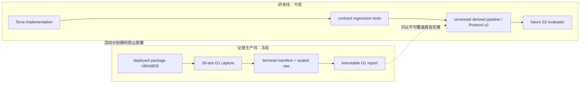
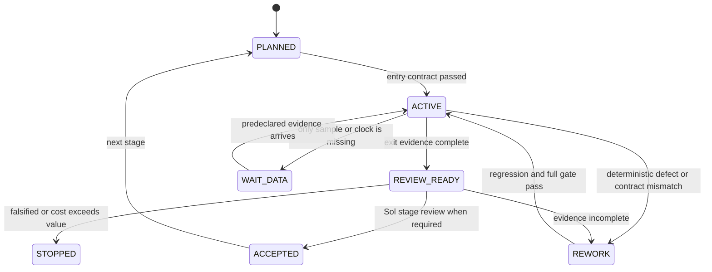

# 自动交易系统总计划与动态治理

> 版本：1.5
> 更新日期：2026-07-30
> 当前阶段：旧 Route B 仍为 E0 contract drafting；原 active G1 已进入 `TERMINAL_WAIT_DATA_PLAN_UNREACHABLE`；另有隔离的 paper-only 理论实践通道
> 当前证据：旧研究线无 G1/G2/市场有效性结论；新通道只有本地 paper practice evidence，无实盘授权或盈利保证
> 当前状态入口：[CURRENT_SYSTEM_STATUS.md](./CURRENT_SYSTEM_STATUS.md)
> 理论权威：[CORE_TRADING_THEORY.md](./CORE_TRADING_THEORY.md)  
> 架构权威：[SYSTEM_ARCHITECTURE.md](./SYSTEM_ARCHITECTURE.md)  
> 详细路线：[SYSTEM_DESIGN_ROADMAP.md](./SYSTEM_DESIGN_ROADMAP.md)

本文保存项目的执行与治理规则；当前状态必须由 [CURRENT_SYSTEM_STATUS.md](./CURRENT_SYSTEM_STATUS.md) 及其机器覆盖层解释。历史计划、阶段目标、Agent 分工、动态改线条件和证据升级纪律保留其当时语义；本文不另行修改核心理论中的 `T-*`、`DATA-*` 或 `H-*` 定义。

系统目标不是保证盈利，而是用最低必要复杂度回答三个连续问题：

1. 数据和派生链是否真实、点时、可重放；
2. 核心理论在锁定样本外是否有稳定的成本后增量；
3. 只有前两项成立时，自动交易执行是否能在严格风险约束下可靠运行。

任何一级失败都允许等待、简化或停止；不得用更多特征、更复杂模型或真实资金掩盖低层证据缺口。

---

## 1. 当前事实基线

### 1.1 冻结 G1 终态

- 历史 active G1 计划是 `btc-usdt-g1-forward-20260723-v1`，窗口为 2026-07-23 至 2026-07-29，共 28 个 61 分钟 slot。
- 冻结门要求 24 个合格 collection、86,400 秒时间并集、7 个 UTC 日期和 12 个 UTC 小时桶。
- 版本化 Sol 终态已证明其上界仅为 14 个可能合格 slot、51,240 秒和最多 4 个 UTC 日期，因此该精确计划为 `TERMINAL_WAIT_DATA_PLAN_UNREACHABLE`。
- 计划、registry、部署包和已有 evidence 只能原样保留；不得补写失败 slot、降门、改计划、用工作区包覆盖，或把新 lane 表述为旧计划恢复。
- 如需新的 G1 evidence program，必须取得独立授权、使用新 plan identity、registry、evidence root 与重新封存的 collector bundle；当前终态不授予该权限。

后续 HAR source/terms 支线也没有解除数据门：HAR1R4 的封存 manifest 为 `FAILURE / WAIT_DATA_SOURCE_CONTRACT_MISMATCH / WAIT_DATA_TERMS_D0_DENIED / legal_conclusion=false`；HAR1R5 只获准静态 gate 创建，网络、activation、data、backtest 和 trading 都未授权。HAR1R5 不是对 HAR1R4 失败的自动修复，也不是新的 G1 权限。

### 1.2 工作区研发线

- 初始基线 169 项测试通过，但没有覆盖真实 episode 终态后的生命周期。
- 已修复 `timedelta >= Decimal` cooldown 类型错误。
- 已修复终态在每条高频行上重复刷新 cooldown、导致每个 collection 最多一个 episode 的生命周期错误。
- 修复后终态仅在转换行保留一次 episode ID/state，随后释放；cooldown 内普通行无旧 episode，期满后可创建下一 episode。
- episode 决策语义已升级为 `episode-feature-decision-clock-v2`：raw feature 仍逐条保留，只有每个 UTC 对齐 1 秒桶的首个合格事件可以触发或推进 episode。
- `config/episode_policy.v2.json` 摘要为 `d919eb5bd8eaf3a01e9a6e316a8d0876f00cbe9a55e14826b4c48f13440b2242`；v1 保持事件驱动兼容且摘要不变。
- 最近记录存在 229 与 282 项测试通过的不同快照；尚未做统一实测，本文件不得把任一快照表述为当前完整结果。当前 package 摘要为 `6d81608110d1f361b55634933fe66028d9bcc89ba693c7305115cf60c91b2eb3`，已与活动部署不同，因此只允许本地研发和只读审计，禁止部署到活动计划。

### 1.3 尚未关闭的 P0

| ID | 缺口 | 当前状态 | 完成定义 |
|---|---|---|---|
| `S0-003` | 协议声明 1 秒决策，episode 实现按每条 raw event 推进 | 已完成（workspace） | `episode_policy.v2` 使用 UTC 对齐 1 秒决策格；高频消息不重复确认；v1 兼容与确定性测试通过 |
| `S0-004` | 理论 H-ID 与 protocol v1 同名异义，holdout 资格链不可到达 | workspace 已完成 guard/role admission | v1 已由 v2 guard 可审计废止；v2 draft 与 DEVELOPMENT/HOLDOUT admission 已实现；真实未来 plans、G1 PASS report 与 exact bindings 仍为 `REQUIRED`，故不能冻结研究 |
| `S0-005` | 当前动作链的阶段语义 | 当前首协议 `PROBE_ONLY` 已完成 | 当前契约只允许 `ENTER_PROBE` 与结构失效标签；ADD 只能在 G2 后以新的 outcome-free 协议另行预注册，不是当前阻塞项 |
| `S0-006` | 研究命令没有执行预注册的完整 G2 判定 | workspace evaluator/formal wrapper 已完成 | baseline、消融、校准、成本、UTC 日 bootstrap、集中度与三值裁决已可执行；尚无真实合格 DEVELOPMENT evidence 或 G2 结果 |
| `S0-007` | 4H context 与 future role 证据链 | workspace 已完成 | closed 1 秒/4H context、role window、context artifact SHA 及 feature→action→label→state→admission binding；尚待真实未来 collection 验证 |
| `S0-008` | 冷证据持续可读与热数据退役边界 | workspace 已完成 | receipt 验证的 compressed cold replay 与退役计划已实现；实际 hot retirement 永久 fail-closed，同盘 cold 非灾备，外部 durable target 未获授权 |
| `S0-009` | one-time February fresh falsification | `FEB2025_TERMINAL_WAIT_DATA_NOT_SCORED` | [Sol A2F1](./config/sol_decision.s0-009-r1-acquisition-gap-censoring.a2f1.json) 已封存：受 guard 获取后，`2025-02-26` `bookDepth` 有 23 分钟内部空档而触发冻结 60 秒门；February 为 `SEEN`、未评分且独立角色永久消费。现为 `HOLD_BEFORE_ANY_NEW_ACQUISITION_OR_SCORING`，G2 与交易仍拒绝 |
| `S0-010` | `RSI-MTF-DRL-PM v0.2.2` executable authority route | `REWORK_ROUTE_B / E0 / AUTHORITY_BUNDLE_CONTRACT_DRAFTING` | [Route B Decision](./config/rsi_mtf_drl_pm.route_b_decision.v0_2_2.json) 已将不完整 Direct AST 路线封存为 `HISTORICAL_REWORK_NON_AUTHORITY`；[Authority Bundle Spec](./RSI_MTF_DRL_PM_AUTHORITY_BUNDLE_SPEC_v0_2_2.md) 仅按 §0.1 替代 semantic source 的 route-only 构造条款，不改变策略语义，并只授权 B1 outcome-free canonical contract、只读 validator 与 contract tests。旧 v0.2 contract 的历史 PASS、raw/canonical digest及 tests保持不变。B2 kernel须等 B1 独立 Sol PASS；市场/历史数据、adapter、backtest、calibration、holdout、paper、OMS、交易与活动 G1/seen roles继续禁止读写 |
| `G1-001` | 冻结 active G1 计划不可达 | `TERMINAL_WAIT_DATA_PLAN_UNREACHABLE` | [Sol v2 终态](./config/sol_decision.active-g1-plan-unreachable.v2.json) 证明合格 slot、时长与 UTC 日期上界均低于冻结门；保留原包且禁止回填、降门、覆盖或伪称恢复 |

### 1.4 `S0-009` 条件式 February falsification 门

[S0-009-FEB-FALSIFICATION-v1](./config/governance_amendment.s0-009-feb-falsification.v1.json) 保留为历史 amendment；其 R1/A1 执行授权已由 [SOL-S0-009-R1-ACQUISITION-GAP-CENSORING-A2 A2F1 serialization](./config/sol_decision.s0-009-r1-acquisition-gap-censoring.a2f1.json) 覆盖为 February terminal hold。原 A2 serialization 与 terminal record 已在采纳前 supersede（仅移除动态外部 provenance，裁决不变）；原 `S0-009-JAN-ONLY-v1` 规则仍保留为历史审计状态；A2F1 不放宽任何研究、证据或交易边界。

- **当前门**：发布态由版本化 [A2F1 decision](./config/sol_decision.s0-009-r1-acquisition-gap-censoring.a2f1.json) 与 [A3E1 terminal guard](./config/s0_009_february_terminal_seen_guard.a3e1.json) 共同约束。两者绑定的本地 release report、R1/A1、guarded production manifest、gap diagnostic 与 terminal record 均位于被 Git 忽略的 `.runtime/`，只作为本机操作证据，不能替代版本化发布依据。获取的 84 archives/84 checksums 不是 score 资格：`2025-02-26` `bookDepth` 发现 1,380,000 ms（23 分钟）内部空档，高于冻结 60,000 ms。
- **终态范围**：February 已为 `SEEN`，`WAIT_DATA_NOT_SCORED`，无 input receipt、fresh report 或评分；独立评价角色永久消费。禁止 February builder replay、重试、重新获取或评分，当前为 `HOLD_BEFORE_ANY_NEW_ACQUISITION_OR_SCORING`。固定 candidate、control、cohort 与 10/20 bps 成本仍不变；G2 与交易继续拒绝。
- **模型与校准**：只可读取 Sol 绑定的 January v4 rows/model/manifest；保持 `IDENTITY_TEMPERATURE_1`。禁止 fit、refit、calibration fit、调参、候选替换、阈值/成本/状态边界重选或任何 post-hoc model rescue。
- **唯一可研究修复**：仅可针对未来未见输入设计通用 `OBSERVED_CADENCE_GAP_CENSOR_REQUIRED` 语义，保留 schema/checksum/symbol/date/ordering/book-depth-level hard failure，且 receipt 必须记录 observed gap intervals 与 censoring facts；不得为 February 特判、修改冻结 60/300 秒阈值或伪造 coverage。该研究修复本身不授权 March 获取、验证或评分。
- **January 事实边界**：v4 development-test 有 1,022 个有效 episode，但状态集中度 0.8620 高于 0.40，门结果为 `WAIT_DATA_COVERAGE`；candidate 在 BUY/SELL 两侧的 log loss 与 Brier 都劣于 D-only control，122 个 eligible episode 的 `selected_count` 均为 0。这是 E0-X 的负面开发信号，不是 H 支持/失败、G2 结论或市场验证。
- **一次性状态映射**：历史规则保留供审计：未完整取得输入且未评分为 `WAIT_DATA_NOT_SCORED`；一旦开始评分，零有效样本为 `STOP_DATA_INVALID`，覆盖不足为 `INCONCLUSIVE_CONSUMED / WAIT_DATA_COVERAGE`，预测或经济门失败为 `STOP_CURRENT_V2_PROXY / STOP_PREDICTIVE|STOP_ECONOMIC`，全门通过最多为 `E0-X_COMPLETE_DESCRIPTIVE`，消费后异常为 `SCORING_FAILED_CONSUMED`。**本次实际只走 `WAIT_DATA_NOT_SCORED`**：已读取 February 但没有 input receipt、fresh score 或评分，独立评价角色仍永久消费，故不得进入任何评分后分支或重跑。
- **最高允许声明**：即使全部冻结门通过，也只能说“固定 January 模型在一个 frozen February proxy cohort 上未被这些预注册诊断门否定”。不得宣称 H 成立/失败、市场有效、可盈利、champion、G1/G2、paper、部署或交易就绪。
- **永久 `SCOPE_BREACH`**：其他日期、第二次 receipt/score、同月调参后重跑、fit/calibration/tuning/model rescue、改变 cohort/action/cost/gates、修改活动 G1，或产生任何 H/G2/交易声明。
- **可持续 chronology**：每个新版本必须先把互不重叠的月份预分为 `DEVELOPMENT`、`CALIBRATION`、`HOLDOUT`；只在前两者建模与校准，冻结单一 candidate 后一次性打开更晚 holdout。任何被读取的月份永久为 `SEEN`，只能用于错误分析或后续 development，不能再次充当独立验证。
- **职责与隔离**：活动 G1 及 `/Users/wt/Library/Application Support/agent-trade-emotion` 不得修改。Sol 只在阶段门、阻塞或边界变化时裁决；Terra 执行受限实现、测试和事实报告，不自行改变 H-ID、holdout 含义或交易权限。

---

## 2. 双线执行模型



两条线只通过版本化 artifact 和不可覆盖报告交接。研发代码可以读取活动 evidence 做只读验证，但不能改写、补齐或重新解释原始证据；活动采集器不加载工作区代码。

---

## 3. Agent 调用纪律

### 3.1 `gpt-5.6-sol ultra`

只承担：

1. 首轮理论、架构、路线总审计；
2. `S0/G1/G2/G3` 等完整阶段门完成后的验收；
3. 证据充分但理论失败，需要简化、否定或改线；
4. frozen contract、holdout、活动证据或资金安全发生冲突；
5. 同一根因经 Terra 两轮仍无法关闭；
6. 两个方案会实质改变研究结论、数据含义或用户结果。

Sol 不参与日常编码、普通测试失败、局部类型修复、命名或可逆内部重构。

### 3.2 `gpt-5.6-terra high`

负责持续执行：

- 契约实现、定向回归和全套测试；
- G1 历史运行事实、冻结计划不可达证明与终态保全审计；
- 数据、feature、action、label、研究和 paper artifact 的摘要与可重放验证；
- 普通缺陷的根因定位和最小修复；
- 每个里程碑的实际命令、退出码、摘要和剩余风险报告。

Terra 不得自行改变核心理论 ID、holdout 含义、资金风险值、真实交易权限或活动采集计划。

### 3.3 升级问题包

升级给 Sol 的问题必须至少包含：

```json
{
  "issue_id": "stable-id",
  "stage": "S0|G1|G2|G3|G4",
  "severity": "P0|P1",
  "expected_contract": {"document_ids": [], "artifact_ids": [], "sha256": []},
  "observed_fact": {"command": "", "exit_code": 0, "report": "", "artifact_paths": []},
  "scope": {
    "active_deployment_affected": false,
    "workspace_only": true,
    "holdout_at_risk": false,
    "funds_at_risk": false
  },
  "attempts": [],
  "options": [],
  "terra_recommendation": "",
  "required_decision_by": ""
}
```

没有复现、证据路径和影响边界的问题不升级。

---

## 4. 动态路线状态机



每次路线更新只允许四类原因：

1. `FACT_CHANGED`：来源、schema、接口、磁盘、资格或真实运行事实改变；
2. `CONTRACT_DEFECT`：实现不能履行已冻结语义；
3. `EVIDENCE_RESULT`：样本、成本、校准、稳定性或故障测试给出新证据；
4. `SCOPE_AUTHORITY`：进入账户、testnet、canary 或付费数据前需要新的外部授权。

不得因“近期表现不好”“想提高回测”或“技术上可以更复杂”临时改线。

### 4.1 自动改线规则

| 触发 | 默认动作 | 是否调用 Sol |
|---|---|---|
| 普通局部测试失败 | Terra 定向复现并最小修复 | 否 |
| 活动 slot 单次外部瞬断 | 保留 UNQUALIFIED，使用 4-slot slack | 否 |
| 同一确定性采集根因或连续两次同源失败 | 暂停后续计划，保护证据，形成问题包 | 是 |
| G1/研究样本不足 | `WAIT_DATA`，按事前计划续采 | 否 |
| 冻结 ID、holdout、资格链冲突 | 停止 finalization/评分 | 是 |
| G2 证据充分但无增量 | 优先简化或否定，不增加特征救回测 | 是 |
| paper 对账或保护不一致 | HALT、禁止新增风险、恢复审计 | 阶段性或两轮未关闭时 |
| 需要真实账户、风险预算、付费数据或正式部署 | 保持关闭并请求对应授权 | 是或用户决定 |

---

## 5. 阶段目标和完成条件

| 阶段 | 进入条件 | P0 产物 | 完成条件 | 等待/停止条件 |
|---|---|---|---|---|
| `S0` 契约修复 | E0、无 outcome | episode v2、Protocol v2、动作/标签契约、G2 evaluator | 所有理论 ID、时间、数据资格、派生版本和裁决可执行；风险驱动测试通过 | 任一旧协议仍可误冻结或 holdout 不可到达则不得结束 |
| `S1` G1 采集 | exact plan/route/digest/disk 通过 | sealed raw、terminal manifests、G1 report | 首 slot 合格；最终至少 24/28 且不可覆盖 G1 PASS | 数据不足为 WAIT；确定性根因暂停；不得补写失败证据 |
| `S2` 研究数据集 | G1 PASS + Protocol v2 finalised | feature/action/label/state artifacts | 600 总有效 episode、每状态至少 100、来源与版本绑定可重放 | 不足只允许 WAIT_DATA；不得降低门槛 |
| `S3` G2 | 所有数据/成本/切分门通过 | OOS 预测、消融、校准、效用、bootstrap、holdout 报告 | 必要理论命题获稳定锁定样本外增量，经济/压力/集中度门通过 | 证据充分但失败则简化/否定；禁止堆特征 |
| `S4` G3 | G2 PASS | live/offline shadow、连续 paper/testnet、保护/恢复/对账 | 多状态稳定、故障演练通过、零未解释订单/持仓差异 | 不一致、未保护或恢复失败即回退 |
| `S5` G4A/G4B | G3 + 资格、账户隔离、风险签署 | 固定版本有限 canary 与审核报告 | 在总损失/名义量/订单/episode/日历上限内达到 E4 | 无外部条件保持关闭；任一预算先到即停止 |

阶段完成是一次证据事件，不是文档状态。只有实际产物、摘要和验证命令齐全，才进入 Sol 阶段审核。

---

## 6. 三阶段交付路线

### 阶段 A：可信研究闭环（当前 P0）

顺序：`S0 → S1 → S2 → S3`。

- 冻结并验证数据、episode、动作、标签和判定契约；
- 完成 G1 与后续前瞻研究/holdout 数据资格；
- 以简单基线和逐因子消融检验 H-001–H-004；
- 只有 G2 通过才保留完整自动交易建设路线。

### 阶段 B：可运行但无资金的交易闭环

顺序：`S4 shadow → paper → testnet`。

- 同一逻辑在线/离线一致；
- 独立 Risk Engine、OMS、保护、退出、账户对账和恢复；
- 真实 API 生命周期只在 testnet/demo 验证；
- paper 盈利不能替代执行正确性，也不能证明生产成交质量。

### 阶段 C：有限资金证据

顺序：`G4A → M6B → G4B → G5`。

- 需要所在地/账户资格、专用账户、禁提款权限和资金所有者签署硬风险值；
- 每轮模型和风险配置固定，不在 canary 内在线学习；
- 未达到 E4 时停止或重新取得有限预算，不自动续期或扩资。

---

## 7. 数据扩充路线

### P0：直接改变当前可验证性

1. 更长且跨时段的 Binance USD-M 前瞻 depth、aggTrade、mark/funding、OI、exchangeInfo 和 censored forceOrder。
2. 价格、收益、波动和趋势上下文 `Z_t`，用于让“趋势延续默认 ABSTAIN”成为可执行条件。
3. 活动运行质量：连接、gap、解析、时钟、封存、资源与 schema 漂移。
4. 后续 paper/testnet 的自身订单、成交、费用、部分成交、拒单、滑点、资金费和账户对账遥测。

### P1：核心模型通过初步 G2 后逐项 shadow

1. Binance spot 作为同场价格发现参考；
2. Bybit L2/trade/OI/funding/allLiquidation/ADL，保留独立 side 和覆盖语义；
3. Deribit DVOL、IV、偏度、期限结构和期权 OI，作为风险上下文；
4. OKX 官方历史 tick/funding/L2，限于外部机理和 replay 审计；
5. 交易所状态、保险基金、稳定币压力和官方宏观日历，按安全/风险路径验收。

### P2：默认延后

- 新闻、社交、通用情绪分数和复杂链上地址标签；
- 多币种、多策略、跨所实盘、maker queue；
- 深度网络、强化学习、在线调参和无人审批发布；
- Kafka、Kubernetes、通用插件平台和多区域系统。

每个新数据源必须单独回答：来源/许可、point-in-time 可用性、schema、覆盖与缺失语义、独立故障域、获取/存储/运维成本，以及相对 champion 的锁定样本外净增量。不能一次接入多源后整体归因。

---

## 8. 历史首个 G1 slot 验收规则（当前不可执行）

以下清单保留为原计划当时的验收规则，不是当前行动项。该精确计划已进入 `TERMINAL_WAIT_DATA_PLAN_UNREACHABLE`，不得重跑、补验或用新证据回填旧 slot。

首 slot 结束后必须核验：

1. supervisor 实际执行 `d1-h00`；
2. slot 状态为 `QUALIFIED_SMOKE_SEALED`；
3. collection manifest 绑定 exact plan SHA、registry SHA、slot ID 和 deployed collector SHA；
4. raw 分段封存且 audit/replay 有效；
5. parse error、book gap、reconnect 和 terminal error 为零；
6. readiness 计入该 collection，但仍为 `COLLECTING/WAIT_DATA` 是正常结果。

失败 slot 是永久事实。`UNQUALIFIED`、未封存、audit failed、incomplete、binding mismatch 或 invalid evidence 都不得覆盖或重跑；只有未来预声明 slot 可以提供新证据。

---

## 9. 证据等级

| 等级 | 含义 | 允许声明 |
|---|---|---|
| `E0-T` | 理论、数据语义与命题对齐 | 可检验，不代表有效 |
| `E1-D` | G1 数据质量、封存、重放、point-in-time | 数据链可用 |
| `E1-L` | episode/action/label 语义与版本可复现 | 合法研究样本可生成 |
| `E2-P` | 锁定样本外预测和校准增量 | 特定数据/假设下的预测证据 |
| `E2-E` | 成本后效用、压力和集中度 | 特定成本假设下的经济证据 |
| `E2-H` | 一次性最终 holdout | 未见窗口保真证据 |
| `E3-S` | live/offline shadow 等价 | 在线计算链成立 |
| `E3-P` | paper/testnet 订单、保护、恢复和对账 | 无资金执行闭环成立 |
| `E4` | 有限 canary 审核 | 严格限额内的有限实盘证据 |
| `E5` | 多状态有限生产 | 受监控的有限生产证据 |

高层证据永远不能替代低层证据。当前项目仍是 E0；工作区测试通过只说明特定工程契约通过。

---

## 10. 成本、复杂度与停止规则

默认保持单标的、单主 venue、单机、公开免费数据、简单正则化模型和 marketable-limit IOC。只有观察到明确瓶颈，才允许增加付费数据、数据库、消息队列、复杂模型或更多标的。

立即停止或回退的条件：

- G1 无法稳定产生合格 point-in-time 数据；
- episode/action/label 语义不能确定性复现；
- 证据充分后 H-001–H-004 无稳定成本后增量；
- 结果由少数日期、方向或状态贡献；
- 微小成本、参数或窗口变化导致结论崩溃；
- 数据不能以生产所需时效、许可和成本持续获得；
- paper/testnet 出现不可解释订单、持仓或保护差异；
- 运维与数据成本高于可验证价值。

否定理论、缩小模型或长期 `ABSTAIN` 都是合格结论。

---

## 11. 每个里程碑的事实报告

Terra 的里程碑报告必须包含：

- 现在用户或系统能完成什么；
- 修改的文件/契约和版本摘要；
- 实际运行的命令、测试数量、退出码与 artifact SHA；
- 真实数据、合成数据、mock 和未运行项分别说明；
- 当前证据等级及绝对不能声明的事项；
- 下一项 P0、等待条件、停止条件和是否需要 Sol。

“代码存在”“测试通过”“无运行错误”“paper 盈利”均不得单独写成市场可行、生产就绪或策略有效。

---

## 12. 变更记录

| 版本 | 日期 | 变更 |
|---|---|---|
| 1.4-ROUTE-B | 2026-07-23 | Sol 采纳 Route B：不完整 Direct AST转为 `HISTORICAL_REWORK_NON_AUTHORITY`，active v0.2.2为 `REWORK_ROUTE_B / E0 / AUTHORITY_BUNDLE_CONTRACT_DRAFTING`；B1只允许新 outcome-free contract、只读 validator与contract tests，旧 v0.2、CORE、semantic source、Profile、活动 G1与seen roles均不改 |
| 1.3-P0-RSI-02 | 2026-07-23 | P0-RSI-01 PASS 后状态同步为 `P0-RSI-01_PASS / E0 / SYNTHETIC_PRIMITIVES_ONLY`；contract 保持 `REVIEW_READY / E0 / REJECT_FREEZE` 与 `ABSENT_BY_DESIGN`，仅授权纯合成 primitives/manifest/tests，活动 G1 package 不可写 |
| 1.3-P0-RSI-01 | 2026-07-23 | Sol 理论阶段门 PASS：`S0-010` 转为 `THEORY_PASS / E0 / CONTRACT_DRAFTING`；仅授权 outcome-free contract/chronology freeze candidate、canonical serialization/SHA-256、static validator 与纯合成无 outcome fixtures，活动 G1 package 不可写 |
| 1.3-A4 | 2026-07-23 | Sol A4 将 `S0-010` 退回 `REWORK / E0`；lane clock、gate-neutral controls 与 target ACK/rounding 必须经下一次 Sol PASS，所有研究/实现/历史读取/交易动作继续未授权 |
