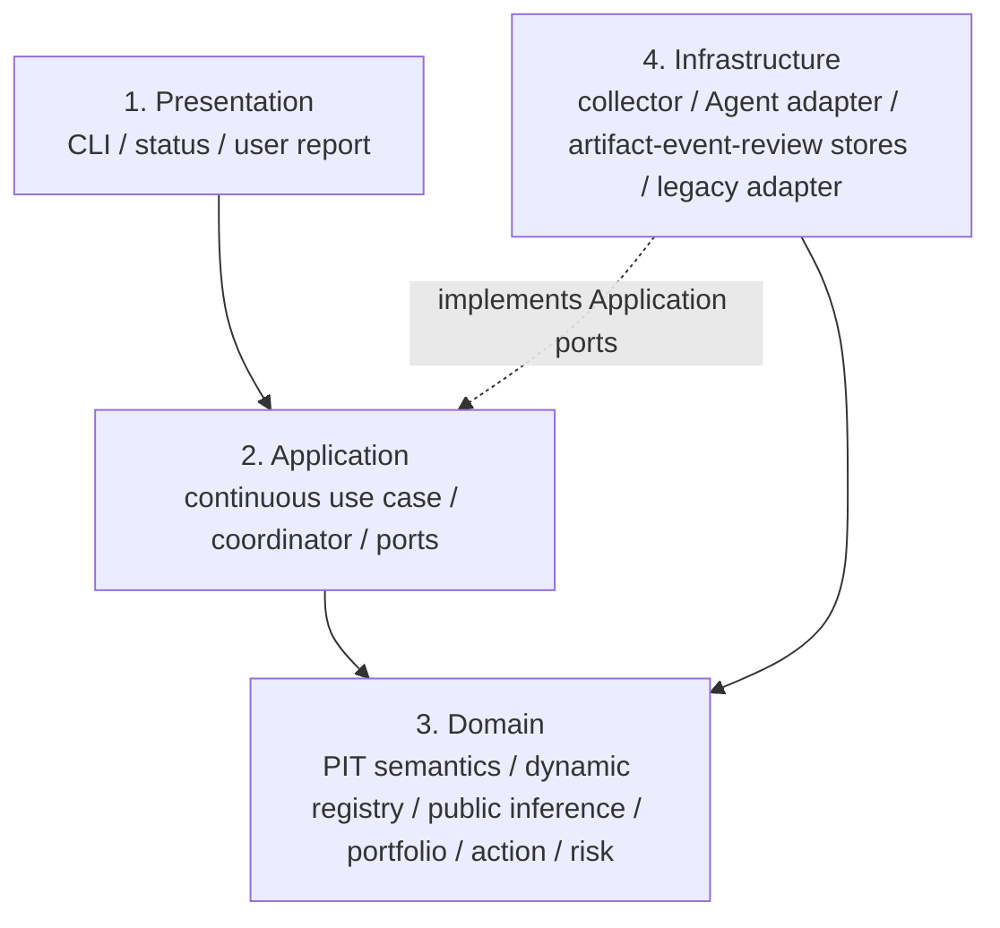

# 动态开放研究与 Agent 核心方向确认（2026-08-06）

> 当前裁决：`DIRECTION_CONFIRMED / LOCAL_CONTRACT_CORRECTION_COMPLETE`
>
> 理论权威：`CORE_TRADING_THEORY_v2_1.md` 保持当前已批准边界
>
> V3 状态：`DRAFT_FOR_USER_REVIEW`，本文件不构成静默批准
>
> 外部权限：`NO_GO_NEW_MARKET_RESEARCH_RUN / NONE_AUTOMATION_PAPER_LIVE_ACCOUNT_ORDER_FUNDS`

## 1. 结论

当前核心方向应正式确认为：**以动态性与开放性主导市场研究，以确定性金融内核守住事实、时间、成本、仓位、风险和提交边界，并最大化单个 Strategy Agent 在这一可行域内的机制发现、假说演化、预期维护、证据解释和动作比较能力。**

这不是“固定若干指标预测涨跌”，也不是“让 Agent 自由交易”。正确系统是：

```text
PIT 市场事实与 UNKNOWN
  → 多周期状态和多维情绪解释
  → 开放候选机制/假说/预期持续演化
  → 有限 operational lead / runner-up / OTHER 窗口
  → 完整动作与仓位尺度的金融比较
  → 确定性风险和权限闸门
  → accepted state、收据、复盘与下一观察
```

本轮发现并纠正了一个新的本地缺口：此前 Agent 实际调用时获得了完整快照和历史对象，但封存的 `agent_context_digest` 只覆盖摘要 digest，额外输入没有全部进入同一个上下文承诺；同时 Agent 理由没有形成独立、可重放的公开推论工件。现在完整 PIT 输入、历史状态、portfolio truth、风险政策、合法动作集和能力边界全部进入同一封存上下文；每轮另有 `public_epistemic_inference_trace`，绑定支持、反证、UNKNOWN、金融机制、假说/预期影响、动作含义、失效条件、局限和下一观察。

## 2. 假设、权威和非目标

### 2.1 本确认采用的假设

1. 市场是部分可观测、非平稳、存在制度和参与者变化的系统；任何固定指标组合都可能随 regime 失效。
2. Agent 的优势是跨来源解释、机制联结、反事实比较和提出新候选；它不应拥有事实真实性、数值复算、风险公式或提交权。
3. 确定性代码的优势是可重放、精确计算和失效关闭；它不应以固定语义白名单替 Agent 作市场发现。
4. 当前没有校准的互斥完备路径分区，因此序数 lead/runner-up 不能包装为概率、EV 或置信边际。
5. 本轮证据只来自本地契约、测试和合成 chronology，不证明真实市场预测、增量价值、收益或生产就绪。

### 2.2 当前权威顺序

```text
PIT 事实和不可变历史工件
  > Core v2.1 已批准认识论与权限边界
  > V3 待审运行形式化
  > 本地合成实现与参数
```

### 2.3 明确非目标

- 不修改或静默批准 V3；
- 不让 Agent 改写已批准 primitive mechanism library；
- 不建设多 Agent 集群、通用 Agent 平台、动态插件市场或新权限系统；
- 不启动网络采集、真实模型、prospective、paper/live、账户、订单或资金操作；
- 不保存或索取模型私有思维链；只保存公开、可审计、来源绑定的结论和理由。

## 3. “开放”与“有限”并不矛盾

Core v2.1 的有限机制约束与本次开放要求必须分层解释，不能互相覆盖。

| 层级 | 是否开放 | 所有者 | 规则 |
|---|---|---|---|
| 认识论类型 | 固定 | Domain contract | `FACT / MEASURE / INFERENCE / HYPOTHESIS / FORECAST / POLICY / RISK` 不可混层 |
| 已批准 primitive mechanism library | 有限 | 冻结理论与用户治理 | Runtime/Agent 不得直接扩库或获得执行权 |
| 研究候选 registry | 语义开放 | Strategy Agent 提案，确定性 reducer 接纳 | 新机制家族、方向、周期和预期不设语义白名单；历史总表不静默删除 |
| ACTIVE 工作集 | 有预算 | 确定性 reducer | 限制当轮认知负荷，不限制候选进入 `CANDIDATE/WATCH` |
| 操作窗口 | 有限 | Agent 排序，Domain 校验 | 每轮保留 lead、runner-up、OTHER/UNKNOWN，服务动作比较而非封闭研究空间 |
| 执行动作 | 有限且受控 | 确定性 risk/permission | 只能从完整合法候选集合选择，且当前全部不可执行 |

正确晋升路径是：

```text
Agent 新候选
  → CANDIDATE / WATCH
  → 明确证据、反证、falsifier、期限和下一观察
  → 多窗口未见样本与对照验证
  → 用户审查并冻结
  → 才可能进入已批准 primitive mechanism library
  → 仍需独立交易权限
```

因此，“动态开放”不是无限激活、无限仓位或无限权限；它是**开放发现、有限注意、严格晋升、受控行动**。

## 4. 完整而谨慎的合法推论

### 4.1 唯一推论链

每条市场结论只能沿以下层级前进：

```text
OBSERVATION
  source / observed_at / available_at / quality / raw binding
    ↓ 可复算 transform
DERIVED MEASURE
  指标、聚合、结构、相对变化
    ↓ 明确假设、代理边界和 UNKNOWN
PUBLIC INFERENCE
  供需、杠杆、拥挤、流动性、事件或跨周期解释
    ↓ 支持、反证、falsifier、horizon
HYPOTHESIS / EXPECTATION
  可竞争、可修订、可失效、可到期
    ↓ 同一 position/risk/cost 条件下比较
POLICY / ACTION CONSIDERATION
  HOLD/OPEN/ADD/REDUCE/PARTIAL/EXIT/REENTER/WAIT
    ↓ deterministic calculation
RISK / PERMISSION / COMMIT
  lot、stop、费用、slippage、funding、保证金、杠杆、风险上限、权限
```

禁止从新闻标题、OI、funding、订单簿快照、RSI 或情绪序数直接跳到买卖动作。

### 4.2 每条公开推断的最低字段

`public_epistemic_inference_trace` 中每条 claim 必须包含：

- 唯一 `claim_id`、claim 类型、陈述、适用周期和有效期；
- 非 UNKNOWN 的支持事实引用；
- 显式反证/冲突引用，若没有也不能把“未看到反证”当支持；
- 显式 UNKNOWN 引用，且 UNKNOWN 不得改标为支持或补零；
- 依赖的先前 claim，且只能引用已出现的上游节点；
- 符合金融基础的机制说明；
- 对已登记假说和预期的具体影响；
- 对合法动作的 `FAVORS / OPPOSES / CONDITIONAL / NO_CONCLUSION` 含义；
- falsification conditions、limitations 和 next discriminating observations。

该工件明确记录：

```text
private_chain_of_thought_recorded = false
trace_scope = PUBLIC_AUDITABLE_JUSTIFICATION_ONLY
uncalibrated_probability_emitted = false
```

这能审计“结论依据是什么”，但不会保存、索取或伪造模型的私有思维过程。

## 5. 金融基础约束

### 5.1 观测不能冒充不可识别对象

- OI 变化只说明总未平仓风险变化，不能单独识别开多、平多、开空、平空；
- 公共多空比和 top trader ratio 不是全体投资者真实仓位；
- 缺失 liquidation 是 `UNKNOWN`，不是零；
- 单次 REST 订单簿快照只能形成 observed snapshot proxy，不能证明冲击后补单和严格可执行韧性；
- 新闻标题和价格反应不能证明人类真实情绪或单一因果；
- 代理量之间共享 lineage 时不能重复计数为独立证据。

### 5.2 动作必须建立在 portfolio truth 上

Agent 可以解释和选择，但每个候选必须由确定性内核复算：

- 唯一 lot、`CORE/TACTICAL` role、数量、entry、mark、stop 和 contract multiplier；
- pending orders、fees、slippage、funding 状态；
- gross/net exposure、symbol/portfolio stop risk；
- margin used/available、post-action leverage 和 hard caps；
- 25/50/75/100 等相邻尺度、保留参与、机会成本、退出后重入延迟；
- WAIT 的原因、机会成本、所等观测和下一复核时间。

### 5.3 路径正确不等于动作正确

即使某条市场路径后来实现，动作仍可能因仓位过小、全平过早、费用、重入延迟或保护失败而表现较差；反之，一次盈利也不能证明机制解释正确。系统必须分开评价：

```text
数据失败 / 推论失败 / 假说失败 / Agent 选择失败
/ 风险与执行失败 / 市场增量失败
```

## 6. Agent 能力最大化的准确含义

### 6.1 Agent 当前应拥有的认知空间

- 读取同一个 digest 封存的完整 PIT 市场快照和 UNKNOWN；
- 读取上一 accepted hypothesis registry、expectation ledger、belief 和 accepted state；
- 读取 lot 级 portfolio truth、risk policy、完整合法动作集和尺度要求；
- 自由组合有区分力的观察，不受指标白名单约束；
- 创建、修订、晋升、降级、拆分、合并、替代、失效、到期、归档和恢复研究假说；
- 创建、修订、更新结果和关闭预期；
- 保留多种解释、OTHER/UNKNOWN、反证和未决条件；
- 先提出候选与公开推论，再从确定性封存的 evaluation set 中选择；
- 请求下一项最有区分力的观察，但不能绕过数据授权和成本边界。

### 6.2 不应下放给 Agent 的能力

- 伪造或改写 source、available_at、raw bytes、历史 accepted state；
- 自行计算并提交事实真值、保证金、杠杆、费用、成交或风险上限；
- 删除合法动作、先写 selected 再生成评价、静默改写 belief；
- 把未校准序数变为 probability、EV 或精确总分；
- 修改理论 authority、运行 manifest、event order、checkpoint 或收据；
- 获取网络、账户、订单、资金或执行权限。

最大化的对象是 Agent 的**认知覆盖、假说创造、解释深度和选择质量**，不是权限、风险预算或不可审计自由度。

## 7. 四层目标架构

只保留四层，依赖方向始终向内。



Infrastructure 不成为第五层“平台”；Agent/模型、交易所、数据库和文件系统均只是外部 adapter。

## 8. 模块划分和唯一所有权

| 层 | 模块 | 类型 | 唯一职责/数据所有权 | mock 与独立验证 |
|---|---|---|---|---|
| Presentation | `single_agent_research_cli.py`、`continuous_fixture_composition.py` | Adapter | 参数、composition、最终状态展示 | 临时 runtime root |
| Application | `continuous_fixture.py` | Service | 周期 use case 和事务顺序，不拥有市场判断 | collector/Agent/comparator/store ports |
| Application | `continuous_cycle.py`、`ports.py` | Core service/contract | event、evidence、completion、review 编排 | fake store/review source |
| Domain | `dynamic_research.py` | Core | market snapshot、sentiment、hypothesis registry、expectation ledger | 纯输入/纯输出 |
| Domain | `epistemic_inference.py` | Core | 公开推论 schema、引用/PIT/拓扑/金融完整性校验 | 纯输入/纯输出 |
| Domain | `portfolio_truth.py` | Core | lot/order/margin/leverage/account truth | 纯金融不变量测试 |
| Domain | `research_integrity.py` | Core | belief reducer、完整 action evaluation、selection、review math | 纯确定性测试 |
| Infrastructure | `continuous_fixture.py` | Adapter | 合成 collector/Agent/comparator 与本地 artifact/checkpoint 实现 | 无网络、无模型 |
| Infrastructure | `research_cycle_store.py` | Service | write-once event/evidence/completion chain | 真实临时文件、篡改测试 |
| Infrastructure | `research_review_repository.py` | Service | 四收据验证、raw/trace 重放、review source 读取 | 物理/语义漂移测试 |
| Infrastructure | `legacy_v1/read_only.py` | Adapter | 冻结旧运行只读兼容 | mutation 永久拒绝 |

模块不得调用其他模块内部 helper；共享对象只能通过公开函数、port、schema 或 event 传递。

## 9. 主要 IO 契约

| 契约 | 输入 | 输出 | Owner | 关键失败关闭条件 |
|---|---|---|---|---|
| `MarketInformationSnapshot v1` | 十类 raw/derived facts | PIT facts、category status、UNKNOWN | Domain dynamic research | future、缺类别、unknown 补零、lineage 错误 |
| `AgentContext v2` | snapshot、历史 state、portfolio、risk、action/capability contract | 单一完整上下文 digest | Application builder | 摘要签名而额外输入未绑定 |
| `AgentProposal v1` | 完整封存 context | sentiment inputs、hypothesis/expectation/belief deltas、候选、公开 claims | Strategy Agent adapter | proposal 与 context digest 不一致、selected-first |
| `PublicInferenceTrace v1` | proposal claims + admitted state | 公开证据路径和 self digest | Domain epistemic contract | 引用不存在、UNKNOWN 改标、claim 倒序、缺金融机制/falsifier/局限 |
| `HypothesisRegistry v1` | prior + lifecycle deltas | append-only registry + transition receipts | Domain dynamic research | 重复语义、非法 revision、超 ACTIVE budget |
| `ExpectationLedger v1` | prior + result deltas | append-only expectations + closure | Domain dynamic research | 静默覆盖、重复预期、无结果证据关闭 |
| `ActionEvaluationSet` | beliefs、portfolio、risk、完整 candidates | 每候选数量/成本/风险/可行性 | Domain research integrity | 缺合法动作/尺度、lot 不一致、风险计算失败 |
| `Selection` | sealed evaluation + Agent choice | 已存在可行候选和未选理由 | Domain research integrity | selected-first、选择不存在/不可行候选 |
| `CycleEvidenceReceipt v1.1` | 顺序事件和全部 artifact bindings | 不推进 checkpoint 的证据收据 | Infrastructure store | 任一事件、actor、物理 SHA 或语义 digest 不匹配 |
| `CompletionReceipt v1.1` | evidence receipt、report、accepted state、到期 review | checkpoint 可推进证明 | Infrastructure store | comparator/report/review 未绑定 |

## 10. 事件流

```mermaid
flowchart LR
    A["CYCLE_DUE"] --> B["COLLECTION + PIT_ADMITTED"]
    B --> C["MARKET_INFORMATION_SEALED"]
    C --> D["REPLAY + PRE_STATE"]
    D --> E["FULL AGENT_CONTEXT_SEALED"]
    E --> F["AGENT_PROPOSAL_SEALED<br/>no selected"]
    F --> G["SENTIMENT / HYPOTHESIS / EXPECTATION"]
    G --> H["PUBLIC_INFERENCE_TRACE_SEALED"]
    H --> I["BELIEF_UPDATE"]
    I --> J["ACTION_EVALUATION_SEALED"]
    J --> K["DELIBERATION + SELECTION"]
    K --> L["RISK + DECISION + STATE_ACCEPTED"]
    L --> M["ACTION_RECEIPT + COMPARATOR + REVIEW_SOURCE"]
    M --> N["CYCLE_EVIDENCE_RECEIPT"]
    N --> O["REPORT + DUE REVIEW"]
    O --> P["CYCLE_COMPLETED + CHECKPOINT"]
```



`STATE_ACCEPTED` 后只允许恢复确定性尾部；不得重新采集或重跑 Agent 改写 accepted judgment。

## 11. 扩展结构，而非通用插件平台

采用最小 `Core Engine + Explicit Adapter Registry`：

```text
Stable Core
  dynamic research / public inference / portfolio truth
  belief / action / risk / event invariants

Explicit adapters registered in frozen manifest
  CollectorAdapter
  StrategyAgentAdapter
  ComparatorAdapter
  ArtifactStore / EventStore / ReviewRepository
  LegacyReadOnlyAdapter
```

扩展生命周期仅为：

```text
register in reviewed manifest → local mock verify → authorized activate
→ run under fixed permissions → deactivate
```

不做目录动态扫描；adapter 无权直接修改 Domain state；新数据源、新模型或新比较器必须具有唯一 ID、版本、能力范围、资源/网络权限和 mock。当前 manifest 只注册本地合成实现。

## 12. 数据 schema 和留痕

每轮至少保存并由 evidence receipt 绑定：

1. 原始请求/响应或失败尝试；
2. `market_information_snapshot`：十类事实、raw/derived、source、raw SHA、observed/available、quality、coverage、lineage、limitations、UNKNOWN；
3. `multidimensional_market_sentiment_state`：十轴序数、覆盖率、冲突、时间尺度、输入 fact IDs、局限和下一观察，无 overall numeric score；
4. `agent_context v2`：完整 PIT 输入、历史 registry/ledger/belief/state、portfolio、risk、action/capability contract；
5. Agent proposal、invocation receipt 和公开 inference trace；
6. hypothesis delta/registry、expectation delta/ledger、belief events/state；
7. action evaluation、deliberation、selection、risk、decision、accepted state、action receipt；
8. comparator、review source、cycle evidence receipt、report、四周期 review 和 completion receipt。

对象各有一个 owner；报告只投影这些工件，不能反向成为权威。

## 13. 三阶段路线

### Phase 1：本地研究内核确认——当前已完成

- 开放 registry、动态 expectation、十类市场记录、十维情绪；
- 完整封存 Agent context；
- 公开推论 trace；
- lot/金融/action/risk 边界；
- event/evidence/completion/review 来源绑定；
- legacy mutation 收敛和合成四周期验证。

出口：只证明结构和过程，不进入市场研究。

### Phase 2：理论冻结与授权的只读市场观察——未授权

- 用户逐项确认 V3 参数、开放候选晋升规则和公开推论 schema；
- 冻结数据合同、标的、周期、观察窗口、评价指标和 stop conditions；
- 在单独授权下接入 PIT 公共数据与真实 Strategy Agent adapter；
- 只做 shadow research，输出不可执行状态和完整缺口。

出口：证明真实输入闭环和 Agent 能持续产生非模板化、有区分力的推论；仍不证明收益。

### Phase 3：事前注册的未见对照——未授权

- walk-forward、相同 PIT/风险/成本/执行语义；
- 比较静态 V1、deterministic continuous 和 single-Agent dynamic；
- 分开测预测前缀、路径捕获、动作忠实、费用、funding、drawdown、重入延迟和 opportunity difference；
- 达到冻结门后才讨论 paper/shadow，再经独立权限讨论更高阶段。

出口：只有新鲜、多窗口、成本后对照证据才能支持 Agent 增量；失败时裁剪理论或 Agent 范围，不靠工程 PASS 辩护。

## 14. 验证门

| Gate | 必须证明 | 当前状态 |
|---|---|---|
| G0 权威 | Core/V3/历史工件/authority 未漂移 | PASS，本轮不改冻结理论与运行 |
| G1 分层 | 只有四层、依赖向内、ports 注入 | PASS，本地主路径有自动检查 |
| G2 开放候选 | 新语义方向可进入 registry，白名单为 `None` | PASS，合成 Cycle 2 新建 liquidity-vacuum-reversal |
| G3 动态晋升 | 新方向可从 WATCH 晋升并成为 operational lead | PASS，合成 Cycle 3 成为 lead |
| G4 完整上下文 | Agent 实际输入与 context digest 完全相同 | PASS，`FULL_BOUND_POINT_IN_TIME_INPUT` |
| G5 公开推论 | 支持/反证/UNKNOWN/金融机制/falsifier/下一观察可重放 | PASS，本地结构与篡改测试 |
| G6 金融真值 | lot/role/order/margin/leverage/cost/risk 一致 | PASS，本地领域测试 |
| G7 决策顺序 | proposal 无 selected，先 evaluation 后 selection | PASS，本地事件和契约测试 |
| G8 来源复盘 | 四周期 review 重验 raw、trace、artifact 和 receipts | PASS，本地合成 review |
| G9 真实市场增量 | fresh unseen、多窗口、成本后对照 | `UNKNOWN_NOT_EVALUATED` |
| G10 交易权限 | paper/live/account/order/funds 明确授权 | `NONE / NO_GO` |

## 15. Legacy 兼容策略

- 不迁移、不补写、不重算 v1.4 Cycle 1–4、E0/E0B 或其他冻结历史；
- 旧 `status/evaluate/comparator` 只读能力保留；
- 旧 `prepare/collect/open/accept/finalize/interrupt/recover` mutation 入口统一失败关闭；
- 新研究功能只进入四层 continuous core；旧约 7,800 行应用不再作为新功能中心；
- 若未来迁移真实适配器，只在新 manifest 注册，不让 legacy 写入新 state。

## 16. 当前仍然未知的问题

以下问题不能由本轮代码或合成 chronology 回答：

- 新开放假说是否具有真实市场解释力；
- Agent 是否能长期提出非模板化、具有增量区分力的新观察和机制；
- 十维情绪是否比更小维度表示更有效，是否存在共享 lineage 重复信息；
- ACTIVE budget=5、lead/runner-up/OTHER 窗口是否是最佳认知容量；
- V3 belief 序数映射是否适合不同标的和 regime；
- 动态政策是否优于 deterministic continuous，是否改善成本后路径捕获和收益；
- 真实模型的身份、token/推理预算、稳定性和跨周期一致性。

这些继续标记 `UNKNOWN_NOT_EVALUATED`，不得用本地 PASS 填补。

## 17. 最终方向声明

当前推荐冻结为系统设计原则、但不冻结为市场有效结论的声明是：

> 系统以点时事实和金融约束为底座，以开放候选假说和持续预期为研究记忆，以单个 Strategy Agent 为机制发现、解释和可行集合选择中心，以确定性 reducer、evaluation、risk、event 和 receipt 为可信提交中心。开放性优先作用于研究语义，动态性优先作用于状态更新；有限性作用于当轮注意、合法动作、风险和权限。任何新方向都可进入候选研究，但不能未经证据、验证、人工冻结和独立授权直接成为已批准机制或交易行为。

该声明与最初 MSTA-HED 的“多周期状态识别 → 有限假说竞争 → 证据持续更新 → 条件触发决策”一致，并补足了原系统最容易失败的两点：**允许候选空间持续生长**，以及**让每次推论和预期都可追溯、可反驳、可复盘**。
