# 可持续自动交易研究系统架构

版本：1.0  
冻结日期：2026-07-22  
当前边界：BTCUSDT、Binance USD-M 公开数据、研究与 paper-only；不含账户凭据和真实下单权限。

## 1. 架构结论

系统采用单机、契约优先、四层模块化架构。当前 P0 不是“尽快训练一个模型”，而是持续形成不被事后选择污染的前瞻证据，并让系统自动判断下一步是继续采集、进入 G1，还是因证据或资源问题停止。真实资金能力保持物理缺席；研究门、paper 门和未来 canary 门不能由调度器跳过。

```mermaid
flowchart TB
    subgraph L1["Presentation Layer"]
      CLI["CLI / launchd adapter"]
      REPORT["JSON reports / operator status"]
    end
    subgraph L2["Application Layer"]
      SUP["Capture Supervisor"]
      COL["Planned Capture Workflow"]
      READY["Research Readiness"]
      GUARD["v2 lineage guard / role admission"]
      PROMOTE["v2 Protocol Finalizer"]
      G2["G2 evaluator / formal wrapper"]
    end
    subgraph L3["Domain Layer"]
      PLAN["Forward Capture Plan"]
      G1["G1 Acceptance Policy"]
      PROTOCOL["Research Protocol"]
      RISK["Risk / OMS state machines"]
    end
    subgraph L4["Infrastructure Layer"]
      BIN["Binance public WS / REST"]
      STORE["Append-only Event Store"]
      SEAL["Manifest / SHA-256 sealing"]
      CLOCK["UTC clock / disk telemetry"]
    end
    CLI --> SUP
    CLI --> READY
    SUP --> PLAN
    SUP --> COL
    COL --> BIN
    COL --> STORE
    COL --> SEAL
    READY --> G1
    READY --> PROTOCOL
    READY --> STORE
    PROMOTE --> GUARD
    PROMOTE --> G1
    PROMOTE --> PROTOCOL
    G2 --> PROTOCOL
    RISK --> STORE
    SUP --> CLOCK
    REPORT <-- CLI
```

依赖只能自上而下；Domain 不导入 CLI、网络或文件系统实现。每份数据只有一个权威所有者：原始市场事实属于 Event Store，采集资格属于 Forward Capture Plan，G1 资格属于不可覆盖 G1 report，研究阈值属于 Research Protocol，订单状态属于 OMS audit trail。

## 2. 四层职责与模块

| 层 | 模块 | 单一职责 | 输入 | 输出/所有权 |
|---|---|---|---|---|
| Presentation | `trade_system.cli` | 参数解析、退出码、JSON 呈现；兼容既有命令 | 命令行参数 | stdout/stderr；不拥有业务状态 |
| Presentation | launchd adapter | 定时调用一次 supervisor；不解释研究结果 | 固定本地 plist | 进程生命周期和本地日志 |
| Application | `capture_supervisor` | 选择当前可执行 slot，执行磁盘预算和重复运行防护 | 冻结 plan、UTC、data root | `RUN_SLOT/WAIT/PLAN_RESERVED/PLAN_EXHAUSTED/RESOURCE_BLOCKED` 决策 |
| Application | `planned_capture` | 原子保留目录、调用公开采集、写终态、封存与审计 | `PlannedCaptureRequest` | `PlannedCaptureResult` |
| Application | `readiness` | 汇总 inventory、执行冻结 G1、量化缺口并给出唯一下一阶段 | evidence roots、policy、protocol | 只读 readiness report |
| Application | v2 lineage guard / role admission / protocol finalizer | v1 guard 废止、future role evidence admission；仅在 verified PASS G1 后冻结 v2 preregistration | v2 guard、future role artifacts、PASS G1 report | 不可覆盖 frozen v2 protocol；缺任一真实 binding 即拒绝 |
| Application | G2 evaluator / formal wrapper | 对已 admitted DEVELOPMENT evidence 执行冻结的 G2 裁决并写 formal wrapper | frozen v2 protocol、admission、state labels | 可验证 G2 report；当前无真实 G2 结果 |
| Domain | `capture_plan` | 校验事前窗口、registry 绑定和资源预算 | plan JSON | immutable plan/slot/value objects |
| Domain | `g1_acceptance` | 按冻结规则决定证据是否可进入研究 | Event Store evidence、policy | PASS 或 WAIT_DATA 报告 |
| Domain | `protocol` | 校验研究、状态覆盖、holdout 和风险绑定 | protocol JSON | immutable protocol |
| Domain | episode/state/action/risk/OMS | 确定性状态转换；不自行联网或下单 | 已验证领域事件 | 决策、标签、风险与审计事件 |
| Infrastructure | `market_runtime` / `binance` | 公开 WS/REST 采集与标准化 | source contract | raw + availability records |
| Infrastructure | `event_store` | append-only 持久化、审计、回放 | records/manifests | 唯一市场证据事实源 |
| Infrastructure | `collection_sealing` | collection 级 raw 分段封存 | terminal manifest | immutable raw manifests |
| Infrastructure | filesystem/clock/disk | UTC 与资源度量 | 本机状态 | 无业务推断的 telemetry |

## 3. P0 系统契约

### 3.1 Capture Supervisor Decision v1

输入：

- 一个已冻结且 schema 有效的 `ForwardCapturePlan`；
- 当前 UTC；
- 计划专属 data root；
- 只读磁盘容量与该计划占用量。

输出字段：

| 字段 | 约束 |
|---|---|
| `record_type` | `capture_supervisor_decision` |
| `action` | `RUN_SLOT`、`WAIT`、`PLAN_RESERVED`、`PLAN_EXHAUSTED`、`RESOURCE_BLOCKED` 之一 |
| `slot_id` | 仅 `RUN_SLOT` 非空 |
| `reason_codes` | 稳定机器码；不能用自然语言驱动执行 |
| `pending_slots/reserved_slots/missed_slots` | 非负计数 |
| `resource_guard` | free bytes、plan bytes、冻结上下限及 pass/fail |

不变量：

1. 只有 `start <= now` 且 `now + min_duration <= end` 的未保留 slot 才可 `RUN_SLOT`。
2. `<plan-id>/<slot-id>` 目录是互斥锁；存在即不自动复用、不覆盖、不重试。
3. 已错过 slot 不由系统补成“相邻窗口”；后续独立 slot 仍可继续。
4. 触发硬磁盘下限或计划总量上限时 fail closed，不创建 evidence 目录。
5. supervisor 不读取标签、收益或模型结果，因此不能按结果选择采集窗口。

### 3.2 Planned Capture Result v1

```text
FROZEN PLAN + FROZEN SOURCE REGISTRY
        -> atomic reserve
        -> PUBLIC_NO_CREDENTIALS capture
        -> terminal collection manifest
        -> seal every owned raw segment
        -> current audit
        -> QUALIFIED_SMOKE_SEALED | UNQUALIFIED_NOT_SEALED
```

失败是终态证据，不是可覆盖异常。SIGINT/SIGTERM、解析错误、book gap、重连、非 `TRADING`、审计失败或本地 setup failure 均不得自动升级为合格。

### 3.3 G1 Progress v1

G1 输出必须同时给出：

- policy ID/status、source registry 与 capture-plan binding；
- 合格/总 collection 数；
- 去重后的时间并集；
- distinct UTC 日期和小时桶；
- 每 collection 的 stream count/gap、封存、ACTUAL、错误和来源结果；
- `qualified_collections`、`observed_seconds`、UTC 日期/小时桶四类量化缺口；
- collection rejection reason 的汇总计数。

证据不足使用 `WAIT_DATA`，而不是把“尚未采够”误写成理论失败。只有冻结 policy、全库 audit 有效且全部门槛同时满足才是 `PASS`。

### 3.4 v2 Guard、Role Admission 与 Protocol Finalization

v1 protocol 只保留为历史证据，v2 lineage guard 会拒绝其 finalization。v2 draft 的阈值、状态分类、成本假设、fold/embargo、样本下限、hypotheses 和 holdout 时间必须在未来 role evidence 前写入；DEVELOPMENT/HOLDOUT 只接受各自 plan、acceptance、context policy/window、archive receipt 与 artifact SHA 的 exact binding。真实 future plans、PASS G1 report 与这些 bindings 缺失时，v2 仍不可 preregister/finalise。

当且仅当 v2 preregistration 已完整时，finalizer 唯一允许改变：

1. `status -> FROZEN_RESEARCH_PROTOCOL`；
2. `frozen_at -> 当前 UTC`；
3. `required_g1_report_sha256 -> verified PASS report`。

policy ID、registry、风险 profile、状态分类器、role admission 和所有研究阈值必须原样保留。输出使用 exclusive create，不允许覆盖。closed 1 秒 context 在下一真实事件发布，4H warmup、gap/non-ACTUAL/invalid book、trend veto 或缺 anchor 一律不给 `ENTER_PROBE`；这不是市场有效性结论。

## 4. 事件流与状态晋级

```mermaid
stateDiagram-v2
    [*] --> COLLECTING
    COLLECTING --> COLLECTING: WAIT / slot failed / evidence insufficient
    COLLECTING --> RESOURCE_BLOCKED: disk guard failed
    COLLECTING --> G1_ELIGIBLE: frozen G1 PASS
    G1_ELIGIBLE --> PROTOCOL_PENDING: protocol still pending G1 binding
    PROTOCOL_PENDING --> RESEARCH_READY: protocol finalizer verifies same PASS report
    RESEARCH_READY --> PAPER_READY: G2 + live/offline equivalence + paper gates pass
    PAPER_READY --> CANARY_BLOCKED: default; no credentials or owner authorization
    RESOURCE_BLOCKED --> COLLECTING: operator frees capacity, future slot remains valid
```



`COLLECTING`、`G1_ELIGIBLE` 和 `RESEARCH_READY` 都不是交易权限。任何实盘路径仍需独立 G3/G4 证据、账户隔离、法律/交易资格、资金风险数值和人工授权。

## 5. 数据结构与所有权

```text
<data-root>/<plan-id>/<slot-id>/
  raw/YYYY-MM-DD.ndjson                 # Event Store 唯一写入
  availability/YYYY-MM-DD.ndjson        # Event Store 唯一写入
  manifests/raw/YYYY-MM-DD.json         # sealing 唯一写入
  manifests/collection/<collection>.json# planned capture 唯一写入
```

已封存 collection 可生成非破坏性的 receipt-bound gzip cold sidecar。cold replay 先验证压缩字节、记录 schema、audit/replay digest 与 receipt，再供 `DeterministicReplay`/未来 role bundle 读取；它不删除 hot evidence。retirement plan 只在 hot/cold 完全等价且非活动 G1 plan 时生成机器计划，执行接口永久 fail-closed。若 cold root 与 hot 同盘，它不是灾备；外部 durable target、恢复演练与实际删除均需后续外部授权。

核心标识链：

```text
source_registry_sha256
  -> capture_plan_sha256 + slot_id
  -> collection audit/replay digest
  -> G1 report_sha256
  -> feature/action/label/state-label manifest sha256
  -> research_protocol_sha256
  -> model/action/risk binding
  -> paper audit + run seal
```

禁止复制 raw 来增加样本数；跨 collection 的簿、rolling feature、episode 或订单状态不得延续。派生产物只能通过 ID/SHA-256 引用上游，不可成为上游事实的新所有者。

## 6. 可扩展边界（非通用插件平台）

当前只保留三个窄适配口：

| 适配口 | 合同 | 当前实现 | 新实现准入条件 |
|---|---|---|---|
| Market source adapter | raw envelope + availability semantics + registry contract | Binance USD-M public | 独立 source ID/schema、序列与删失语义测试 |
| Evidence store adapter | append-only、exclusive manifest、audit/replay digest | 本地文件系统 | 相同写入不变量和故障恢复证明 |
| Model adapter | frozen artifact input/output schema；无下单能力 | deterministic baseline | G2 后、同一 holdout 和成本门下独立比较 |

不建设动态插件发现、微服务、Kafka、Kubernetes 或通用多交易所框架。只有观察到当前适配口成为真实交付瓶颈时才扩展。

## 7. 三阶段路线图与验收门

### 阶段 A：可持续证据采集（P0）

- 冻结 G1 v1、7 天轮转计划和 12 GiB 计划预算/15 GiB 磁盘下限；
- launchd 按 28 个冻结 UTC slot 对应的本地日历时刻调用一次 supervisor，`RunAtLoad` 负责重启恢复；
- 28 个 61 分钟 slot，要求至少 24 个合格、24 小时时间并集、7 个 UTC 日期和 12 个 UTC 小时桶；
- 自动封存、失败留痕，readiness 量化剩余缺口。

验收：计划和 policy 校验通过；并发调用最多一个能保留 slot；资源不足不创建目录；真实 slot 只有 audit 后才显示 sealed。

### 阶段 B：可复核研究闭环（P0/P1）

- G1 PASS 后构建 provenance-bound feature/action/label/state-label bundle；
- finalizer 只绑定 exact PASS report；
- 样本不足统一 `INCONCLUSIVE/WAIT_DATA`；
- frozen walk-forward 与 one-time holdout 全部写不可覆盖报告。

验收：任一 digest、state 重算、holdout ledger 或 embargo 不符均 fail closed；无 PASS G1 不生成 frozen protocol。

### 阶段 C：paper 与有限 canary（P1，默认关闭）

- 先完成 offline/live feature 与 decision 等价；
- paper OMS、保护单、账户遥测、恢复和故障演练；
- 只有 G3 通过且资金所有者另行给出风险/账户/资格授权，才创建一次性 canary contract。

验收：断线、陈旧数据、账户不一致、重复提交和恢复路径均有真实演练证据；当前代码存在不等于门已通过。

## 8. 兼容与迁移策略

1. 保留现有 `collect-public`、`collect-planned-public` 和 `capture-plan-status` CLI 名称。
2. `collect-planned-public` 变为 Presentation 兼容适配器，主工作流下沉到 Application 服务。
3. 新的 `supervise-capture-once` 是自动运行主入口；它复用同一 planned-capture 服务，不复制采集逻辑。
4. 旧 v1/v2 Source Registry 和既有 collection 永不改写；G1 v1 只接受其明确绑定的 v3 + capture plan。
5. 官方历史 archive overlap 留在 P1 交叉审计；归档暂未发布不会阻塞 P0 前瞻采集或被伪装成验证成功。

## 9. 明确停止条件

- 可用磁盘低于 15 GiB或本计划占用达到 12 GiB；
- source registry / plan / instrument 摘要不一致；
- 当前时间已不足以完成 slot 最小时长；
- target 已存在、写入者状态不明或 evidence audit 不通过；
- G1 未 PASS、协议未冻结、状态覆盖不足或 holdout 已被打开；
- 任何凭据、账户、资金或 live endpoint 被意外引入当前公开采集进程。

达到停止条件时系统保留证据、输出机器可读原因并等待显式处置，不通过降低标准“自我修复”。
