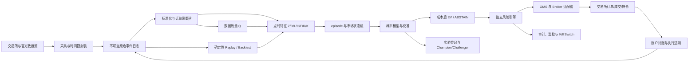
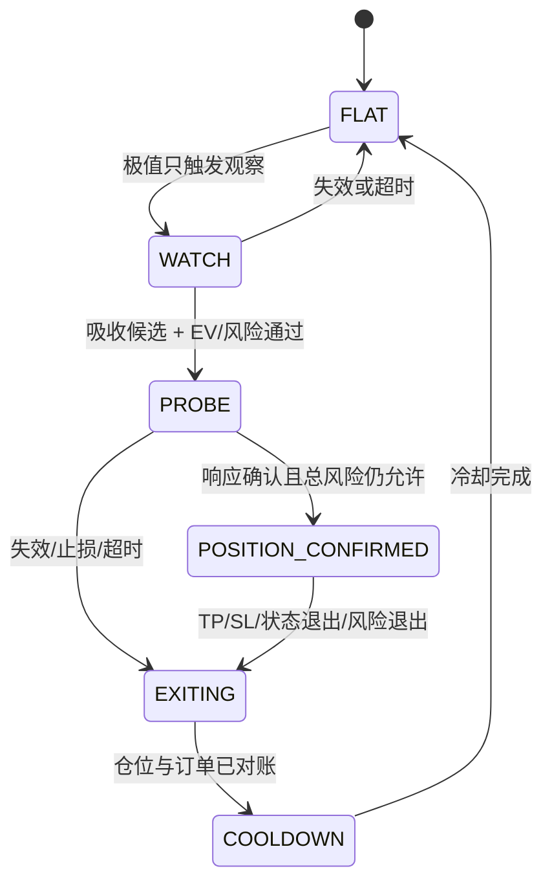
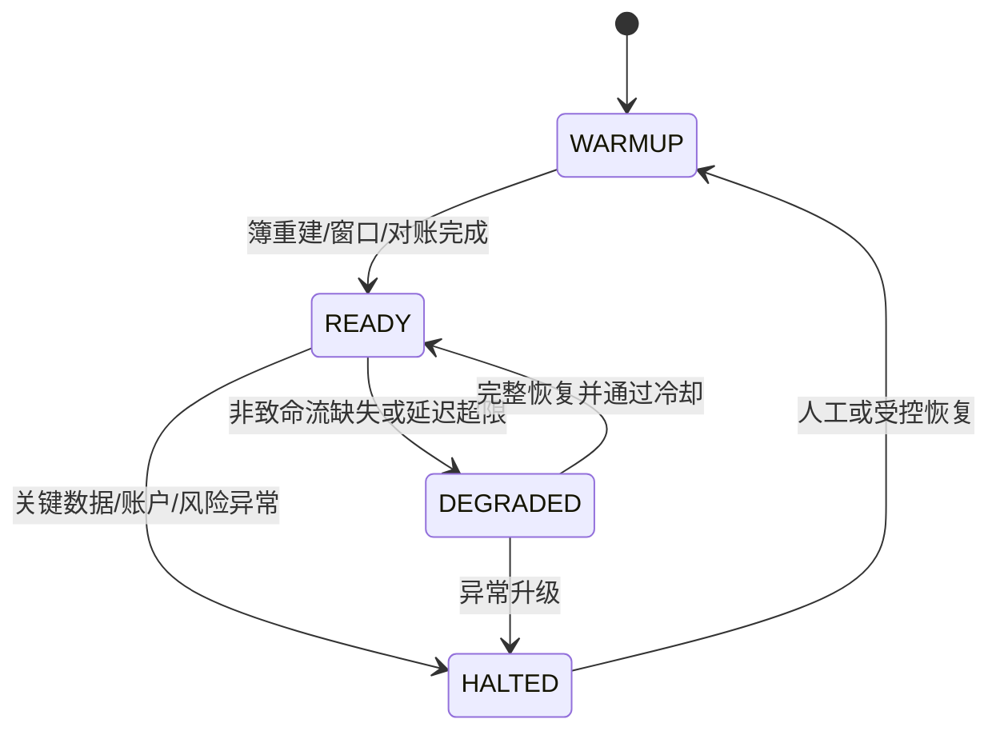
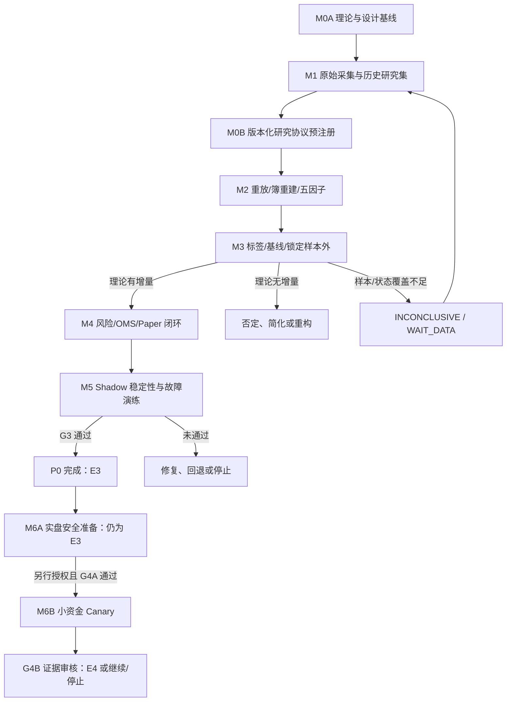

# 自动交易系统设计与优先级路线图

> 版本：1.5
> 状态：受限设计基线；旧 active G1 为 `TERMINAL_WAIT_DATA_PLAN_UNREACHABLE`；RSI 后续 Route B 为 E0 contract drafting
> 更新日期：2026-07-30
> 理论权威：[CORE_TRADING_THEORY.md](./CORE_TRADING_THEORY.md)
> 架构权威：[SYSTEM_ARCHITECTURE.md](./SYSTEM_ARCHITECTURE.md)
> 当前状态入口：[CURRENT_SYSTEM_STATUS.md](./CURRENT_SYSTEM_STATUS.md)
> 当前准备度：旧研究线无 G1/G2；新通道仅有隔离 paper practice authority；本文件不代表市场有效、72 小时实践完成或实盘系统

本文件把核心理论转换为一个低复杂度、可重放、可审计、可逐级晋升的自动交易系统。所有理论含义以核心理论中的 `T-*`、`DATA-*`、`H-*` 为准；本文件只规定系统如何实现和验证，不复制或另行发明理论。

---

## 1. 交付目标与范围

### 1.1 P0 用户结果

本文的 `P0` 与 `P0-R` 同义：M0A–M5、最高 E3 的研究/paper 范围，不含真实资金。

P0 完成后，系统操作者应当能够：

1. 持续采集并审计 BTCUSDT 主市场原始数据；
2. 从不可变原始事件确定性重放同一时刻系统“看到了什么”；
3. 生成与 live 同源的五因子、episode 状态和按动作定义的 TP/SL/结构退出/timeout 概率；
4. 在账户适用费率、盘口、保守延迟/滑点、funding 和部分成交约束下回测，并把尚未有实盘遥测的部分明确标为先验；
5. 运行 paper trading 完整闭环，并在交易所支持的 testnet/demo 验证真实 API 订单生命周期，包括风险审批、下单、保护、退出和账户对账；
6. 在数据缺失、时钟异常、拒单、断线、持仓不一致时停止新增风险并恢复；
7. 用证据决定理论是否值得进入小资金 canary，而不是默认必须上线。

P0 工程验收目标到 **M5 / E3 paper 闭环** 为止。之后先完成 M6A 并通过 **G4A Canary 准入（证据仍为 E3）**，才可运行 M6B；M6B 的有限实盘证据再由 **G4B** 审核是否达到 E4。真实资金不是本次交付的默认终点，启用需要资金所有者另行授权并满足所在地和交易所资格要求。

### 1.2 V1 明确范围

- 主标的：BTCUSDT。
- 主市场：Binance USDⓈ-M 永续；Binance 现货作为参考。
- 主策略：极值后的吸收—修复/反转。
- 明显趋势延续：记录但不交易，输出 `ABSTAIN`。
- 仓位：PROBE + POSITION_CONFIRMED 两段，共享一个 episode 风险预算。
- 初始执行：marketable limit IOC；不在 P0 建 maker 排队模型。
- 账户契约：V1 仅支持 Binance One-way Mode / `positionSide=BOTH`，并要求专用账户/子账户的抵押品、订单与 BTCUSDT 仓位由本系统独占；Hedge Mode 和与人工/其他机器人共享净仓账户均不支持。
- 研究与 paper：允许使用 OKX 历史 L2 做外部研究，但不得用其成交价格冒充 Binance 执行。

### 1.3 非目标

- 不承诺收益率、胜率或上线日期。
- 不做全币种扫描、组合优化或跨交易所套利。
- 不做强化学习、在线自动调参或“自主扩资”。
- 不做新闻/社交情绪驱动的核心入场。
- 不先建设 Kafka、Kubernetes、微服务平台、通用插件系统或数据湖平台。
- 不用回测最优值决定资金风险上限。

---

## 2. 总体方案

### 2.1 设计原则

1. **一条逻辑，两种时钟**：offline replay 和 live 使用同一套标准化、特征、episode、模型与决策代码；差别只在事件来源和时钟。
2. **原始事件不可变**：任何清洗、修复和派生都另存版本，不能覆盖原始消息。
3. **点时正确优先**：所有输入以 `available_at` 为准，禁止事后补齐污染历史决策。
4. **风险引擎独立否决**：模型只能提出意图，不能绕过风险、账户和执行健康检查。
5. **交易所账户是真实执行源**：本地状态必须持续与交易所订单、成交、持仓和余额对账。
6. **故障时减少权限**：数据或执行退化时禁止新增风险，不用模型猜测缺失数据。
7. **先证明增量，再增加复杂度**：遵循 `T-012` 和 `T-016`。

### 2.2 最小架构



### 2.3 最小部署形态

P0 使用一个代码仓和一台受控 POSIX/Linux 主机，逻辑上分成三个进程即可：

- `market-runtime`：采集、标准化、簿重建、特征、episode 和决策。
- `trade-gateway`：风险、OMS、Broker、保护单、账户对账和 kill switch。
- `research-cli`：重放、标签、回测、训练、校准、报告。

三个进程共享版本化库和本地持久化，不引入远程消息队列。paper 阶段可以同机运行；canary 前再根据故障演练决定是否需要独立 watchdog 或备用主机。

推荐的低成本技术基线：

- Python 3.12+ 与 `asyncio` 用于采集、研究和执行编排；
- 小时分段的压缩原始日志（NDJSON/zstd 或等价格式），原子封口并写 checksum；
- Parquet 保存标准化事件、特征和研究结果；
- DuckDB 做本地分析与批量 as-of 查询；
- SQLite WAL 保存配置版本、实验、意图、订单状态和审计元数据；
- 进程监管使用 systemd 或等价的简单 supervisor。

这些是默认建议，不是不可修改的公共接口。只有容量测试证明不够时，才升级 PostgreSQL、流式总线或分布式存储。

---

## 3. 数据设计

### 3.1 强制事件信封

所有快慢数据使用同一套逻辑事件信封，但物理上必须是两条 append-only 记录，而不是一行随后回写：

1. `raw_capture` 在收到完整 payload 后立即落盘，保存接收顺序、原文和反查位置；解析失败也必须保留。
2. `availability_record` 在解析、序列/覆盖检查和必要质量验证后追加，引用同一 `event_id`，同时给出实际生成时间、该版本的可用时间、可用性证据类型、schema 和质量；失败事件可永久没有可用记录。

| 字段 | 含义 |
|---|---|
| `event_id` | `[raw]` 事件实例 ID；使用 UUIDv7 或 `source/connection_id/ingest_seq`，不得只用内容哈希 |
| `source` / `venue` | 来源系统与交易场所 |
| `instrument` / `stream` | 规范化标的与原始流 |
| `schema_version` | `[derived]` 解析器和源 schema 版本；新解析器追加新记录 |
| `connection_id` / `session_id` | 连接、登录会话或文件导入批次；重连后必须变化 |
| `ingest_seq` | 每个 collector 内严格递增的接收序号，用于区分相同 payload 的不同事件实例 |
| `capture_seq` | 单一 raw-log writer 提交时分配的全局递增序号，定义跨流确定性回放顺序 |
| `exchange_event_time` | 交易所或发布者声明的事件时间 |
| `venue_trade_date` | 场所定义的交易日；例如 CME 周末事件时间与下一营业日 trade date 必须并存 |
| `source_as_of` | ETF、宏观、链上等数据描述的观察时点 |
| `publish_time` | 来源实际发布时刻；未知时必须显式为空 |
| `receive_time` | 本机收到完整消息的时刻 |
| `receive_monotonic_ns` | 同一主机启动周期内的单调接收时钟；不可单独跨主机比较 |
| `derived_at` | `[derived]` 该 availability record 实际生成/落盘的墙钟时间，禁止回填 |
| `available_at` | `[derived]` 该解析版本可进入决策的最早时刻；其证据含义由 `availability_kind` 决定 |
| `availability_kind` | `[derived]` `ACTUAL` 或 `RECONSTRUCTED`；后来重算不得伪装为当时实际运行 |
| `reconstruction_basis` | `[derived]` 仅重算时必填：解析器、质量规则、延迟模型和输入版本 |
| `sequence_start/end` | `[derived]` 序列或 update ID；无序列时为空 |
| `revision_id` / `label_version` | 修订和第三方标签版本 |
| `quality_flags` | `[derived]` gap、late、duplicate、recovered、censored、ordering_reconstructed 等 |
| `raw_segment` / `raw_offset` | 原始日志分段和字节/记录偏移，支持精确反查 |
| `payload_hash` | 原始 payload 哈希 |
| `payload` | 完整原生消息或可逆编码 |

系统时间统一保存 UTC；展示层再转换时区。主机必须运行时间同步，记录 NTP 偏差和 monotonic receive clock。

`available_at` 不是消息到达时刻的别名。它必须晚于或等于 `receive_time`，并包含完成解析、序列衔接和必要质量验证所需的时间；`derived_at` 必须是 record 真正生成的时间且不得倒签。只有当时运行的冻结管线实际释放的记录可标 `ACTUAL`。后来使用新解析器、新质量规则或数据修复重跑时，只能追加 `RECONSTRUCTED`，同时保存反事实 `available_at` 和完整 `reconstruction_basis`；不得把它改写成历史实际可用。`payload_hash` 只用于完整性与重复检测，不能替代 `event_id`。

G2 可以使用 `RECONSTRUCTED`，但必须在打开相应 holdout 前冻结整套解析/质量/延迟规则，从原始点时输入确定性生成，单独报告并禁止用于真实延迟、跨流先后、队列或当时生产可用性的主张。任何候选版本晋级 E3 前，都必须在新的向前窗口用 `ACTUAL` shadow 记录证明 offline/live 等价。

### 3.2 原始层、标准层、特征层

```text
raw/native
  raw_capture：原生消息 + 接收/落盘元数据，永不覆盖

availability/normalized
  availability_record + 统一 side、合约单位、价格、名义量、场所语义
  同一 raw 可有多个明确版本，但 champion 只绑定一个冻结版本
  始终能反查 raw event_id

feature
  完整输入窗口、available_at、availability_kind、quality、episode_anchor、feature_version

decision/audit
  当时看见什么、模型/政策/风险版本、为什么交易或放弃
```

### 3.3 订单簿重建

每个 venue 的适配器必须严格实现官方 snapshot + delta 规则：

1. 先缓冲增量，再取得 snapshot；
2. 丢弃 snapshot 之前的无效更新；
3. 校验首条连接和后续连续序列；
4. 发现 gap、乱序无法恢复或 checksum 不一致时立即将 book 标记为 invalid；
5. 重新获取 snapshot 并恢复后才允许特征进入 READY；
6. 缺失区间不插值、不静默填零；
7. 若采集 RPI depth，则与 Binance standard book 分开存储和建模；未采集时标记 unavailable，不能填零，也不能假设 RPI 对 API 订单可成交；
8. 不同 venue 的 side、合约 multiplier、quote currency 和 liquidation 方向在适配器内统一，并保留原始语义。

### 3.4 P0-R 研究与 paper 数据路径

按依赖顺序建设：

1. `DATA-001/002/004/005/007/008`：Binance 永续核心流、合约规则和数据健康。
2. `DATA-010`：立即持续自采 Binance；官方归档只补其实际包含的成交/K 线。
3. `DATA-009`：先冻结私有账户、费率、订单与成交遥测契约；真实 fill/尾部滑点只有 E4 后才能校准。
4. `DATA-011`：先下载 OKX BTC 小样本审计覆盖，再按实际特征价带选择最小充分深度；不得先验锁死 400 档。
5. `DATA-003/006`：成本低时前瞻 shadow 留存，不阻塞首个 Binance 永续 G1/G2。
6. 可选 archival sidecar：在不影响 M1 核心路径且落入时间预算时，保存 `DATA-104` 的 ETF 官方快照，以及 `DATA-101/103/109` 中不易回补的 liquidation/ADL/保险流；只做 shadow，失败不阻塞 P0-R。

OKX 历史数据只承担 replay 工程、特征原型与外部机理检查，不能单独支持 Binance `H-001`–`H-004` 或通过 G2。Binance G2 必须使用持续自采的合格 Binance 窗口，或另行批准且通过 schema/完整性审计的 Binance 历史方案；执行成本、队列、滑点和账户结果必须由 Binance 数据及 `DATA-009` 验证。

### 3.5 M6A / G4A 实盘安全数据路径

1. `DATA-012`：从官方产品目录重新确认可访问的稳定币/法币市场，冻结独立故障域、每 venue 一票、最小可执行名义量、bid/ask 口径、quorum、陈旧度、持续阈值和恢复迟滞。
2. `DATA-013`：交易所维护/状态纳入硬安全路径；宏观 blackout 明确选择 `ENABLED` 或 `DISABLED_WITH_OWNER_APPROVAL`。启用时，官方日历刷新、版本化，抓取/解析/冲突失败必须 fail closed。
3. `DATA-009`：User Stream 与 Binance Account/Trade REST 共同覆盖账户、position mode、开放订单、成交、income/资金费、commission、余额和持仓对账；任一侧不能单独替代另一侧。

这些是资金启用的硬依赖，不应反向阻塞 M1–M3 的无资金研究。

### 3.6 历史数据购买决策

不立即采购大规模数据。先执行：

1. 用 OKX 官方历史 L2 样本建立重放和特征基线，并先审计实际深度与日期覆盖；
2. 下载 Tardis 或候选供应商免费样本；
3. 将供应商同日 Binance 数据与实时自采 schema、sequence、book state 和 timestamp 逐项对齐；
4. 估算只购买 BTCUSDT 所需时期的成本与可节省等待时间；
5. 只有当 Binance 专属历史能改变 P0 决策、且净价值高于费用时，再向用户请求购买授权。

此设计不授权任何付费采购。

---

## 4. 核心运行模块

### 4.1 数据质量引擎

输出 `Q` 和组件级健康状态：

- 有 sequence 流的连续性和重建状态；无 sequence 流的连接/轮询 coverage、cadence 与 censored/unknown；
- 消息年龄、延迟分位、时钟偏差；
- 快照/增量比例、重复、乱序和 schema 错误；
- REST/WS 一致性抽检；
- OI、ratio、funding、强平的实际覆盖；
- 磁盘、日志封口、checksum 和回放可读性；
- 慢数据的 publish/revision/label version 完整性。

质量分数不用于填补数据，而用于限制特征、仓位和健康状态。关键流无效时必须禁止新开仓。

### 4.2 点时特征引擎

实现核心理论中的 $Z,D,L,C,F,R,K$，每个特征都包含：

- `feature_name` 和 `feature_version`；
- 输入事件集合或可复现窗口；
- `window_start/end`、`available_at`；
- `availability_kind` 及重算数据 eligibility；
- 缺失和 quality mask；
- robust normalization 的训练版本；
- `episode_id` 与冻结锚点；
- 原始值、标准化值和单位。

同一输入日志、同一版本重复计算必须得到相同结果。offline 和 live 不允许维护两套特征代码。

### 4.3 episode 与市场状态

实现 `T-003`、`T-005`、`T-006`、`T-007`、`T-015`：

- 背景状态：趋势上/下、震荡、强制去杠杆、轧空、UNKNOWN。
- episode：OBSERVE → EXPANDING → DECELERATING → ABSORBING → RESPONDING → 终态。
- 多空方向分别估计；状态转换使用最小持续时间或滞回，防止 tick 级抖动。
- 状态只生成候选和上下文，不直接绕过概率模型与风险。

### 4.4 预测与校准

首个 champion 使用简单、正则化、可解释模型：

- 基线：价格、波动、成交量、时间和极值；
- 候选 champion：正则化 multinomial logistic 或离散时间 competing-risk 模型；
- 长、短分别训练或至少分别校准；
- 校准集与训练集分离；
- 完整理论将按 LONG/SHORT 与 ENTER_PROBE/ADD_POSITION_CONFIRMED 分别输出 `p_TP / p_SL / p_STRUCTURE_EXIT / p_TIMEOUT`、不确定性和模型适用状态；首份 Protocol v2 只实现 LONG/SHORT 的 ENTER_PROBE，ADD 必须在 PROBE 通过 G2 后另行预注册；
- 不确定、分布外或质量不足时输出 `ABSTAIN`。

每个模型/校准 artifact 必须机器可读地声明 `required_source_ids`、每源 `max_age`、允许的缺失策略（`ABSTAIN` / `DISABLE_FEATURE` / `FALLBACK`）和已验收的 `fallback_model_id`。可选数据失效时不得临时填值或现场决定降级；没有预先验收 fallback 的强依赖一律 `NO_NEW_RISK`。

树模型只能作为 challenger；深度网络和强化学习属于 P2。模型选择以锁定样本外的校准、成本后效用、稳定性和复杂度为准，不以训练收益最高为准。

### 4.5 决策政策

决策按 `T-008`、`T-009` 执行：

```text
候选方向
→ 概率与不确定性
→ 真实成本/压力成本
→ 保守 EV
→ 流动性/容量
→ 风险闸门
→ TRADE 或 ABSTAIN
```

每次 `ABSTAIN` 也必须记录主原因，例如 `NO_ABSORPTION`、`NEGATIVE_EV`、`DATA_STALE`、`RISK_LIMIT`、`EVENT_BLACKOUT`、`OUT_OF_DISTRIBUTION`。

---

## 5. 三套状态机

### 5.1 交易状态



禁止从 PROBE 因亏损直接增加仓位；只有 episode 进入 `REVERSAL_CONFIRMED`、增量动作 EV 与总风险均通过，持仓才可进入 `POSITION_CONFIRMED`。V1 每个 instrument 同时最多一个活动 episode 和一个本策略仓位；反向触发不能绕过退出、对账和 COOLDOWN 自动反手。

### 5.2 系统健康状态



- `WARMUP`：不新增风险。
- `READY`：允许按政策评估。
- `DEGRADED`：禁止新增风险和确认加仓；现有仓位按预批准的保护/退出政策管理。
- `HALTED`：取消新增风险意图；保持交易所原生保护单，并按预批准策略退出或冻结，禁止模型自行决定恢复。

### 5.3 订单状态

```text
INTENT
→ RISK_APPROVED / RISK_REJECTED
→ SUBMITTED
→ ACKNOWLEDGED
→ ACKNOWLEDGED / PARTIAL / FILLED / CANCELED / REJECTED / UNKNOWN
→ 每笔新增 fill 触发 PROTECTION_REQUIRED
→ PROTECTED（仅在保护数量不变量成立时）
→ RECONCILED
```

零成交后进入 CANCELED/REJECTED 不创建保护；`UNKNOWN` 不是失败，也绝不是可重试许可。任何超时订单都先冻结该 instrument 的新增意图，并用 REST + User Stream 解释订单与持仓，再决定取消、保护或重试，防止重复成交。

---

## 6. Replay、标签与回测

### 6.1 确定性 Replay

Replay 必须同时保留两种顺序，不得混为一谈：capture order 用于审计实际接收/解析过程，availability order 用于向模型释放已经可用的 derived events。

- 原始记录按 `capture_seq` 重演；同一 collector 内同时校验 `ingest_seq`，不能重新按交易所时间美化乱序；
- derived event 只有在其冻结版本满足 `available_at <= virtual_now` 时才进入模型；更早 capture 但尚未验证的事件不能阻塞后续已可用事件，也不能提前释放；回放日志还必须保存 `availability_kind`，不得把重算记录冒充历史 ACTUAL；
- 同一 `available_at` 的释放顺序按冻结的 `(capture_seq, event_id)` 排列；订单簿自身仍必须满足交易所 sequence，否则该 book 不可用；
- 历史导入没有原始 capture order 时，必须冻结确定性的导入排序规则，例如 `(available_at, source_priority, session_id, ingest_seq, event_id)`，并标记 `ordering_reconstructed=true`；这只证明可复现，不能恢复真实接收先后；
- `ordering_reconstructed=true` 的跨流数据禁止用于 lead-lag、延迟、补单先后、队列或其他顺序敏感的 H/G2 结论，除非另有可审计的原始 sequence/接收顺序；
- `availability_kind=RECONSTRUCTED` 只有满足 3.1 的预注册与 eligibility 契约才可进入 G2；报告必须与 ACTUAL 结果分层，且它永远不能证明当时已部署或当时延迟；
- 支持重连、gap、晚到和 schema 变更重演；
- 输出 book checksum、特征 hash、状态转换和决策日志；
- 同一版本重复运行必须得到相同 hash。

### 6.2 标签

按核心理论 `T-008` 生成 competing-risk 标签：

- 每个样本锁定 `(side, stage, entry_policy, barriers, horizon, exit_policy)`；首份 Protocol v2 仅允许 ENTER_PROBE。未来 ADD_POSITION_CONFIRMED 必须使用独立预注册标签，不能复用 PROBE；
- episode 级切分；
- 多空分别定义障碍与执行价格；
- 成交后的 TP、SL、STRUCTURE_EXIT、timeout 互斥；NO_FILL/PARTIAL_FILL 属于执行结果而非市场路径标签；
- `RISK_KILL`、`DATA/EXECUTION_HALT`、账户异常和人工紧急退出另记为 `operational_override`，按预注册规则 censor 或进入独立故障情景，不训练进市场路径模型；
- 最大持有期和障碍在训练前锁定；
- tick/event 数据按实际事件顺序判断障碍；若只有 bar 数据且同一 bar 同时触及 TP/SL，则按预注册的保守规则处理或直接判为不可用，禁止事后选择有利顺序；
- 同时保存 MFE、MAE、time-to-hit、超时 PnL；
- 标签只能使用未来事件，特征不能引用任何标签窗口信息。

### 6.3 执行仿真

P0 使用市场可成交限价 IOC 模型：

1. 决策在 `decision_at` 产生；
2. 订单在 `decision_at + sampled_latency` 到达；
3. 使用到达时可见、有效的 Binance book；
4. 从最优价逐层消耗，允许部分成交，剩余 IOC 取消；
5. 不允许以信号 mid 或 bar close 假定全额成交；
6. 计入真实 fee tier、spread、slippage、funding 和保护/退出成本；
7. E2/E3 使用保守先验；M6B 只收集固定 active 版本的 `DATA-009`，不得在同一轮更新模型、成本参数或阈值。该遥测经 G4B 审核后只能校准下一 challenger，并重新走 shadow、批准和新一轮 canary。

执行模型必须单独输出 `p_fill`、成交比例分布、条件滑点与 `NO_FILL`。研究中的提交 EV 按核心理论 8.3 计算；不成交不能被当作 TIMEOUT，部分成交也不能按目标全量仓位计算收益。E2/E3 只能使用公开盘口、保守延迟先验和 testnet 协议结果；经 G4B 审核的真实成交只用于下一冻结版本，不能反向污染既有 holdout 或当前 canary。

maker 回测需要真实订单排队和取消行为，P0 不做，避免虚假 fill。

### 6.4 研究切分与报告

- purged walk-forward，embargo 至少覆盖最大标签/持有期；
- 锁定样本外只在模型和阈值冻结后运行；
- baseline → D → L/C → F → R → K 顺序消融；
- 分年份、方向、状态、时段和 venue 报告；
- 同时报失败实验、成本压力和参数邻域；
- 试验数量较大时做多重尝试/回测过拟合控制。

任何“通过”门槛必须在查看锁定测试结果前写入实验登记；不能在结果出来后移动标准。

---

## 7. 风险、OMS 与执行

### 7.1 风险权限链

```text
模型只产生 Intent
→ Risk Engine 计算最坏损失与所有限额
→ OMS 生成幂等订单
→ Broker 提交
→ User Stream + REST 对账
→ 保护单确认
```

模型进程没有绕过 Risk Engine 的下单接口。

### 7.2 风险引擎

按 `T-010` 强制检查：

- episode、单笔、单日和回撤限额；
- 总名义敞口、杠杆、保证金、单 venue 暴露；
- stop 距离 + 正常成本 + 尾部成本后的最坏损失；
- book 容量、最大 participation 和滑点；
- PROBE/POSITION_CONFIRMED 的共享风险预算；
- 数据/模型/账户/执行健康；
- 稳定币脱锚、交易所可用性，以及资金所有者已启用的宏观事件 blackout；
- 连续拒单、未知订单和持仓不一致。

风险参数保存在独立版本化配置中，修改需要双重确认或等价人工审批；研究流程无写权限。

### 7.3 原因级 Risk Gate 契约

系统健康与风险许可是两个正交维度：`READY` 不代表当前允许开仓。Risk Gate 只能输出：

- `OPEN`：可继续进入普通风险审批；不是自动下单许可。
- `NO_NEW_RISK`：禁止新 PROBE 和确认加仓；既有仓位仅按预批准保护/退出政策管理。
- `HALT_AND_RECONCILE`：取消未成交入场意图，保持交易所原生 reduce-only 保护，立即对账并执行原因专属 runbook。paper OMS 会把本地 `SUBMITTED`、`ACKNOWLEDGED` 和未终态 `PARTIAL` 入场意图转换为 `CANCELED`；这只是本地状态约束，不替代未来交易所撤单 ACK。

每个 gate 配置必须有 `reason_code`、数据源 quorum、新鲜度、阈值、持续时间、恢复迟滞、各持仓阶段动作、是否人工解除和配置版本；生产值不能从最赚钱回测反推。

每个 reason evaluator 独立保留活动原因，由单一 resolver 生成最终权限：`HALT_AND_RECONCILE > NO_NEW_RISK > OPEN`。任何较宽松结果不得覆盖更严格结果；只有所有活动原因分别满足恢复条件后才可放宽。最终下单权限再取“健康状态映射、risk-gate resolver、普通限额审批”三者最严格值：`WARMUP/DEGRADED → NO_NEW_RISK`，`HALTED → HALT_AND_RECONCILE`；gate 的 HALT 同时触发健康 HALTED 与对账。

M0B 只冻结字段、resolver、paper/synthetic 测试 profile 和“不从收益反推风险值”的约束；生产来源、阈值、持续时间、抵押品和仓位动作必须在 M6A/G4A 由资金所有者单独签署。

| 原因 | 判定与抗误报 | Gate | WATCH | PROBE / POSITION_CONFIRMED | 恢复 |
|---|---|---|---|---|---|
| 单场稳定币坏 tick | 仅一源异常、其他新鲜来源不确认 | 保持 `OPEN`，隔离该源并告警 | 正常评估，但坏源不入特征 | 不因单 tick 强平；原生保护保持 | 该源连续正常并通过离群检查 |
| peg feed 陈旧或 quorum 不足 | 新鲜来源数低于配置、时钟或基准失效 | `NO_NEW_RISK` | 不得进入 PROBE | 禁止加仓；按既定保护/退出政策管理 | quorum 持续恢复满 `T_recover` |
| 跨场确认 USDT 脱锚 | product whitelist 中至少满足批准票数的独立 venue/故障域，以最小可执行名义量的 bid/ask 越阈并持续 `T_confirm`；同 venue/vendor 最多一票 | `HALT_AND_RECONCILE` | 取消所有入场 | 取消待成交加仓、对账，并执行抵押品/退出 runbook；平掉 BTCUSDT 不得被视为自动消除 USDT 风险 | 价格与账户风险持续恢复、人工解除 |
| 宏观事件 blackout（仅在 policy 启用时） | 版本化官方日历进入预设窗口；健康可仍为 READY | `NO_NEW_RISK` | 不开 PROBE | 不加仓；既有仓位按预批准的持有、减仓或退出政策处理 | 事件结束、数据新鲜且冷却完成；日期变更须重新计算窗口 |
| 已启用宏观日历陈旧/抓取失败/解析冲突 | 冻结的事件集合任一必需 source 超过 `max_age`、schema 未识别或来源冲突未解决 | `NO_NEW_RISK` | 不开 PROBE，不沿用旧日历 | 不加仓；既有仓位按预批准政策 | 来源恢复、冲突人工/规则解决、全量重算窗口并完成冷却 |
| 计划维护/venue 公告 | 经人工或可信公告确认的未来服务风险 | 维护前 `NO_NEW_RISK`；服务异常升级为 `HALT_AND_RECONCILE` | 不开仓 | 维护前按预案降风险；异常后对账 | 服务、账户和订单状态重新确认，必要时人工解除 |
| 主订单簿 invalid / 私有流陈旧 / 账户不一致 | sequence gap 未恢复、user stream/REST 冲突或未知订单 | `HALT_AND_RECONCILE` | 取消意图 | 禁止加仓、保持保护、REST + user stream 对账，按失败类型退出 | 完整重建、零未解释差异、冷却；账户不一致需人工解除 |
| foreign order/fill/position | 发现非本系统 client-order namespace、人工/其他机器人订单或无法归属的 BTCUSDT 净仓变化 | `HALT_AND_RECONCILE` | 取消意图 | 禁止新增风险，保护当前交易所净仓并按账户隔离 runbook 对账/退出 | 原因解释、恢复专用账户独占、零未解释差异并人工解除 |
| 非 champion 依赖的 P1 feed 失效 | 可选跨场/期权/ETF 源陈旧 | 禁用该 feature，通常保持 `OPEN` | 使用不依赖它的 champion | 同左 | 数据恢复后先 shadow；若模型 artifact 的 `required_source_ids/max_age` 声明强依赖且无验收 fallback，则改为 `NO_NEW_RISK` |
| 硬限额/连续拒单/密钥异常 | 风险预算突破或执行健康失败 | `HALT_AND_RECONCILE` | 取消意图 | 取消待成交加仓、对账并按 runbook 处置 | 原因消除且人工解除 |

G4A 的硬阻塞项不是“有一张风险清单”，而是适用矩阵的来源、数值、阶段动作、合并优先级和恢复路径均已配置并完成演练。宏观 blackout 必须明确记录为 `ENABLED`（并满足日历 SLA）或 `DISABLED_WITH_OWNER_APPROVAL`，不得隐式启用/停用；确认脱锚、宏观窗口和账户不一致不能共用一个泛化退出动作。

### 7.4 OMS 和幂等

- `episode_id + intent_id + action + version` 生成 client order ID。
- 重复 intent 不得重复下单。
- 每次提交、ack、partial、fill、cancel、reject、timeout 均追加写入审计日志。
- 网络超时先对账，不盲目重试。
- 每笔新增 fill 都立即触发保护 upsert；IOC 尚未终结时，后续 fill 必须继续扩大保护。零 fill 不创建保护，孤儿保护必须取消。
- 对 V1 专用账户，定义 `effective_protected_qty >= abs(reconciled_exchange_position_qty)`；`effective_protected_qty` 只计算交易所已确认、当前有效且不会因同一条件互相重复计数的 reduce-only 保护（或经验证的全仓等价保护）。按交易所步长取整后仍必须覆盖净仓。
- 保护数量不变量在每次 fill、订单终态、REST/User Stream 对账和重连后重新验证。保护未确认时不允许确认加仓；paper OMS 在已有净仓尚未被确认覆盖时会以 `PROTECTION_NOT_CONFIRMED` 拒绝 `ADD_POSITION_CONFIRMED`。超过资金所有者批准的 `max_unprotected_duration` 或保护被拒/撤销时，立即 `HALT_AND_RECONCILE` 并执行预批准 emergency flatten，不能等待模型判断。
- 本地、交易所订单、成交、持仓和余额周期性及事件驱动对账。

V1 账户契约固定为 Binance **One-way Mode / `positionSide=BOTH`**，并使用专用账户/子账户，使其抵押品、订单和 BTCUSDT 净仓由本系统独占。启动和运行中必须通过私有 REST + User Stream 核验持仓模式、订单 namespace、成交和净仓；模式不符或发现 foreign activity 立即 HALT。上述 `reduceOnly` 保护和净仓风险归因只在该独占契约下成立。若未来支持 Hedge Mode 或共享账户，必须另建仓位归属、`positionSide`、平仓数量、保证金耦合和保护单拒绝测试，作为独立 P1 变更，不得静默复用 V1 逻辑。

### 7.5 退出

退出原因必须互斥且可审计：

- `STRUCTURE_INVALIDATED`
- `STOP_TRIGGERED`
- `TARGET_REACHED`
- `TIMEOUT`
- `RISK_KILL`
- `DATA/EXECUTION_HALT`
- `MANUAL_EMERGENCY`

止损不得向扩大风险方向移动。健康退化时如何处理既有仓位必须在 live 前预配置，不能临场交给模型。

---

## 8. 监控、安全与恢复

### 8.1 监控面板

P0 只保留能改变操作的指标：

数据：

- 流连接、sequence gap、book validity、消息年龄、延迟和时钟偏差；
- 磁盘、日志封口、checksum、schema 错误；
- 特征缺失、质量降级和 offline/live 差异。

模型：

- 输入漂移、状态 coverage、abstain 比例；
- 预测校准、TP/SL/STRUCTURE_EXIT/timeout 实际频率，以及 operational override 的独立频率/损失；
- champion/challenger 差异。

执行与风险：

- intent/ack/fill 延迟、拒单、部分成交、滑点和费用；
- 未保护持仓、未知订单、对账差异；
- 当前风险预算、日损、回撤和 kill 状态。

### 8.2 告警优先级

- P0：未保护仓位、持仓/余额不一致、关键簿失效、风险限额突破、交易密钥异常。
- P1：持续延迟、异常拒单、特征大幅漂移、磁盘/归档风险。
- P2：研究报表、低价值可视化和非阻塞数据源缺失。

### 8.3 密钥与权限

- 公共采集不用私钥；账户只读和交易权限尽量分离。
- 交易 key 禁止提款，启用 IP allowlist 和最小权限。
- 密钥不写入代码、日志或数据文件，使用系统 keychain/secret store。
- testnet/paper 与 production key、配置和目录物理分离。
- 启动时显示环境、账户和交易权限，防止误连生产。

### 8.4 恢复流程

启动或重连时：

1. 载入最后审计状态，但不相信本地仓位；
2. 从交易所查询开放订单、成交、持仓、余额和保护单；
3. 解释所有差异并落审计记录；
4. 重建订单簿和特征窗口；
5. 完成冷却后从 WARMUP 进入 READY；
6. 任何无法解释的差异进入 HALTED。

---

## 9. 优先级与阶段路线图

### 9.1 总体依赖



### 9.2 P0：端到端闭环

| 顺序 | 里程碑 | 核心产物 | 验收闸门 | 相对工作量 |
|---|---|---|---|---|
| 0A | `M0A` 理论与设计基线 | 本文件、核心理论、Claim/Data/Hypothesis ID | 文档一致；未知与非主张明确 | 已完成本轮基线 |
| 0A.1 | `M0A-RSI` synthetic primitive implementation | P0-RSI-01 contract、P0-RSI-02 pure synthetic strategy primitives、implementation manifest 与 synthetic tests | `P0-RSI-01_PASS / E0 / SYNTHETIC_PRIMITIVES_ONLY`：Sol 阶段审查与静态 contract 验收 PASS；contract 仍为 `REVIEW_READY / E0 / REJECT_FREEZE`，strategy binding `ABSENT_BY_DESIGN`，digest `38d572453045016bbdc314d184f9be87a608ec8bc36aabaf92d8c0ce742201e5`。禁止市场/历史数据、reader/network/exchange adapter、backtest、calibration、holdout、paper 或 trading；A3/January/February/March/G1 与活动 package 保持隔离不可写 | P0 合成原语优先 |
| 1 | `M1` 数据基础 | Binance live 核心 raw、私有费率/账户遥测契约、OKX BTC 历史 L2 覆盖样本、Source Registry | 有 sequence 的流可检测 message gap；无 sequence 的流记录连接/轮询 coverage 与 censored/unknown；原始日志有 checksum；OKX 深度经试点选择 | L |
| 0B | `M0B` 研究协议预注册 | `research_protocol`：episode、动作、标签、成本、切分和通过门槛 | 在生成最终特征/标签和查看锁定结果前版本冻结 | M |
| 2 | `M2` Replay 与特征 | venue 适配、book builder、Q、Z/D/L/C/F/R/K、episode | 同版本重放 hash 一致；无 unresolved gap 的数据段才 eligible；无未来输入 | L |
| 3 | `M3` 研究验证 | competing-risk 标签、简单基线、校准、消融、walk-forward、锁定样本外报告 | 输出支持、否定或 `INCONCLUSIVE/WAIT_DATA`；只有达到预注册证据精度才允许支持/否定；成本压力和失败实验完整 | L |
| 4 | `M4` Paper/Testnet 交易闭环 | Risk Engine、OMS、paper broker、Binance testnet One-way 适配、保护单、对账、操作面板 | position-mode mismatch 会 HALT；重复意图不重复下单；部分成交/拒单/timeout/保护失败测试通过；零未解释持仓差异 | L |
| 5 | `M5` Shadow 稳定性 | live 特征/决策 shadow、offline/live 对比、故障演练 | 特征/状态在预注册容差内一致；关键 kill 场景通过；样本覆盖多个状态 | 持续时间主导 |

`M3` 是停止/继续/等待数据的决策点。证据充足且核心理论没有稳定成本后增量时，不继续为它建设实盘执行复杂度；证据不足则回到 M1 等待，不得把“不显著”误写成“无效”。

### 9.2.1 当前实现证据快照（2026-07-22）

下表记录代码已覆盖的工程能力，不将合成测试或代码存在误写为 G1/G2/G3 通过：

| 能力 | 当前实现 | 可证明的范围 | 尚不能证明 |
|---|---|---|---|
| M1 原始证据 | append-only raw/availability、连接/序号、分段封存 checksum、审计、冻结 Source Registry、`exchangeInfo` 合约快照与账户遥测契约 | 本地合成/未来采集的不可回写和完整性检查；collection 可定位到来源/schema/配置摘要和首个原始 payload 哈希；BTCUSDT filters/status 有点时快照；未来私有遥测不得省略费用、对账与恢复字段 | 已积累的 Binance 前瞻覆盖、无 sequence gap 的真实窗口；真实账户遥测 |
| M2 簿与特征 | snapshot+delta 连续性、gap fail-closed、确定性 replay、feature artifact | 同一输入下的确定性处理和缺口拦截 | 历史/前瞻市场中五因子的可预测性 |
| M3 标签与基线 | 动作级 TP/SL/结构退出/超时；NO_FILL 与删失排除；冻结、可摘要的状态分类器从 label features 派生 state artifact；每状态样本 gate；purged walk-forward；正常/压力成本情景 | 标签语义、无成交不混为 timeout、分类器摘要或重算不符/状态不足/未知时不训练、成本假设可复算 | 合格 Binance 样本外增量、校准、统计精度或成本后 alpha |
| M4/M5 安全骨架 | paper IOC、幂等 intent、原因级 paper Risk Gate Profile、保护数量不变量、offline artifact 比较，以及可选的采集进程内 live-feature artifact/封存后 replay verifier、可选的封存合约 tick/lot/notional 校验 | 合成故障下的状态约束；live feature 只在合格 collection 后原子发布，且可逐 event 对照 feature、点时/availability、episode 和质量上下文；冻结 profile 下的 HALT/NO_NEW_RISK 合并、恢复迟滞与人工解除约束 | 交易所账户、testnet/实盘协议、跨窗口持续 shadow 稳定性 |

当前 `research_protocol.paper.v1.json` 明确是 `SYNTHETIC_DEVELOPMENT_PROFILE`，不是已冻结的 M0B 协议，也不含资金风险值。它只能辅助开发测试，不能被用于开启 G2/G3 评估。

`config/risk_gate_profile.paper.v1.json` 是同样受限的 `FROZEN_PAPER_RISK_GATE_PROFILE`：它冻结 reason code、`HALT_AND_RECONCILE > NO_NEW_RISK > OPEN` resolver、三种持仓阶段动作、恢复迟滞和是否人工解除。`RiskGate` 在加载该 profile 时拒绝未声明原因或与契约不符的等级；较弱原因清除后不会覆盖仍活动的 HALT，且每条原因必须先进入恢复状态并等待迟滞，要求人工解除的原因还必须显式确认。OMS 的细粒度诊断（如未保护仓位）仍完整保留在 halt audit reason，但会被映射到已冻结的 `DATA_EXECUTION_HALT` 或 `ACCOUNT_MISMATCH` resolver family，确保未知诊断不会因配置校验异常而降低停机级别。OMS 还提供纯本地的账户快照对账约束：只有净仓与待处理 client order ID 均匹配才返回一致；foreign order、丢失的本系统订单和净仓差异都进入 HALT。新增的本地 paper reduce-only 路径只接受相反方向、数量不超过本地持仓的 IOC；它可在 entry gate 已 HALT 时降低而非增加敞口，部分退出会将既有保护数量收敛到剩余仓位，完全退出清零本地保护和名义敞口，并记录本地成本基础与已实现 PnL。它不代表交易所已接受 reduce-only、保护或平仓。profile 与此对账器的 source/freshness/threshold 均为 synthetic 契约，不含生产数据源、资金数值、账户、凭据或下单权限，不能视为 G4A/M6A 配置或实盘风控证明。

实现已提供 `FROZEN_RESEARCH_PROTOCOL` 校验与草稿模板：只有显式填写 `frozen_at`、数据 source/channel/schema、episode/label/成本边界、有效样本与校准/置信区间门槛、purged split/final holdout 以及各假设通过/失败条件后才可获得 `frozen_for_research=true`。episode 的可执行触发另由 `FROZEN_EPISODE_POLICY` artifact 冻结：它声明 feature version、触发字段/阈值、冷却时间和状态机阈值；`build-features-g1-bundle` 必须传入该 artifact，并把 ID/SHA-256 写进 feature manifest。无 policy 的 `FeaturePipeline` 仅为合成/开发兼容而保留，绝不能进入 G1 bundle。`research-baseline --require-frozen-protocol` 会拒绝合成或草稿 profile；模板本身不是协议、更不是阈值建议。

`config/source_registry.v3.json` 是当前 BTCUSDT 公开采集的冻结 Source Registry。`collect-public` 在连接前验证配置流都在该来源契约中，并在 collection manifest 固化 registry ID、SHA-256、source schema 版本和每个来源的首个实际 payload hash；v3 还按 collection 记录的 cadence 轮询 `exchangeInfo` 合约状态/filter 原始快照，且任一次 BTCUSDT 状态非 `TRADING` 时保留 raw 但拒绝 `QUALIFIED_SMOKE`。对未来按时段积累的 collection，`FROZEN_FORWARD_CAPTURE_PLAN` 要求计划冻结时间早于每个 slot 的开始，并在连接前把 instrument、registry 摘要、UTC slot 与最小时长绑定到 manifest；slot 的 `coverage_intent` 只是一项预先排程说明，绝非市场状态标签或 G1/M0B 证据。此前 collection 使用的 v1/v2 仍保留，不能被新契约改写。它不主张接口永久可用；新 schema/endpoint/覆盖语义必须建立新 registry 版本，旧 collection 保留原绑定。

`config/account_telemetry_contract.v1.json` 冻结未来 paper/Testnet 私有遥测的最小边界：只读 Private REST/User Stream，明确禁止交易和提款；order update、fill、独立 funding settlement、账户更新和 REST recovery snapshot 必须保存本地/来源时间、身份、费用、余额、持仓与 raw payload hash。它要求任何未解释持仓差异在新增风险前归零，但本身没有凭据、网络、签名或下单能力，不能被当作私有数据采集或 M4 已完成的证据。

封存 `exchangeInfo` 可派生仅本地使用的 `BinanceInstrumentRules`：当前可验证 PRICE_FILTER、LOT_SIZE 和 MIN_NOTIONAL，并在将该规则对象显式交给 paper OMS 时，于风险审批前拒绝不符合 tick、quantity step、范围、notional 或 `TRADING` 状态的 intent，保留具体 rejection reason。它仍不能替代交易所 ACK、动态限额、账户权限或 Testnet 验证；合成 paper 未注入真实 rule snapshot 时不应被误写为合约可执行性证据。

`audit-okx-historical` 已实现为 `DATA-011` 的本地只读审计器：版本化计划逐日声明 OKX BTC 文件及 timestamp/bids/asks schema path，报告以 write-once JSON 保存文件缺失、格式、字节数、SHA-256、抽样时间覆盖和实际最大 bid/ask 档数。输出硬编码 `eligible_for_binance_g2=false`，因此它只能降低 replay/外部机理工程的不确定性；目前尚未下载并审计真实 OKX BTC 文件，不能将工具、模板或合成测试视为覆盖样本。

同样，`validate-g1` 只接受 `FROZEN_G1_DATA_ACCEPTANCE` 作为 G1 判定策略，并交叉检查 collection manifest、实际 raw/availability 数量、必需 stream、sealed segment、ACTUAL 分区、parse/book 错误、重连、全库 audit、来源注册表 ID/SHA-256。冻结策略还必须预先声明最少不同 UTC 日期与小时桶，防止在同一短时段复制 collection 虚增覆盖；这些日历桶只衡量采集分散度，不能替代 M0B 的状态分类覆盖。策略还必须精确覆盖全部 required streams：snapshot 有最少观测数，depth、aggTrade、mark 与 OI 各有最少观测数和从 collection 首尾计入的最大观察间隔；`exchangeInfo` 单独验证最少观测数、最大实际间隔和全程 `TRADING` 状态。`forceOrder` 只检查配置，不把无事件误判为零或断线。受控 `SIGINT/SIGTERM/SIGHUP` 中断必须产生 `UNQUALIFIED` terminal manifest，部分 raw 不得纳入 G1；无法捕获的终止信号由外部监督器作为未完成窗口处理。`--output` 把每次验收结果以不可覆盖 JSON 和内容摘要保存；只有 `PASS` 报告的 SHA-256 才能被 M0B 协议绑定。草稿模板即使阈值为零也只输出 `DRAFT_POLICY`；冻结策略在证据不足时输出带量化缺口的 `WAIT_DATA`，两者都不能宣称 G1。

2026-07-22 已完成五段隔离的 Binance BTCUSDT 正常前瞻公开窗口。第一段 120.0 秒留存 1,552 个 `ACTUAL` raw/availability 记录，用于验证采集链。第二段 180.0 秒留存 2,980 条记录，首次收到 1 条 `forceOrder`；其 155 个后续 feature row 标为 `liquidation_censored`，其余 2,813 行仍标为 `liquidation_unobserved`。第三段（当时最新 v3 window）配置 depth、aggTrade、mark、`forceOrder`、OI、snapshot 与 30 秒周期 `exchangeInfo`，在 300.0 秒内留存 7,565 个 `ACTUAL` raw/availability 记录：3,003 个 depth delta、4,171 个 aggTrade、306 个 mark、57 次独立 OI 轮询、1 个 REST depth snapshot、10 个 `exchangeInfo` contract snapshots 与 17 个 `forceOrder` 事件。第三段零 book gap、零解析错误、零重连，所有物理连接的 ingest sequence 均无可观测缺口；raw 段已封存，并通过 audit/replay（audit digest `dc729c…a7a37`）核验。十次 `exchangeInfo` 均解析到 BTCUSDT 为 `TRADING`、`PERPETUAL` 并含 7 类 filters。第三段各流实际最大观察间隔为 depth 1.854 秒、aggTrade 2.722 秒、mark 2.869 秒、OI 6.329 秒、exchangeInfo 33.856 秒；这些是描述性证据，不是事后冻结阈值。其 7,548 个 feature row 中 3,222 行标为 `liquidation_censored`、4,326 行标为 `liquidation_unobserved`；两种状态均不能转译为“真实强平为零”。第四段跨 UTC 日界，留存 21,966 条 `ACTUAL` raw/availability，持续 910.193 秒：8,920 条 depth、11,908 条 aggTrade、909 条 mark、170 次 OI、30 次 `exchangeInfo`、1 个 snapshot 与 28 个 `forceOrder`；零解析错误、零 book gap、零重连，两个 raw 分段均封存，audit/replay digest 分别为 `563198a…59af1e` 与 `01ff2c…4d7e5`，并生成 13,236 条 feature row。第五段留存 17,775 条 `ACTUAL` raw/availability，持续 915.670 秒：8,973 条 depth、7,680 条 aggTrade、916 条 mark、169 次 OI、30 次 `exchangeInfo`、1 个 snapshot 与 6 个 `forceOrder`；零解析错误、零 book gap、零重连，单段 raw 已封存，audit/replay digest 分别为 `cb8b131…819fa` 与 `c14993…ea370`，并生成 10,681 条 feature row。collection manifest 固化 `source-registry.v3` 的 SHA-256、两个来源的 schema 版本、metadata poll cadence 及 REST/WS 的首个实际 payload hash；此前 v1/v2 collection 保持独立证据边界。另有一段异常终止的 9,192 条 raw/availability 窗口已在恢复后封存，但 manifest 永久为 `UNQUALIFIED`，绝不计入 G1。采集器现将意外重连作为新的 physical `connection_id`，depth 断线后必须重新缓冲/snapshot，旧 generation 的 snapshot 会被丢弃。当时的草稿 G1 验收器返回 `DRAFT_POLICY`；这些历史短窗现也因不属于新冻结计划或每窗不足而被 G1 v1 排除。上述窗口证明采集器可以形成可审计短期证据，**不**代表足够的数据时长、状态覆盖、G1 通过、模型有效或执行可用；此前两段失败 smoke 也被保留，分别揭示并驱动修复了 snapshot/delta 并发与错误的 `U` 连续性假设。

`inventory-collections` 是 G1 前的只读运营盘点：递归读取已有 terminal manifest，逐库重验当前 audit/replay、所属 collection 的 raw segment 封存状态与来源绑定，并仅把 `QUALIFIED_SMOKE + sealed + current digest` 列为 `SEALED_CURRENT`。它的时长仅为描述性相加，不去重重叠窗口、不推断状态覆盖、不写出报告、更不产生 G1 资格。`validate-g1-bundle` 才可只读验收多个独立封存 Evidence Store：每库各自 audit、collection 不可跨库混写，合格窗口只按真实时间并集累计，bundle audit digest 绑定每个库的 audit digest。同一 evidence root 不能重复传入；同 collection ID、audit digest 与 replay digest 的复制证据会被拒绝，不能靠复制窗口虚增 G1 覆盖。当前五个正常窗口 bundle 的总实际观测时长为 2,437.281 秒、五条 collection 均逐项合格、所有库 audit valid；已写入不可覆盖草稿报告（SHA-256 `521a62d…67e79`）。由于策略仍是草稿，最终状态仍为 `DRAFT_POLICY`，该报告不能绑定研究。这证明长期积累可保持独立证据边界，不能替代 G1 的时长/状态阈值或研究结论。

`audit-binance-aggtrade-overlap` 补齐 M1 的 archive-to-forward 工程对照：一个 `FROZEN_BINANCE_ARCHIVE_OVERLAP_PLAN` 必须固定官方 USD-M `aggTrades` 日文件与其 `.CHECKSUM` 的 URL/本地路径、SHA-256/列序/日期、exact `SEALED_CURRENT` collection 和 Source Registry 摘要；审计器先核对 archive 与官方 checksum/计划，再逐一重验封存/audit/replay/registry binding，并要求交集 aggregate trade ID 的 price、quantity、buyer-maker 语义和 exchange time 全部相等。该工具故意只在至少一条 exact ID 交集时给出 `complete=true`，并报告 archive 重复 ID、日期越界和 payload mismatch。它没有 archive 或 forward 的全日完整性分母，不能弥补断线或验证 L2/OI/funding，因此是 M1 观测链工程检查，不改变 G1/G2/G3 或执行资格。截至当前没有真实官方 archive 通过该检查。

新增 `describe-sealed-features` 把上述完整性门作为只读前置，并以 collection 边界独立回放 feature；它只报告观测数、min/max、1/5/50/95/99 分位数和质量标记计数，不写 artifact，不读取标签/收益，也不会给出阈值或方向建议。2026-07-22 的真实本地盘点有 14 个 `SEALED_CURRENT` collection（描述性时长相加 3,900 秒，未去重）；在这些集合上得到 82,219 条 feature row。`liquidation_unobserved` 为 72,144 行、`liquidation_censored` 为 10,075 行、`crowding_unavailable` 为 79 行。因此该报告只能说明当前样本中强平观测大量为空或受截断，绝不能把零值、任何分位数或 3,900 秒描述性时长解释为真实强平为零、充分覆盖、G1 通过或阈值依据。

`research-readiness` 把只读 inventory、冻结 G1 policy 和 v2 protocol guard 汇总为操作导航；冻结 policy 存在时会执行 G1 只读验收并输出 collection/观测秒数/UTC 日期/小时桶缺口和 rejection reason 计数，但不持久化 PASS report、不创建 bundle，也不给出交易许可。2026-07-22 当时的运行显示 14 个 `SEALED_CURRENT` collection，G1 v1 合格数为 0，缺口为 24 个、86,400 秒、7 个 UTC 日期与 12 个小时桶；当时状态为 `COLLECTING/WAIT_DATA`。后续该精确 active G1 计划已进入 `TERMINAL_WAIT_DATA_PLAN_UNREACHABLE`，所以这段旧读数不能再作为当前采集状态。v1 protocol 已由 v2 guard 废止；v2 draft 的 role admission 已实现，但任何后续研究都需要独立授权的新 future plans、G1 PASS report 与 exact bindings，故尚不能 preregister/finalise。该摘要不能替代不可覆盖 G1 报告、bundle provenance、G2 结果或冻结研究。

原计划的 P0 次序已被终态覆盖；当前只允许按以下边界解释：

1. 保持终态 active G1 部署、plan、registry 与 evidence 不变；禁止补 slot、重跑、降门或覆盖，且不得再尝试让该精确计划达到 PASS。
2. 只有新的独立权限建立新 plan identity、registry、evidence root 与 collector bundle 后，才可在任何 DEVELOPMENT/HOLDOUT outcome 打开前冻结 future capture plan、equal-or-stricter acceptance、4H role window/context policy、PROBE-only action policy、软件摘要与一次性 holdout 资格；v2 中的 `REQUIRED` 未全部替换前不得 finalise。
3. 仅对 admitted、ACTUAL-only、逐 collection 归档可验证的窗口生成 feature/action/label/state artifact，执行正式 G2 基线、H-001–H-004 消融、校准、10/20 bps 成本代理、UTC 日 bootstrap 和集中度门；样本不足时输出 `INCONCLUSIVE/WAIT_DATA`。
4. 只有 PROBE 获得明确锁定样本外增量，才另行预注册 ADD；只有完整 G2 通过，才扩展长期 shadow、paper 对账和故障演练。账户/Testnet/真实资金仍需独立授权。

相对工作量中 `M` 表示中等、`L` 表示较大，仅用于排依赖和资源，不是日期承诺；M1/M5 的实际日历时间主要受数据积累与 episode 发生率支配。

ETF 与不可回补的 liquidation/ADL/保险流属于可取消的并行 archival sidecar：只有不影响 M1 核心路径且落在预先时间预算内才做；失败不阻塞 P0-R。G2/E2 后才扩接和评估，独立晋级后才允许成为 champion/risk-policy 依赖。

### 9.2.1A 有上限的 external historical diagnostic（E0-X）

该支线的历史 v1 规则只允许 Jan `SEEN` 数据；它保留为审计记录。February 的 R1/A1 一次受 guard 获取已结束，现由 [Sol A2F1 acquisition-gap censoring 裁决](./config/sol_decision.s0-009-r1-acquisition-gap-censoring.a2f1.json) 封存为 `FEB2025_TERMINAL_WAIT_DATA_NOT_SCORED`：`2025-02-26` 官方 `bookDepth` 有 23 分钟内部空档，超过冻结 60 秒门。执行态为 `HOLD_BEFORE_ANY_NEW_ACQUISITION_OR_SCORING`；February 已 `SEEN`、未评分且独立角色永久消费。

不得为 February 建立 input receipt、fresh report 或 score；禁止同月 builder replay、重试、重新获取、评分、fit、calibration fit、调参、阈值/状态重选或模型救援。唯一可研究路径是为未来未见输入设计通用 `OBSERVED_CADENCE_GAP_CENSOR_REQUIRED` 语义：schema、checksum、symbol、date、ordering 与 book-depth-level 仍 hard fail，receipt 必须记录 observed gap interval/censoring facts；不得设置 February 特例、修改冻结 60/300 秒阈值或伪造 coverage。这不授权 March 获取、验证或评分；其他日期仍须单独裁决。

January v4 只能形成负面 E0-X development signal：development-test 1,022 个有效 episode 的 `max_state_concentration=0.8620`，因此冻结门为 `WAIT_DATA_COVERAGE`；两侧 candidate 的 log loss/Brier 都差于 D-only control，合计 122 个 eligible episode 仍 `selected_count=0`。这支持“进行一次低成本 falsification 是否复现失败”的优先级，不支持 H 失败、模型市场无效或任何晋级结论。

February 一经读取即永久为 `SEEN`；本次因 cadence gap 终结为 `WAIT_DATA_NOT_SCORED`，不表示评分已经发生，也不允许以任何方式重开同月。A2 后不得对 February 作结果、coverage、H、G2、paper、部署或交易声明；G2 eligibility 与 trading authorization 始终为 false/denied。

### 9.2.1B 可持续历史研究 chronology

后续历史研究按版本而不是按“不断重跑同一月份”推进。每个新版本在任何 outcome 可见前必须冻结互不重叠的 `DEVELOPMENT`、`CALIBRATION`、`HOLDOUT` 日期角色；只在 DEVELOPMENT 建模、只在 CALIBRATION 校准，在两者结束后冻结唯一 candidate，再用一次性 receipt 打开更晚 HOLDOUT。任何被读取的数据窗口永久登记为 `SEEN`；失败后应退役或建立新 candidate version 并移向更晚数据，不得通过放宽覆盖/集中度门、改变成本或加入特征来救回已消费 holdout。

该 chronology 是 E0-X 历史诊断与 G1/G2 的共同防泄漏原则，但两者资格链仍完全分离。external diagnostic 不能替代 G1、future DEVELOPMENT/CALIBRATION/HOLDOUT 或真实执行证据。原 active G1 已终态不可达；若要继续该研究路线，优先级是先取得独立的新 evidence-program 权限，再冻结新的 future plan，并在独立 future cohort 上验证。

### 9.2.2 采集证据历史快照（2026-07-22）

第六段独立 Binance BTCUSDT 正常前瞻窗口已完成：留存 19,073 条 `ACTUAL` raw/availability，持续 917.625 秒，其中 depth 8,992、aggTrade 8,962、mark 917、OI 169、`exchangeInfo` 30、snapshot 1、`forceOrder` 2。它从 00:50 延续至 01:05 UTC，零解析错误、零 book gap、零重连；raw 已封存，audit/replay digest 分别为 `1ad6c21…b63ee` 与 `12b6493…9b3e7`，并生成 11,313 条 feature row。六个独立正常窗口 bundle 的实际观测时长为 3,354.906 秒，6 条 collection 均逐项合格、所有库 audit valid，覆盖 2 个 UTC 日期和 3 个小时桶（23、00、01）；当时的不可覆盖草稿报告 SHA-256 为 `374a240…77774`。该历史报告状态为 `DRAFT_POLICY`，不能被新 G1 v1 追溯升级、绑定研究或证明市场状态/模型/执行有效性。

### 9.2.3 持续前瞻采集的运行约束（2026-07-22）

为降低人工选窗和跨 collection 混写风险，后续 slot 必须在开始前以 `FROZEN_FORWARD_CAPTURE_PLAN` 冻结。受监督服务在 slot 内调用同一 planned-capture Application workflow 时，运行时校验 plan/registry/instrument/完整时长/采集 package 摘要，原子保留 `<data-root>/<plan-id>/<slot-id>` 独立 Evidence Store，并只在 `QUALIFIED_SMOKE` 与封存后 audit 仍有效时自动封存。中断或数据质量失败只留下 `UNQUALIFIED` collection manifest，并在命令报告中标为 `UNQUALIFIED_NOT_SEALED`；同一 slot 不得自动重试覆盖。`capture-plan-status` 只读检查 `PENDING/READY/MISSED/UNQUALIFIED` 等操作状态，并只把摘要绑定、collection 合格、原始段封存和 audit 同时满足的 slot 标为 `QUALIFIED_SMOKE_SEALED`。该能力只提高前瞻证据的可操作性，不追溯此前窗口，也不替代 G1、市场状态覆盖或 M0B 结论。

### 9.2.4 冻结计划 smoke 运行记录（2026-07-22）

`forward-20260722-0148/utc-0148` 在 slot 开始前冻结，绑定 `source-registry.v3`（SHA-256 `3aa28782…4ec4b`）、BTCUSDT、UTC 01:48–01:53 的计划窗口和 240 秒最小时长。采集器独立写入该 plan/slot 的 Evidence Store，并以 `QUALIFIED_SMOKE_SEALED` 终态自动封存：5,408 条 raw/availability 记录、1 个 raw 分段、四个物理连接（depth 2,393、market 2,969、metadata 1、OI 45 条）；审计无问题，audit digest 为 `b12dbd89…2a9ba`，replay digest 为 `886fefd6…125f1`。所有 raw 都有实际 availability 记录，各连接 ingest sequence 未见可观测缺口。该记录验证计划绑定、独立目录、自动封存和可复核完整性；它仍是短时运行 smoke，未被加进既有六窗口草稿 G1 bundle，不能被解释为 G1 PASS、市场状态覆盖、模型有效性或执行许可。

### 9.2.4A 正式 G1 v1 自动采集（2026-07-22）

`forward_capture_plan.g1.v1.json` 已在所有窗口前冻结，覆盖 2026-07-23 至 07-29 的 28 个 61 分钟 slot，并轮转 12 个 UTC 起始小时；`g1_data_acceptance.v1.json` 只接受该 plan 与 `source-registry.v3`，要求至少 24 个合格 collection、86,400 秒时间并集、7 个 UTC 日期和 12 个小时桶。每窗另有 stream count/gap、metadata、ACTUAL-only、零错误/重连及封存门。计划将整个 `trade_system` package 源码摘要纳入启动校验，并冻结 15 GiB 最低可用空间与 12 GiB 本计划最大占用。`supervise-capture-once` 只在完整 3,660 秒仍能放入窗口且目录不存在时返回 `RUN_SLOT`；迟到、已保留或资源不足均不连接网络。

本机 `com.agent-trade-emotion.capture-supervisor` LaunchAgent 曾部署，使用用户级安装包和 `~/Library/Application Support/agent-trade-emotion` 的只读配置/evidence 路径，避免 macOS 后台进程无法访问 `Documents`。首次直接从工作区启动确实因该隐私边界出现 `No module named trade_system`，没有创建 evidence；改为部署包后，离开工作区导入、plan/package 摘要匹配与 LaunchAgent `WAIT` 退出码 0 均曾验证。“28 个 slot 全部 `PENDING`、第一个为 2026-07-23 00:00 UTC”只是启动前快照，已被后续 [active G1 v2 终态](./config/sol_decision.active-g1-plan-unreachable.v2.json) 覆盖：冻结计划可达到的 slot、时长和日期上界均不足，现为 `TERMINAL_WAIT_DATA_PLAN_UNREACHABLE`。不得把旧“已启用”或 `PENDING` 快照解释为计划仍在运行、可恢复或可能通过。

HAR 后续 source/terms 支线也没有恢复该 G1：HAR1R4 的封存 manifest 是 `FAILURE / WAIT_DATA_SOURCE_CONTRACT_MISMATCH / WAIT_DATA_TERMS_D0_DENIED / legal_conclusion=false`；HAR1R5 只获准静态 gate 创建，尚无网络 activation 或 evidence manifest，且 data、backtest、trading 均为 false。

G1 通过后，`build-features-g1-bundle` 只能读取 PASS 报告列出的合格 collection：它先核验报告内容摘要、每 collection 的 audit/replay 摘要和封存状态，再按 collection 独立重放，给 feature event/episode 加来源命名空间，并写出不可覆盖的 feature-bundle manifest。它不复制 raw，也不允许簿、滚动因子或 episode 状态跨 collection 延续；任何报告/目录/摘要错配均停止构建。该产物是 M2/M3 的输入证据边界，不是模型评价、G2 通过或自动交易许可。

### 9.2.4B Future role context 与可持续存储边界（workspace）

`S0-007` 已在 workspace 完成 closed UTC-second context：每个测量桶在下一真实事件才发布，4H warmup、gap/non-`ACTUAL`、invalid book、trend-continuation veto、缺 episode anchor 或方向侧 resilience 不可用都 fail closed。压力侧 `R_directional`、其连续 1 秒 improvement 与 `price_impact_1s` 均从 collection-local closed buckets 重算；feature manifest 绑定 context policy/window/artifact SHA，并沿 feature→action→label→state→role admission 传递。当前首协议只允许 `ENTER_PROBE`；ADD 是 G2 后另行 outcome-free preregistration 的长期路线，不能借本链提前产生。

`S0-008` 已在 workspace 完成 receipt-verified compressed cold replay 与 hot-retirement plan。cold bytes 可在验证 receipt、记录数、audit/replay、terminal、plan/registry/software binding 后供 deterministic replay 使用；未封存、错配、篡改、路径越界和活动 G1 plan 均拒绝。实际 hot retirement 仍永久 fail-closed，未删除任何 active evidence；同盘 cold sidecar 不是灾备，外部 durable target、恢复演练和实际退役属于后续外部授权，不是当前市场或交易验证。

`build-actions-g1-bundle` 只能使用冻结的 `FROZEN_RESEARCH_ACTION_POLICY`，并将其摘要绑定到 exact feature-bundle manifest；每条规则在每个 evidence/episode 最多产生一个反事实市场路径候选动作，且显式标为 `COUNTERFACTUAL_FILLED_FOR_MARKET_LABEL_ONLY`，不构成历史成交或交易许可。`label-actions-g1-bundle` 进一步校验 action manifest，要求 action 显式绑定该 manifest 中的 `evidence_id`，只在同一 collection 的 feature path 内生成 TP/SL/结构退出/超时标签，并写入不可覆盖 label manifest。它防止独立窗口的价格点跨边界参与 barrier 顺序；通用开发标签器不能代替此 provenance 链。label manifest 仍需在状态分类和冻结研究时继续绑定，标签存在不代表样本量、状态覆盖或研究结论已满足。

`assign-states-g1-bundle` 是该链唯一可供冻结研究使用的状态分配入口：它校验 label artifact/manifest，按冻结分类器重算 state，写入不可覆盖 state-label manifest，并复制 G1 report/policy 与分类器摘要。`research-baseline --require-frozen-protocol` 必须同时校验该 state-label manifest、输入 label SHA-256、分类器摘要和 G1 报告摘要；任一不符即拒绝，不能把通用开发 `assign-states` 输出误当作 M0B 研究证据。

### 9.2.5 本地 paper 订单审计（P0 实现边界）

可选 `paper_audit` 在每次 OMS 生命周期变化后追加哈希链事件，并要求以唯一终态事件结束；审计器检查序列、前序摘要、内容摘要和终态位置。这使本地 paper 运行的意图、确认、成交、保护、对账与 HALT 可复核。`FROZEN_PAPER_RUN_CONTRACT` 进一步冻结 model、action policy、risk-gate profile、source registry、state classifier 与 input evidence 的 ID/SHA-256，并强制 `PAPER_ONLY`、无凭据、无订单、无提款、`LOCAL_PAPER_IOC`。`verify-paper-run-evidence` 会重新解析/哈希 supplied model、policy、risk、source、state 和 input 文件，拒绝 contract 中仅手写但不对应实际 artifact 的摘要；`verify-paper-run-binding` 则只在开始 context 与契约完全一致且 audit 已终态时通过；`seal-paper-run` 才能写入一次性 manifest，绑定 audit 文件和尾摘要。它们只能检测本地文件/版本不一致，不能阻止拥有本机文件权限的一方重写链或换 registry，更不代表交易所已接受 reduce-only、保护或平仓。

### 9.2.6 决策级 shadow 一致性（P0 实现边界）

`--live-feature-output` 可让公开 collector 在同一进程内、raw/availability 已落盘后运行与 replay 同源的 `FeaturePipeline`，将 feature row 暂存到 collection 内部。只有 collection 本身通过健康检查后，文件才以原子 no-replace 方式发布并由 terminal manifest 绑定路径、SHA-256、行数和 feature version；任何不合格或中断运行只留下明确排除的 partial 文件。`verify-live-feature-shadow` 在 raw segment 已封存且当前 audit/replay 摘要仍等于 terminal manifest 时，重新按 collection 边界回放并逐 event 比较 feature value、`available_at`、availability kind、episode ID/state 和 quality flags。它只解决一个 collection 的本地 M5 特征可重放性，不能主张长期 shadow 稳定、模型/决策等价、账户对账或 G3。对于后续模型实际发出的 offline/online decision artifact，`verify-shadow-decision-artifact` 先要求 event 存在于 exact supplied feature artifact、feature 为 `ACTUAL`、`decision_at` 不早于 `available_at`，并匹配 supplied model ID、冻结 action-policy ID 与 risk profile digest；它输出各输入文件 SHA-256，但不生成预测。仅在两份 artifact 各自通过该 provenance 检查后，`compare-shadow-decisions` 才对同一 `event_id` 的 `decision_at`、feature/model/policy/risk profile 绑定、`trade`、`reason`、`ev_fill` 与 `ev_submit` 逐项比较。方向相同但原因、版本或 EV 不同仍是失败；缺失 event 也不能静默忽略。这些工具只审计本地 artifact，不能独立证明长期前瞻等价、状态覆盖、账户对账或 G3。

### 9.2.7 本地已实现 PnL 风险预算（P0 实现边界）

`RiskLimits` 可选冻结 `max_daily_realized_loss` 与 `max_session_realized_drawdown`。OMS 只在本地 paper fill 已确定费用和退出损益后更新它们；UTC 日损或 session 已实现回撤触限即进入 `HALT_AND_RECONCILE`，并拒绝后续新增风险。它不读取余额、不以 mark price 估计未实现 PnL，也不替代资金所有者签署的账户级日损、权益回撤、保证金或生产风险参数；这些仍是 M6A/G4A 的硬依赖。

### 9.2.8 异常 paper 运行的 fail-closed 交接（P0 实现边界）

未写入 `RUN_FINALIZED` 的 paper audit 永远不是已完成运行。`recover-paper-run` 仅在操作者确认原进程已停止后，为哈希链完整的未封存轨迹写入一次性 `HALT_AND_RECONCILE_REQUIRED` 交接报告，绑定 audit 文件摘要、尾事件、最后本地状态和本地预期待处理 client order ID；它不重建可执行 OMS、不恢复运行、更不发起订单。`verify-paper-recovery` 会拒绝 audit 在报告后发生变化。下一步必须是未来私有 REST/User Stream 的只读订单、成交、仓位、保护与余额对账；在此之前不得增加风险。

### 9.2.9 规范化只读账户遥测与恢复比对（P0 实现边界）

`audit-account-telemetry` 只读取已落盘的 `normalized_account_telemetry` JSONL。每行必须绑定冻结账户遥测契约 ID/SHA-256、包含对应事件的完整必需字段和 raw payload SHA-256，并递归拒绝 API key、secret、signature、listen key、token 或私钥字段；同一 exchange order/fill identity 重复会被拒绝。`reconcile-paper-recovery-telemetry` 先重验 fail-closed recovery report 与原 audit，再把其本地预期订单/净仓与 artifact 中最新 REST recovery snapshot 比较，输出 `MATCHED_MANUAL_CLEAR_REQUIRED` 或 `MISMATCH` 的一次性报告。它没有账户连接、签名、订单、自动恢复或解除 HALT 能力；artifact 匹配也不能证明交易所完整性、余额正确性、保护有效、权限有效或 G3。

### 9.2.10 脱敏私有事件的本地规范化（P0 实现边界）

`normalize-account-telemetry` 只将已落盘、已脱敏的 `sanitized_private_source_event` JSONL 转为凭据无关的 artifact；固定 source schema `binance-usdm-private.v1` 仅映射订单更新、逐笔成交、账户更新、单条 funding income 与恢复快照。每条输出绑定 source-record/raw-payload hash，却不复制 payload；未知 source kind、未知用户流事件、范围外标的、缺失字段、非有限数值或嵌套凭据都会 fail-closed。转换后立即执行同一份冻结契约审计，且输出路径 write-once。该命令没有 listen key、HTTP/WebSocket、签名、密钥读取、订单、恢复或解除 HALT 能力。它降低将来只读适配器的 schema 漂移风险，但不能证明上游导出未丢失、交易所字段没有变化、时间同步正确、私有连接持续性或 G3。

### 9.2.11 最终 holdout 的本地一次性开放（P0 实现边界）

`open-final-holdout` 只允许从未打开、`ONE_TIME_ONLY` 的冻结协议生成 release receipt；它要求操作者同时确认候选版本已冻结及受控 registry 无其他写入者。receipt 绑定协议摘要、最终窗口、完整 labels 文件 SHA-256 和各时间区域的有效样本计数；同一受控 registry 内相同 protocol digest/holdout ID 已有 entry 时 fail-closed。`verify-final-holdout` 会重验 receipt 内容摘要、registry entry 和精确 labels 文件。冻结 `research-baseline` 同时拒绝 final-holdout、跨界及窗口之后的标签。`evaluate-final-holdout` 重验相同 bindings，仅用 pre-holdout 训练行拟合固定 baseline，并在 release 窗口内评分；最终报告写入后，无论成功或覆盖不足，都会在 registry 写入唯一的 consumption entry，阻止同一 receipt 再被使用。它不锁定外部存储、不能阻止拥有 registry 文件系统权限的操作者换目录或删除文件，不替代复杂模型的独立复现，也不证明 G2/E2。

### 9.3 P0 各阶段最低验收

#### M0B 研究协议

进入 M2 前必须创建并冻结一个版本化 `research_protocol`，至少填写：

- 数据源、Source ID、endpoint/channel、schema 版本、合约和可用时期；并绑定已通过的 G1 policy ID、不可覆盖 `PASS` G1 报告的 SHA-256、冻结 Source Registry ID/SHA-256 与 paper Risk Gate Profile ID/digest；
- episode 触发、去重、同/反向重叠、锚点重置、决策频率、价格带宽；
- 每个状态的最小持续、滞回、失效、最大观察和最大持有期；
- 当前 ENTER_PROBE 的 entry、barrier、exit 和同刻 TP/SL 冲突规则；ADD_POSITION_CONFIRMED 只有在 PROBE 通过 G2 后的新协议中才需独立冻结；
- `p_fill`、部分成交、延迟、费用、funding、正常/压力滑点与成本压力倍数；
- `STRUCTURE_EXIT` 与 `operational_override` 的分界、censor/scenario 规则；
- 主预测指标、校准门槛、成本后效用及置信区间要求；
- 最大时期/方向/少数交易贡献集中度；
- 最小有效 episode 数或目标置信区间精度；并冻结状态分类器 artifact ID/SHA-256、互斥状态 ID、每状态最小有效 episode 数和不足时固定返回 `INCONCLUSIVE/WAIT_DATA` 的规则。状态 ID 必须随 action/label artifact 保留；出现未分类/未知状态或任一预声明状态不足时，基线不得训练；
- purging、embargo、训练/校准/walk-forward/最终 holdout 边界；冻结研究命令必须采用协议中的 folds/embargo，拒绝 CLI 覆盖；总有效 episode 未达到预注册下限时输出 `INCONCLUSIVE/WAIT_DATA` 而不训练。冻结运行（包括 `WAIT_DATA`）必须写入新的不可覆盖报告，绑定输入 labels SHA-256、protocol/G1/state-classifier 摘要。最终 holdout 必须有时区明确的 start/end、唯一 ID、`ONE_TIME_ONLY` 复用规则，且 frozen protocol 创建时 `opened_at=null`；
- 每条核心假设的明确通过、失败和停止条件。
- risk-gate schema、resolver 优先级和 paper/synthetic 测试 profile；不包含尚未获资金所有者签署的生产风险值。

一次性 holdout 只能在 release candidate 冻结后打开一次；打开后不得用于调参。`open-final-holdout` 需要候选冻结和单写者确认，在受控 registry 里按 protocol digest/holdout ID 写入一次性 release receipt，绑定精确 labels SHA-256；`verify-final-holdout` 重验这三方绑定。冻结 `research-baseline` 仅接受 holdout start 前已结束的标签，拒绝 holdout、重叠与之后的标签，防止最终样本外窗口进入开发统计。`evaluate-final-holdout` 只在已验证 receipt 下以 pre-holdout 行拟合、以 release 窗口内行评分，并把评分报告文件摘要写成同一 registry 的一次性 consumption entry；即使样本/状态覆盖不足而结论为 `INCONCLUSIVE`，receipt 也会被消耗，不能调参后重跑。该账本不是分布式不可篡改存储，也不证明 G2；后续 challenger 必须使用新的向前样本或新指定的未见 holdout，不能反复把同一测试集称为样本外。“稳定净增量”只表示满足本协议预先填写的全部门槛，不允许事后重新解释。

#### M1 数据

- 每个 `raw_capture` 立即具有 `connection_id / ingest_seq / capture_seq / receive_time / raw_offset`；解析后另追加含 `exchange_event_time / derived_at / available_at / availability_kind / quality/schema` 的 `availability_record`。相同 payload 的不同实例不得合并成一个 `event_id`，也不得回写 raw；事后重算只能标 `RECONSTRUCTED`。
- snapshot/delta、schema、side 和 multiplier 有官方依据与版本。
- 对带 sequence 的订单簿等流，任何未恢复 message gap 都使依赖它的区间失去研究/交易资格。
- 对 forceOrder、REST 快照、ratio 等无连续 sequence 的流，只能记录连接/轮询 coverage gap、预期 cadence 偏差和 `censored/unknown`；不得声称知道漏了几条，也不得把缺失填成零。
- OKX 历史文件逐日记录缺失、实际深度/日期覆盖、格式和 checksum；不默认 50/400/5000 档具有相同起点或官方回填已经完整。
- Binance 自采、官方归档和供应商样本之间完成至少一个重叠日对照。
- `ordering_reconstructed=true` 的历史段有独立 eligibility mask，默认禁止跨流 lead-lag、延迟、补单先后和队列研究。
- `ACTUAL` 与 `RECONSTRUCTED` 分区统计；每条重算记录具有完整 `reconstruction_basis`，不能支持“当时生产可用”或真实延迟主张。
- 若启用 archival sidecar，采集失败不得伪装为零，也不得影响 P0 champion 或延误 M1 核心验收。

#### M2 Replay/特征

- 相同输入和版本重复两次的 book、feature、state 和 decision hash 一致。
- 任一特征满足 `available_at <= decision_at`。
- G2 使用 `RECONSTRUCTED` 时，解析、质量、延迟和 eligibility 规则在打开对应 holdout 前冻结并单独报告；E3 前必须在新向前窗口用 `ACTUAL` shadow 验证同版本等价。
- OI、funding 和 ratio 不进入价格局部区间。
- liquidation 缺失与真实零严格区分。
- standard/RPI 数据永不混合；未采集 RPI 时显式 unavailable，而不是零。

#### M3 研究

- 先运行简单基线，再逐因子消融。
- `H-001`–`H-004` 的 G2 结论必须来自合格 Binance 窗口；OKX 结果只作为 replay/外部机理证据单独报告。
- 未达到 M0B 的有效 episode、状态覆盖或置信区间精度时，唯一合格结论是 `INCONCLUSIVE/WAIT_DATA`。
- 训练、校准、walk-forward 和锁定测试区间不交叉泄漏。
- 报告概率校准、成本后效用、回撤/尾部、方向和时期集中度。
- 费用、spread、延迟、滑点和 funding 压力场景均已运行。
- 通过标准在查看锁定样本前登记，不用胜率或最佳参数单独判定。

#### M4/M5 Paper

- duplicate intent、partial fill、reject、unknown order、disconnect/reconnect、stop reject、position mismatch 均有定向测试；另有 `partial fill + 后续 fill + stop replace/reject race` 联合演练，逐事件验证保护数量不变量和最大无保护窗口。
- One-way/BOTH 启动核验、误设 Hedge Mode、reduce-only 保护单接受/拒绝与重连恢复均有定向测试。
- 风险演练至少包含：单场稳定币坏 tick、跨场 quorum 确认脱锚、peg feed 陈旧、已启用宏观日历过期/解析冲突/发布日期移动且处于 WATCH/PROBE/POSITION_CONFIRMED、主簿 invalid、position-mode mismatch、foreign order/fill/position 和账户不一致。
- 每个演练同时核验 gate 输出、不同仓位阶段动作、原生保护、对账、告警、恢复迟滞和人工解除要求；不能只检查“系统没有崩溃”。
- M4/M5 可先用版本化 fixture/故障注入验证通用状态转换，不因此声称 `DATA-012/013` 已可用于实盘；M6A/G4A 必须用真实来源、批准阈值和生产配置重新演练。
- Binance testnet/demo 用于验证签名、权限、订单状态和 reduce-only 保护流程；其流动性与成交结果不得用于证明生产执行或策略盈利。
- 任一开放仓位都有已确认保护或系统处于最高级告警/退出流程。
- `DEGRADED/HALTED` 不新增风险。
- 每轮对账后本地订单、交易所模拟订单、成交和持仓零未解释差异。
- paper 持续时长和最小 episode 数在观察到真实事件率后预注册；只“跑满若干天”不构成通过。

### 9.4 M6 / G4A–G4B：P0 之后、需另行授权的 Canary

| 顺序 | 里程碑 | 核心产物 | 硬闸门 |
|---|---|---|---|
| 6A | `M6A` 实盘安全准备 | `DATA-012/013`、专用账户 REST + User Stream、One-way mode、参数化 risk-gate matrix、密钥与权限、抵押品/退出/恢复 runbook | `G4A`：地区与账户资格确认；提款权限禁用；账户独占；资金所有者签署硬风险值及单轮 canary 总预算/到期点；适用 gate 演练通过；零已知高严重度缺陷。通过时仍是 E3 |
| 6B | `M6B` 最小资金 Canary | 固定版本、最小资金、值守、真实执行遥测；预先冻结累计损失、累计成交名义量、最大订单/episode 数和最长日历时间 | 任一总预算/到期条件先到即停止；不在本轮自适应校准或扩资；任何关键异常立即降回 shadow/paper；运行本身不自动宣称 E4 |
| 6C | `G4B` Canary 证据审核 | 实际 fill/费用/延迟/拒单/部分成交/尾部滑点、保护与对账、事件覆盖及消耗风险预算报告 | 达到预注册的 E4 证据要求才标 E4；不足只能停止或在资金所有者重新批准新预算/到期点后 `CONTINUE_LIMITED`，失败则回退或停止 |

本设计没有授权启用真实资金。`M6A/G4A` 的完成不产生 E4，也不代表策略盈利；`M6B` 只在固定版本和有上限的总风险预算内产生候选实盘证据，是否达到 E4 由 G4B 判断。样本稀疏不能自动延长真实资金暴露。

### 9.5 P1：E2 后评估，独立晋级后使用

1. `DATA-101`：评估 M1 已留存的 Bybit 风险流，再按需要接入 L2/成交/OI/funding；先作为 shadow risk 和跨场确认。
2. `DATA-102`：Deribit DVOL、IV 曲面、偏度和期限结构，先调节风险/EV 门槛。
3. `DATA-103`：评估 M1 已留存的 Binance ADL、保险基金、指数成分与系统压力。
4. `DATA-108`：Coinbase BTC-USD L2/L3，验证独立现货价格发现。
5. `DATA-109`：评估可选留存的 OKX censored liquidation 流，不把 recent data 当全量。
6. `DATA-104`：使用 M1 已保存的 ETF point-in-time 快照验证慢速先验；通过前不影响 champion。
7. `DATA-107`：CME 基差/OI/期权，仅在许可与成本合理时接入。
8. ETH 外部稳定性；通过独立闸门后才成为交易候选。
9. champion/challenger 自动影子评估与发布编排。
10. 使用真实自身订单后研究 maker/queue 模型。
11. 只有免费历史不足且能改变决策时，采购 Binance 历史 L2。

每个 P1 数据族独立晋级；不允许“一次接入全部数据后整体变好”的不可归因验证。

### 9.6 P2：明确延后

- 全币种扫描、多策略组合和跨交易所实盘套利。
- Hyperliquid、Coinbase International 等更多衍生品 venue。
- 复杂链上地址标签、交易所净流入和自建多链归档节点。
- 新闻、社交、Google Trends 与通用情绪分数。
- 清算热力图、最大痛点、“聪明钱”和无净 dealer side 的 Gamma 墙。
- 5000 档长期全量存储、VIP 高频 feed、全期权 raw L2。
- 深度网络、强化学习、在线自动调参和无人审批发布。
- Kafka/Kubernetes/微服务、通用插件平台和多区域高可用。

---

## 10. 发布闸门与停止条件

### G0：理论可实施

- 本轮已形成 M0A 核心理论和系统设计基线；具体研究参数尚未冻结。
- M0B `research_protocol` 必须在 M2 前完成。G0 只代表问题可测，不代表理论有效。

### G1：数据可用（E1）

- 原始事件可重放、簿可重建、质量问题不会被静默隐藏。
- 否则停止模型研究，先修数据。

### G2：研究有增量（E2）

- 核心模型在锁定样本外、压力成本和参数邻域下相对基线有稳定净增量。
- 只有达到 M0B 预注册的有效 episode、状态覆盖或置信区间精度后，才允许判支持/否定；不足时输出 `INCONCLUSIVE/WAIT_DATA` 并继续核心采集。
- 证据充足且失败时，优先否定/简化 `H-001`–`H-004`，不堆新数据救回测。

### G3：Paper 闭环（E3）

- offline/live 一致，订单/保护/对账/恢复完成，故障演练通过。
- Paper 盈利不是唯一通过条件，系统正确性和校准更重要。

### G4A：Canary 准入（仍为 E3）

- 只在 P0 的 G3/E3 已通过后进入；资金所有者批准风险，交易资格、API 权限和运维值守明确。
- `DATA-012`、`SRC-BIN-OPS`、带签名及有效期的 `SRC-OPS-MANUAL`、实时公共/私有健康探针、专用账户 REST + User Stream 和原因级 `risk_gate_matrix` 已参数化；各源均有 SLA/陈旧动作，启用的宏观政策满足 `DATA-013` SLA。来源未知或必需运营输入陈旧时 fail closed。
- 专用账户/子账户满足抵押品、订单和 BTCUSDT 仓位独占；任何 foreign order/fill/position 都会 HALT。
- 脱锚、关键数据失效、账户不一致及所有启用政策的分阶段动作、合并优先级与恢复演练通过。
- 通过只授权一轮预设最小风险的 M6B，并冻结累计损失、成交名义量、订单/episode 数和日历到期点；尚未决定的抵押品处置或 HALTED 仓位政策属于硬阻塞，不能临场交给模型。

### G4B：Canary 证据审核（E4）

- M6B 只按预注册风险和固定版本运行，不自动扩大或用本轮遥测更新 active 版本；实际订单、成交、保护、对账和故障证据完整。
- 达到预注册的最低有效 episode/执行证据和状态覆盖后，才可声明 E4；证据不足时本轮结论为 `INCONCLUSIVE` 并在总预算/到期点停止。若要 `CONTINUE_LIMITED`，必须由资金所有者重新批准累计损失、名义量、订单/episode 数和日历期限，不能无限续期；安全或校准失败则回到 shadow/paper。

### G5：有限生产（E5）

- 只有通过 G4B 且具备更多实盘 episode、多个市场状态和稳定执行证据后，才讨论扩大资金、增加标的或提高系统复杂度。P1 数据可在 M1 做非阻塞 archival capture、在 E2 后评估，但只有独立晋级后才可被 champion/risk policy 使用。
- 任一关键漂移、对账异常或校准崩溃可降级回 shadow/paper。

---

## 11. 成本与复杂度控制

### 11.1 默认选择

- 先用 OKX 官方免费历史 L2 和 Binance 前瞻自采，不先购买企业级数据。
- 先用单标的、单主 venue、单机模块化部署。
- 先用正则化简单模型，不先引入 GPU 或模型服务平台。
- 先用 IOC 避免虚假 maker fill 与排队模拟。
- 先构建关键操作面板，不做装饰性 dashboard。

### 11.2 何时才允许升级

| 升级 | 必须观察到的现实问题 |
|---|---|
| 付费历史数据 | 免费/自采覆盖不足以检验核心命题，且等待成本高于购买成本 |
| PostgreSQL | SQLite 出现可测并发、恢复或容量瓶颈 |
| 消息队列 | 单机事件通道无法满足可测吞吐/隔离需求 |
| 多主机/高可用 | canary 故障演练证明单机风险不可接受 |
| maker 模型 | IOC 成本明确吞噬有效 alpha，且已有真实排队数据 |
| 复杂模型 | 简单模型留下稳定、可复现的非线性误差 |
| 更多标的 | BTC 在多个状态通过 E4/E5，且容量或分散收益明确 |

---

## 12. 已授权决策与仍不可推断的外部条件

用户已授权本系统负责人作出研究与工程决策。当前据此固定：优先免费公开数据、单标的单 venue、冻结 G1/研究阈值、自动公开采集、12 GiB 计划存储上限；不购买付费数据、不请求凭据、不启用 testnet/live，也不因官方历史归档暂不可得而停止前瞻 P0。以下事项不是工程偏好，而是只有外部事实或资金所有者在进入对应阶段时才能提供的条件：

以下不会阻塞当前文档定稿，但会阻塞对应阶段：

- 是否具备所在地允许的 Binance/目标交易所访问和自动交易资格；
- 研究、paper、canary 的账户和 API key，以及是否能提供由本系统独占的专用账户/子账户；
- 是否允许付费购买历史数据，以及预算上限；
- canary 资金规模、`T-010` 硬风险数值，以及单轮累计损失/名义量/订单/episode/日历期限；
- 生产主机、网络、告警联系人和人工值守边界；
- 对每个 HALTED 原因，既有 PROBE/POSITION_CONFIRMED 是立即退出、按计划减仓，还是保留交易所保护单等待人工处理；USDT 脱锚还必须单独决定抵押品处置。

在这些条件明确且 G3/G4A 通过前，系统默认答案均为“未授权/关闭”；授予一般决策权不会把不存在的资格、凭据、账户隔离或风险签署变成已满足。

---

## 13. 已知风险

1. **Binance 历史 L2 缺口**：免费官方归档不足以直接构建长期 Binance 微观结构回测；OKX 只能验证机理，不能替代执行市场。
2. **接口语义漂移**：RPI、强平、OI、深度和权限会变化，必须持续跟踪 changelog 和 schema。
3. **跨场时钟与合约差异**：不同币本位/USDT/USD、multiplier、side 和 latency 若归一错误，会制造虚假 lead-lag。
4. **强平不完整**：Binance/OKX 是截断观察；Bybit 即使官方称全量也可能因客户端断线丢失。
5. **回测过拟合**：episode 稀疏、状态选择和大量数据候选会提高多重尝试风险。
6. **执行模型偏差**：公共盘口不能完整表达隐藏流动性、RPI 权限、队列和极端滑点。
7. **结算与 venue 风险**：USDT 脱锚、交易所停服、ADL、API 限流和账户限制都可能超过策略风险模型。
8. **实盘样本慢**：极值修复事件可能稀疏，paper/canary 需要足够事件而不仅是日历时间。
9. **理论可能无效**：即使数据、系统和测试全部正确，`H-001`–`H-004` 仍可能没有成本后 alpha；停止项目或简化模型是允许且必要的结果。

---

## 14. 变更记录

| 版本 | 日期 | 变更 |
|---|---|---|
| 1.4-P0-RSI-02 | 2026-07-23 | P0-RSI-01 静态契约验收与 Sol 阶段审查 PASS：`M0A-RSI` 状态同步为 `P0-RSI-01_PASS / E0 / SYNTHETIC_PRIMITIVES_ONLY`；仅授权纯合成 primitives/manifest/tests，contract 仍 `REVIEW_READY / E0 / REJECT_FREEZE`、binding `ABSENT_BY_DESIGN`，活动 G1 package 不可写 |
| 1.4-P0-RSI-01 | 2026-07-23 | Sol 理论阶段门 PASS：`M0A-RSI` 转为 `THEORY_PASS / E0 / CONTRACT_DRAFTING`；仅授权 outcome-free contract/chronology freeze candidate、canonical serialization/SHA-256、static validator 与纯合成无 outcome fixtures，活动 G1 package 不可写 |
| 1.4-A4 | 2026-07-23 | Sol A4 将 `M0A-RSI` 退回 `REWORK / E0`：等待 lane clock、gate-neutral controls、target ACK/rounding 语义经下一次 Sol PASS；不授权实现、历史读取、回测或交易 |
| 1.4 | 2026-07-23 | 对齐核心理论 v2.0：`RSI-MTF-DRL-PM v0.2` 为 `DRAFT / E0 / REVIEW_READY`，v0.1 已 supersede；固定 Sol 审查→contract/chronology→Terra 合成原语→DEVELOPMENT→单层校准→freeze→one-time HOLDOUT 的未授权顺序，维持 A3/January/February/March/G1 隔离 |
| 1.3 | 2026-07-23 | 对齐核心理论 v1.6：RSI-MTF-DLR-PM 仅为 future-only 理论 DRAFT，优先于任何实现/市场测试；A3/January/February/March/G1 继续隔离，当前 E0 |
| 1.1 | 2026-07-22 | 落地四层目标架构、冻结 G1/episode/state/预注册协议、部署带代码/磁盘门的 LaunchAgent，当前状态更新为 COLLECTING/WAIT_DATA |
| 1.0 | 2026-07-22 | 建立单标的最小架构、数据契约、三状态机、风险/OMS、P0–P2 路线和 E0–E5 发布闸门 |
