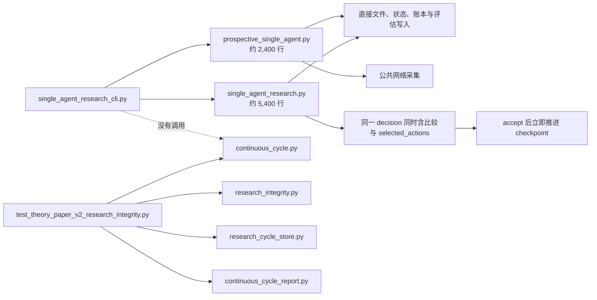
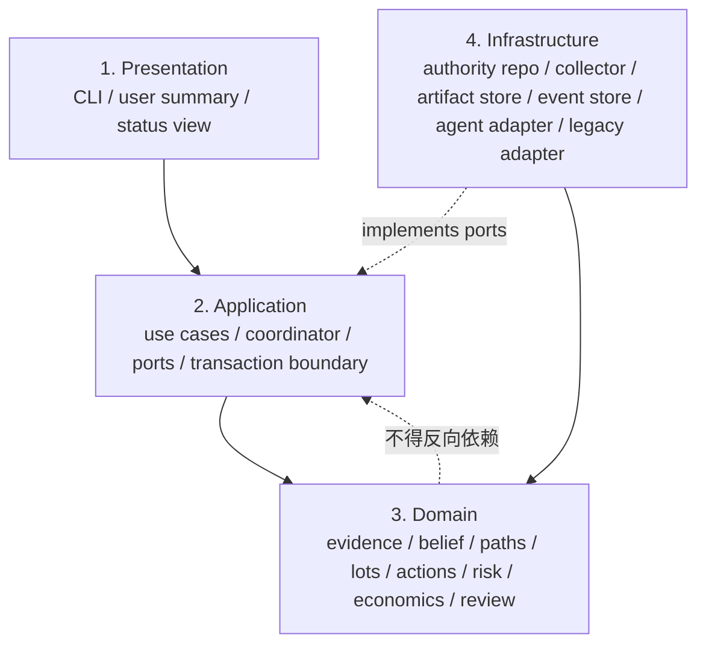

# 当前系统全面审查、V3 目标设计与纠正记录

- 日期：2026-08-06
- 工作区：`/Users/wt/Documents/agent-trade-emotion`
- 当前分支：`codex/s0-research-foundation`
- 审查基线 HEAD：`e400b64b8a986ceeb3312e4dd7e6749dc4239268`
- 用户既有未跟踪文件：`THEORY_AND_EXPERIMENT_EVOLUTION_AUDIT_2026-08-05_副本.md`（全程保留，未读取或修改）
- 审查性质：结构、契约、持久化与授权边界审查；不是新实验
- 外部执行权限：`NONE_LOCAL_SIMULATION`
- 当前结论：`LOCAL_KNOWN_STRUCTURE_AND_PROCESS_ISSUES_CLOSED / NO_GO_NEW_MARKET_RESEARCH_RUN`

## 1. 结论

审查基线发现的真实状态是两个并存且没有接通的系统；本轮纠正后，旧约 7,800 行应用已冻结为 legacy，新四层主链已经由真实 CLI 接管全新四周期本地合成 chronology。旧历史目录没有迁移、补事件或改 checkpoint。

V3 的理论方向能够解释 v1.0-v1.4 暴露出的主要失败，但它仍是 `DRAFT_FOR_USER_REVIEW`，不能反向冒充当前冻结理论，也不能据此启动新市场实验。本轮完成了历史授权失效关闭、lot 真值、动态假说、预期账本、市场信息、十维情绪、两阶段收据、来源绑定 review、四层 ports 和 legacy CLI 收敛。

这次交付完成了范围内全部已知本地结构与流程问题的纠正，但没有把系统宣称为真实市场实验就绪、预测有效、可盈利或生产可用。

## 2. 当前状态

**已完成（限本地结构、契约与合成流程范围）。**

现在可以：

1. 查询当前研究授权状态；
2. 确认旧 v1.3/v1.4 授权模板不能单独启动新研究；
3. 通过真实 CLI 在全新临时目录完成四周期合成流程，验证 selected-after-evaluation、动作尺度、WAIT 义务、失败触发器、动态假说、预期关闭、市场信息、十维情绪、真实文件事件链和完成绑定；
4. 只从四份 cycle evidence receipt 重建四周期 review；
5. 以只读方式查询旧 status、comparator 和已存在 evaluation；旧 mutation command 默认拒绝。

现在仍不能：

1. 把 V3 当作已批准、已冻结理论；
2. 把本地合成 PASS 当作真实市场动态能力、Agent 机制发现能力或情绪有效性的证明；
3. 启动、恢复或续跑新的 prospective/seen 市场实验；
4. 读取 future outcome、恢复 automation，或连接 paper/live、账户、订单、凭据和资金；
5. 从结构测试推导预测力、盈利性或生产就绪。

## 3. 审查基线与版本权威

| 输入 | 当前角色 | 物理 SHA-256 |
|---|---|---|
| `requirements/2026-07-30-theory-paper-practice.md` | 需求、历史执行与验收主记录 | 本轮已更新，最终哈希见验证记录 |
| `THEORY_AND_EXPERIMENT_EVOLUTION_AUDIT_2026-08-05.md` | 截至 2026-08-05 的理论与实验演化审计 | `91ce66f9a17e98ec8989d16f0a4c8133644001c8d2b500cea6dc88f9eb156b3c` |
| `CORE_TRADING_THEORY_v2_1.md` | 当前理论权威，但不附带新实验授权 | `2c9673127f85f587651130997d1454d7d0862bdc8677f5132e322d7da5ae0d3d` |
| `CURRENT_RESEARCH_THEORY_v3_DRAFT_FOR_REVIEW.md` | V3 候选设计输入，状态仍为待用户审阅 | `b353274dc90ae7af1493577b872032b00a845553db6f2512d6cce709cbaa86ef` |

权威规则：

- V3 可以指导“应该如何设计”，但在批准、冻结和生成独立摘要前，不能改变实验评分、历史结论或启动权限。
- v1.4 checkpoint、interruption receipt、E0/E0B manifest/checkpoint/event/receipt 是冻结历史，不做就地修补。
- 历史模板、旧聊天、`accepted=true`、测试 PASS、automation 文件存在，均不构成当前授权。

当前运行冻结状态：

- v1.4：`INTERRUPTED_OUTCOMES_SEALED / completed=4 / next=5 / resume_allowed=false`；
- accepted state digest：`e76f9ad7fb1a41cf578db1f4bb88bb059677cf15a53fb392696e950eb068780d`；
- interruption digest：`0a7326be0fb2f750c753c80552ea64d5e065fafede1d5564c088c3cf7372c7e1`；
- `automation-2`、`automation-3`、`automation-4`、`g1`、`v1-3`、`v1-4` 均为 `PAUSED`；
- 本轮没有创建或修改 automation，也没有产生 Cycle 5 工件。

## 4. 证据等级

| 等级 | 含义 | 本轮是否具备 |
|---|---|---|
| E0 | 文档或配置中写了某项能力 | 是 |
| E1 | 实际代码与入口调用链证明能力存在 | 是；新合成入口已接线，旧市场入口冻结为 legacy |
| E2 | 离线测试证明确定性契约 | 是 |
| E3 | 当前冻结市场运行产物证明真实周期采用该契约 | 否；仅全新 synthetic chronology 采用，v1.4 中仍为 0 |
| E4 | 新鲜、未见 outcome、预注册实验结果 | 否 |
| E5 | 预测有效、稳定盈利、生产就绪 | 否，且本轮不允许这样宣称 |

## 5. 当前真实调用链



关键事实：

- 新四件套在生产包中的直接消费者只有测试；真实 CLI 没有导入 `ContinuousResearchCycleCoordinator`。
- v1.4 的 `implementation_bindings` 绑定的仍是旧应用、旧 CLI、采集适配器和旧测试，不包含新四件套。
- 旧 `accept_research_decision` 在写入 decision/state/receipt 后，将 `next_cycle_index` 直接加一；没有等待 comparator、report、四周期 review 和统一 completion receipt。
- v1.4 冻结运行目录不存在新事件链或新完成收据。这不否定历史运行，但否定“新核心已经在真实运行中生效”的说法。

## 6. 不合理之处与失败账本

| ID | 优先级 | 问题或失败 | 影响 | 当前处理 |
|---|---:|---|---|---|
| R-01 | P0 | 历史 v1.3/v1.4 模板仍写有 `start_authorized=true`，旧 prepare 仅检查该布尔值 | 过期授权可被误当成当前授权 | **已纠正**：新增独立当前授权文件和精确绑定闸门 |
| R-02 | P0 | 新核心未进入真实 CLI；旧应用仍是系统中心 | “修复完成”只成立于旁路原型 | **已纠正**：`run-continuous-fixture` 由四层新主链接管；旧 mutation CLI 全部拒绝 |
| R-03 | P0 | 旧 decision 同时承载候选比较与最终 selected action | 无法证明先封存完整比较、后选择 | **已纠正于新主链**：proposal 无 selection，封存 evaluation 后才单独 deliberation/selection |
| R-04 | P0 | 旧 checkpoint 在 accept 后立即推进 | comparator/report/review 缺失时仍可跳到下一周期 | **已纠正于新主链**：evidence/report/due review/completion 全部封存后才推进 |
| R-05 | P0 | 新事件账本此前允许不存在的路径、任意 digest 和任意 actor | 自洽链不能证明真实 artifact | **已纠正**：文件存在、根目录 containment、物理哈希、语义 digest、actor 所有权 |
| R-06 | P0 | completion 需要 pre-state/decision/action receipt digest，却没有对应事件 | 三项关键绑定可被凭空填入 | **已纠正**：新增三个显式 sealed event 并强制匹配 |
| R-07 | P1 | 失败触发器只检查字符串，不检查注册集 | Agent 可临时发明失败条件 | **已纠正** |
| R-08 | P1 | `REDUCE_25/50/75`、`EXIT_100` 只检查标签存在，不检查真实数量 | 标称 25% 可能实际减 10% | **已纠正** |
| R-09 | P1 | WAIT 无强制复查时间和待观察对象 | WAIT 可变成没有机会成本的永久不行动 | **已纠正** |
| R-10 | P1 | 任意非空字符串会被标记为 `PLATFORM_ATTESTED` | 模型身份被过度声称 | **已纠正**：只接受 64 位摘要，且明确身份范围未验证 |
| R-11 | P1 | `position_truth` 只有聚合数量、一个 stop 与聚合风险 | 无法表达 CORE/TACTICAL、lot 级减仓、独立 stop、pending order、margin/leverage | **已纠正**：原子 account/lots/orders 输入，全部聚合量由内核复算 |
| R-12 | P1 | 四周期 review 接受调用方直接给出的 PnL、capture、risk 与 peak | 指标没有来源 artifact/digest，可能“算对了输入，但输入未经证明” | **已纠正**：验证四份 evidence receipt、全部物理 SHA/语义 digest 后读取绑定 row |
| R-13 | P1 | 两个应用模块合计约 7,800 行，并直接承担网络、文件、领域校验、执行模拟和报告 | 无单一数据所有者，难以替换、复放和审查 | **已纠正于新主路径**：旧模块冻结为 legacy；新 use case 按四层和 ports 运行 |
| R-14 | P1 | 多个 infrastructure 模块向上依赖 application | 目录分层与依赖分层不一致 | **已纠正于新主路径**：Application 不导入 Infrastructure，Domain 不导入外层；自动测试防回退 |
| R-15 | P1 | 旧内部函数仍可操作已有 run root；当前授权闸门只封住新 prepare | 迁移期仍存在旧 mutation surface | **已纠正 CLI surface**：prepare/collect/open/accept/finalize/interrupt/recover 返回统一拒绝码；status/comparator/evaluation 只读 |
| R-16 | P2 | V3 的 10 项理论选择尚未获用户批准 | 无法冻结稳定 policy/contract 并启动新实验 | **受阻于必要用户决定** |
| R-17 | P0 | 五类固定路径只能动态排序，不能新增机制方向 | 伪动态能力 | **已纠正**：开放语义 registry 支持 create/revise/promote/demote/split/merge/supersede/invalidate/expire/archive/restore |
| R-18 | P1 | 没有 expectation ledger | 预期无法累计、去重、检验和关闭 | **已纠正**：append-only revision history、确定性语义去重和显式结果状态 |
| R-19 | P1 | 情绪只有四维文字标签 | 无法跨轮量化覆盖、分歧与 UNKNOWN | **已纠正结构**：十维 -2..2 序数量化、coverage/conflict/contributors；真实市场有效性仍未知 |

## 7. 历史失败应如何解释

### 7.1 理论形式化失败

- V1 纸面观察含真实市场片段，但它没有注册成本、资金费、路径可分性、lot/episode/reentry 与完整动作比较，不能作为 V3 的验证结果。
- “路径名称更丰富”不等于竞争集合成立；同一上层过程可同时产生多个下层表现，因此在没有分区证明和校准前只能输出 ordinal lead、runner-up 和 OTHER，不能输出概率、和为 100、margin、entropy 或 EV。
- 战略层、战术层和执行层此前混在一个动作标签里，导致 fixed take-profit、trailing stop、re-entry 等机制无法区分是在管理核心 exposure、战术 lot，还是仅执行已有决策。

### 7.2 实验设计失败

- 多 Agent transport 路线把精力消耗在模型传输/身份证明，而没有先证明理论动作判别本身；E0/E0B 只能作为冻结、同源、离线诊断。
- 连续 P0 运行出现全 WAIT，说明旧契约没有真正比较合法动作、真实尺度与 WAIT 机会成本，而不是证明“市场没有动作”。
- seen V1 复放使用已记录历史，最多能做诊断，不能替代 fresh unseen terminal。
- v1.4 虽修复了 selected-first 的部分表现和 interruption fail-closed，但没有接入统一事件链，且当前 artifact 中没有新 completion proof。

### 7.3 工程失败

- 目录存在 `presentation/application/domain/infrastructure` 不等于四层架构成立；必须看依赖方向、写入权和真实入口。
- 测试直接调用新核心只能证明该切片可计算，不能证明命令入口、恢复路径和持久化生命周期采用它。
- 自摘要 digest 只能证明文档自洽；必须同时绑定真实路径、物理字节、语义自摘要、actor 和前序事件。

## 8. V3 理论设计的合理部分与需要冻结的边界

合理且应保留：

1. D/L/C/F/R/K 作为因果与证据坐标，而非拼分数；
2. strategic / tactical / execution 三层动作语义；
3. 稳定路径、ordinal support、lead/runner-up/OTHER；
4. Agent 只提交 evidence event，reducer 独占 belief state；
5. episode、exposure、reentry 分离；
6. CORE/TACTICAL lot 分离；
7. 八类动作与相邻仓位尺度完整比较；
8. proposal → sealed evaluation → selection；
9. 确定性成本、风险、barrier 与状态 reducer；
10. 单一 append-only 周期链、completion receipt 与四周期 review。

仍需用户冻结的实质选择：

1. V3 是否取代 Core v2.1 成为下一实验理论权威；
2. 八类动作的最终枚举与 OPEN/REENTER 的适用边界；
3. CORE/TACTICAL lot 的默认创建、合并和减仓顺序；
4. partial take-profit 与 generic reduce 是否保留为不同机制；
5. WAIT 的最大期限、复查时钟和最低 observation contract；
6. stable path 的最小集合及 OTHER 的定义；
7. 三种 policy 的正式定义、冻结参数与 comparator；
8. 四周期 review 的窗口长度与 metric 来源；
9. fresh unseen 实验的 terminal、样本规模和失败停止规则；
10. V3 freeze 后是否允许创建一个全新 chronology；历史 chronology 不恢复。

## 9. 目标系统：严格四层

只允许以下四层，不另设第五个“共享平台层”。依赖方向始终向内；Infrastructure 通过 Application ports 注入，Domain 不导入文件系统、网络、CLI 或具体模型适配器。



### 9.1 Presentation

| 模块 | 输入 | 输出 | 不得拥有 |
|---|---|---|---|
| `research_cli` | 显式 project/run/operation 参数 | JSON 状态或明确错误码 | 授权判断、领域计算、文件写入 |
| `cycle_summary` | 已验证的 report + completion receipt | 面向用户的多节摘要 | 自行补全 UNKNOWN、重新计算指标 |
| `review_view` | 四周期 review artifact | lead/runner-up、动作、风险、成本和缺失项 | 修改 review 或状态 |

### 9.2 Application

| 模块 | 责任 | 输入契约 | 输出契约 | 可替换依赖 |
|---|---|---|---|---|
| `start_research` | 校验 current authority 后创建新 chronology | `StartResearchRequest` | manifest/genesis/checkpoint | AuthorityRepository、ArtifactStore |
| `continuous_cycle` | 只编排固定事件顺序 | due cycle + frozen ports | `CycleCompletionReceipt` | Collector、AgentPort、Stores |
| `post_accept_finalize` | accepted state 后只运行确定性 tail | accepted state/action receipt | comparator/report/review/completion | Comparator、ReportStore |
| `recover_cycle` | 从 durable event/checkpoint 恢复 | run id + checkpoint | 唯一 next required event | EventStore |
| `query_status` | 只读状态 | project/run id | verified status DTO | Repositories |
| `legacy_adapter_use_case` | 只读旧 artifact 或明确拒绝旧 mutation | legacy run root | derived view / denial | LegacyArtifactAdapter |

Application 只拥有 use-case 事务边界；它不拥有 market judgment、risk formula 或文件格式细节。

### 9.3 Domain

| 子域 | 唯一数据所有者 | 核心输出 |
|---|---|---|
| time/PIT | `PITAdmissionGate` | `PITAdmissionReceipt` |
| evidence | `EvidenceEventReducer` | lineage-aware active evidence |
| hypothesis | `PathBeliefReducer` | ordinal `BeliefState` |
| strategic state | `StrategicStateReducer` | structure/regime/episode state |
| position | `LotPortfolioReducer` | CORE/TACTICAL lots、orders、margin、leverage、risk truth |
| reentry | `ReentryContractReducer` | eligibility/delay/invalidations |
| action | `CandidateBuilder` + `ActionEvaluator` | complete sealed evaluations |
| deliberation | `SelectionContract` | selection over exact feasible set |
| governance/risk | `DeterministicRiskKernel` | veto/resize/approved decision |
| economics | `MatchingAndCostKernel` | fills、fees、slippage、funding、PnL |
| review | `ReviewReducer` | source-bound four-cycle review |
| completion | `CompletionContract` | exact required artifact bindings |

Domain 的测试必须是纯函数、固定输入、确定性输出；mock 只用于时间、collector、AgentPort 与 persistence ports，不 mock 领域规则本身。

### 9.4 Infrastructure

| 适配器 | 实现的 port | 写入边界 |
|---|---|---|
| `CurrentResearchAuthorityRepository` | current authority 查询 | 只读固定 authority JSON 与 theory bytes |
| `PublicMarketCollector` | point-in-time public observations | acquisition attempts/raw snapshots；无账户/订单 |
| `CanonicalArtifactStore` | write-once artifacts | run root 内、物理 SHA + semantic digest |
| `ResearchEventStore` | append-only process events | 固定 event order 与 actor |
| `CheckpointStore` | compare-and-advance | 只有 completion receipt 后可推进 |
| `SingleStrategyAgentAdapter` | one proposal/deliberation/selection invocation | 只写 invocation receipt 与 Agent 输出；无状态 reducer 权限 |
| `LegacyV14Adapter` | 旧 artifact 读取 | 只读；不得把旧 run 转写成 V3 事实 |

## 10. 核心契约

### 10.1 当前授权

```json
{
  "status": "ACTIVE_FROZEN_RESEARCH",
  "current_theory": {
    "review_status": "FROZEN_APPROVED",
    "physical_sha256": "<64 hex>"
  },
  "experiment_start_authorized": true,
  "authorized_operations": ["PREPARE_PROSPECTIVE"],
  "authorized_run_ids": ["<exact run id>"],
  "authorized_template_sha256s": ["<exact physical sha256>"],
  "authorization_receipt_path": "<contained write-once receipt path>",
  "authorization_receipt_digest": "<64 hex>",
  "external_execution_authority": "NONE_LOCAL_SIMULATION",
  "executable": false
}
```

缺一项即拒绝。历史 template 的布尔值不参与当前授权判断。

### 10.2 候选动作

每个 symbol 每轮必须包含八类动作；对已有 exposure 至少比较 `REDUCE_25/50/75` 与 `EXIT_100`。标签必须与真实 lot 数量变化一致。每个候选必须包含：

- 唯一 `candidate_id`、`action_class`、`sizing_id`；
- target lot IDs/roles；
- 三条稳定路径的不同 process ID；
- registered evidence 与 registered failure trigger；
- position consequence、failure process、opportunity cost、cost/risk tradeoff；
- WAIT 的 `wait_until` 与 `wait_for_observations`；
- 在 selection 字段出现前完成确定性 economics、risk 与 hard veto。

### 10.3 事件与 artifact

每个 event 同时绑定：

1. run root 内真实相对路径；
2. 当前物理 SHA-256；
3. artifact 自摘要或物理摘要；
4. 固定 actor；
5. 前一事件摘要；
6. evidence boundary 与 timestamp。

仅有 digest 字符串、仅有路径、仅有 event chain 三者均不足以证明完成。

### 10.4 checkpoint

状态规则：

```text
AWAITING_AGENT_DECISION
  -> STATE_ACCEPTED + ACTION_RECEIPT_SEALED
  -> POST_ACCEPT_FINALIZATION
  -> COMPARATOR_SEALED
  -> REPORT_SEALED
  -> REVIEW_SEALED (cycle % 4 == 0)
  -> CYCLE_COMPLETED
  -> checkpoint advances exactly once
```

进入 `POST_ACCEPT_FINALIZATION` 后禁止再次调用 Agent；恢复只能继续确定性 tail。

## 11. 单一周期事件流


非四周期边界省略 `REVIEW_SEALED`，其余顺序不允许变化。

## 12. 扩展点设计

不建设动态插件平台。扩展只通过冻结 manifest 中的显式 registry 完成：

| Registry | 允许扩展 | 冻结键 | 禁止事项 |
|---|---|---|---|
| `EvidenceAdapterRegistry` | frozen replay、public REST 等观察适配器 | adapter id + code SHA + source contract SHA | 运行时扫描、凭据读取、账户数据 |
| `PolicyRegistry` | V3 批准后的三种策略 | policy id + parameter digest | 临场改评分或隐藏候选 |
| `ComparatorRegistry` | pre-registered deterministic baselines | comparator id + geometry digest | outcome 后新增 comparator |
| `AgentAdapterRegistry` | 单一 Strategy Agent 调用适配器 | adapter id + receipt contract | 让 adapter 写 belief/state 或宣称未验证模型身份 |
| `ReportRendererRegistry` | JSON/Markdown 用户视图 | renderer id + schema version | 修改 underlying metrics |

新增适配器的验收：contract test、deterministic fixture、PIT boundary、failure receipt、manifest binding。扩展点不授予实验或交易权限。

## 13. 兼容与迁移

### Phase 1：失效关闭与契约加固（本轮已完成）

- 新增 current authority 文档和 `authority-status`；
- `prepare-seen-v1`、`prepare-prospective` 先经过 current authority；
- 加固 action evaluation、WAIT、trigger、size 与 invocation provenance；
- 加固 event payload、actor 和 completion bindings；
- 不修改任何冻结 run、E0/E0B 或 automation。

### Phase 2：新核心接管本地合成入口（本轮已完成）

1. 不就地重写冻结旧模块；另建严格四层 use case、ports 与 adapters；
2. 用新 `continuous_cycle` 接管一个全新的离线 fixture chronology；
3. legacy adapter 只读旧目录；旧 mutation commands 默认拒绝；
4. 将 aggregate position truth 替换为 lot/role/order/margin/leverage truth；
5. 四周期 review 只从 receipt-bound artifact 推导；
6. 通过 CLI integration test 证明真实入口生成完整事件链和 completion receipt。

### Phase 3：新的 prospective 实验（需要另行显式授权）

1. 冻结 theory/policy/template/implementation digests；
2. 预注册 fresh unseen terminal、样本、停止规则和 comparator；
3. 生成一次性 authority receipt 与 exact run id；
4. 新建 chronology；不恢复 v1.4；
5. 任何 acquisition、PIT、receipt、checkpoint 异常立即失败关闭；
6. 完成前不读取 future outcome；全程无 paper/live/account/order authority。

## 14. 验证门

| Gate | 通过条件 | 当前 |
|---|---|---|
| G0 版本 | V3 review status、理论 SHA 与授权分离 | PASS |
| G1 当前授权 | 旧 template 不能启动或触发 collector | PASS |
| G2 候选完整性 | 八类动作、真实尺度、registered trigger、WAIT 义务 | PASS（纯领域测试） |
| G3 selection 隔离 | evaluation 中禁止 selection；selection 只引用 sealed set | PASS（纯领域测试） |
| G4 artifact 真实性 | 路径 containment、真实文件、物理/语义摘要、actor | PASS（store 测试） |
| G5 completion | pre-state/decision/action receipt 全部有事件并匹配 | PASS（store 测试） |
| G6 恢复 | accepted 后不重调 Agent，完成后才推进 checkpoint | PASS（store 测试） |
| G7 真实入口 | CLI 完整周期采用新 coordinator | **PASS（全新四周期合成 chronology）** |
| G8 lot truth | CORE/TACTICAL、orders、margin/leverage 全量进入 evaluator | **PASS（领域与 CLI 集成）** |
| G9 review 来源 | 指标从绑定 artifact 推导 | **PASS（物理漂移测试失败关闭）** |
| G9A 动态研究 | 新方向、预期更新/关闭、市场信息、十维情绪进入收据 | **PASS（合成 fixture）** |
| G10 fresh unseen | 新预注册 terminal 完成 | **NOT STARTED / NOT AUTHORIZED** |

## 15. 本轮代码纠正

| 文件 | 纠正 |
|---|---|
| `config/theory_paper_v2.current_research_authority.v1.json` | 明确 `SUSPENDED_USER_REVIEW_REQUIRED`，分离 V2.1 与 V3 draft |
| `domain/governance/research_authority.py` | 纯领域精确授权契约 |
| `infrastructure/authority/current_research.py` | authority 与 theory 物理哈希验证 |
| `application/research_authority.py` | 只读 authority query |
| `single_agent_research.py` / `prospective_single_agent.py` | prepare 前 fail-closed current authority gate |
| `single_agent_research_cli.py` | 新增 `authority-status` / `run-continuous-fixture`，拒绝 legacy mutation，evaluation 改为只读 |
| `domain/research_integrity.py` | trigger、size、WAIT、process identity、provenance 纠正 |
| `domain/portfolio_truth.py` | lot/role/stop/order/margin/leverage/account 原子真值与复算 |
| `domain/dynamic_research.py` | 市场信息、十维情绪、开放假说 registry 与 expectation ledger |
| `application/continuous_fixture.py` / `application/ports.py` | 四层 ports 与真实四周期 use case |
| `infrastructure/continuous_fixture.py` | 无网络、无模型的固定 collector/Agent/comparator adapters |
| `infrastructure/research_review_repository.py` | 四份 evidence receipt 与来源物理/语义验证 |
| `infrastructure/legacy_v1/read_only.py` | 旧 evaluation 只读访问 |
| `infrastructure/research_cycle_store.py` | 真实 artifact、actor、三项缺失绑定、checkpoint tail 纠正 |
| `tests/test_theory_paper_v2_research_authority.py` | 证明旧授权模板不能采集或创建 run |
| `tests/test_theory_paper_v2_research_integrity.py` | 覆盖新契约和失败关闭路径 |

## 16. 已知边界与明确非结论

- 旧约 7,800 行应用没有就地重写；它被冻结为 legacy，只读命令保留，写命令拒绝。新功能只进入四层新主路径。
- 新 action/event/dynamic 核心已有真实 CLI 合成运行证据，但不是公开市场运行证据。
- 现有 frozen artifact 不迁移、不补 event、不伪造 completion receipt。
- 本轮没有新的市场结果，也没有 future outcome；因此没有预测、收益或策略优越性结论。
- 任何本地 PASS 只证明对应契约在固定输入下失败关闭，不证明市场有效性。

## 17. 唯一推荐路径

保持 current authority 为 suspended、所有相关 automation 为 paused、历史 chronology 为 sealed。下一条最优路径是由用户审阅并冻结第 8 节的 V3 理论选择；只有冻结后，AI 才能另行设计 fresh unseen、预注册、无执行权限的新市场实验。当前不需要再扩建本地框架。

## 18. 最终实现与验证快照

本节是对第 5、13、14、15、16 节审查基线状态的最终覆盖记录。

真实新入口：

```text
single_agent_research_cli.py run-continuous-fixture
→ Presentation composition
→ Application continuous fixture use case + ports
→ Domain market/sentiment/hypothesis/expectation/belief/action/risk reducers
→ Infrastructure write-once artifacts/event/checkpoint/review repositories
```

四周期合成验收结果：

- `completed_cycles=4 / next_cycle_index=5`；
- Cycle 2 创建此前不存在的 `hypothesis:event-liquidity-vacuum-reversal`；
- Cycle 3 将 `expectation:base-sequence` 显式关闭为 `FULFILLED`；
- 每轮 evidence receipt 精确绑定 market information、sentiment、hypothesis delta/registry、expectation delta/ledger、belief、完整动作评价、selection、risk、accepted state、action receipt、comparator 与 review source；
- Cycle 4 review 绑定四份 evidence receipt；任一来源物理漂移均失败关闭；
- 合成 collector 同时生成原始观测、派生特征和显式 UNKNOWN；未调用网络、模型、automation、账户、订单或资金。

验证：Theory Paper V2 全范围 `273` 项测试通过；其中动态领域与四周期主链聚焦验证 `21` 项通过；`compileall` 与 `git diff --check` 通过。该结果的证据等级是本地 E1/E2 与 synthetic process evidence，不是新鲜市场 E3/E4，也不是 E5。

## 19. 动态开放与完整推论追加确认

用户进一步明确“动态性与开放性是主导、分析需有完整推论、符合理论与金融基础并最大化 Agent 有效能力”后，复核发现并关闭新增 `R-17`：此前实际 Strategy Agent 调用获得了完整 snapshot/registry/ledger，但已封存 `agent_context_digest` 只覆盖其摘要 digest，调用时追加的完整对象没有进入同一输入承诺；Agent rationale 也没有独立、可重放、来源绑定的公开推论 schema。

当前纠正：

- `AgentContext v2` 将完整 PIT market snapshot、上一 registry/ledger/belief/accepted state、lot 级 portfolio truth、risk policy、完整合法动作集和研究能力边界封存在同一个 digest 中；传给 Agent 的对象不再包含 digest 外额外输入；
- 新增 `domain/epistemic_inference.py`，只记录公开可审计结论，不记录私有 chain-of-thought；每条 claim 强制绑定支持事实、反证、UNKNOWN、金融机制、假说/预期影响、动作含义、falsifier、局限和下一观察；
- 事件链新增 `PUBLIC_INFERENCE_TRACE_SEALED`；evidence receipt、accepted state、report 和 review source 同时绑定 `public_inference_trace_digest`；四周期 review 会重新执行推论契约并验证 raw/物理/语义来源；
- 明确三层边界：已批准 primitive mechanism library 继续有限且不得由 Agent 扩写；研究候选 registry 语义开放；ACTIVE budget 与 lead/runner-up/OTHER 只是有限注意力窗口；
- 完整方向、架构、模块/IO、事件流、扩展结构、数据 schema、三阶段路线、验证门和 legacy 策略见 `DYNAMIC_OPEN_AGENT_CORE_CONFIRMATION_2026-08-06.md`。

追加验证：Theory Paper V2 全范围 `275` 项测试通过；动态、公开推论、四周期主链与既有完整性聚焦验证 `23` 项通过；合成 Cycle 2 新方向进入 registry，Cycle 3 成为 operational lead。该结果仍只属于本地契约与 synthetic process evidence，不批准 V3，不证明真实市场预测、Agent 增量、收益或生产就绪。

## 20. 新窗口可靠性追加复核

用户报告新窗口 Agent 系统的大量 bug 已导致实验取消后，进一步还原了 E0B sample 163 的 controller context compaction、冻结恢复分支缺失，以及 v1.3 Cycle 17 的 accept 后 lot-truth false negative。完整根因、四层纠正、状态机、数据契约、恢复矩阵和验证结果见 `NEW_WINDOW_AGENT_RELIABILITY_AUDIT_AND_CORRECTION_2026-08-06.md`。

本次新增并关闭当前 successor 的 `R-18..R-30`：checkpoint self-digest、digest-bound resume capsule、有界历史 view、精确 input plan、完整 output delivery receipt、adapter 返回前 durable transport record、current-cycle/lot grounding、mandatory preaccept receipt、typed pre/post-accept failure、sealed-stage resume、postaccept Agent 禁止重入、本地独占 run lease，以及 desired/actual controller reconciliation。

追加验证：窗口可靠性故障注入 `17` 项、窗口可靠性与连续主链 `22` 项、Theory Paper V2 全范围 `292` 项全部通过，`compileall` 与 `git diff --check` 通过；新增篡改注入证明 delivery 声明与返回前持久化 transport record 的语义 digest、物理 SHA-256 不一致时，会在 proposal attempt 和 accept 前失败关闭。当前覆盖结论为 `KNOWN_NEW_WINDOW_FAILURE_MODES_CLOSED_IN_LOCAL_SUCCESSOR`；真实模型 transport、真实 automation 控制面、市场预测、收益和生产稳定性仍为 `UNKNOWN_NOT_EVALUATED`。
