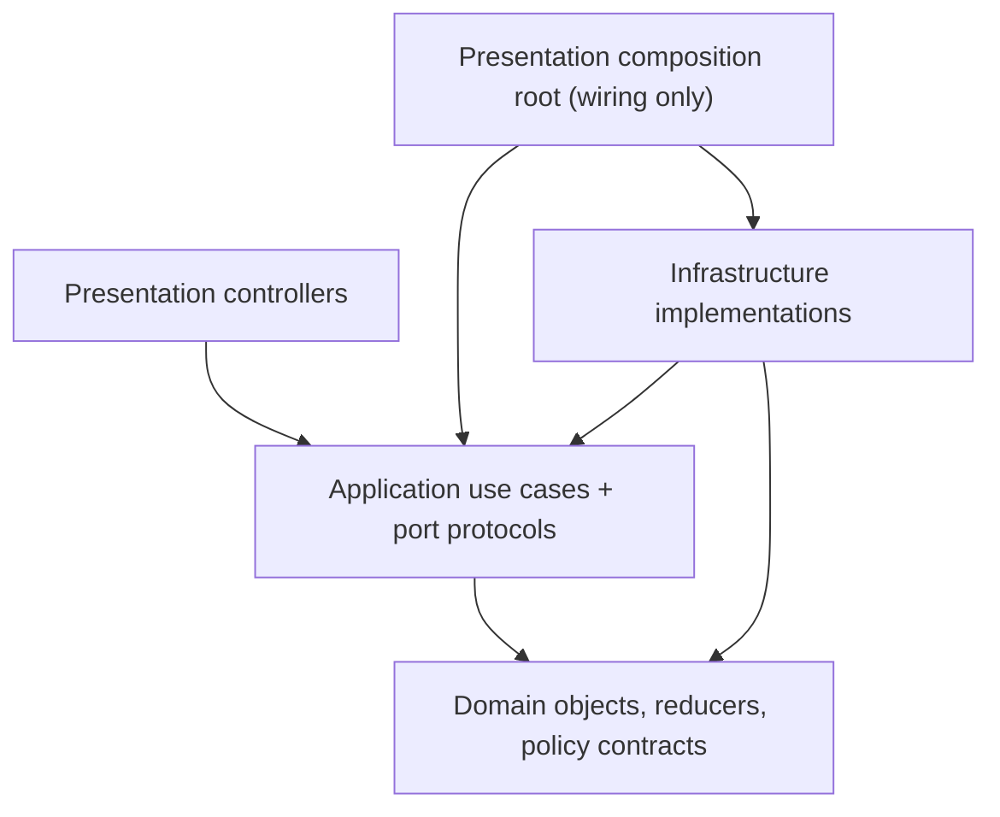
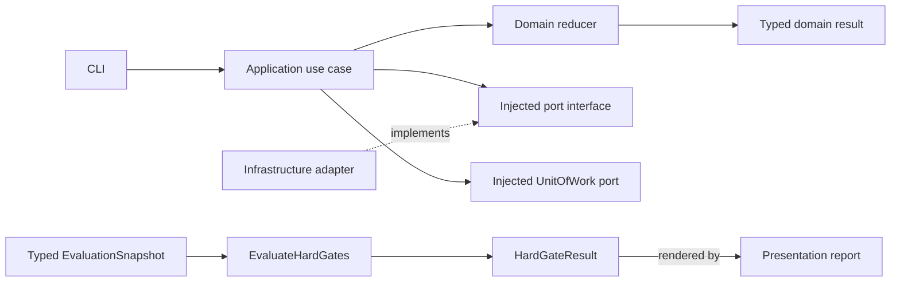
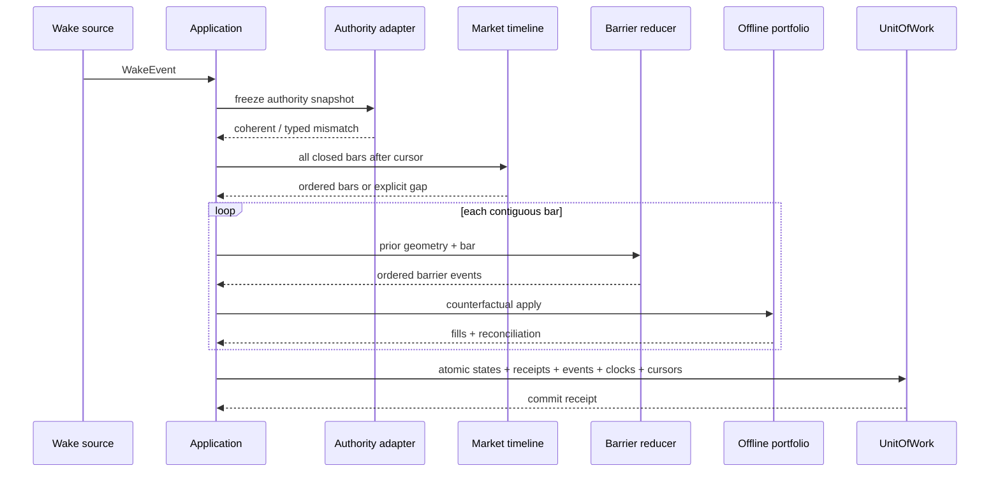

# Theory Agent V2 Offline System Architecture v0.1

Status: `HISTORICAL_BASELINE_SUPERSEDED_FOR_C1_BY_IMPLEMENTATION_CONTRACT_V1_0`

Runtime authority: `NONE`

Paper authority: `NONE`

Live authority: `NONE`

Theory/design contracts:

- `STRATEGIC_EPISODE_POSITION_GOVERNANCE_CHALLENGER_v0_1.md`
- `PATH_RISK_AND_STAGED_POSITION_GOVERNANCE_CHALLENGER_v0_1.md`
- `BOUNDED_AGENT_AUTONOMY_CHALLENGER_v0_1.md`
- `THEORY_AGENT_V2_AGENT_CLUSTER_DESIGN_v0_1.md`
- `THEORY_AGENT_V2_IMPLEMENTATION_CONTRACT_v1_0.md` — canonical amendment

Canonical supersession notice:

- Section 12's original schema list and its historical count are a baseline
  input only. C1 materialization uses the resolved identity set in
  `THEORY_AGENT_V2_IMPLEMENTATION_CONTRACT_v1_0.md`.
- Historical A–G and earlier gate lists are superseded by that contract's A–I
  arms and complete hard-gate set.
- Where vocabulary, owner IDs, actions, reducers, schemas or experiments
  differ, the implementation contract wins for V2 E0. This document remains
  useful for four-layer topology and legacy boundaries; it is not a second
  machine-contract authority.

Legacy preservation:
`READ_ONLY; NO IN_PLACE UPGRADE`

---

## 1. Outcome

V2 is a hybrid, event-driven, point-in-time offline system:

- bounded one-shot Agents create a coherent candidate portfolio, challenge it,
  and select within a deterministic feasible set;
- the deterministic kernel owns PIT admission, calculations, hard constraints,
  state validation, event ordering, authority and atomic commit;
- accepted strategic hypotheses remain continuous across reviews and compile
  into governed counterfactual actions.

The hourly scheduler is only a wake source. It is not the strategy, state
owner, market clock, or action authority.

V2 is built beside the existing V1 runtime. It does not extend the legacy
`experiment.py`, `theory.py`, or `portfolio.py` orchestration center.

---

## 2. Current-system diagnosis

### 2.1 Flawed legacy center

The present V1 path concentrates unrelated responsibilities:

```text
CLI
→ experiment.run_hourly_cycle
→ market snapshot
→ portfolio.process_market_bars
→ theory.build_cycle_analysis/template
→ transaction commit

CLI
→ experiment.submit_agent_decision
→ theory.validate_decision
→ portfolio.submit_actions
→ mixed decision/execution/portfolio receipt
```

The practical consequences are:

- each cycle can create a new hypothesis instance instead of advancing one
  accepted strategic state chain;
- prose and normalized action payloads can stand in for typed governance;
- the latest snapshot has disproportionate authority;
- portfolio submission has no unique governed-receipt boundary;
- review logic, execution, storage, and orchestration are coupled;
- missed hourly wakes can skip intermediate bars.

### 2.2 Existing V2 assets are shadow-only

`trade_system/theory_paper/governance_v2` and
`trade_system/theory_paper/inference_v2` contain useful invariant and lineage
logic, but their declared action authority is none. They are sources for
characterization tests and selective porting, not an executable successor
core.

### 2.3 Confirmed scheduler and matching defects

The frozen V1 run has:

- automation status `PAUSED`;
- runtime status `ACTIVE`;
- pending cycle 25;
- two missing completed hourly slots;
- matching that consumes only the most recent closed 1H bar.

This is a state-authority split plus a catch-up failure. If several hours pass,
an intermediate stop, target, or limit crossing can be omitted.

---

## 3. Design constraints

1. Exactly four runtime code layers:
   Presentation, Application, Domain, Infrastructure.
2. Dependencies point inward:
   Presentation → Application → Domain.
3. Infrastructure implements ports declared by Application or Domain and is
   injected inward; Domain never imports Infrastructure.
4. Every authoritative object has one owner.
5. All state changes are deterministic reducers over immutable prior state and
   ordered events.
6. All external/model outputs are untrusted proposals.
7. Only a governance gate can create an action-authority receipt.
8. In E0, no executable receipt can be created.
9. All V1 access is read-only and digest-bound.
10. Missing lineage, state, time, profile, ACK, or permission fails closed.
11. Reports and sidecars are rebuildable projections.
12. Identical frozen inputs and policy versions produce identical output
    digests.
13. One decision session uses a fixed one-pass DAG:
    proposal → challenge → deterministic calculation/constraints → selection →
    governance.
14. Agent roles never communicate through free-form chat and never write
    accepted state, requirements, authority or HEAD.
15. The deterministic kernel creates the complete feasible set but does not
    choose the preferred market action.
16. Agent agreement, count, or text similarity never becomes evidence weight,
    confidence, permission or state.

---

## 4. Four-layer architecture

Source-code dependency direction:



- Presentation controllers import only the Application facade.
- Application imports Domain and declares outward port protocols.
- Infrastructure imports and implements those protocols and Domain value
  contracts.
- Domain imports neither Application nor Infrastructure and never locates a
  plugin.
- `presentation/bootstrap.py` is the isolated composition root allowed to
  construct Infrastructure implementations and inject them into Application;
  it contains no business rule.

Runtime call flow after composition:



The report is never a hard-gate input. It renders typed gate results.

Decision-session runtime flow:

```mermaid
flowchart LR
    BOOT["Application bootstrap<br/>frozen DecisionContext"] --> PROP["Proposer Agent port"]
    PROP --> CHAL["Challenger Agent port"]
    CHAL --> CALC["Domain calculators"]
    CALC --> FEAS["Domain hard constraints<br/>FeasibleActionSet"]
    FEAS --> SEL["Selector Agent port"]
    SEL --> GOV["Domain governance"]
    GOV --> REPLAY["Offline replay adapter"]
    REPLAY --> UOW2["UnitOfWork compare-and-commit"]
```



Application owns this fixed DAG. There is no Agent coordinator, voting step, or
Agent-to-Agent message channel.

---

## 5. Module layout

```text
trade_system/theory_paper_v2/
├── presentation/
│   ├── cli.py
│   ├── bootstrap.py
│   └── report.py
├── application/
│   ├── contracts.py
│   ├── ports.py
│   ├── bootstrap_cluster.py
│   ├── build_role_view.py
│   ├── run_decision_session.py
│   ├── freeze_agent_artifact.py
│   ├── assemble_candidate_bundles.py
│   ├── build_feasible_action_set.py
│   ├── commit_e0_session.py
│   ├── open_episode.py
│   ├── freeze_replay_bundle.py
│   ├── advance_episode.py
│   ├── review_target.py
│   ├── evaluate_reentry.py
│   ├── catch_up_timeline.py
│   ├── run_ablations.py
│   └── evaluate_hard_gates.py
├── domain/
│   ├── contracts/
│   │   ├── ids.py
│   │   ├── references.py
│   │   ├── values.py
│   │   └── errors.py
│   ├── evidence/
│   │   ├── model.py
│   │   ├── receipts.py
│   │   ├── admission.py
│   │   ├── promotion.py
│   │   └── schemas/
│   ├── hypothesis/
│   │   ├── model.py
│   │   ├── receipts.py
│   │   ├── reducer.py
│   │   └── schemas/
│   ├── deliberation/
│   │   ├── context.py
│   │   ├── autonomy.py
│   │   ├── proposal.py
│   │   ├── challenge.py
│   │   ├── candidate_bundle.py
│   │   ├── calculation.py
│   │   ├── constraints.py
│   │   ├── feasible_set.py
│   │   ├── selection.py
│   │   └── schemas/
│   ├── strategic/
│   │   ├── model.py
│   │   ├── receipts.py
│   │   ├── projection.py
│   │   ├── invariants.py
│   │   ├── reducer.py
│   │   └── schemas/
│   ├── position/
│   │   ├── model.py
│   │   ├── receipts.py
│   │   ├── lots.py
│   │   ├── risk.py
│   │   ├── account_risk.py
│   │   ├── path_payoff.py
│   │   ├── staged_plan.py
│   │   ├── adjustment_quota.py
│   │   ├── supervision.py
│   │   └── schemas/
│   ├── geometry/
│   │   ├── model.py
│   │   ├── receipts.py
│   │   ├── target_review.py
│   │   ├── reducer.py
│   │   └── schemas/
│   ├── reentry/
│   │   ├── model.py
│   │   ├── receipts.py
│   │   ├── reducer.py
│   │   └── schemas/
│   ├── governance/
│   │   ├── model.py
│   │   ├── receipts.py
│   │   ├── gate.py
│   │   └── schemas/
│   ├── time_authority/
│   │   ├── model.py
│   │   ├── policy.py
│   │   └── schemas/
│   ├── policy/
│   │   ├── profile.py
│   │   └── schemas/
│   ├── matching/
│   │   ├── model.py
│   │   ├── barriers.py
│   │   └── schemas/
│   ├── portfolio_projection/
│   │   ├── model.py
│   │   ├── reducer.py
│   │   └── schemas/
│   └── evaluation/
│       ├── model.py
│       ├── metrics.py
│       └── schemas/
└── infrastructure/
    ├── agents/
    │   ├── one_shot_adapter.py
    │   └── raw_turn_archive.py
    ├── legacy_v1/
    │   ├── source_adapter.py
    │   └── audit_adapter.py
    ├── market/
    │   └── frozen_bar_adapter.py
    ├── evidence/
    │   └── frozen_source_adapter.py
    ├── portfolio/
    │   └── offline_replay_adapter.py
    ├── repositories/
    │   ├── content_store.py
    │   ├── event_store.py
    │   ├── projections.py
    │   └── unit_of_work.py
    ├── authority/
    │   └── snapshot_adapter.py
    ├── clocks/
    │   ├── review_clock_authority.py
    │   └── slot_clock.py
    ├── policy/
    │   └── frozen_registry.py
    └── plugins/
        ├── registry.py
        ├── normal_range.py
        ├── evidence_source.py
        ├── event_qualification.py
        ├── risk_policy.py
        └── horizon_policy.py
```

Each owning Domain module defines its objects, receipts, events, and schemas.
`domain/contracts` contains only cross-module primitives, immutable references,
canonical value types, and typed errors; it cannot become a shared-model
monolith. Public package `__init__` files may re-export owner-defined types but
do not redefine them.

`schemas/` contains resources, not a fifth runtime layer. Application-owned and
Infrastructure-boundary envelopes use schemas beside their owner modules.
Tests remain outside the package.

### 5.1 Module contract, mock, and independent test surface

| Module | Responsibility | Typed input → output | Type / data ownership | Mock strategy | Independent test surface |
|---|---|---|---|---|---|
| Presentation `cli` | parse offline commands | CLI args → Application command | Presentation; owns no state | fake Application facade | parsing, no direct adapter access |
| Presentation `bootstrap` | wire dependencies only | config refs → use-case facade | Composition root; owns no data | in-memory port set | dependency graph/import rules |
| Presentation `report` | render typed results | Gate/Ablation result → text/JSON | rebuildable projection | fixed result fixtures | snapshot/render only |
| Application `contracts` | own use-case envelopes | versioned commands/results | Application owner | schema fixtures | compatibility/error envelopes |
| Application `ports` | declare outward protocols | typed requests → typed results | protocol only | in-memory fakes | port conformance |
| Application `bootstrap_cluster` | verify cold-start inputs | project/session manifests → BootstrapReceipt | use case | frozen manifests | missing digest/state/authority no-commit |
| Application `build_role_view` | create least-context immutable views and canonical role bytes | DecisionContext + role contract/projection policy → RoleContextView + ResolvedRoleInputBundle | use case | fixed multi-object context fixtures | source-bound JSON pointers, missing-pointer fail closed, exact JCS bytes/blob digest, common cutoff |
| Application `run_decision_session` | execute fixed one-pass Agent DAG | BootstrapReceipt + context → governed E0 session result | use case | three fake role ports | no direct Agent messaging/retry loop |
| Application `freeze_agent_artifact` | bind raw Agent output | adapter output + context → schema-valid frozen envelope | use case | malformed/timeout fixtures | digest, parent, role, model closure |
| Application `assemble_candidate_bundles` | invoke Domain candidate assembler | Proposal + Challenge → CandidateBundleSet | use case | candidate fixtures | Application owns no compatibility predicate |
| Application `build_feasible_action_set` | orchestrate calculations and hard filters | candidate set + policies → CalculationBundle + FeasibleActionSet | use case | pure Domain fakes | hard/soft/unknown separation |
| Application `commit_e0_session` | prepare sole atomic commit | governed selection + expected heads → CommitReceipt | use case | in-memory UoW | no partial writes, E0 only |
| Application `open_episode` | create strict genesis | Open command + trusted receipts → opened state/batch | use case | fake clock/evidence/policy/UoW | no self-signed genesis |
| Application `freeze_replay_bundle` | freeze common input | source refs → ReplayBundle | use case | fake sources/digest | PIT, common proposal digest |
| Application `advance_episode` | orchestrate state delta | prior state + evidence → UoW batch | use case | fake projections/UoW | stale head, atomic outputs |
| Application `review_target` | review checkpoint | target event + four slots → review receipt | use case | fixed hypothesis fixtures | four-slot completeness |
| Application `evaluate_reentry` | run due contract | time receipt + evidence → reentry delta | use case | fake trusted clock | eligibility/revocation/expiry |
| Application `catch_up_timeline` | catch up every bar | cursor set + bars → CatchUpResult/UoW batch | use case | gap timeline fake | per-timeframe cursor rules |
| Application `run_ablations` | run same bundle A–G | bundle + arm envelopes → AblationResult | use case | deterministic replay fake | same bundle/proposals, feature matrix |
| Application `evaluate_hard_gates` | compute gate result | EvaluationSnapshot → HardGateResult | use case | fixed evaluation fixture | report cannot influence gate |
| Domain `contracts` | primitive IDs/refs/errors | primitives only | Domain primitive owner | direct values | canonical validation |
| Domain `evidence` | PIT/source admission/promotion | source records → receipts | Domain Evidence owner | fixed source receipts | field-level PIT, no self-promotion |
| Domain `hypothesis` | persistent competing set | prior set + admitted evidence → revision | Domain Hypothesis owner | fixed evidence | continuity, OTHER/UNKNOWN |
| Domain `deliberation` | autonomy, typed proposals/challenges/calculations/constraints/selection | frozen role envelopes + Domain state → feasible/selection validation objects | Domain Deliberation owner | fixed envelopes | role overreach, dedup, selector membership, action-space collapse |
| Domain `strategic` | state and projection reducers | prior state + typed receipts → state/transition | Domain Strategic owner | fixed causal refs | all legal/illegal transitions |
| Domain `position` | roles, account/episode risk, path payoff, staged plans, adjustment and supervision | portfolio projection + plan/matrix/envelopes → position/risk receipts | Domain Position owner | fixed portfolio/path fixtures | role, q_auth, risk nesting, staged ADD, unattended safety |
| Domain `geometry` | target/checkpoint/protection lifecycle | geometry + event/ACK → revision | Domain Geometry owner | fake governance/venue receipts | ACK race, stale analysis/protection |
| Domain `reentry` | reentry lifecycle | contract + time/evidence → evaluation | Domain Reentry owner | fixed due receipts | terminal/deferral paths |
| Domain `governance` | only policy gate | ActionIntent + all receipts → E0 governance/counterfactual result | Domain Governance owner | fixed gate inputs | deny-only authority, no bypass |
| Domain `time_authority` | review-time semantics | clock + trusted time fact → receipt | Domain Time owner | fixed time facts | due/not-due, naive time reject |
| Domain `policy` | accepted profiles/registries | immutable profile → policy view | Domain Policy owner | frozen registry fixture | symbol/profile mismatch |
| Domain `matching` | barrier order and gap semantics | geometry + ordered bar/event → barrier result | Domain Matching owner | bar fixtures | STOP_FIRST, causal ordering |
| Domain `portfolio_projection` | translate adapter output | PortfolioReplayResult → projection receipt | Domain projection owner | replay result fixture | adapter cannot mutate Domain |
| Domain `evaluation` | separate metric groups | committed ledger → EvaluationSnapshot | Domain Evaluation owner | ledger fixtures | P&L/opportunity separation |
| Infrastructure `legacy_v1` | verify/read V1 only | V1 paths/digests → LegacyCycleEnvelope | source adapter | temporary frozen tree | tamper reject, zero writes |
| Infrastructure `agents` | one-shot model calls and raw-turn archive | RoleContextView → untrusted raw response | adapter output/archive owner | fixed raw outputs/timeouts | no hidden thread, no repository write, no role substitution |
| Infrastructure `market` | serve complete frozen bars | cursor/timeframe → ordered bars | adapter output owner | in-memory timeline | no latest-only shortcut |
| Infrastructure `evidence` | serve registered frozen evidence | source request → source result | adapter output owner | fixture catalog | lineage/availability |
| Infrastructure `portfolio` | counterfactual accounting | counterfactual receipt + events → replay result | replay-state owner | in-memory ledger | accounting/reconcile/idempotency |
| Infrastructure `repositories` | one atomic commit truth | UoW batch → CommitReceipt | event/commit owner | in-memory UoW | crash/retry/recovery |
| Infrastructure `authority` | status/prompt coherence | raw authorities → AuthoritySnapshot | adapter output owner | status fixtures | PAUSED/ACTIVE/prompt mismatch |
| Infrastructure `clocks` | trusted time/slot facts | clock request → time fact | adapter output owner | deterministic clock | no self-reported due |
| Infrastructure `policy` | load frozen registry bytes | digest → registered profile/plugin refs | adapter output owner | fixture registry | immutable digest |
| Infrastructure `plugins` | static pure policy functions | registered immutable input → verdict | no Domain state ownership | per-plugin fake | capability/resource/failure rules |

No row may communicate with another module through an untyped dictionary or
free-text convention. A module can be implemented only after its input,
output, typed errors, owner schema, mock, and independent tests exist.

---

## 6. Object ownership

| Object | Single owner module | Schema owner | Consumers |
|---|---|---|---|
| `ObjectRef`, `CausalRef`, IDs | Domain Contracts | Domain Contracts | all modules |
| `SchemaRegistry`, `ObjectOwnerRegistry`, `ConstraintRegistry`, `closed_error_registry.v1`, `closed_event_registry.v1`, canonical envelope schemas | Domain Contracts | Domain Contracts | bootstrap, all modules |
| `RoleContract`, `RoleInputProjectionPolicy`, `DeterministicPredicateContract` | Domain Deliberation | Domain Deliberation | bootstrap, role-view builder, constraint engine, Agent adapter |
| `RoleSkillPackageManifest`, `PortContract`, `KernelComponentContract` | Application | Application Contracts | bootstrap, composition root |
| `FieldAvailability` | Domain Evidence | Domain Evidence | admission, replay |
| `RawEvidenceRecord` | Domain Evidence | Domain Evidence | Hypothesis, reports |
| `EvidenceSourceReceipt` | Domain Evidence | Domain Evidence | admission |
| `EvidenceAdmissionReceipt` | Domain Evidence | Domain Evidence | Hypothesis, Governance |
| `EvidenceBundle` | Domain Evidence | Domain Evidence | DecisionContext, Deliberation |
| `PromotionReceipt` | Domain Evidence | Domain Evidence | Strategic |
| `AutonomyEnvelope`, `AgentProposalEnvelope`, `ProposedActionPlan`, `ChallengeEnvelope`, `ChallengeClaim`, `ChallengeDisposition` | Domain Deliberation | Domain Deliberation | Candidate assembler, Governance |
| `CandidateBundle`, `CandidateAssemblyReceipt`, `CandidateBundleSet`, `CandidateCalculationReceipt`, `DeterministicCalculationBundle` | Domain Deliberation | Domain Deliberation | Constraint engine, Selection |
| `ConstraintVerdict`, `ConstraintVerdictSet`, `FeasibleActionSet`, `AgentSelection` | Domain Deliberation | Domain Deliberation | Governance, Evaluation |
| `StrategicDeltaFacet` | Domain Strategic | Domain Strategic | Candidate assembler, state validator |
| `DynamicGeometryFacet` | Domain Geometry | Domain Geometry | Candidate assembler, Geometry |
| `PositionExposureFacet` | Domain Position | Domain Position | Candidate assembler, risk calculator |
| `ReentryFacet` | Domain Reentry | Domain Reentry | Candidate assembler, Reentry |
| `ExecutionTacticFacet` | Domain Governance | Domain Governance | Candidate assembler, Matching |
| `TimeframeAuthorityProfile` | Domain Policy | Domain Policy | Evidence, Strategic, Matching |
| `ReviewClock`, `TimeAuthorityReceipt` | Domain Time Authority | Domain Time Authority | Application, Strategic, Reentry |
| `CompetingHypothesisSet` | Domain Hypothesis | Domain Hypothesis | Strategic, Target review |
| `CompetingHypothesisRevision` | Domain Hypothesis | Domain Hypothesis | Strategic |
| `NewHypothesisReceipt` | Domain Hypothesis | Domain Hypothesis | Episode opening |
| `StrategicEpisodeState` | Domain Strategic | Domain Strategic | all governance use cases |
| `StrategicEpisodeOpenedReceipt` | Domain Strategic | Domain Strategic | UnitOfWork |
| `TransitionReceipt` | Domain Strategic | Domain Strategic | UnitOfWork, report |
| `InvalidationReceipt` | Domain Strategic | Domain Strategic | Governance, Reentry |
| `PositionLotReference`, `PositionLock` | Domain Position | Domain Position | Strategic, Geometry |
| `ExposureReferenceReceipt` | Domain Position | Domain Position | Exposure reducer |
| `PathPayoffMatrixSpec`, `PathPayoffCell` | Domain Position | Domain Position | Deliberation calculations, Evaluation |
| `CandidateRiskReceipt`, `ExecutionCostReceipt`, `ForwardRewardRiskReceipt` | Domain Position | Domain Position | Deliberation, Governance, Evaluation |
| `AccountRiskBudgetEnvelope`, `EpisodeRiskAllocationReceipt` | Domain Position | Domain Position | Deliberation constraints, Governance |
| `StagedPositionPlan`, `StageActivationReceipt` | Domain Position | Domain Position | Deliberation, Governance |
| `AdjustmentQuotaContract`, `PlanAmendmentReceipt` | Domain Position | Domain Position | Governance |
| `SupervisionAvailabilityContract`, `UnattendedSafetyEnvelope` | Domain Position | Domain Position | Deliberation, Governance |
| `PositionProjectionReceipt` | Domain Portfolio Projection | Domain Portfolio Projection | Strategic, Evaluation |
| `GeometryVersion` | Domain Geometry | Domain Geometry | Matching, Governance |
| `GeometryRevisionReceipt` | Domain Geometry | Domain Geometry | UnitOfWork |
| `TargetReachedEvent` | Domain Geometry | Domain Geometry | Target review |
| `PostTargetHypothesisReviewReceipt` | Domain Geometry | Domain Geometry | Governance |
| `ReentryContract`, `ReentryEvaluationReceipt` | Domain Reentry | Domain Reentry | Strategic, Governance |
| `ActionIntent` | Domain Governance | Domain Governance | Governance gate |
| `GovernanceAssessmentReceipt` | Domain Governance | Domain Governance | Offline policy gate, report |
| `CounterfactualPolicyReceipt` | Domain Governance | Domain Governance | Offline replay adapter |
| `ClosedBar`, `BarrierEvent`, `ScheduleGapReceipt` | Domain Matching | Domain Matching | Catch-up, Portfolio replay |
| `EvaluationSnapshot`, `AblationResult`, `HardGateResult` | Domain Evaluation | Domain Evaluation | Application, Presentation |
| `OpportunityCostReceipt` | Domain Evaluation | Domain Evaluation | Deliberation, Selection, reports |
| `ReplayBundle`, `ReplayExperimentArm`, use-case commands/results | Application | Application Contracts | use cases, Presentation |
| `ProjectBootstrapManifest`, `ProjectStateGenesisContract`, `ProjectStateMigrationReceipt`, `ClusterManifest`, `SkillResolutionReceipt`, `KernelComponentResolutionReceipt`, `ClusterBootstrapReceipt`, `DecisionContext`, `RoleContextView`, `ResolvedRoleInputBundle`, `E0CommitPlan` | Application | Application Contracts | cluster use cases, UnitOfWork |
| `LegacyCycleEnvelope` | Infrastructure Legacy Adapter | Infrastructure Legacy Adapter | Freeze bundle |
| source V1 fills/cash/fees/lots | Infrastructure Legacy Adapter | existing V1 schema | forensic comparison only |
| `CounterfactualPortfolioState` | Infrastructure Offline Portfolio | Infrastructure Portfolio | replay adapter only |
| `PortfolioSnapshot`, `PortfolioReplayResult` | Infrastructure Offline Portfolio | Infrastructure Portfolio | Application; then Domain projection |
| `RawAgentResult`, `RawAgentTurnArchiveManifest`, `ToolTranscript` | Infrastructure Agent Adapter | Infrastructure Agent Adapter | freeze-agent-artifact use case only |
| `ImmutableByteBlob` | Infrastructure Content Store | Domain Contracts | role input, raw Agent/tool archives |
| `AuthoritySnapshot` | Infrastructure Authority Adapter | Infrastructure Authority | Application authority gate |
| `StoredEvent`, `UnitOfWorkBatch`, `CommitReceipt` | Infrastructure UnitOfWork/Event Store | Infrastructure Repository | projections, recovery |
| report/table/chart | Presentation | Presentation | user only |

Ownership boundary for portfolio data:

1. legacy/external execution records remain source-owned and read-only;
2. V2 counterfactual accounting state is owned only by the offline portfolio
   adapter within one replay run;
3. `PortfolioReplayResult` is immutable adapter output;
4. Domain Position never edits adapter state; it deterministically reduces a
   typed replay result into `PositionLotReference`,
   `PositionProjectionReceipt`, and exposure state;
5. the adapter never constructs or mutates Domain objects.

No object is jointly mutable. Every authoritative object in this table must
have a versioned schema before its reducer or adapter is implemented.

`FieldProjection` and `ResolvedFieldProjection` are embedded schema `$defs`,
not objects and not ObjectOwnerRegistry entries. The
`resolved_role_input_document.v1` transport schema is a registered
`SCHEMA_FRAGMENT` with exact
`unique_owner_module=APPLICATION_DECISION_SESSION`; only the
`ImmutableByteBlob.v1` carrying its canonical bytes is an owned runtime
object.

For decision-session objects, semantic ownership is separate from persistence
phase: the owning producer first freezes exact bytes under the manifest-bound
write-once work namespace; UnitOfWork may later accept only that exact digest.
Rejected-session work remains non-authoritative. The canonical
`ObjectOwnerRegistry.v1` fields `precommit_writer`,
`accepted_persistence_owner`, and `acceptance_mode` define this two-phase rule.

---

## 7. Application ports

### 7.1 `LegacySourcePort`

Input:

```yaml
run_root:
cycle_id:
expected_manifest_digest:
mode: FORENSIC_REPLAY
```

Output: `LegacyCycleEnvelope`

Requirements:

- verify manifest, ledger, transaction, artifact, analysis, and decision
  bindings;
- never write V1;
- preserve unknown historical fields as unknown;
- mark reconstructed objects
  `physical_existence_at_source_time=NOT_CLAIMED`.

### 7.2 Field-level PIT admission

Every primitive decision field, not only its containing snapshot, carries:

```yaml
field_path:
value:
observed_at:
available_at:
ingested_at:
source_committed_at:
source_commit_receipt_ref:
source_event_id:
source_revision:
lineage_grade:
physical_existence_at_source_time:
usage_scope:
lineage_digest:
```

`lineage_grade` is:

- `CONTEMPORANEOUS_CAPTURE`;
- `PROVIDER_ARCHIVE_WITH_RELEASE_PROOF`;
- `RECONSTRUCTED_UNVERIFIED`.

`physical_existence_at_source_time` is:

- `PROVEN`;
- `NOT_CLAIMED`;
- `DISPROVEN`.

Contemporaneous decision admission requires:

```text
available_at <= decision_cutoff
and source_committed_at <= decision_cutoff
and source_commit_receipt_ref is valid
and physical_existence_at_source_time = PROVEN
and lineage_grade = CONTEMPORANEOUS_CAPTURE
and usage_scope = DECISION_CONTEMPORANEOUS
and ingested_at <= decision_cutoff
```

A provider archive ingested later may enter only
`COUNTERFACTUAL_MARKET_REPLAY` when its immutable release-time, revision
policy, and source identity prove what the market published by the cutoff. It
cannot be represented as an input the historical Agent actually consumed.

`RECONSTRUCTED_UNVERIFIED` and `NOT_CLAIMED` fields are
`AUDIT_OR_EVALUATION_ONLY`; they cannot alter historical state or action.
Missing, stale, conflicted, and revision-unknown fields remain explicit.

### 7.3 `EvidenceSourcePort`

```python
fetch_registered(source_request, decision_cutoff) -> EvidenceSourceResult
```

Contract:

- accepts only a source ID and version present in the frozen Policy Registry;
- returns field-level availability plus an immutable
  `EvidenceSourceReceipt`;
- cannot sign its own admission or promotion;
- unknown source, missing lineage, future availability, or source failure
  returns typed UNKNOWN/REJECT;
- network access is absent in E0; fixtures and frozen archives only.

### 7.4 `ReviewClockAuthorityPort`

```python
evaluate_due(review_clock_ref, authority_cutoff) -> TimeAuthorityReceipt
```

Contract:

- derives due/not-due from a frozen clock definition and trusted time source;
- binds clock revision, cutoff, triggering event/bar, and profile digest;
- Application, a model, and a plugin cannot self-report that a strategic
  review is due;
- naive, missing, inconsistent, or future time fails closed.

### 7.5 `PolicyRegistryPort`

```python
load_registry(registry_digest) -> FrozenPolicyRegistry
load_timeframe_profile(profile_ref) -> TimeframeAuthorityProfile
```

Contract:

- read-only, immutable, digest-bound registry;
- owns accepted profile/plugin/policy IDs and capability scopes;
- rejects unknown versions or instrument-profile mismatch;
- cannot be changed after `ReplayBundle` freeze.

### 7.6 `MarketTimelinePort`

```python
closed_bars(
    instrument_id,
    after_close_time,
    through_close_time,
    timeframe,
) -> tuple[ClosedBar, ...]
```

Contract:

- return every closed bar in strict order;
- include observed/available/ingested timestamps and lineage;
- never return only the latest bar when earlier unprocessed bars exist;
- return an explicit gap/unknown result when continuity cannot be proven.

### 7.7 `StateProjectionPort`

```python
load_chain_head(episode_id) -> AcceptedStateEnvelope | None
load_object(object_ref) -> ImmutableDomainObject
```

Contract:

- read-only projection over the committed event/transaction log;
- exactly one projected accepted head;
- never appends or owns commit authority;
- rebuildable from committed UnitOfWork batches;
- projection lag is explicit and cannot be treated as a new head.

### 7.8 `PortfolioReplayPort`

```python
snapshot(as_of) -> PortfolioSnapshot
apply_counterfactual(receipt, ordered_events) -> PortfolioReplayResult
```

Contract:

- consumes only `CounterfactualPolicyReceipt`; every other governance or Agent
  receipt type is rejected;
- no external account or V1 runtime writes;
- binds input state, bars, policy, and receipt digests;
- output machine-binds `authority_scope=OFFLINE_REPLAY_ONLY`,
  `external_execution_authority=NONE_E0`, and `executable=false`;
- enforces Core event priority and STOP_FIRST;
- returns fills, costs, lots, ambiguity diagnostics, and reconciliation state.

### 7.9 `AuthoritySnapshotPort`

Output:

```yaml
automation_status:
runtime_status:
manifest_status:
authorization_status:
cycle_id:
pending_cycle_id:
expected_effective_prompt_bytes_digest:
runtime_effective_prompt_bytes_digest:
manifest_effective_prompt_bytes_digest:
manifest_bound_template_file_bytes_digest:
automation_definition_bytes_digest:
prompt_template_bytes_digest:
prompt_compile_inputs_digest:
prompt_canonicalization_policy:
snapshot_cutoff:
coherent:
reason_codes:
digest:
```

Any status, cycle, authorization, or prompt-binding mismatch sets
`coherent=false`.

Prompt authority binds the exact UTF-8 bytes actually submitted:

- `prompt_canonicalization_policy=NONE_EXACT_UTF8`;
- `runtime_effective_prompt_bytes_digest` hashes the decoded full automation
  prompt field, including every appended Chinese or other instruction;
- `expected_effective_prompt_bytes_digest` is registered by the new run
  manifest from the exact full prompt bytes;
- `manifest_effective_prompt_bytes_digest` must bind those same full bytes;
- a template-file digest is supporting lineage only and cannot substitute for
  the effective prompt digest;
- compile inputs and automation definition bytes are hashed separately;
- whitespace or Unicode normalization is not silently applied;
- coherent prompt authority requires all three effective prompt digests to be
  present and equal, with valid source IDs and cutoffs.

The current V1 “template versus template plus Chinese appendix” therefore
produces `PROMPT_BINDING_MISMATCH`; canonicalization cannot hide the appendix.

`FORENSIC_REPLAY` may report an incoherent historical snapshot, but it cannot
generate a successor action. Any incremental or future-authority mode fails
closed.

### 7.10 `EventStoreReadPort`

```python
read_after(chain_cursor) -> tuple[StoredEvent, ...]
load_commit(commit_id) -> CommitReceipt
```

Events are canonical, append-only, write-once, and digest chained.

### 7.11 `UnitOfWorkPort`

There is one commit authority:

```python
commit(
    e0_commit_plan,
    expected_event_chain_head,
    expected_aggregate_heads,
) -> CommitReceipt
```

Contract:

- compare all expected heads before writing;
- stage the complete batch;
- atomically commit one transaction manifest and event-chain head;
- make state, receipts, clocks, contracts, geometry, cursors, and events
  visible together or not at all;
- return the original receipt for an idempotent retry;
- reject any stale head or partially duplicate request;
- recover projections only from the last valid commit receipt.

The immutable UnitOfWork/event chain is the unique source of commit truth.
`StateProjectionPort` and every report are rebuildable projections. No module
may write accepted state, a cursor, or a receipt outside this UnitOfWork.
The exact `StoredEvent.v1`, `UnitOfWorkBatch.v1` and `CommitReceipt.v1`
payloads and their no-cycle/content-matching rules are the canonical
definitions in the cluster design Section 10.8.

### 7.12 `SkillResolverPort`

```python
resolve(required_skill_ref) -> SkillResolutionReceipt
```

Contract:

- resolves only the three manifest-pinned generative role skills;
- only `USER_INSTALLED`, `PLUGIN_RESOLVED`, or `EXPLICIT_PATH_INVOCATION`;
- verifies canonical source, resolved skill bytes, `agents/openai.yaml`,
  version, execution kind, allowed caller and callable status;
- project-local source existence does not imply availability;
- mismatch returns typed no-commit and cannot fall back to a generic prompt.

### 7.13 `KernelComponentResolverPort`

```python
resolve_all(required_component_refs) -> list[KernelComponentResolutionReceipt]
```

Contract:

- resolves deterministic Application, Domain and Infrastructure
  implementations, never skills;
- verifies component ID/version, code digest, port contract, schema registry,
  policy compatibility and health;
- exact PASS component IDs must equal the manifest-required set;
- model invocation is forbidden;
- a receipt proves component binding only and cannot grant execution or
  UnitOfWork authority.

### 7.14 `AgentRolePort`

```python
invoke_once(role_contract_ref, resolved_role_input_bundle) -> RawAgentResult
```

Contract:

- only the three pinned roles: Proposer, Challenger, Selector;
- fresh one-shot invocation; no previous thread/response/session memory;
- Application resolves the role view into frozen canonical input bytes before
  invocation;
- no repository, HEAD, authority, external execution or evidence-refresh
  access;
- consumes a role-scoped immutable view and returns untrusted bytes;
- cannot call another role;
- timeout/partial result remains explicit and another role cannot substitute;
- Application validates and freezes a typed envelope before downstream use.

### 7.15 `ContentStorePort`

```python
put_once(exact_bytes, media_type, compression) -> ImmutableByteBlob
get_verified(blob_ref) -> bytes
```

Contract:

- content key derives only from the exact uncompressed byte digest;
- writes are create-once and idempotent for identical bytes;
- an existing key with different bytes is a hard integrity failure;
- reads verify compression, byte length and digest before returning;
- mutable paths/URLs are never object identity;
- UnitOfWork accepts only exact referenced blob digests and does not rewrite
  blob bytes.

---

## 8. Core input/output contracts

### 8.1 `ReplayBundle`

```yaml
schema_version:
bundle_id:
mode:
decision_cutoff:
authority_snapshot_ref:
legacy_source_refs:
market_event_refs:
initial_state_ref:
initial_portfolio_ref:
policy_refs:
policy_registry_digest:
plugin_registry_digest:
timeframe_profile_ref:
candidate_proposal_refs:
candidate_proposal_digest:
scenario_id:
source_digest:
bundle_digest:
```

`ReplayBundle` is identical across A–G. An arm is a separate object:

```yaml
replay_experiment_arm_id:
replay_bundle_ref:
ablation_id:
enabled_feature_set:
policy_delta_digest:
```

Every arm must bind the same `bundle_digest` and
`candidate_proposal_digest`; a model may not regenerate proposals per arm.

### 8.2 `AdvanceEpisodeCommand`

```yaml
command_id:
decision_cutoff:
previous_state_ref:
previous_state_digest:
evidence_receipt_refs:
hypothesis_revision_ref:
proposed_strategic_status:
proposed_exposure_status:
reason_class:
trigger_rule_ref:
promotion_receipt_refs:
```

Output:

- accepted `StrategicEpisodeState` + `TransitionReceipt`; or
- typed rejection with no state change.

### 8.3 `GovernanceDecision`

```yaml
agent_selection_ref:
feasible_action_set_ref:
deterministic_calculation_bundle_ref:
constraint_verdict_set_ref:
challenge_disposition_ref:
prior_state_ref:
portfolio_snapshot_ref:
geometry_refs:
reentry_ref:
evidence_refs:
selection_valid: PASS | REJECT | UNKNOWN
market_feasibility: FEASIBLE | INFEASIBLE | UNKNOWN
counterfactual_permission: ALLOWED | DENIED
external_execution_authority: NONE_E0
executable: false
expected_head:
```

E0 outputs:

- `GovernanceAssessmentReceipt`;
- optional `CounterfactualPolicyReceipt` with
  `authority_scope=OFFLINE_REPLAY_ONLY`,
  `external_execution_authority=NONE_E0`,
  `executable=false`, and `allowed_consumer=OFFLINE_REPLAY_ADAPTER`.

### 8.4 `TimelineCatchUpResult`

```yaml
wake_slot_cursor_before:
wake_slot_cursor_after:
barrier_cursor_before_by_instrument_timeframe:
barrier_cursor_after_by_instrument_timeframe:
strategic_review_cursor_before:
strategic_review_cursor_after:
expected_slots:
completed_slots:
experiment_slot_completeness:
barrier_replay_continuity:
gap_receipts:
ordered_bar_events:
barrier_results:
portfolio_result_ref:
continuity_verdict:
digest:
```

Cursor semantics:

- wake-slot cursor records which expected slots have been assessed and may
  advance across a gap only after a terminal gap classification is committed;
- each barrier cursor advances only through a contiguous sequence of verified
  closed bars and never jumps a missing bar;
- strategic-review cursor advances only for a real or fully PIT-recoverable
  accepted review event.

`ScheduleGapReceipt.status` is one of:

- `DETECTED`;
- `BAR_RECOVERED`;
- `RECOVERED_FULL`;
- `PARTIAL_SOURCE_GAP`;
- `UNRECOVERABLE`.

If all bars and all PIT inputs are recoverable, replay may close
`RECOVERED_FULL`. If bars are complete but non-bar contemporaneous evidence is
not, status is `PARTIAL_SOURCE_GAP`: barrier matching is replayed but the
missed strategic review is censored and experiment-slot completeness remains
false.
If any closed bar is missing, the relevant barrier cursor stops before that
gap, status is `UNRECOVERABLE`, and later bars cannot be applied.

### 8.5 Canonical contract envelopes

Domain Contracts owns:

- `object_ref.v1`;
- `causal_ref.v1`;
- `envelope_common_fields.v1`;
- `artifact_envelope.v1`;
- `event_envelope.v1`.

The exact required fields and content-addressing rules for `ObjectRef.v1` and
`CausalRef.v1` are the single definitions in the cluster design Section 10.8.
No adapter may substitute a path, database row ID or mutable alias for either
value type.

`envelope_common_fields.v1` requires:

```yaml
schema_id:
schema_version:
object_id:
project_id:
offline_run_id:
decision_session_id:
correlation_id:
causation_id:
created_at:
decision_cutoff:
available_at:
policy_digest:
source_refs:
parent_artifact_digests:
payload_digest:
```

Every non-event command, result, state, receipt and Agent handoff uses
`artifact_envelope.v1`, which composes the common fields with:

```yaml
binding_phase:
producer_kind:
cluster_id:
cluster_manifest_digest:
schema_registry_digest:
decision_context_digest:
episode_id:
source_bundle_digest:
prior_state_digest:
theory_registry_digest:
authority_snapshot_digest:
status:
unknown_fields:
payload:
producer_content_digest:
role_id:
role_skill_id:
role_skill_version:
role_skill_digest:
model_provider:
model_id:
model_configuration_digest:
```

The exact types, enums, conditional nullability, array ordering and
`additionalProperties=false` rules are the single definitions in
`artifact_envelope.v1`; the cluster design's Section 9 is its human-readable
projection. The five closed binding profiles are `BOOTSTRAP_PRE_CONTEXT`,
`EVIDENCE_PRE_CONTEXT`, `SESSION_INPUT_PRE_CONTEXT`,
`DECISION_CONTEXT_ROOT`, and `CONTEXT_BOUND`. Their conditional nullability is
the exact contract in the cluster design; no profile may use a fabricated
sentinel digest.

Events use only `event_envelope.v1`, composed from the common fields plus the
event fields in Section 9.6. An event does not also nest or duplicate an
artifact envelope.

Command payload schemas additionally require `request_id` and
`expected_head_digest`; these are owner-defined payload fields, not duplicate
universal-envelope fields. Results are exactly one of:

- typed success with an immutable object;
- typed `UNKNOWN`;
- typed rejection/error.

There is no nullable “accepted” default and no free-text-only failure.
Compatibility follows Section 12.

### 8.6 Strict genesis

`OpenStrategicEpisodeCommand` requires:

```yaml
instrument_id:
direction:
new_hypothesis_receipt_ref:
time_authority_receipt_ref:
evidence_admission_receipt_refs:
timeframe_authority_profile_ref:
portfolio_snapshot_ref:
cooldown_receipt_ref:
expected_active_episode_ref: null
```

The reducer rejects genesis unless:

- there is no active episode for strategy/instrument;
- every receipt comes from its trusted owner;
- portfolio truth is reconciled;
- any prior episode is CLOSED and required cooldown is complete;
- all causal cutoffs agree.

Success produces `StrategicEpisodeState`, `StrategicEpisodeOpenedReceipt`,
initial review clocks, and domain events in one UnitOfWork. A model, plugin, or
Application use case cannot self-sign a new hypothesis or clock.

### 8.7 Strategic invalidation

`InvalidationCommand` binds:

```yaml
previous_state_ref:
registered_hard_invalidator_ids:
evidence_admission_receipt_refs:
promotion_receipt_refs:
time_authority_receipt_ref:
timeframe_authority_profile_ref:
proposed_exit_intent_ref:
```

Success produces:

- `InvalidationReceipt`;
- INVALIDATED strategic state and `TransitionReceipt`;
- cancellation of every nonterminal ReentryContract;
- required exit/reconciliation events;
- one UnitOfWork batch.

Missing strategic authority, missing premise mapping, or a tactical-only
signal rejects invalidation.

### 8.8 Typed error catalog

All errors use `typed_error.v1`:

```yaml
error_id: non-empty globally unique string
error_code: closed registered token
category: registered category token
fail_closed: true
object_refs: array<ObjectRef>, minItems=0
reason_fields: ordered array<ErrorReasonField>, minItems=0
retryability: NEVER | NEW_SESSION | AFTER_INPUT_REPAIR | IDEMPOTENT_RETRY
caused_by_error_refs: array<ObjectRef>, minItems=0
error_digest: sha256
```

`ErrorReasonField` and all conditional value/nullability rules are the single
definition in the cluster design Section 10.8. Registry entry, category,
reason-field names and retryability must match exactly; `error_digest` follows
the common payload self-digest rule.

Initial closed catalog:

| Category token | Codes |
|---|---|
| `CONTRACT` | `SCHEMA_INVALID`, `PARENT_DIGEST_MISMATCH` |
| `PIT` | `PIT_FUTURE_AVAILABLE`, `PIT_SOURCE_NOT_COMMITTED`, `PIT_PHYSICAL_EXISTENCE_UNPROVEN`, `PIT_MIXED_CUTOFF` |
| `STATE` | `STATE_HEAD_MISSING`, `STATE_HEAD_STALE`, `STATE_ILLEGAL_COMBINATION`, `STATE_TRANSITION_FORBIDDEN` |
| `GENESIS` | `GENESIS_ACTIVE_EPISODE_EXISTS`, `GENESIS_RECEIPT_MISSING`, `GENESIS_COOLDOWN_INCOMPLETE` |
| `CLOCK` | `CLOCK_UNTRUSTED`, `CLOCK_NOT_DUE`, `CLOCK_TIME_INVALID` |
| `EVIDENCE` | `EVIDENCE_SOURCE_UNREGISTERED`, `EVIDENCE_LINEAGE_INVALID`, `PROMOTION_SELF_SIGNED` |
| `POLICY` | `POLICY_DIGEST_MISMATCH`, `PROFILE_INSTRUMENT_MISMATCH`, `PLUGIN_REGISTRY_MISMATCH` |
| `GEOMETRY` | `GEOMETRY_STALE`, `GEOMETRY_ACK_MISSING`, `GEOMETRY_OLD_BARRIER_TRIGGERED` |
| `REENTRY` | `REENTRY_CONTRACT_REQUIRED`, `REENTRY_ELIGIBILITY_REVOKED`, `REENTRY_OVERDUE` |
| `AUTHORITY` | `AUTHORITY_STATUS_MISMATCH`, `PROMPT_BINDING_MISMATCH`, `E0_ACTION_AUTHORITY_NONE` |
| `SCHEDULE` | `SCHEDULE_SLOT_GAP`, `SCHEDULE_BAR_GAP`, `SCHEDULE_CURSOR_NONCONTIGUOUS` |
| `PORTFOLIO` | `PORTFOLIO_UNRECONCILED`, `PORTFOLIO_RESULT_STALE`, `EPISODE_RISK_EXCEEDED` |
| `BOOTSTRAP_SKILL_KERNEL` | `BOOTSTRAP_INCOMPLETE_NO_COMMIT`, `SKILL_UNAVAILABLE_NO_COMMIT`, `SKILL_DIGEST_MISMATCH_NO_COMMIT`, `KERNEL_COMPONENT_UNAVAILABLE_NO_COMMIT`, `KERNEL_COMPONENT_DIGEST_MISMATCH_NO_COMMIT`, `KERNEL_COMPONENT_HEALTH_UNKNOWN_NO_COMMIT` |
| `AGENT_ROLE` | `ROLE_UNAVAILABLE_SESSION_INCOMPLETE`, `ROLE_INPUT_PROJECTION_INVALID_NO_COMMIT`, `ROLE_INPUT_BYTES_DIGEST_MISMATCH_NO_COMMIT`, `PROPOSAL_COVERAGE_INCOMPLETE`, `CHALLENGE_UNVERIFIED`, `REPROPOSAL_REQUIRED`, `CALCULATION_UNKNOWN_DEPENDENCY`, `SELECTOR_OUTSIDE_FEASIBLE_SET` |
| `COUNTERFACTUAL` | `COUNTERFACTUAL_PERMISSION_DENIED`, `OFFLINE_REPLAY_FAILED_NO_COMMIT`, `EXTERNAL_EXECUTION_FORBIDDEN_E0` |
| `CONTENT_STORE` | `CONTENT_BLOB_DIGEST_MISMATCH`, `CONTENT_KEY_COLLISION` |
| `COMMIT` | `UOW_HEAD_STALE`, `UOW_PARTIAL_DUPLICATE`, `UOW_RECOVERY_REQUIRED` |

The preceding table is a deterministic expansion, not a display-only
grouping. The initial registry values are:

```yaml
registry_id: THEORY_AGENT_V2_CLOSED_ERROR_REGISTRY
registry_version: 1.0.0
unknown_code_policy: FAIL_CLOSED
closed: true
```

For each listed code, C1.0 creates exactly one `ClosedErrorEntry`, sorts all
entries bytewise by `error_code`, and sets:

- `category` to the exact category token in the left column;
- `fail_closed: true`;
- `required_reason_field_names: [detail_code]`;
- `retryability` from this exact category map:

```yaml
CONTRACT: AFTER_INPUT_REPAIR
PIT: NEW_SESSION
STATE: NEW_SESSION
GENESIS: AFTER_INPUT_REPAIR
CLOCK: NEW_SESSION
EVIDENCE: AFTER_INPUT_REPAIR
POLICY: AFTER_INPUT_REPAIR
GEOMETRY: NEW_SESSION
REENTRY: NEW_SESSION
AUTHORITY: AFTER_INPUT_REPAIR
SCHEDULE: NEW_SESSION
PORTFOLIO: AFTER_INPUT_REPAIR
BOOTSTRAP_SKILL_KERNEL: AFTER_INPUT_REPAIR
AGENT_ROLE: NEW_SESSION
COUNTERFACTUAL: NEVER
CONTENT_STORE: AFTER_INPUT_REPAIR
COMMIT: NEW_SESSION
```

There are no per-code overrides in version `1.0.0`. Thus the full registry
entry bytes are uniquely derivable from this section before its self-digest is
computed.

Every matching `typed_error.v1` instance has exactly one reason field:

```yaml
name: detail_code
value_kind: STRING
string_value: non-empty closed diagnostic token
boolean_value: null
object_ref_value: null
```

`detail_code` is diagnostic only; no reducer, selector or governance rule may
parse it as market evidence, permission or a state transition. Both
`AFTER_INPUT_REPAIR` and `NEW_SESSION` create a new `decision_session_id` and
never mutate the frozen failed context. Only `IDEMPOTENT_RETRY` may reuse the
exact same input bytes and idempotency key.

Adding an error code requires a schema-compatible catalog revision; unknown
codes fail closed.

This table is the human-readable projection of the single Domain Contracts
`closed_error_registry.v1`. Cluster skills, Domain reducers and adapters
consume that registry rather than maintaining local near-synonym codes.

---

## 9. Deterministic event flow

### 9.1 Wake and catch-up



An hourly wake does not cause a strategic review unless a registered strategic
clock or qualified event is due.

### 9.2 Evidence and strategic transition

```text
ordered event
→ PIT admission
→ dependency-group de-duplication
→ prior accepted head or authorized strict-genesis state-basis load
→ immutable EvidenceBundle
→ immutable session risk/autonomy/supervision input envelopes
→ immutable DecisionContext and role views
→ Proposer Agent one-shot AgentProposalEnvelope
→ Challenger Agent one-shot ChallengeEnvelope
→ deterministic ChallengeDisposition
→ Domain CandidateBundleAssembler
→ Domain payoff/risk calculations and hard constraints
→ complete FeasibleActionSet
→ Selector Agent one-shot AgentSelection
→ deterministic GovernanceAssessmentReceipt
├─ PASS + FEASIBLE + ALLOWED
│  → CounterfactualPolicyReceipt
│  → offline replay
│  → UnitOfWork compare-and-commit proposal + selection + replay + state +
│    TransitionReceipt + events + clocks
└─ REJECT/UNKNOWN/INFEASIBLE/DENIED
   → typed terminal no-commit work artifact
```

Missing previous state, a digest mismatch, or a mixed causal cutoff rejects the
transition.

### 9.3 Target checkpoint

```text
Management checkpoint reached
→ freeze four hypothesis slots
→ admit evidence for each slot
→ deterministic PostTargetHypothesisReviewReceipt
→ candidate action
→ independent invalidation receipt if EXIT_STRATEGIC
→ governance gates
→ E0 counterfactual result only
```

An execution barrier skips discretionary review and applies its pre-frozen
order semantics.

### 9.4 Reentry

```text
CORE quantity transitions positive → zero while thesis survives
→ atomically open ReentryContract
→ clock/evidence event makes contract DUE
→ re-evaluate pullback, continuation, and time-review routes
→ ELIGIBLE or typed deferral/expiry
→ new THI + separate risk/governance gates
→ counterfactual fill in E0
→ reconciliation
→ EXECUTED
```

Strategic invalidation atomically cancels every nonterminal reentry contract.

### 9.5 Geometry replacement

Analytical geometry:

```text
regime change
→ old analysis anchor STALE_FOR_NEW_DECISIONS
→ new candidate geometry
→ governance activation receipt
→ ACTIVE_ANALYSIS
```

Executable barrier:

```text
replacement request
→ PENDING_VENUE_ACK
→ old barrier remains authoritative
→ ACK before crossing
→ old SUPERSEDED + new ACTIVE_PROTECTION atomically
```

Crossing before ACK executes the old barrier.

### 9.6 Versioned event catalog

Every event uses `event_envelope.v1`, composed with all required
`envelope_common_fields.v1` plus:

```yaml
event_type: closed registered token
event_payload_schema_id: canonical schema ID
event_payload_schema_version: semver
aggregate_id: non-empty string
event_sequence: nonnegative integer
payload_ref: ObjectRef
previous_event_chain_digest: sha256 | null
event_digest: sha256
```

`object_id` from the common fields is the event ID. The event envelope does not
duplicate `correlation_id`, `causation_id`, cutoff, availability, policy,
source, parent, or payload digest fields.

`event_sequence` is run-global. At sequence `0`, the previous digest is null
and the event is the run's sole event-chain genesis. At every later sequence,
the immediately preceding committed run-head sequence must be exactly `n-1`;
the new sequence is exactly previous plus one and its previous digest equals
that head digest. Sequence reuse across event types or aggregates in the same
run is forbidden. Payload schema/digest fields must match `payload_ref`;
`event_digest` follows the self-digest omission rule.

Event types and owners come from the single Domain Contracts
`closed_event_registry.v1`. `event_payload_schema_version` carries payload
version; the `event_type` string never embeds `.v1`.

The initial `closed_event_registry.v1` object uses:

```yaml
registry_id: THEORY_AGENT_V2_CLOSED_EVENT_REGISTRY
registry_version: 1.0.0
closed: true
```

Every entry below has `payload_schema_version: 1.0.0` and the exact ordered
`idempotency_key_field_names:
[offline_run_id, event_sequence]`. These names address fields on the
complete `event_envelope.v1`, not fields inside the payload. Every initial
entry has exactly `post_commit_listener_ids: []`. A reducer or governance
component must consume direct typed inputs inside the originating UnitOfWork,
never a just-produced event. Rebuildable projections and later decision
sessions query committed events through read ports; they are not registered
callbacks in C1.0.

| `event_type` | `unique_owner_module` | `payload_schema_id` | `trigger_class` | `post_commit_listener_ids` |
|---|---|---|---|---|
| `DECISION_SESSION_BOOTSTRAPPED` | `APPLICATION_DECISION_SESSION` | `cluster_bootstrap_receipt` | `PRECOMMIT_RECORDED_AT_FINAL_COMMIT` | [] |
| `AGENT_PROPOSAL_FROZEN` | `DOMAIN_DELIBERATION` | `agent_proposal_envelope` | `PRECOMMIT_RECORDED_AT_FINAL_COMMIT` | [] |
| `CHALLENGE_FROZEN` | `DOMAIN_DELIBERATION` | `challenge_envelope` | `PRECOMMIT_RECORDED_AT_FINAL_COMMIT` | [] |
| `CHALLENGE_DISPOSITIONED` | `DOMAIN_DELIBERATION` | `challenge_disposition` | `PRECOMMIT_RECORDED_AT_FINAL_COMMIT` | [] |
| `CANDIDATE_BUNDLES_ASSEMBLED` | `DOMAIN_DELIBERATION` | `candidate_bundle_set` | `PRECOMMIT_RECORDED_AT_FINAL_COMMIT` | [] |
| `FEASIBLE_ACTION_SET_BUILT` | `DOMAIN_DELIBERATION` | `feasible_action_set` | `PRECOMMIT_RECORDED_AT_FINAL_COMMIT` | [] |
| `AGENT_SELECTION_FROZEN` | `DOMAIN_DELIBERATION` | `agent_selection` | `PRECOMMIT_RECORDED_AT_FINAL_COMMIT` | [] |
| `REPLAY_BUNDLE_FROZEN` | `APPLICATION_DECISION_SESSION` | `replay_bundle` | `PRECOMMIT_RECORDED_AT_FINAL_COMMIT` | [] |
| `EVIDENCE_SOURCE_FETCHED` | `DOMAIN_EVIDENCE` | `evidence_source_receipt` | `PRECOMMIT_RECORDED_AT_FINAL_COMMIT` | [] |
| `EVIDENCE_ADMITTED` | `DOMAIN_EVIDENCE` | `evidence_admission_receipt` | `PRECOMMIT_RECORDED_AT_FINAL_COMMIT` | [] |
| `EVIDENCE_REJECTED` | `DOMAIN_EVIDENCE` | `typed_error` | `PRECOMMIT_RECORDED_AT_FINAL_COMMIT` | [] |
| `SIGNAL_PROMOTED` | `DOMAIN_EVIDENCE` | `promotion_receipt` | `COMMITTED_DOMAIN_TRANSITION` | [] |
| `HYPOTHESIS_CREATED` | `DOMAIN_HYPOTHESIS` | `new_hypothesis_receipt` | `COMMITTED_DOMAIN_TRANSITION` | [] |
| `HYPOTHESIS_REVISED` | `DOMAIN_HYPOTHESIS` | `competing_hypothesis_revision` | `COMMITTED_DOMAIN_TRANSITION` | [] |
| `EPISODE_OPENED` | `DOMAIN_STRATEGIC` | `strategic_episode_opened_receipt` | `COMMITTED_DOMAIN_TRANSITION` | [] |
| `STRATEGIC_STATE_TRANSITIONED` | `DOMAIN_STRATEGIC` | `transition_receipt` | `COMMITTED_DOMAIN_TRANSITION` | [] |
| `STRATEGIC_INVALIDATED` | `DOMAIN_STRATEGIC` | `invalidation_receipt` | `COMMITTED_DOMAIN_TRANSITION` | [] |
| `EXPOSURE_REFERENCE_LOCKED` | `DOMAIN_POSITION` | `exposure_reference_receipt` | `COMMITTED_DOMAIN_TRANSITION` | [] |
| `POSITION_PROJECTED` | `DOMAIN_PORTFOLIO_PROJECTION` | `position_projection_receipt` | `COMMITTED_DOMAIN_TRANSITION` | [] |
| `TARGET_REACHED` | `DOMAIN_GEOMETRY` | `target_reached_event` | `COMMITTED_DOMAIN_TRANSITION` | [] |
| `POST_TARGET_REVIEWED` | `DOMAIN_GEOMETRY` | `post_target_hypothesis_review_receipt` | `COMMITTED_DOMAIN_TRANSITION` | [] |
| `GEOMETRY_STALE_FOR_DECISIONS` | `DOMAIN_GEOMETRY` | `geometry_revision_receipt` | `COMMITTED_DOMAIN_TRANSITION` | [] |
| `GEOMETRY_ACTIVATED` | `DOMAIN_GEOMETRY` | `geometry_revision_receipt` | `COMMITTED_DOMAIN_TRANSITION` | [] |
| `REENTRY_OPENED` | `DOMAIN_REENTRY` | `reentry_contract` | `COMMITTED_DOMAIN_TRANSITION` | [] |
| `REENTRY_DUE` | `DOMAIN_REENTRY` | `time_authority_receipt` | `COMMITTED_DOMAIN_TRANSITION` | [] |
| `REENTRY_EVALUATED` | `DOMAIN_REENTRY` | `reentry_evaluation_receipt` | `COMMITTED_DOMAIN_TRANSITION` | [] |
| `REENTRY_TERMINATED` | `DOMAIN_REENTRY` | `reentry_evaluation_receipt` | `COMMITTED_DOMAIN_TRANSITION` | [] |
| `GOVERNANCE_ASSESSED` | `DOMAIN_GOVERNANCE` | `governance_assessment_receipt` | `PRECOMMIT_RECORDED_AT_FINAL_COMMIT` | [] |
| `COUNTERFACTUAL_POLICY_CREATED` | `DOMAIN_GOVERNANCE` | `counterfactual_policy_receipt` | `PRECOMMIT_RECORDED_AT_FINAL_COMMIT` | [] |
| `SCHEDULE_GAP_DETECTED` | `DOMAIN_MATCHING` | `schedule_gap_receipt` | `COMMITTED_DOMAIN_TRANSITION` | [] |
| `BAR_REPLAYED` | `DOMAIN_MATCHING` | `closed_bar` | `COMMITTED_DOMAIN_TRANSITION` | [] |
| `BARRIER_TRIGGERED` | `DOMAIN_MATCHING` | `barrier_event` | `COMMITTED_DOMAIN_TRANSITION` | [] |
| `PORTFOLIO_REPLAYED` | `INFRASTRUCTURE_OFFLINE_PORTFOLIO` | `portfolio_replay_result` | `PRECOMMIT_RECORDED_AT_FINAL_COMMIT` | [] |
| `PORTFOLIO_RECONCILED` | `DOMAIN_PORTFOLIO_PROJECTION` | `position_projection_receipt` | `COMMITTED_DOMAIN_TRANSITION` | [] |
| `HORIZON_EVALUATED` | `DOMAIN_EVALUATION` | `evaluation_snapshot` | `COMMITTED_DOMAIN_TRANSITION` | [] |
| `HARD_GATES_EVALUATED` | `DOMAIN_EVALUATION` | `hard_gate_result` | `COMMITTED_DOMAIN_TRANSITION` | [] |

The table is the complete machine-value source for all initial
`ClosedEventEntry` objects. C1.0 sorts them bytewise by `event_type`, resolves
`event_envelope_schema_ref` to the materialized
`(event_envelope, 1.0.0)` schema object, and computes the registry digest. No
display label, prose trigger, or inferred listener is used.
The `(offline_run_id, event_sequence)` pair is unique across event types and
aggregates. A
second event with the same pair but a different type, payload or digest is
rejected as `UOW_PARTIAL_DUPLICATE`.

`CommitReceipt.v1` itself is the terminal proof of the atomic commit; it is not
embedded as an event payload in the same batch, which would create a
content-addressing cycle.

Any later polling consumer reads only committed events. Duplicate idempotency
keys return the original result; conflicting payloads with the same key are
rejected.

The current decision session is driven only by direct typed
Application/Domain/Infrastructure return objects and write-once precommit
records—from bootstrap through governance, counterfactual policy and portfolio
replay. Every corresponding committed event exists only after the final
UnitOfWork commit and may drive projections or a later session, never the
session that produced it.

---

## 10. Scheduler and barrier design

### 10.1 Clock ownership

- 4H/1D closed bars or accepted instrument-specific equivalents:
  strategic reviews.
- 1H/15M or qualified events:
  execution and risk only when the profile permits.
- real barrier, ACK, fill, risk, and data-integrity events:
  immediate.
- hourly automation:
  wake-only.

### 10.2 Missing-slot handling

For each wake:

1. enumerate expected slots from the committed cursor;
2. compare with completed slots;
3. emit `ScheduleGapReceipt` for every missing slot;
4. fetch every closed bar after the barrier cursor;
5. validate continuity;
6. replay each bar in order;
7. advance each instrument/timeframe barrier cursor only through its
   contiguous verified prefix;
8. classify the wake gap independently as `RECOVERED_FULL`,
   `PARTIAL_SOURCE_GAP`, or `UNRECOVERABLE`;
9. advance the wake-slot cursor after its gap receipt is terminal, while the
   strategic-review cursor advances only for a real or fully recoverable PIT
   review.

Unavailable bars remain gaps. They are not synthetic neutral bars.

### 10.3 Barrier ordering

Proven causal source order is preserved. Within one event time or an
unorderable frozen snapshot:

```text
KILL/ACCOUNT_MISMATCH
→ STOP_HIT
→ PROTECTION_REPAIR
→ STRUCTURE_EXIT
→ TARGET_HIT
→ TIMEOUT
→ BARRIER_UPDATE
→ NO_CHANGE
```

When OHLC touches stop and target without intrabar order, authoritative replay
uses STOP_FIRST and also records diagnostic best/worst bounds.

---

## 11. Plugin design

### 11.1 Allowed plugin types

- `EvidenceSourcePlugin`
- `NormalRangePolicyPlugin`
- `EventQualificationPolicyPlugin`
- `RiskPolicyPlugin`
- `HorizonPolicyPlugin`

### 11.2 Common contract

Input:

```yaml
schema_version:
plugin_id:
plugin_version:
decision_cutoff:
immutable_input:
source_refs:
policy_digest:
permission_scope:
call_budget:
```

Output:

```yaml
verdict: PASS | REJECT | UNKNOWN
reason_codes:
evidence_refs:
available_at:
output_digest:
```

### 11.3 Restrictions

Plugins:

- are explicitly registered by configuration;
- cannot write Domain state;
- cannot dispatch an action;
- cannot access a repository directly;
- cannot self-promote evidence;
- return UNKNOWN on failure or missing data;
- are instrument/profile scoped;
- cannot add a new mechanism ID at runtime.

### 11.4 E0 plugin lifecycle and security

E0 policy is:

```text
STATIC_BUILTIN_PLUGINS_ONLY
NO_DYNAMIC_INSTALL
NO_DYNAMIC_UPDATE
NO_NETWORK
NO_FILESYSTEM
NO_PROCESS
NO_ENVIRONMENT
NO_AMBIENT_CLOCK
NO_RANDOMNESS
```

Lifecycle:

```text
DEFINED_IN_CODE
→ REGISTERED_IN_FROZEN_REGISTRY
→ ACTIVATED_FOR_REPLAY_BUNDLE
→ INVOKED_WITHIN_BUDGET
→ DEACTIVATED_AT_RUN_END
```

Install, update, uninstall, or unregistered activation is rejected with
`PLUGIN_DYNAMIC_OPERATION_FORBIDDEN`.

Each registry entry freezes:

- plugin ID/version/code digest;
- allowed input/output schemas;
- permission scope;
- feature flag;
- maximum calls and input size;
- deterministic timeout/failure result;
- instrument/profile scope;
- mock fixture and independent test ID.

The complete registry and feature-flag digest is bound into `ReplayBundle`.
Plugin feature flags govern plugin availability; they are distinct from A–G
ablation features. A plugin failure returns UNKNOWN and cannot mutate state or
expand authority.

---

## 12. Versioned schemas

Initial schema set by owner:

| Owner | Versioned schemas |
|---|---|
| Domain Contracts | `object_ref.v1`, `causal_ref.v1`, `immutable_byte_blob.v1`, `typed_error.v1`, `envelope_common_fields.v1`, `artifact_envelope.v1`, `event_envelope.v1`, `schema_registry.v1`, `object_owner_registry.v1`, `constraint_registry.v1`, `closed_error_registry.v1`, `closed_event_registry.v1` |
| Domain Evidence | `field_availability.v1`, `raw_evidence_record.v1`, `evidence_source_receipt.v1`, `evidence_admission_receipt.v1`, `evidence_bundle.v1`, `promotion_receipt.v1` |
| Domain Policy | `timeframe_authority_profile.v1`, `frozen_plugin_registry.v1` |
| Domain Time Authority | `review_clock.v1`, `time_authority_receipt.v1` |
| Domain Hypothesis | `competing_hypothesis_set.v1`, `competing_hypothesis_revision.v1`, `new_hypothesis_receipt.v1` |
| Domain Deliberation | `role_contract.v1`, `role_input_projection_policy.v1`, `deterministic_predicate_contract.v1`, `autonomy_envelope.v1`, `agent_proposal_envelope.v1`, `proposed_action_plan.v1`, `challenge_envelope.v1`, `challenge_claim.v1`, `challenge_disposition.v1`, `candidate_bundle.v1`, `candidate_assembly_receipt.v1`, `candidate_bundle_set.v1`, `candidate_calculation_receipt.v1`, `deterministic_calculation_bundle.v1`, `constraint_verdict.v1`, `constraint_verdict_set.v1`, `feasible_action_set.v1`, `agent_selection.v1` |
| Domain Strategic | `strategic_episode_state.v1`, `strategic_episode_opened_receipt.v1`, `transition_receipt.v1`, `invalidation_receipt.v1`, `strategic_delta_facet.v1` |
| Domain Position | `position_lot_reference.v1`, `position_lock.v1`, `exposure_reference_receipt.v1`, `path_payoff_matrix_spec.v1`, `path_payoff_cell.v1`, `account_risk_budget_envelope.v1`, `episode_risk_allocation_receipt.v1`, `staged_position_plan.v1`, `stage_spec.v1`, `stage_activation_receipt.v1`, `adjustment_quota_contract.v1`, `plan_amendment_receipt.v1`, `supervision_availability_contract.v1`, `unattended_safety_envelope.v1`, `candidate_risk_receipt.v1`, `execution_cost_receipt.v1`, `forward_reward_risk_receipt.v1`, `position_exposure_facet.v1` |
| Domain Portfolio Projection | `position_projection_receipt.v1` |
| Domain Geometry | `target_reached_event.v1`, `post_target_hypothesis_review_receipt.v1`, `geometry_version.v1`, `geometry_revision_receipt.v1`, `dynamic_geometry_facet.v1` |
| Domain Reentry | `reentry_contract.v1`, `reentry_evaluation_receipt.v1`, `reentry_facet.v1` |
| Domain Governance | `action_intent.v1`, `governance_assessment_receipt.v1`, `counterfactual_policy_receipt.v1`, `execution_tactic_facet.v1` |
| Domain Matching | `closed_bar.v1`, `barrier_event.v1`, `schedule_gap_receipt.v1` |
| Domain Evaluation | `opportunity_cost_receipt.v1`, `evaluation_snapshot.v1`, `ablation_result.v1`, `hard_gate_result.v1` |
| Application | `project_bootstrap_manifest.v1`, `project_state_genesis_contract.v1`, `project_state_migration_receipt.v1`, `cluster_manifest.v1`, `role_skill_package_manifest.v1`, `port_contract.v1`, `kernel_component_contract.v1`, `skill_resolution_receipt.v1`, `kernel_component_resolution_receipt.v1`, `cluster_bootstrap_receipt.v1`, `decision_context.v1`, `role_context_view.v1`, `resolved_role_input_bundle.v1`, `resolved_role_input_document.v1`, `e0_commit_plan.v1`, `replay_bundle.v1`, `replay_experiment_arm.v1`, `open_episode_command.v1`, `advance_episode_command.v1`, `governance_decision.v1`, `timeline_catchup_result.v1` |
| Infrastructure Agent | `raw_agent_result.v1`, `raw_agent_turn_archive_manifest.v1`, `tool_transcript.v1` |
| Infrastructure Legacy | `legacy_cycle_envelope.v1` |
| Infrastructure Portfolio | `portfolio_snapshot.v1`, `portfolio_replay_result.v1`, `counterfactual_portfolio_state.v1` |
| Infrastructure Authority | `authority_snapshot.v1` |
| Infrastructure Repository | `stored_event.v1`, `commit_receipt.v1`, `unit_of_work_batch.v1` |

Compatibility rules:

- schema identity is `(unversioned schema_id, full SemVer schema_version)`;
  every initial schema uses `1.0.0`, and the `.v1` notation in this document is
  display shorthand only;
- every owner payload/envelope uses the one self-digest field named in
  `SchemaRegistryEntry`; its value and envelope `payload_digest` are identical
  under the cluster contract's omit-then-insert JCS/SHA-256 algorithm;
- unknown schema major: reject;
- known major with unknown optional field: preserve on round trip;
- required field missing: reject;
- enum value unknown: reject, never map to default;
- V1 historical source fields remain nullable/unknown and are never backfilled
  as if contemporaneous;
- schema migration creates a new object and receipt, never edits an immutable
  object.

`FieldProjection` is materialized only as
`role_context_view.v1#/$defs/FieldProjection`; `ResolvedFieldProjection` is
materialized only as
`resolved_role_input_bundle.v1#/$defs/ResolvedFieldProjection`. They do not
receive independent schema identities. `resolved_role_input_document.v1` is a
registered `SCHEMA_FRAGMENT` with exact
`unique_owner_module=APPLICATION_DECISION_SESSION` and is used to validate the
canonical Agent input bytes; it is not an accepted owner payload and has no
self-digest field.

---

## 13. Runtime namespace and authority

New files may be written only under:

```text
.runtime/theory-paper-v2/<offline_run_id>/
```

Required run manifest:

```yaml
mode: OFFLINE_REPLAY
paper_action_authority: NONE
live_action_authority: NONE
legacy_write_authority: NONE
theory_contract_digest:
code_digest:
schema_bundle_digest:
policy_digest:
dataset_digest:
automation_status_observed:
authority_snapshot_digest:
```

The implementation must not read `.runtime/theory-paper-v2/current` as an
implicit authority alias. A run is addressed by explicit immutable ID.

No V2 command changes automation-2.

---

## 14. Legacy compatibility strategy

### 14.1 Reuse through adapters

Safe candidates:

- canonical JSON, digest, write-once, lock, and ledger primitives;
- public read-only market acquisition with PIT timestamps;
- `inference_v2` frozen-cycle lineage verification;
- V1 portfolio behavior as a characterization oracle;
- current governance invariant tests as a regression oracle;
- Chinese record rendering as Presentation-only projection.

### 14.2 Forbidden reuse

V2 core must not call:

- legacy hourly orchestration as a strategy reducer;
- legacy normalized action validation as governance authority;
- bare `portfolio.submit_actions`;
- per-cycle V1 hypothesis list as a persistent state;
- V1 review evaluator as a strategic-state owner.

### 14.3 Migration

No in-place runtime upgrade occurs.

Historical V1 cycles are loaded into a nullable `LegacyCycleEnvelope`. Missing
strategic state, intent, reentry, or geometry lifecycle remains
`UNKNOWN_LEGACY_UNDECLARED`.

The adapter may identify a legacy gap. It may not fabricate the missing V2
object.

---

## 15. Evaluation and ablation architecture

All A–G arms receive the same frozen input bundle and candidate proposals.
Only one feature flag changes cumulatively:

| Arm | Enabled delta |
|---|---|
| A | frozen V1 behavior |
| B | persistent strategic state |
| C | CORE/TACTICAL role split |
| D | four-slot post-target review |
| E | mandatory ReentryContract |
| F | expiring/rebuildable dynamic geometry |
| G | scheduler continuity and event-driven matching |

The cumulative feature vectors are frozen:

```text
A = {}
B = {PERSISTENT_STRATEGIC_STATE}
C = B + {LOT_ROLE_SEPARATION}
D = C + {POST_TARGET_FOUR_HYPOTHESIS_REVIEW}
E = D + {MANDATORY_REENTRY_CONTRACT}
F = E + {DYNAMIC_GEOMETRY_LIFECYCLE}
G = F + {SCHEDULER_CONTINUITY, EVENT_DRIVEN_MATCHING}
```

Each arm has its own `ReplayExperimentArm`, but every arm binds the same
`ReplayBundle.bundle_digest` and `candidate_proposal_digest`.

Required scenario families:

- trend continuation;
- rebound failure;
- false breakout;
- range;
- deep pullback recovery;
- no-pullback acceleration;
- event gap.

SNDK is a seen incident fixture, not a tuning sample. At least one
independently frozen non-SNDK suite is required.

Metrics remain separate:

1. functional fidelity;
2. decision behavior;
3. P&L/risk;
4. opportunity capture.

Synthetic scenarios establish contract behavior only. They do not establish
market prediction or profit.

---

## 16. Testing strategy

### 16.1 Domain unit tests

- every legal/illegal strategic and exposure combination;
- all closed transition tables;
- exact prior-state hash;
- promotion authority;
- four-slot target review;
- reentry cancellation, revocation, expiry, and execution;
- analytical versus executable geometry;
- account/episode/tranche risk nesting and PositionLock monotonicity;
- path-payoff cells and uncalibrated-probability prohibitions;
- staged plan, adjustment quota and unattended safety;
- proposal/challenge/candidate/constraint/selection ownership;
- only verified hard challenge may request reproposal;
- all hard-feasible candidates retained; soft-only deletion forbidden;
- selector membership and HEDGE-current-Core rejection;
- Core priority and STOP_FIRST.

### 16.2 Application contract tests

- same input → same digest;
- stale UnitOfWork expected-head rejection;
- atomic state/reentry transition;
- no state reconstruction from prose;
- mixed cutoff rejection;
- overdue review cannot disappear;
- cursor advances only over a contiguous prefix;
- immutable bootstrap and skill-resolution mismatch no-commit;
- fixed one-pass Proposer→Challenger→Kernel→Selector DAG;
- no root-Agent or worker state assembly;
- Domain, not Application, owns candidate compatibility;
- governance→offline replay→single E0CommitPlan→UnitOfWork ordering;
- worker write-once namespaces and exact artifact-digest consumption.

### 16.3 Adapter tests

- V1 read-only enforcement;
- future evidence rejection;
- every intermediate bar returned;
- paper/live adapter rejects E0 objects;
- authority mismatch fails closed;
- event-store idempotency and recovery;
- one-shot Agent adapter has no prior thread/repository/execution access;
- deterministic kernel components are code behind typed ports, not runtime
  skills, and cannot call a model;
- offline replay accepts only exact non-executable counterfactual receipt;
- paper/live adapters reject `NONE_E0` and `executable=false`.

### 16.4 Scenario and ablation tests

- SNDK functional incident;
- all seven cross-scenario families;
- missing middle bar followed by reversal;
- target/stop same-bar ambiguity;
- barrier replacement ACK race;
- reentry continuation without preferred pullback;
- old support geometry becoming stale after regime migration;
- tactical noise cannot erase CORE;
- challenger preference cannot veto;
- missing role cannot be substituted;
- same-budget single-Agent versus three-role cluster smoke;
- cold start from immutable artifacts with no previous chat.

---

## 17. Delivery phases and gates

### Phase 1 — E0 offline core

Deliver:

- schemas;
- pure reducers;
- in-memory repositories;
- offline replay adapter;
- synthetic scenarios;
- deterministic tests.

Gate:

- no V1 writes;
- no executable receipt;
- all P0 invariants fail closed;
- deterministic digest replay;
- paper/live adapter rejection.

### Phase 2 — frozen historical shadow replay

Deliver:

- read-only V1 adapter;
- cycles 1–24 replay bundles;
- SNDK incident fixture;
- A–G reports;
- legacy gap index.

Gate:

- every input PIT and digest bound;
- unknown historical fields remain unknown;
- no retrospective state fabrication;
- same bundle across all arms;
- strategy/exogenous attribution separated.

### Phase 3 — future paper canary proposal

Not authorized in this work.

It would require:

- all 18 hard gates;
- independently frozen out-of-sample paper window;
- no unacceptable drawdown degradation;
- explicit user approval;
- a new runtime/automation ID;
- a separate paper permission envelope.

Rollback is disabling the new V2 entry point. V1 artifacts remain unchanged.

---

## 18. Eighteen activation hard gates

1. every step consumes the prior accepted state and hash;
2. zero stateless-recomputation violations;
3. every lot has exactly one role from the closed CORE/TACTICAL/HEDGE enum;
   current E0 permits only CORE/TACTICAL and hard-rejects HEDGE until a
   separately accepted hedge contract exists;
4. every full exit has an explicit intent;
5. zero-core exit under a surviving thesis atomically creates ReentryContract;
6. old geometry expires for new decisions and can be rebuilt without removing
   active protection;
7. cycle-19/21-like cases can represent lawful continuation/reentry candidates;
8. fixed-target simulation follows pre-registered target kind and barrier rule;
9. missing slots are detected and caught up;
10. automation/runtime/manifest/authorization are coherent;
11. strategy and exogenous attribution are separate;
12. multiple historical scenarios improve opportunity capture relative to V1
    without unacceptable drawdown degradation;
13. rules are frozen before an unseen window and cannot change during it.
14. path-payoff, account/episode/tranche risk and staged-position objects are
    complete, independently recalculable and never use unrealized profit to
    expand risk;
15. supervised/unattended/no-new-risk modes preserve protection and never
    convert operator absence into a strategic view change;
16. every decision session cold-starts from immutable artifacts and verified
    skill-resolution receipts, with no hidden thread memory or role
    substitution;
17. all hard-feasible candidates remain in the feasible set, soft warnings
    cannot delete them, and Selector output is a member of the set;
18. governance, counterfactual replay and commit objects machine-bind
    `external_execution_authority=NONE_E0` and `executable=false`; paper/live
    adapters reject them.

Phase 1 can close functional gates only. Gate 12 and the unseen portion of gate
13 require future evidence and therefore remain closed in this task.

---

## 19. Acceptance of this design

This design is ready for E0 offline implementation when:

- the candidate theory contract has no blocking P0 for schema/reducer;
- every new code module maps to exactly one of the four layers;
- object ownership and ports above are preserved;
- E0 action authority remains none;
- the old runtime and automation remain untouched.

The four-layer direction is accepted, but Phase 1A contract closure must pass a
final architecture review after the newly requested path-risk and staged
position contracts are incorporated. Until then, schemas, mocks, and contract
tests may be prepared; business reducers and adapters remain paused. No result
here authorizes Phase 3.
