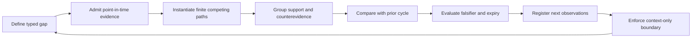
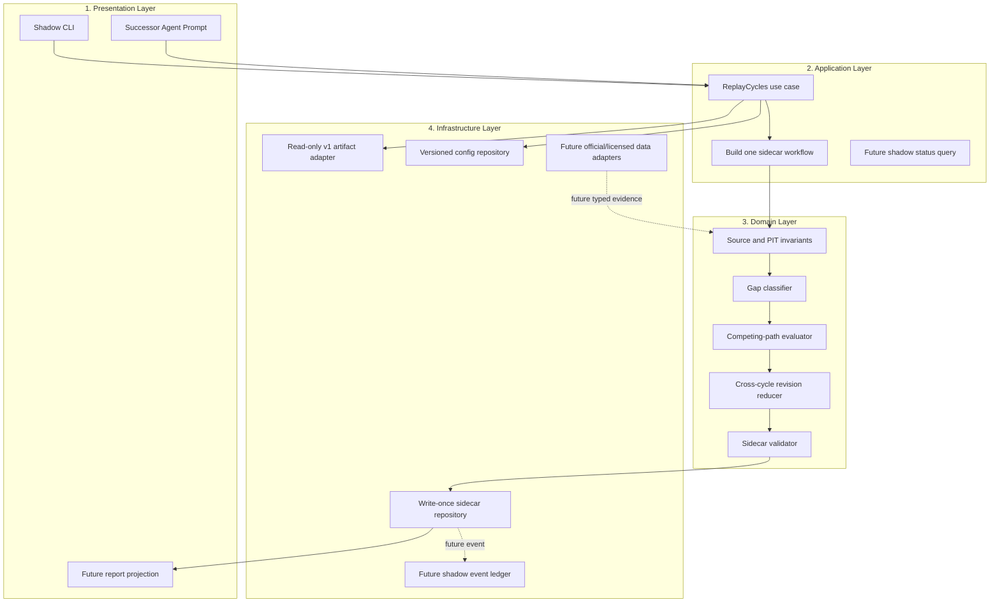
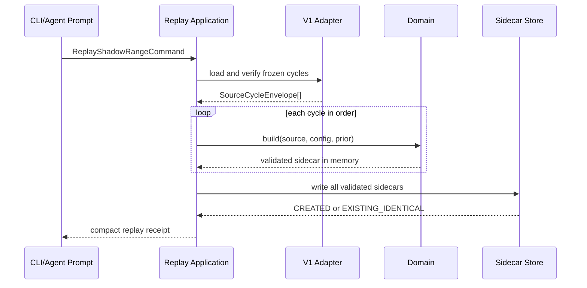

# Theory-Paper Missing-Data Inference Successor v2

## 1. Decision

The target system is a new, independent shadow inference core beside the
currently active theory-paper v1 runtime. It reads immutable v1 cycle artifacts,
classifies data gaps, evaluates multiple compatible paths, compares them with
the previous cycle and writes a separate sidecar.

It does not replace the current v1 center during the active 72-hour run.
`experiment.py`, the v1 ledger, portfolio, transaction chain, scoring and risk
gates remain authoritative for that run. The successor is not an action engine:
its output is context only.

Current implementation status:

- Product flow and four-layer target architecture: implemented in this design;
- deterministic domain reducer and validators: implemented;
- read-only v1 adapter and write-once sidecar repository: implemented;
- historical range replay CLI: implemented;
- successor automation prompt: implemented but not activated;
- event ledger, report projection and external data plugins: designed and
  deferred;
- consumption by an hourly Agent: disabled until the activation gates pass and
  the user explicitly authorizes it.

## 2. Requirement structure

### User intent

When data cannot be obtained, the Agent must not stop at a blank field and must
not invent a value. It must use the data that was actually available to maintain
multiple competing, falsifiable paths, then review those paths again whenever
the market changes.

### Operational goal

Make missing-data reasoning repeatable, auditable and resistant to single-story
bias in every scheduled cycle.

### System outcome

Every admitted cycle and symbol has:

1. a typed gap register;
2. field-level point-in-time evidence;
3. at least two named competing paths;
4. separate `OTHER_PATH` and `UNKNOWN_PATH` guards;
5. support and counterevidence grouped to prevent double counting;
6. falsifiers, next observations and expiry;
7. a cross-cycle revision state;
8. a hard boundary preventing the sidecar from authorizing an action.

### Core features

- v1 source digest and transaction binding validation;
- `available_at <= decision_at` evidence admission;
- four gap classes:
  `INTERFACE_FAILURE / NOT_COLLECTED / INSUFFICIENT_HISTORY /
  PUBLICLY_UNIDENTIFIABLE`;
- finite path registry;
- ordinal, non-probabilistic support;
- correlated-evidence group de-duplication;
- immutable prior linkage;
- historical replay and future live-pending modes;
- write-once sidecars outside the v1 tree.

### Enhancement features

- Chinese report projection;
- per-gap and per-path trend queries;
- shadow lifecycle ledger;
- alerts for stale paths, future evidence and repeated unknowns.

### Optional/future features

- official `forceOrder`, incremental depth and RPI-depth adapters;
- official announcement/filing adapters;
- licensed historical microstructure or news adapters;
- calibrated probability only after an independently authorized partition,
  dataset and out-of-sample calibration stage.

### System boundary

Inputs:

- v1 `manifest.json` and `ledger.ndjson`;
- per-cycle `market.json`, `news.json`, `analysis.json`;
- analysis transaction commit;
- in historical mode only, `agent-decision.json`, `decision.json` and the
  decision commit;
- the frozen successor-v2 framework config;
- the previous successor sidecar when one is required.

Outputs:

- one successor-v2 sidecar per cycle;
- a CLI validation/write receipt;
- no write into the v1 run tree.

Triggers:

- explicit CLI range replay;
- after activation only, a live-pending call after v1 analysis is frozen and
  before the Agent authors its decision.

### Non-goals

- changing the current v1 theory, scoring, portfolio or risk math;
- reconstructing unavailable values;
- participant identity, deterministic open/close role, intent or psychology;
- causal truth, calibrated probability, predictive proof or profitability
  proof;
- private account access, credentials, live orders or fund movement;
- Kafka, microservices, a database cluster or a general Agent framework.

### Success metrics

Correctness and safety:

- zero admitted future evidence;
- zero unknown-to-zero conversions;
- 100% of active targets contain at least two named paths plus `OTHER_PATH` and
  `UNKNOWN_PATH`;
- zero support inflation from duplicated dependency groups;
- the same source/config/prior inputs produce the same sidecar digest;
- every invalid source, contract or prior linkage fails closed;
- v1 source artifact digests are unchanged before and after replay.

Runtime:

- a six-symbol cycle should validate in under one second on the project runtime;
- a failed cycle can be retried independently;
- repeated identical writes return `EXISTING_IDENTICAL`;
- a conflicting existing file is rejected.

Activation:

- at least two consecutive real cycles replay successfully;
- targeted failure-injection tests pass;
- current 72-hour v1 run has ended;
- explicit user authorization is recorded.

## 3. Product flow

The primary product is not a dashboard; it is the information flow the
scheduled Agent must follow every time. The output hierarchy is deliberately
fixed so the Agent cannot start from a preferred story and search backward for
support.

| Order | Operator/Agent sees | Required decision |
|---|---|---|
| 1. Source lock | run, cycle, decision cutoff and source digests | Is the input admissible? |
| 2. Gap map | missing field, gap kind, reason and forbidden claims | What is genuinely unknown? |
| 3. Evidence register | exact field reference, value, availability and dependency group | What was known at the cutoff? |
| 4. Competing paths | two named paths plus OTHER and UNKNOWN | Which explanations remain compatible? |
| 5. Evidence balance | support, counterevidence and material conflict | What supports and challenges each path? |
| 6. What changed | observation delta and revision state | Did the path strengthen, weaken, fail, expire or remain unchanged? |
| 7. Next check | falsifier, next observable and expiry | What future observation will discriminate the paths? |
| 8. Decision boundary | context-only/no-risk-authority label | Can v1 gates legally use this context? |

Per-target review loop:



The visible language must remain:

- “compatible with observations,” not “the real cause”;
- “ordinal support,” not “probability”;
- “public behavior proxy,” not a person, institution or psychology;
- “unknown,” not zero.

## 4. Four-layer architecture

Exactly four layers are used.



Layer rules:

- Presentation calls only Application contracts.
- Application coordinates use cases and contains no market-path rules or file
  parsing.
- Domain is deterministic and has no file, network, credential, portfolio or
  order access.
- Infrastructure implements read/write adapters but cannot relax Domain
  invariants.
- No module calls another module's private helper as an integration surface.

## 5. Module split and ownership

| Layer/module | Type | Responsibility | Input → output | Data owner | Mock/test surface |
|---|---|---|---|---|---|
| `inference_v2.__main__` | Presentation service | Parse CLI request and render compact receipt | CLI args → JSON receipt/error | none | fake application function |
| `theory_paper_automation_prompt.v2.md` | Presentation policy | Force the per-cycle review order | frozen cycle/sidecar → Agent behavior | prompt binding | offline prompt inspection |
| `application.replay_cycles` | Application service | Load a contiguous range, build all in memory, validate, then write | replay command → replay receipt | replay receipt | fake source/config/repository ports |
| Domain source/PIT validator | Domain core | Verify source schema, digests, symbols and time cutoff | source envelope → admitted source | admitted source semantics | bad digest/future fixtures |
| Domain gap classifier | Domain strategy | Classify missing fields and forbidden claims | admitted analysis → gap register | `missing_data_register` | one fixture per gap class |
| Domain evidence extractor | Domain strategy | Materialize typed evidence references | admitted analysis → evidence register | `evidence_register` | field/time/dependency fixtures |
| Domain path evaluator | Domain core | Apply finite target strategies without imputation | gaps + evidence + registry → path states | path state | target-specific fixtures |
| Domain revision reducer | Domain core | Compare stable path identity across cycles | prior/current path → revision receipt | revision receipt | all six revision states |
| Domain sidecar validator | Domain core | Enforce all non-bypassable invariants | sidecar + config + prior → verdict | sidecar semantics | mutation/failure injection |
| `infrastructure.load_frozen_cycle` | Infrastructure adapter | Read v1 cycle and verify commits/ledger/bindings | run/cycle/mode → source envelope | source envelope representation | temporary v1 fixture |
| config repository | Infrastructure adapter | Strict-load the frozen framework | path → config snapshot | config bytes | duplicate/non-finite fixture |
| write-once repository | Infrastructure adapter | Write outside v1; identical retry succeeds | sidecar → write receipt | sidecar bytes | conflict/race fixture |
| future report projection | Presentation plugin | Render Chinese review/read model | sidecar → report | derived view only | fixed sidecar snapshot |
| future source adapters | Infrastructure data mods | Add official/licensed evidence | source event → typed evidence | adapter raw cache | recorded offline source fixture |

Every semantic data object has one owner:

| Object | Owner |
|---|---|
| v1 market/news/analysis/decision/portfolio | active v1 runtime |
| `SourceCycleEnvelope.v1` | v1 artifact adapter |
| admitted evidence semantics | Domain source/PIT validator |
| gap register | Domain gap classifier |
| evidence register | Domain evidence extractor |
| path state | Domain path evaluator |
| revision receipt | Domain revision reducer |
| complete sidecar aggregate | Domain sidecar builder |
| sidecar bytes | write-once repository |
| reports/query views | projection plugin; always rebuildable |

The repository stores the aggregate but does not become a second semantic
owner. A report projection is never an evidence source.

## 6. Contract-first IO

### Replay command

```json
{
  "schema_version": "ReplayShadowRangeCommand.v1",
  "run_dir": "<read-only-v1-run>",
  "output_dir": "<independent-v2-root>",
  "first_cycle": "cycle-0014",
  "last_cycle": "cycle-0015",
  "mode": "HISTORICAL_SHADOW_RECONSTRUCTION",
  "validate_only": false
}
```

### Source cycle envelope

```json
{
  "schema_version": "SourceCycleEnvelope.v1",
  "run_id": "<stable-run-id>",
  "cycle_id": "cycle-0015",
  "mode": "HISTORICAL_SHADOW_RECONSTRUCTION",
  "market": {},
  "news": {},
  "analysis": {},
  "source_artifacts": {
    "market.json": "<canonical-digest>",
    "analysis.json": "<canonical-digest>"
  },
  "source_committed_at": "<historical-only>"
}
```

### Sidecar aggregate

Top-level schema:

```text
schema_version
framework_id + framework_config_digest
mode + execution_scope
source
point_in_time
symbols[]
previous_sidecar_digest
boundaries[]
activation_state
sidecar_digest
```

Per-symbol schema:

```text
symbol
source IDs and observed_at
missing_data_register[]
evidence_register[]
observation_vector
observation_delta_from_prior_cycle[]
inference_targets[]
review_flow[]
symbol_review_digest
```

Per-path schema:

```text
stable path_instance_id
cycle-specific path_revision_id
template and path kind
causal steps
support/counterevidence refs
independent dependency groups
ordinal support
falsifiers + falsifier state
next observables + expiry
probability forbidden status
path state digest
revision receipt + digest
record digest
```

Errors are stable fail-closed codes, including:

- `SOURCE_ARTIFACT_DIGEST_MISMATCH`;
- `SOURCE_ANALYSIS_DIGEST_MISMATCH`;
- `SOURCE_MARKET_FROM_FUTURE`;
- `EVIDENCE_FROM_FUTURE`;
- `FRAMEWORK_PATH_CARDINALITY`;
- `SIDECAR_REQUIRED_RESIDUAL_MISSING`;
- `SIDECAR_SUPPORT_GROUP_MISMATCH`;
- `PRIOR_PATH_STATE_DIGEST_MISMATCH`;
- `LIVE_PRIOR_SIDECAR_REQUIRED`;
- `OUTPUT_INSIDE_PROTECTED_V1_RUN`;
- `WRITE_CONFLICT`.

Compatibility policy:

- the successor system may be called v2 while each new transport contract
  starts at `.v1`;
- additive optional fields may remain in a schema version;
- deleting a field, changing a type or changing semantics requires a new
  schema version;
- committed sidecars are never migrated in place;
- an upcaster, if later needed, must be a pure function producing a new
  sidecar with explicit lineage.

## 7. Event flow

The current MVP is a synchronous local use case; it does not introduce a
message broker. The following events are frozen extension contracts for a
future append-only shadow ledger:

| Event | Trigger | Payload | Listener |
|---|---|---|---|
| `shadow.cycle.requested.v1` | replay/live command accepted | run, cycle, mode, config digest | orchestrator/audit |
| `shadow.evidence.admitted.v1` | PIT gate passes | source and evidence-set digests | metrics |
| `shadow.gaps.classified.v1` | gap register built | gap digest and counts | metrics/report |
| `shadow.paths.assessed.v1` | path states built | target/path digests | revision reducer |
| `shadow.revision.computed.v1` | prior comparison completes | revision counts and digest | validator |
| `shadow.cycle.committed.v1` | write-once commit succeeds | cycle, URI, sidecar digest | projection |
| `shadow.cycle.rejected.v1` | any gate fails | source digest and stable error code only | status/alert |



## 8. Plugin/mod structure

The stable core is:

```text
PIT invariants
+ gap taxonomy
+ residual/unknown separation
+ dependency-group de-duplication
+ revision semantics
+ digest/immutability rules
```

Allowed mods are registered from a static allowlist:

- `EvidenceExtractorMod`: maps a new source schema to typed evidence;
- `TargetPathMod`: adds a finite path target without changing existing target
  semantics;
- `OrdinalSupportStrategy`: replaces a target evaluation rule but can never
  emit a probability;
- `ReportProjectionMod`: adds a Chinese/JSONL/query view;
- `DataSourceAdapterMod`: adds official or licensed public data.

Lifecycle:

```text
register -> initialize -> run/onEvent -> deactivate -> uninstall
```

Safety:

- default network and credential scope is none;
- source reads use an allowlist;
- writes are restricted to the successor namespace;
- mods cannot disable PIT, UNKNOWN, OTHER, evidence-group de-duplication,
  paper-only or no-action invariants;
- all mod output re-enters the core validator;
- CPU/time/output limits are configured before any live activation.

No dynamic plugin marketplace is needed for this task.

## 9. Data model and queries

The MVP uses canonical JSON and write-once files:

```text
.runtime/theory-paper-successor-v2/<source-run-id>/
  cycles/
    cycle-0014/inference-sidecar.v2.json
    cycle-0015/inference-sidecar.v2.json
  reports/                         # future, rebuildable
  shadow-ledger.ndjson             # future
```

No database is required. If query volume later justifies SQL, it is a
rebuildable projection with these logical tables:

- `source_cycle`;
- `missing_item`;
- `evidence_ref`;
- `inference_target`;
- `path_state`;
- `path_evidence_link`;
- `path_revision`;
- `shadow_commit_event`.

Required queries:

1. Which fields are missing for a cycle/symbol and why?
2. Did any evidence arrive after the decision cutoff?
3. Does every target have two named paths plus OTHER and UNKNOWN?
4. Which dependency groups support and contradict each path?
5. What changed from the previous cycle?
6. Which paths strengthened, weakened, failed or expired?
7. Which falsifier or next observation is due?
8. Are source and prior digests still valid?
9. Did shadow replay change any v1 artifact?

## 10. Legacy compatibility strategy

The v1 runtime is a protected legacy center for the active experiment.

- The successor does not import or call private `experiment.py` use cases.
- `load_frozen_cycle` is the only compatibility adapter. It reads v1 schemas
  and validates their commit and ledger boundaries.
- Existing v1 CLI commands and automation remain unchanged.
- Historical reconstruction requires committed decisions and labels physical
  existence at the original decision time as `NOT_CLAIMED`.
- Future live mode reads a pending, already-frozen analysis before decision
  authoring and requires the actual prior sidecar.
- The existing v1 `PHI_OTHER_UNKNOWN` is not reused as a successor domain
  object. Successor v2 keeps `OTHER_PATH` and `UNKNOWN_PATH` separate and uses
  `OTHER_OR_UNKNOWN` only as a reader-facing union label.
- The frozen research-system v1.2 dynamic-hypothesis contracts are a conceptual
  predecessor for PIT, receipts, conflicts and residual semantics. They are not
  a runtime engine and do not authorize paper trading.
- Rollback is simply disabling successor consumption. Because v1 is never
  mutated, no v1 state rollback is required.

## 11. Three-phase roadmap

### Phase 1 — contract and shadow core

- freeze config, schemas, error codes and path identities;
- implement the four layers and read-only adapter;
- implement deterministic gap/evidence/path/revision reducers;
- replay consecutive frozen cycles;
- keep consumption disabled.

Exit gate: current implementation and tests pass; v1 artifacts remain
unchanged.

### Phase 2 — operational shadow

- run the sidecar after every new frozen analysis without Agent consumption;
- add a shadow event ledger and Chinese report projection;
- measure runtime, gap trends, path churn and failure rates;
- connect no new data source yet.

Exit gate: a complete future window has zero PIT and immutability violations,
with deterministic retries.

### Phase 3 — limited successor consumption

- current 72-hour v1 run is complete;
- user explicitly authorizes the v2 prompt;
- enable `shadow_consume` for the Agent while keeping v1 risk/action gates
  authoritative;
- later add one official data adapter at a time behind its own feature flag.

Exit gate for each adapter: source authority, availability clock, gap/censoring
semantics, offline fixture and rollback all pass.

## 12. Verification and activation gates

Contract gates:

- strict JSON, no duplicate keys or non-finite values;
- framework ID, target order and finite path registry match;
- every named path has causal steps, counterevidence capability, falsifiers,
  next observations and expiry.

PIT gates:

- market and measurement time do not exceed `decision_at`;
- news uses `retrieved_at` for availability;
- historical decisions and execution receipts are not admitted as pre-decision
  evidence;
- future or unknown clocks fail closed.

Path gates:

- at least two named paths;
- separate OTHER and UNKNOWN;
- no numeric probability;
- dependency groups, not raw proxy count, determine ordinal support;
- a material conflict remains visible;
- prior digest and time are valid;
- revision is one of the six registered states.

Storage gates:

- output is outside the v1 run;
- all requested cycles build and validate in memory before the first write;
- identical retry succeeds;
- conflicting bytes fail;
- no v1 source digest changes.

Activation gates:

- two or more consecutive real-cycle replays pass;
- failure injection and full relevant v1 regression tests pass;
- current v1 run ends;
- the user explicitly authorizes the switch;
- activation changes only prompt consumption, never paper/live permission.

## 13. Known limits

- Current F inference cannot observe authoritative liquidation events.
- Current R inference is capped because one snapshot cannot measure temporal
  replenishment.
- Missing higher-timeframe indicators remain missing; conditional paths do not
  restore their values.
- News metadata cannot verify article facts or causal market impact.
- Public aggregates cannot reveal participant identity, exact trade role,
  intent or psychology.
- Ordinal path support has not been calibrated and cannot be used as a
  probability or expected-value input.
- Historical sidecars prove deterministic reconstruction, not that the sidecar
  physically existed at the original decision cutoff.

