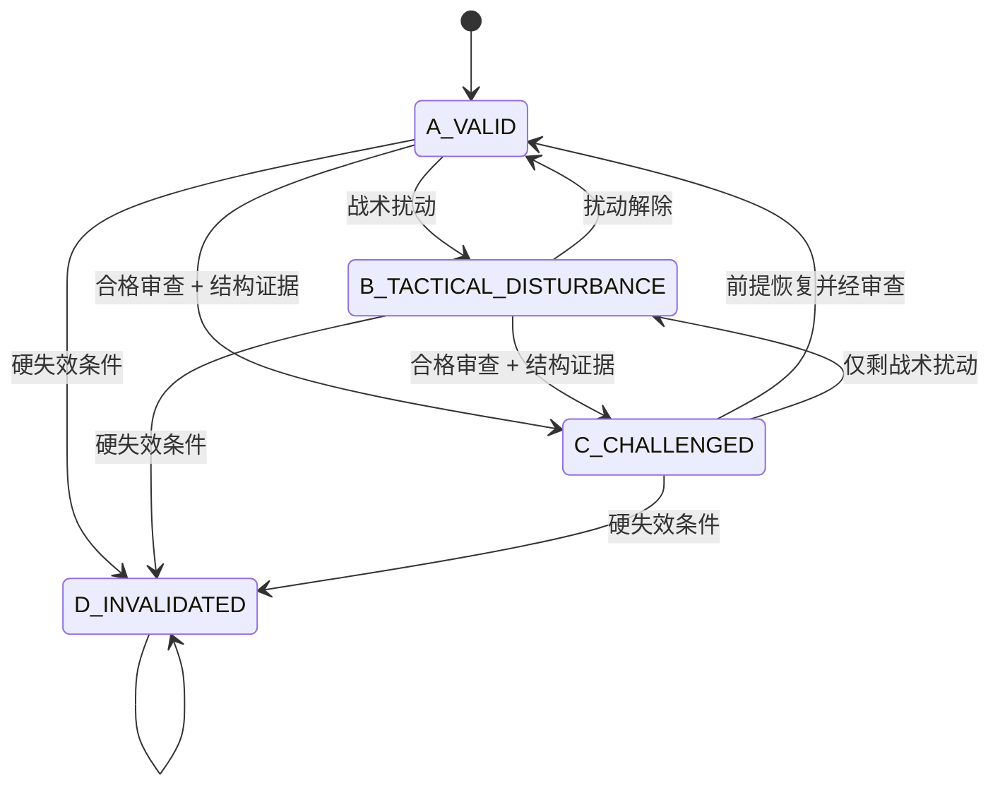

# 多时间尺度决策治理 successor v2 系统设计

## 1. 设计结论

当前 v1 已具备多周期分析、PIT（只使用决策时点已可用数据）、不可变事务和纸面风险门，但缺少位于“分析结论”和“组合动作”之间的不可绕过治理门。修复不能在活动 72 小时基线中途修改 v1 schema，而应采用并行 successor：

```text
冻结数据与分析
→ 缺失数据竞争路径 sidecar
→ 多时间尺度治理卡
→ 治理校验门
→ 既有组合/风险门
→ 纸面动作
→ 按声明 horizon 复盘
```

当前交付只完成前述治理规则的领域核心、legacy 影子审查和真实周期回放。它处于 `SHADOW_CANDIDATE_NOT_ACTIVATED`，没有接入当前 v1 提交调用链，也没有纸面或实盘动作权限。

## 2. 需求到控制点

| 用户问题 | successor 控制点 | 失败处理 |
|---|---|---|
| 小周期显著性夺取方向权 | 固定时间尺度 role 与最大权限；禁止投票 | 无升级回执时拒绝战略改写 |
| 噪音或单根 K 线越级 | 信号分类与完整升级条件 | 缺一项即拒绝升级 |
| 风险操作被解释为观点失效 | `ActionIntent` 与战略状态分离 | 风险/战术动作不能拥有战略状态 |
| 退出后无限期观望 | 非 D 状态下退出/减仓强制 `ReentryContract` | 缺失合同拒绝动作 |
| 短期结果证明长期判断 | horizon 对齐评价器 | 到期前只记局部路径，不判正确 |
| 持仓后反复重写战略 | 固定 4H/1D、expiry、合格事件审查钟 | 战术/风险审查不能触发战略转换 |
| 一次操作污染原 thesis | 三类 append-only 账本、唯一 owner | 禁止跨账本回写 |

## 3. 两套层次必须分开

### 3.1 五类业务决策权限

| 权限 | 唯一职责 | 可改变 | 不可改变 |
|---|---|---|---|
| `STRATEGIC_HYPOTHESIS` | 核心方向、前提、失效条件、horizon | 假设定义 | 仓位、订单、成交 |
| `STRUCTURAL_EVIDENCE` | 信号分类、证据关联、升级回执 | 置信序位与转换证据 | 直接下单 |
| `RISK_CONTROL` | 在观点可能正确时仍限制损失 | 仓位上限、保护、减仓许可 | 核心方向与状态 |
| `TACTICAL_EXECUTION` | 进入、退出、分批与滑点处理 | 动作节奏和执行参数 | 中长期假设 |
| `REVIEW_UPDATE` | 按冻结 horizon 评价与产生新版本 | 复盘状态、新假设提案 | 回写旧判断 |

### 3.2 四层代码架构

| 代码层 | 当前模块 | 职责 | 禁止事项 |
|---|---|---|---|
| Presentation | `governance_v2.__main__` | 参数解析、结构化结果和错误码 | 不做领域判断 |
| Application | `governance_v2.application` | 连续周期用例、先全量验证再写入 | 不读取账户或构造市场结论 |
| Domain | `governance_v2.domain` | 配置、sidecar、治理卡、状态转换、再入场与 horizon 不变量 | 无文件、网络、订单 I/O |
| Infrastructure | `governance_v2.infrastructure` | 复用只读 v1 adapter、路径隔离、write-once 写入 | 不补造 intent、状态或缺失证据 |

业务权限由 Domain 强制；代码四层负责保证规则不会被 I/O、提示词或调用顺序绕开。两者不是同一套“层”。

## 4. 模块与唯一对象归属

| 模块 | 拥有的对象 | 输入 | 输出 |
|---|---|---|---|
| Hypothesis Governance | `StrategicHypothesis`、A/B/C/D 状态 | 冻结假设、合格转换命令 | 新状态版本或拒绝 |
| Evidence Governance | `SignalRecord`、`PromotionReceipt` | PIT 观测、前提注册表 | 分类证据、升级回执或拒绝 |
| Risk Policy Adapter | `LotRiskSnapshot/Reference`（只读） | 当前 lot、风险限制、战略状态只读视图 | 风险许可；不产生观点；`LotRiskLifecycle` 仍由既有 v1 Portfolio/Risk runtime 唯一拥有 |
| Execution Governance | `TradeIntent`、`ReentryContract` | 风险许可、战术条件、战略状态只读视图 | 可提交动作或拒绝 |
| Horizon Review | `HorizonEvaluation` | 冻结规则、完整窗口、到期观测 | interim / supported / falsified / expired |
| Legacy Audit Adapter | `LegacyGovernanceSidecar` | v1 committed analysis/decision/ledger | `UNKNOWN` 保真审查与违规清单 |
| Gate Orchestrator | `GovernanceGateResult` | 完整治理卡、配置摘要 | `ACCEPTED` 或 typed rejection |

唯一 owner 规则：

- 假设账本唯一拥有核心假设、方向、前提、A/B/C/D 状态和 review clock；
- 信号账本唯一拥有信号类别、PIT 证据、独立组、持续窗口和升级回执；
- 行为账本唯一拥有动作意图、lot 目标、风险原因、再入场合同和动作评价窗口；
- `LotRiskLifecycle` 独立于当前市场观点。新观点不能重写既有 lot 的父假说；
- 账本之间只能按 ID 引用，不能复制后再反向覆盖原对象。

## 5. 版本化输入输出合同

### 5.1 当前已实现

1. `FrozenCycleSource.v1`
   - 只接受已提交的 v1 analysis、validated decision、commit 与 ledger；
   - 校验 run、cycle、摘要和时点绑定；
   - source 只读。

2. `DecisionGovernanceFramework.v2`
   - 文件：`config/theory_paper_decision_governance.v2.json`；
   - 冻结时间尺度权限、信号类别、PHI 方向、升级条件、状态机、动作意图、再入场、审查钟、评价与账本 owner；
   - 不含未经样本校准的概率或连续权重。

3. `LegacyGovernanceSidecar.v2`
   - 对历史 v1 做影子审查；
   - 历史没有声明的战略状态、动作意图和再入场合同保持 `UNKNOWN_LEGACY_UNDECLARED` 或 `null`；
   - 只报告 gap，不用 reason 文本倒推理由；
   - digest 绑定、write-once，并禁止写入 v1 run 树。

4. `FutureGovernanceCard.v2`
   - 严格 validator 已实现；
   - 包含 source、三账本、状态转换、升级回执、动作意图、再入场合同和 horizon policy；
   - 强制同 run 相邻 cycle、`previous_card_digest`、同一假设不可变字段、实际 action→intent、非 D 退出→再入场、horizon class→周期/窗口/最短时长；
   - 自签 promotion 与连续周期自报战略审查时钟会被明确拒绝，直到可信 adapter 接入；
   - genesis 只能以 `A_VALID + NO_CHANGE` 建立；自签 reentry condition 即使字段完整也会因执行 authority 未接入而拒绝；
   - 新 hypothesis ID 在没有 creation receipt 时失败关闭，不能借换 ID 绕过 D；
   - 未接入当前提交调用链，因此尚不是 active runtime protection。

### 5.2 接线前必须实现的合同

1. `StrategicTransitionCommand.v2`
   - `prior_state / proposed_state / trigger / premise_or_invalidator_ids / evidence_ids / promotion_receipt_ids / reviewed_at`；
   - C/D 只能由战略 review 入口提交。

2. `PromotionReceipt.v2`
   - 必须同时证明：超出预注册正常范围、跨独立 closed windows 持续、独立数据类型确认、改变注册前提、不是纯流动性/随机/未知原因、全部证据满足 PIT；
   - receipt 只授予“进入结构证据审查”的资格，不自动转换状态。

3. `ActionIntent.v2`
   - 动作必须显式属于战略进入/加仓、风险减仓/退出、战术退出、战略失效退出、保护更新、纯执行或 HOLD；
   - intent 不得从自然语言 reason 推断。

4. `ReentryContract.v2`
   - 绑定原 hypothesis instance；
   - 含最低条件、验证仓/结构重确认/计划仓三阶段、价格条件、时间条件、`review_by` 和 D 状态取消条件；
   - 分阶段具体仓位仍由独立组合风险策略决定。

5. `GovernanceGateResult.v2`
   - 只有 `ACCEPTED` 才能把原 decision 交给既有 paper portfolio gate；
   - 任一 unknown intent、非法状态转换、缺失再入场合同、未授权越级、时点或摘要错误必须 typed reject；
   - 不得有“提示词说明已遵守”的旁路。

6. `GovernedActionReceipt.v2`
   - 将 `run_id / cycle_id / source_decision_digest / governance_card_digest /
     portfolio_gate_digest / action_digest` 一次性绑定；
   - 一张 receipt 只可消费一次；
   - 没有 receipt 的候选动作不得进入 `submit_actions`。

所有对象使用精确字段、版本号、ID 和 canonical digest。未知值显式保留，不以零、默认方向或自由文本替代。

## 6. 状态与权限



- B 不等于方向改变；它允许保护、延迟、对冲或战术退出；
- C 表示核心前提受到结构证据挑战，允许降风险和暂停新增风险；
- D 对同一 hypothesis instance 为终态；若之后形成反向或恢复判断，必须创建新实例和完整新证据链；
- PnL、压力、近期动作结果、单根低周期 K 线、未确认新闻与纯自由文本不能触发 C/D。

## 7. 每轮事件流

当前 shadow 流：

```text
V1CycleCommitted
→ FrozenCycleVerified
→ LegacyGovernanceAuditBuilt
→ LegacyGovernanceAuditValidated
→ GovernanceSidecarWritten | ExistingIdentical | Rejected
```

未来 successor 接线流：

```text
CycleFrozen
→ CandidateDecisionV1SchemaValidated
→ MissingDataPathsValidated
→ TrustedSignalsExtracted
→ PriorGovernanceCardLineageVerified
→ ReviewClockReceiptVerified
→ PromotionReceiptsValidated
→ StrategicReviewDueChecked
→ StrategicTransitionValidated
→ TradeIntentValidated
→ ReentryContractValidated
→ HorizonPolicyValidated
→ GovernanceCardAccepted
→ GovernanceCardAndActionReceiptCommitted
→ ExistingPortfolioRiskGate
→ PaperActionCommitted
```

事件只传递不可变 ID 和 digest；它们不承担状态所有权。任何 `Rejected` 事件终止本轮新动作，但不能撤销既有硬保护。

## 8. 插件边界

允许插件：

- `EvidenceSourceAdapter`：增加正式授权的公开或付费数据，但必须输出 provenance、`observed_at`、`available_at`、质量和缺口原因；
- `SignalClassifier`：把已注册 observable 映射到信号类别和最大权限；
- `NormalRangeEstimator`：只提供预注册正常范围，版本冻结且须独立校准；
- `PortfolioRiskPolicy`：决定风险上限和再入场阶段的具体规模；
- `ReviewReporter`：中文审计报告和提醒。

禁止插件：

- 直接改写 A/B/C/D；
- 从 PnL、持仓压力或自由文本生成结构失效；
- 绕过 governance gate 或既有 portfolio gate；
- 把公开聚合数据解释为参与者身份、意图或心理事实；
- 未经授权访问私有账户、密钥或实盘接口。

## 9. 数据模型

```text
StrategicHypothesis 1 ── n SignalRecord
StrategicHypothesis 1 ── n StrategicTransition
SignalRecord        n ── n PromotionReceipt (通过 evidence_id 引用)
StrategicHypothesis 1 ── n TradeIntent
TradeIntent         0 ── 1 ReentryContract
TradeIntent         n ── n LotRiskLifecycle (只引用，不改写父假说)
StrategicHypothesis 1 ── n HorizonEvaluation
GovernanceCard      1 ── 1 GovernanceGateResult
```

核心时点约束：

```text
evidence.available_at <= decision_at
transition.reviewed_at <= decision_at
reentry.created_at <= decision_at < reentry.review_by
horizon.starts_at < horizon.ends_at
```

到 `horizon.ends_at` 且满足 `minimum_complete_windows` 前，结果只能是
`INTERIM_PATH_OBSERVATION_NOT_CORRECTNESS`。到期评价使用原先冻结的 support、falsifier 和失效规则；不得事后选择更有利窗口。

治理卡还必须具有连续 lineage：

```text
current.run_id == previous.run_id
current.cycle_number == previous.cycle_number + 1
current.previous_card_digest == previous.card_digest
current.source_decision_digest == governed_action_receipt.source_decision_digest
```

新 hypothesis instance 不能由 Agent 任意换 ID。必须由 Domain 根据
`NewHypothesisCommand + prior terminal state + 新 premise/invalidator 集` 铸造
`NewHypothesisReceipt`；仅换 ID、名称或同名 PHI 不能绕过 D 终态。

## 10. Legacy 兼容与迁移

- v1 历史工件永不迁移、补字段或回写；
- legacy adapter 读取 v1 committed authority，输出独立 sidecar；
- 缺失的 intent、状态转换和再入场合同保持 unknown，并形成阻塞项；
- sidecar 不能反向成为历史交易理由，也不能改变 v1 review 或 performance；
- successor 第一个可执行周期必须创建全新的治理卡和 hypothesis instance mapping；
- 当前 v1 自动任务保持原 prompt、manifest 和 transaction binding。

## 11. 三阶段路线与门

### 阶段 1：历史影子审查

状态：已实现。

通过门：

- 对连续真实周期确定性生成 sidecar；
- 相同输入得到相同 digest 或 `EXISTING_IDENTICAL`；
- 缺失历史语义保持 unknown；
- v1 源摘要、事务、组合和自动任务不变；
- 负例证明低周期越级、自签 promotion、genesis 自报战略失效、EXIT 冒充 HOLD、
  无再入场合同、自签再入场条件、非法状态转换、换 hypothesis ID、伪造一分钟
  战略 horizon 和输出路径逃逸均被 strict validator/adapter 拒绝。

### 阶段 2：新 successor paper 提交前接线

状态：未实现、未授权。

必须完成：

- Agent 在提交 decision 前生成完整 `FutureGovernanceCard.v2`；
- Infrastructure 从冻结 source 构造可信 evidence catalog 和交易所日历派生的
  review-clock receipt；Agent 只能引用，不能自签 `outside_normal_range`、window、
  independent group 或 scheduled close；
- Card repository 强制验证同 run 相邻 cycle 和 `previous_card_digest`；
- Domain 独占 hypothesis instance ID 铸造，防止换 ID 绕过 D；
- Application 层调用 `require_valid_card`，产生 `GovernanceGateResult.v2`；
- Application 把 accepted card 与候选 decision 绑定为 write-once
  `GovernedActionReceipt.v2`；只有该 receipt 才能进入既有 portfolio/risk gate；
- 卡片、gate result、decision 和 transaction 使用同一 `decision_at` 与摘要绑定；
- 风险/战术退出必须绑定具体 `target_lot_ids`，再入场条件必须由后续周期的
  trusted signals 执行，逾期由调度器发出 due 状态；
- 当前硬保护即使本轮治理失败仍可执行，新增风险失败关闭；
- 在独立 paper run 中完成故障注入和完整 shadow window，不修改旧 run。

通过门：

- 零 schema 旁路，所有非法测试均 typed reject；
- 每次风险/战术退出的 reentry contract 可被后续周期追踪、执行或由 D 明确取消；
- 战略 review 只在注册时钟/事件发生；
- horizon 到期前无长期正确性标签；
- 用户单独授权切换。

### 阶段 3：有限 paper 激活与校准

状态：未开始。

范围仍是 paper-only。先比较 predecessor 与 successor 的流程偏离、过度退出、漏回归、假设状态转换和风险结果；再基于独立样本校准升级所需的窗口、正常范围和独立证据组。不得用本次复盘直接拟合精确权重。

通过门：

- 完整独立 paper 窗口无关键治理绕过；
- 所有参数有版本和样本外依据；
- 过程质量、预测评价和 PnL 分开报告；
- 任何实盘、私有数据或资金权限另立需求、风险评审和用户授权。

## 12. 当前可用与不可用

现在可用：

- 审查当前 v1 历史周期中的治理缺口；
- 用 strict validator 验证未来治理卡样本；
- 验证升级、状态、再入场和 horizon 的纯领域不变量；
- 验证 legacy governance sidecar 的隔离路径与 write-once；FutureGovernanceCard、
  GateResult 和 GovernedActionReceipt 的 repository 尚未实现；
- 在独立 namespace 保存可重复审查结果。

现在不可用：

- 不能声称当前活跃 v1 已受治理门保护；
- 不能让 v2 sidecar 授权纸面动作；
- 不能自动生成或提交 successor 治理卡；
- 不能证明预测有效、盈利、因果或实盘安全。

## 13. 当前实现的激活前阻塞项

以下不是文档优化项，而是接入动作门之前必须补齐的 P0 接线条件：

1. **可信信号提取**：strict validator 已拒绝自签 promotion，但当前尚无能
   生成可信 `source_ref`、正常范围、持续 closed windows、独立确认组和 cause
   class 的 source extractor。没有它时低周期升级保持不可用。
2. **真实审查时钟**：连续卡已经禁止 NO_CHANGE/TACTICAL/RISK 更新重置战略钟，
   且自报的 scheduled/event trigger 会因可信 authority 未接入而被拒绝；仍需
   closed-bar/calendar/event receipt adapter 才能合法执行战略转换。
3. **已接受 lineage 的持久化证明**：schema 已强制 `previous_card_digest`、
   同 run 和相邻 cycle，但纯函数只能验证前卡字节一致，不能证明它曾经通过并被
   write-once 接受。接线前必须由 Card repository 和 GovernedActionReceipt
   提供 authority。
4. **新假设铸造**：当前缺 creation receipt 时会拒绝任何新
   `hypothesis_instance_id`，已封闭换 ID 绕过 D；仍需 Domain
   `NewHypothesisReceipt` 才能在合法条件下开始真正的新实例。
5. **lot 与再入场执行**：当前会验证再入场字段形状，但在可信执行 authority
   未接入时仍明确拒绝，不接受自报 condition ID；尚需绑定具体退出动作、lot、
   版本化谓词、条件执行器、逾期调度与分阶段恢复结果。
6. **horizon 真实评价**：class、timeframe、最短时长和完整窗口数已经强制，
   但 `evaluate_horizon_status` 仍是未接线纯函数；support/falsifier 与 closed
   windows 必须由冻结谓词 evaluator 计算，不能由调用者自报。
7. **完整证据包绑定**：legacy loader 会验证完整 ledger，但当前 sidecar 的
   source hash 列表未单独绑定 chaos-execution 与 review 工件。未来
   `FrozenCycleEnvelope` 必须显式列出影响退出、lot 和 horizon 结论的全部工件摘要。

任一项未完成时，`paper_action_authority` 必须保持
`NONE_VALIDATION_ONLY / NONE_SHADOW_ONLY`。

## 14. 验收判定

本次“successor 候选已修复已知纯函数负例”的准确含义是：

- 漏洞已被复现、分级，并在 strict validator 边界内转化为失败关闭的领域不变量；
- 独立 successor 核心能拒绝对应负例，并忠实审查真实历史；
- 当前冻结基线未被污染。

它不等于“当前 v1 已修复”。当前 v1 只有在阶段 2 完成接线、独立验证通过且用户授权切换后，才可以被 successor 替代。
