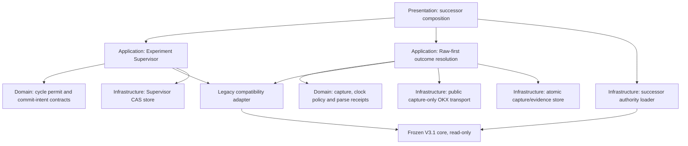
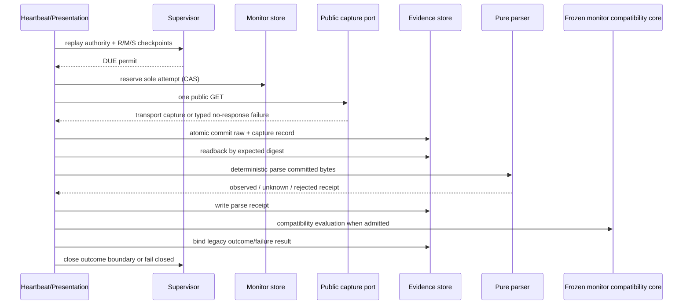

# V3.1 后继实验运行时设计（冻结候选）

状态：`RELIABILITY_BASE_ONLY_SUPERSEDED_TARGET_DESIGN_NO_AUTHORITY_PUBLISHED`

适用范围：公开 OKX `BTC-USDT-SWAP` 数据、本地研究、不可执行；不包含 paper/live、账户、订单、凭据、资金或组合写回。

2026-08-07 变更：本文件的 raw-first、时钟、Supervisor、commit recovery、资格和 authority 修复继续实现并回归；原 `8/8+8/8` 串行目标设计不再启动。新的行为与实验入口为 `CURRENT_RESEARCH_THEORY_v3_2_DYNAMIC_AGGRESSIVE.md` 和 `V3_2_SYSTEM_AND_EXPERIMENT_DESIGN_2026-08-07.md`，采用完整动态计划及 AnalysisClock/OutcomeClock 分离。任何 V3.1.1 authority、qualification 或 target artifact 均不得封存。

## 1. 结论与成功标准

旧 run `v31-prospective-btcusdt-20260806t183742z` 永久保持 `FAILED_CLOSED`。后继方案不修改旧 run、旧 attempt、旧 failure、冻结理论文件或旧 authority 绑定的 `74` 个 runtime 字节。

后继 run 的实验完成标准不降低：同一新 run 内必须形成 `8/8` 个 accepted cycle 与对应 `8/8` 个合法 outcome receipt。合法 `UNKNOWN/UNRESOLVED` 是 coverage loss，但仍是如实记录的 outcome；没有 receipt 绝不能冒充 UNKNOWN。

本次设计同时关闭四个已知运行时缺陷：

1. HTTP 响应必须先作为 write-once capture bundle 耐久提交，再做任何 content-type、JSON、schema、数值或时间语义解析；
2. provider clock 与 local receive clock 分离，采用事前冻结的有界政策，保留原始时间，不静默夹取；
3. research、monitor、source 与 Agent 由一个 run-level Supervisor 统一放行；
4. successor authority 冻结实际导入闭包，不再把旧 `74` 项显式集合误称为完整运行时闭包。

## 2. 四层架构



四层职责严格固定：

- Domain：只定义不可变合同、状态机、时钟政策、重建与验证；无文件、网络、Agent 或时钟读取。
- Application：编排 permit、commit intent、capture、parse、旧核心兼容调用；只依赖端口。
- Infrastructure：实现公开 GET、原子目录提交、write-once 文件、CAS checkpoint 与完整 authority 物理重放。
- Presentation：唯一生产组合入口；顺序固定为 full loader → exact-five authority projection → Supervisor gate → use case。

## 3. 模块表

| 层 | 新模块 | 单一职责 | 可独立替换/模拟 |
|---|---|---|---|
| Domain | `domain/v31_outcome_capture_v2.py` | capture、clock policy、parse receipt 与状态不变量 | 纯函数，可用 bytes fixture |
| Domain | `domain/v31_experiment_supervisor_v2.py` | permit、commit intent、terminal 判定 | 纯 checkpoint document |
| Domain | `domain/governance/v31_application_authority_projection_v2.py` | 完整 loader 结果到五文档 Application 合同 | 纯映射验证 |
| Application | `application/v31_outcome_resolution_v2.py` | attempt → capture commit → readback parse → outcome link | fake capture/store/parser |
| Application | `application/v31_experiment_supervisor_v2.py` | source/prepare/Agent/commit 前统一放行 | fake R/M/S store |
| Infrastructure | `infrastructure/v31_public_outcome_capture_v2.py` | 一次白名单 GET，只返回 transport capture | fake HTTP transport |
| Infrastructure | `infrastructure/v31_outcome_evidence_store_v2.py` | raw+record 原子 bundle、capture CAS、parse/link readback | 临时目录 |
| Infrastructure | `infrastructure/v31_supervisor_store_v2.py` | run-level write-once/CAS cursor | 临时目录 |
| Domain | `domain/v31_successor_cycle_commit_v2.py` | 完整跨 store commit material | 纯映射重建 |
| Application | `application/v31_successor_cycle_commit_v2.py` | preview、冻结、commit/recovery | fake owner stores |
| Infrastructure | `infrastructure/v31_successor_commit_store_v2.py` | owner 外 write-once recovery material | 临时目录 |
| Domain | `domain/v31_sentiment_native_projection_v2.py` | 十二轴来源矩阵与图投影合同 | 纯证据 observations |
| Application | `application/v31_sentiment_native_projection_adapter_v2.py` | admitted PIT/source 到十二轴的精确映射 | 已封存 source bundle |
| Domain | `domain/v31_association_preregistration_v2.py` | 96 候选、窗口、lag、BY/Holm | 纯有限 registry |
| Domain | `domain/v31_evaluation_contract_v2.py` | 预测、校准、成本、regime 的证据门 | 纯状态报告 |
| Domain/Application/Infrastructure | `v31_successor_qualification_v2.py` | fresh source、current Codex、fixed monitor 三资格 | 已封存资格证据 |
| Infrastructure | `infrastructure/authority/v31_successor_authority_loader_v2.py` | predecessor、失败 lineage、新 authority、完整闭包重放 | 临时 project tree |
| Presentation | `presentation/v31_successor_composition_v2.py` | 唯一 successor 运行入口 | mock ports |
| Presentation | `presentation/v31_successor_authority_freeze_composition_v2.py` | Phase A/资格/Phase B/新全局 authority 路径 | 临时 project tree |

旧模块不被改写。successor authority 把旧冻结核心作为 compatibility dependency，同时把全部新模块、祖先 `__init__.py` 与实际本地 import closure 纳入摘要集合。

## 4. 输入输出合同

### 4.1 Capture port

```text
capture_public_outcome(monitor_plan, requested_at)
  -> PublicOutcomeCapture
```

输入只允许已验证的 public/non-account/GET monitor plan。输出只包含 transport 事实：request/final URL、HTTP status、headers、raw bytes、request time、receive time、source request ID。该端口禁止 JSON decode、Decimal、provider timestamp 或 mark 解析。

无 HTTP response 时返回 typed transport failure；不得发起第二次请求。HTTP 4xx/5xx 若已得到有界完整 body，仍先作为 response capture 保存，再由 parser 决定拒绝。

### 4.2 Atomic capture store

```text
commit_capture_bundle(attempt_binding, capture)
  -> CommittedCaptureBinding

load_committed_capture(binding)
  -> verified raw bytes + capture record
```

store 是 raw/capture 的唯一 owner。发布顺序为 temporary directory → raw fsync → capture record fsync → directory fsync → atomic rename → parent fsync → checkpoint CAS。canonical bundle 已存在时只接受逐字节、逐摘要完全相同的本地恢复。

checkpoint 计数不变量：

```text
outcomes <= parses <= captures <= attempts <= plans
```

任一相邻 gap 最多为 1。`ATTEMPT_RESERVED_NO_CAPTURE` 禁止再次 GET；`CAPTURE_COMMITTED_PENDING_PARSE` 只允许对同一已验证 raw 做确定性本地恢复。

### 4.3 Pure parser

```text
parse_committed_public_outcome(raw, capture_record, monitor_plan, clock_policy)
  -> PublicOutcomeParseReceipt
```

parser 无网络、无 clock、无 store mutation。结果只有：

- `ADMITTED_OBSERVED`：有效 mark；
- `ADMITTED_UNKNOWN`：响应存在但信息不足或有效 provider time 超出政策，value 为空、coverage=0；
- `REJECTED`：响应结构或数值合同损坏，monitor fail closed。

receipt 始终绑定 capture digest、raw SHA-256、parser version、policy digest、原始 provider time、clock delta、评价时间和 exact reason code。

### 4.4 Supervisor permit

```text
open_cycle_permit(run_id, requested_cycle, R checkpoint, M checkpoint, prior outcome)
  -> CyclePermit | denial
```

Cycle N 的必要充分条件：

- research：`READY_FOR_CYCLE`、`completed=N-1`、`next=N`、`resume_allowed=true`；
- monitor：`ACTIVE`、`plans=attempts=outcomes=N-1`、`resume_allowed=true`；
- N>1 时物理与语义重放 outcome N-1、accepted state、plan 与 predecessor receipt；
- Supervisor 自身没有未完成 commit、失败或 stale digest。

同一 permit 必须在 source qualification reservation、source admission、formal prepare、Agent attempt reservation 前重新绑定 live R/M digest。任一 digest 改变后 permit 失效。

## 5. 时钟政策 v1.1

定义：

- `Tn`：outcome not-before；
- `Tx`：expires-at；
- `Tr`：本地 requested-at；
- `Tc`：body 完整接收后的本地 receive time；
- `Tp`：OKX row `ts`；
- `L`：provider 最大领先；
- `A`：provider 最大数据年龄。

本地窗口是硬条件：`Tn <= Tr <= Tc <= Tx`。provider 容差不得掩盖本地时钟倒退或超期。

冻结候选为 `L=2000ms`、`A=5000ms`；在新 Phase A 前仅允许通过公开资格测量把界限收紧，不得根据 outcome 方向放宽。最终数值和政策摘要必须进入 authority。

provider admissibility：`Tc - A <= Tp <= Tc + L`。

- `-A <= Tp-Tc <= 0`：OBSERVED，quality=HIGH；
- `0 < Tp-Tc <= L`：OBSERVED，quality=MEDIUM，明确记录 `PROVIDER_LEAD_WITHIN_BOUND`；
- 语法有效但超界：UNKNOWN、coverage loss，实验继续；
- timestamp 非数字/溢出：REJECTED、fail closed。

`evaluation_as_of=Tc`、`available_at=Tc`；`provider_as_of=Tp` 原样保存在 lineage。两种 clock domain 不互相伪装，也不静默改写 `Tp`。

## 6. 事件流与恢复边界



恢复规则：

- attempt 前失败：0 GET，可安全重新评估状态；
- attempt 已写、无 canonical capture：0 新 GET，永久 fail closed；
- canonical capture 已发布、checkpoint 尚未 bind：允许验证同一 bundle 后补 bind，0 新 GET；
- capture 已 bind、parse 未完成：只允许相同 parser/policy 对同一 raw 做本地恢复；
- parse receipt 已写：只允许完成同一确定性 outcome 写入；
- parser/evaluator version、policy digest 或 raw digest 改变：永久 fail closed。

## 7. Commit intent 与跨 store 原子性

accepted state 与 monitor plan 分属两个旧 store，无法形成单文件原子事务。successor 在任何旧 store 写入前先 write-once 保存 `cycle_commit_intent`，绑定：cycle permit、terminal Agent transport、六对象摘要、精确 monitor plan、research/monitor expected checkpoint digest。

Supervisor CAS 到 `COMMIT_RESERVED` 后才允许兼容核心落盘。崩溃恢复只可补完 intent 已冻结的本地 artifact；不得重调 Agent、改变选择、改变 monitor threshold 或采 outcome。两 store 读回一致后写 commit receipt，并转 `AWAITING_OUTCOME`。

Cycle 8 accepted 后不是实验终局，而是 `AWAITING_FINAL_OUTCOME`；只有 research terminal 且 monitor `8/8` terminal，Supervisor 才进入 `TERMINAL_COMPLETE`。

## 8. Authority 与旧系统兼容

### 8.1 不覆盖旧 authority

- 旧路径 `config/theory_paper_v31.current_research_authority.v2.json` 保持不变；
- successor 使用新的 v3 path、run-scoped manifest、authorization、lineage 和 envelope；
- loader 先完整验证旧 active chain、Q0-Q8、Q6/Q7 physical replay 与旧 `74` 摘要，再验证旧 run 的 terminal failure evidence，最后验证 successor runtime/import closure 和新 chain；
- Application 只能收到 loader 输出中的五份授权语义文档，避免 Q7 typed AST 中同名字段被旧递归扫描误判。

### 8.2 完整导入闭包

successor Phase A 使用两种结果交叉校验：

1. 静态本地 import closure：包含目标模块、祖先 package `__init__.py` 与所有可解析本地依赖；
2. fresh-process import trace：记录实际加载的 project-local `.py`。

最终 runtime set 是显式有序集合，并由新 subject freeze 固定。任何未绑定的新 dependency、路径漂移、symlink、PYTHONPATH shadow、sitecustomize 或 import trace 差异都阻止 Phase B。

## 9. 验收门

必须全部通过后才可冻结新 run：

1. 所有 response-returned 的 parser 失败均有 raw/capture/parse receipt；
2. parser spy 证明调用时 canonical raw 已经可按摘要读回；
3. 同一 cycle 并发 resolver 恰好最多一个 GET；
4. capture 后 crash 只做本地恢复，attempt-only 永不重取；
5. 时钟边界逐毫秒覆盖 `Tc-A`、`Tc`、`Tc+L` 及两侧越界；
6. `FAILED_CLOSED`、reserved attempt、缺 outcome、stale permit 均阻断 source/prepare/Agent；
7. 合法 UNKNOWN receipt 允许进入下一周期，但 coverage loss 保留；
8. accept/schedule 崩溃只能按 commit intent 恢复；
9. research terminal + monitor 7/8 不得封实验，双 8/8 才完成；
10. 旧 Q7 typed-node collision 可通过 exact-five projection，真正的业务权限扩张仍拒绝；
11. old 74 任一漂移、new closure 任一漂移、未绑定 import 均阻止 authority；
12. 全流程无 account/order/credential/funds 能力，无未校准概率、Brier/ECE/EV 或盈利声明。

## 10. 三阶段路线

### Phase 1：并行核心与故障注入

实现 pure contracts、atomic capture store、Supervisor 与无网络测试。旧 run 和旧 runtime 完全不变。

### Phase 2：资格与 authority

同一 run 不能以已经接受的 cycle 反向证明启动前合格，因此 Phase 2 使用 two-run 结构：

1. 冻结 qualification authority/run；
2. 执行一次 authority-postdating 公开 source qualification、一次当前 root Codex 两阶段 Agent 资格 cycle 和 fixed monitor/Supervisor probes；
3. write-once 退休 qualification run，不创建 automation，其 accepted cycle 永不计入正式目标；
4. 完整 import closure 重放；
5. 冻结不同 run_id 的 target manifest、authorization、最终 authority、lineage、genesis 与三 checkpoint。

必须机械证明：`target_run_id != qualification_run_id != failed_predecessor_run_id`。

### Phase 3：唯一前瞻 run

每次 heartbeat 只跨一个逻辑边界：到期只解析一个 outcome；outcome 完成后的下一次才开启新 cycle。持续到 Supervisor `TERMINAL_COMPLETE` 且 8/8 双链重放通过。

## 11. 十二轴来源、投影与 UNKNOWN

successor 冻结 `DIRECT / PROXY / DERIVED / UNKNOWN` 四级来源 registry。Application 只接收已完成 cycle source admission 的 PIT dataset、information revision registry、raw SHA 与 previous accepted bindings。投影输出包含共享 information/data 节点与 typed edges；同一 datum 投影多个轴时保持同一 dependency group，不复制成独立证据。

当前 OKX public scope 可形成价格、结构代理、参与、拥挤、杠杆、波动与闭合 15m/1h/4h/1d 一致性 evidence。以下不被强行补齐：

- liquidation 没有合格事件源时为 UNKNOWN；
- 单帧 book 不证明 liquidity resilience；
- 标题、价格或成交量不替代 event/attention；
- 单 BTC 市场不替代 cross-market regime；
- OI change 缺上一 accepted admission+dataset+OI digest 时为 UNKNOWN。

来源 observation 只证明证据存在，不自动赋予轴方向或数值概率。

## 12. 关联预注册与评价

关联全集事前固定为 `2 family × 12 axis × 2 lag × 2 window = 96`：lag=`1H/4H`，closed-pair window=`168/720`，最小 observed=`135/576`，missing 上限=`20%`。默认使用任意依赖下 Benjamini–Yekutieli `q=.05`，并报告 Holm `alpha=.05`；普通 BH 只有新版本在 outcome 前证明 independence/PRDS 才可启用。

当前 8-cycle target 不满足最小样本，故预测增量、成本后收益、跨 regime 和关联发现均保持 `UNKNOWN_NOT_EVALUATED`；ordinal probability cloud 的 Brier/ECE 为 `NOT_APPLICABLE`。portfolio/reentry=`EXCLUDED_NO_CLAIM`，仅静态 FLAT shadow。

## 13. Commit material 的物理恢复

完整 material 先写入独立 coordinator store，再由 Supervisor 写 commit intent，最后才允许 research/monitor owner 前进。恢复顺序固定为：

```text
read/verify material
→ replay commit intent
→ rebuild six objects from durable assembly bundle
→ idempotent research commit
→ idempotent monitor schedule
→ replay both checkpoints
→ close Supervisor commit
```

如果 research CAS 后进程死亡，下一次只消费同一 material；Agent 与 outcome port 的调用数都必须为 0。若 material、intent、authority、owner prefix 或阈值任一漂移，失败关闭。

## 14. Primary-source 方法灵感与边界

- Diebold–Mariano：将来用于同样本、同 horizon 的 paired forecast-loss 比较；8 个 outcome 不足。
- Engle DCC：提醒相关结构随时间变化；不能把一次窗口相关当永久事实。
- Hansen SPA 与多模型比较：控制 data snooping；不能用观察后挑选候选代替预注册。
- Benjamini–Yekutieli/Holm：处理多重检验；前者适用于任意依赖的 FDR，后者作为 confirmatory FWER。
- OKX 官方文档：只定义可合法获取的公开 endpoint；接口存在不等于某轴当前有有效数据。

## 15. 不作出的声明

该设计即使完成 8 个周期，也只形成一次受控前瞻研究样本链，不自动证明预测增量、概率校准、成本后 alpha、稳定盈利、跨 regime 有效、paper/live 可用或生产就绪。
