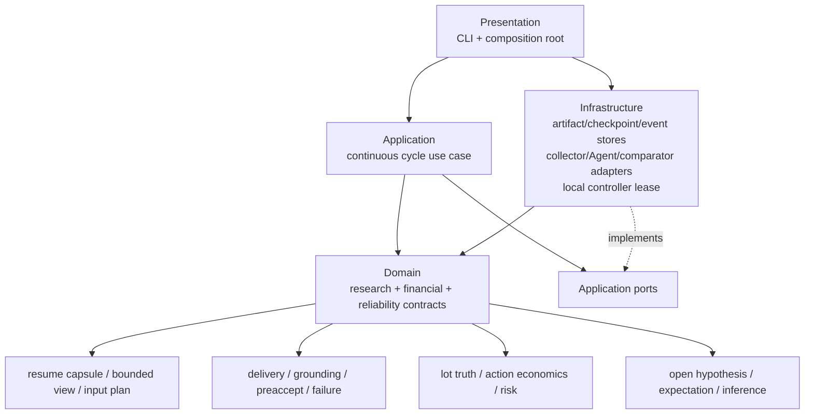

# 新窗口 Agent 可靠性、可恢复性与系统纠正报告

日期：2026-08-06  
项目：`/Users/wt/Documents/agent-trade-emotion`  
冻结代码基线：`codex/s0-research-foundation @ e400b64b8a986ceeb3312e4dd7e6749dc4239268`  
裁决范围：当前四层连续研究 successor；历史 v1.3、v1.4、E0、E0B 只读  
外部权限：无网络、无真实模型、无 automation 修改、无账户、无订单、无资金

## 1. 结论

历史系统在新窗口中的失败不是单一提示词问题，而是三种系统性缺陷叠加：权威状态与聊天窗口耦合、完整输入没有预算和交付收据、语义真实性检查晚于 write-once accept。E0B sample 163 因全量 packet 反复回灌总控并触发 context compaction，冻结恢复协议又没有“child 已返回而 controller 未收据化”的分支；v1.3 Cycle 17 则在结构校验通过并接受以后，才发现 120/144 条动作反事实沿用了上一轮仓位数值。两项实验依法失败关闭是正确结果，不能恢复或修补。

当前四层 successor 已对这些已知同类故障完成本地机械纠正：窗口恢复只认 self-digest capsule、manifest、checkpoint、事件链和内容寻址工件；Agent 调用前有精确输入预算；Agent 输出必须是完整 canonical object；当前周期、lot、动作和仓位事实在接受前统一 grounding；`STATE_ACCEPTED` 前必须存在 preaccept receipt；接收前、接收后和控制面失败拥有不同状态；新旧窗口并发接管同一 run 会被本地独占租约拒绝。

本次结果只达到 `LOCAL_RELIABILITY_CONTRACT_COMPLETE`。它证明本地合成主链能够阻断已知窗口迁移、截断、旧事实污染、部分提交、重复 Agent 调用和控制状态混淆；不证明真实模型 transport、长上下文服务质量、市场判断、预测、收益、跨 regime 泛化或生产稳定性。

## 2. 证据边界与冻结原则

### 2.1 本次实际读取

- `requirements/2026-07-30-theory-paper-practice.md`：历史运行、事故和权限边界；
- `THEORY_AND_EXPERIMENT_EVOLUTION_AUDIT_2026-08-05.md`：理论与实验演化裁决；
- E0B `HANDOFF.md`、冻结 manifest 和当前 checkpoint；
- v1.3 Cycle 17 accepted state、interruption receipt 和既有事故记录；
- 当前 Presentation / Application / Domain / Infrastructure 代码、ports、事件链和测试。

### 2.2 明确未做

- 未读取 E0B future outcome，未 evaluate sample 163；
- 未恢复、重试、补录或修改 E0B；
- 未改写 v1.3 Cycle 17 accepted 工件或继续 Cycle 18；
- 未恢复 v1.4、E0、E0A 或历史 automation；
- 未调用网络、真实模型、paper/live、账户、凭据、订单或资金接口；
- 未把本地合成 PASS 解释为市场有效、预测有效、盈利或生产就绪。

## 3. 两条取消故障链复原

### 3.1 E0B sample 163：窗口容量与恢复合同共同失效

权威冻结状态为：

- run：`native-codex-action-e0b-btcusdt-20260801T102202Z`；
- `completed_count=3`、`next_sample_index=163`、`role_output_count=18`；
- `event_head_digest=47171b3e...ff4e`；
- `terminal=false`、`NONE_E0`、`executable=false`；
- sample 163 没有正式 event、receipt 或 outcome access。

故障链：

1. 预检只验证 sample 160 的两动作 packet，长度为 `20,698 bytes`，没有验证全窗口最坏负载。
2. sample 163 Single packet 达到 `43,325 bytes`；13 次 spawn initial message 累计约 `593,432 characters`。
3. controller 同时保留完整 packet、角色输出、验证上下文和旧窗口聊天，使用量由 `217199/258400` 上升至 `241509/258400` 后发生 compaction。
4. child 输出曾在会话侧出现，但尚未形成 formal invocation receipt、六对象绑定或 event。
5. 冻结恢复协议只允许完整已收据状态恢复，没有“child 完成、controller 未接收”的合法分支。
6. 任何补录、缩包重试或重新调用都会改变冻结 transport 历史，因此 run 永久失败关闭于 3/32。

根因不是“Agent 不会推理”，而是 transport 设计将重复全量上下文、角色输出和控制状态放进一个有限聊天窗口，并把窗口内可见输出误当成可恢复事实。旧 handoff 虽声明聊天不是权威，却没有机器生成的有界输入计划、完整交付回执和中间阶段恢复 capsule。

### 3.2 v1.3 Cycle 17：接受边界早于语义真实性边界

故障链：

1. Cycle 17 的 PIT 采集、来源、raw SHA、closed-bar 和硬输入检查通过。
2. 唯一 Strategy Agent 形成动作与反事实；schema、依赖和 apply validator 返回 PASS。
3. 系统先执行 write-once accept，accepted state digest 为 `497702fd...bc0ef`。
4. 接收后的只读交叉复核才发现五个持仓标的共 `120/144` 条 `path_realization` 沿用了 Cycle 16 的 mark notional/open risk；MU 无持仓文本正确。
5. 另有六个 `dynamic_update_summary` 把“上一轮”错误写成 Cycle 17，而不是 Cycle 16。
6. 原 validator 只验证字段、引用、动作应用和硬风险，没有把自由文本中的 lot 数值和周期标签与当轮 pre-state/evaluation 机械交叉绑定。
7. 冲突发生在 accepted head 已推进以后，只能记录 `ACCEPTED_CYCLE_0017_ACTION_COUNTERFACTUAL_LOT_TRUTH_CONFLICT` 并永久中断，不能原地修补。

这里的核心失败是 `semantic false negative`：结构合法不等于金融事实正确；报告和 review 发现问题太晚，承担了本应属于 preaccept gate 的职责。

### 3.3 控制面删除失联

v1.3 中断后，对 heartbeat `v1-3` 连续四次请求 delete 均超时，本地配置仍显示 `ACTIVE`。这说明“已经请求删除”不能推出“实际已停止”。历史处理没有绕过控制面是正确的，但系统设计缺少：

- desired state 与 observed actual state 分离；
- 有期限 lease；
- kill switch；
- 幂等 command identity；
- 删除/暂停后的实际状态复核。

## 4. 可行性与稳定性裁决

| 层面 | 修复前裁决 | 当前本地裁决 | 仍未证明 |
|---|---|---|---|
| 新窗口冷启动 | 不可靠，容易依赖聊天摘要 | capsule + checkpoint + event chain 可恢复 | 真实 Codex 服务跨窗口 transport |
| 长上下文 | 全量历史随轮次增长 | 有界 active view + 完整历史 content-addressed refs | 真实 tokenizer、服务端最大输入和输出 |
| Agent 输出 | 会话可见不等于正式收据 | COMPLETE/STOP/非截断/canonical envelope 后才承认 | 外部模型 adapter 的真实收据质量 |
| 当轮仓位真实性 | 自由文本可沿用旧数值 | lot truth digest + evaluator 重算 + grounding 拒绝旧叙述 | 真实交易所仓位与账本对账 |
| 接受原子性 | report/review 可能首次发现冲突 | preaccept receipt 在 `STATE_ACCEPTED` 之前 | 进程/文件系统故障之外的分布式事务 |
| 接收后恢复 | 恢复路径可能重新调用 Agent | 只重放确定性尾部，Agent 重入禁止 | 真实外部 comparator/data sink 的幂等性 |
| 并发窗口 | write-once 只能晚期发现竞争 | 本地 OS 独占锁 + lease state 先阻断 | 跨主机分布式 lease |
| 控制状态 | desired 与 actual 可混淆 | 本地 durable reconciliation 分离两者 | 真实 Codex automation control plane |

因此，当前系统设计在“单机、本地、不可执行、合成 adapter、同一文件系统”边界内可行；在真实模型和真实控制面接入前仍是 NO-GO。

## 5. 已知问题台账与纠正

| ID | 已知问题 | 影响 | 纠正 | 当前状态 |
|---|---|---|---|---|
| W01 | 聊天/摘要被用作跨窗口补全 | 状态污染、不可复现 | resume capsule 明确 `chat_history_is_authority=false` | 本地关闭 |
| W02 | 每轮复制完整历史 | 必然达到窗口上限 | 有界非终态 view，完整历史只用 digest/ref | 本地关闭 |
| W03 | 预检不是当前精确 payload | 最坏 packet 未被测到 | 每次调用前对精确 canonical context 生成 input plan | 本地关闭 |
| W04 | 截断输出可能被当作完成 | 部分 JSON/语义进入系统 | complete delivery envelope + output byte gate | 本地关闭 |
| W05 | Agent 已返回但 controller 尚未写事件 | 新窗口可能重复调用 Agent | adapter 返回前先写 durable transport record；事件链识别已封存 proposal/deliberation | 本地关闭 |
| W06 | 当前周期/上一周期标签混用 | 叙述与时点错误 | current/prior label grounder | 本地关闭 |
| W07 | 旧 lot 数值进入反事实文本 | 金融真实性失效 | current position truth digest、结构化重算、禁止未绑定仓位数值叙述 | 本地关闭 |
| W08 | accept 先于完整语义核验 | 冲突只能中断整个 run | mandatory preaccept validation receipt | 本地关闭 |
| W09 | checkpoint 缺少自身完整性绑定 | 新窗口无法证明状态未漂移 | checkpoint schema 1.1 self-digest | 本地关闭 |
| W10 | 接收前部分写入缺少类型 | 可能重试不安全阶段 | typed failure + event cursor + failed-closed partial commit | 本地关闭 |
| W11 | 接收后中断可能重新调用 Agent | 同一周期产生第二判断 | postaccept state + deterministic-tail-only recovery | 本地关闭 |
| W12 | 两个窗口同时接管同一 run | 重复采集/重复模型调用 | LocalRunLease 独占锁；异常退出持久化 PAUSED/kill switch | 本地关闭 |
| W13 | delete requested 被误当成 deleted | 旧控制器可能继续运行 | desired/actual reconciliation + idempotency key | 本地契约关闭，真实控制面未接入 |
| W14 | 真实模型 token/transport 未验证 | 仍可能发生服务端截断或超时 | Phase B 必须做无市场、无执行的 transport dry run | 未评估，非本轮授权范围 |

“本地关闭”表示代码和故障注入已经阻断该失败模式，不表示历史 run 被修好。历史 W01–W13 证据保持不可变。

## 6. 纠正后的四层架构



架构仍只有四层。resume、Agent、数据源、存储和控制器都不是第五层；它们分别是 Domain contract、Application port 或 Infrastructure adapter。

### 6.1 Presentation

唯一职责：解析 CLI 参数、选择本地 adapter、确定 run root、先取得 LocalRunLease，再调用 Application use case。它不判断市场、不修改风险规则、不生成假说。

主要模块：

- `presentation/continuous_fixture_composition.py`
- `presentation/single_agent_research_cli.py`

### 6.2 Application

唯一职责：按事件顺序编排一个 cycle，调用 ports，维护候选 staging 与 accepted boundary，选择恢复分支。它不实现交易公式，不直接导入 Infrastructure。

主要模块：

- `application/continuous_fixture.py`
- `application/continuous_cycle.py`
- `application/ports.py`

### 6.3 Domain

唯一职责：纯函数定义并校验研究、金融和可靠性不变量。

主要 owner：

- `dynamic_research.py`：市场 snapshot、情绪、开放假说、expectation；
- `epistemic_inference.py`：公开、来源绑定的完整推论；
- `portfolio_truth.py`：逐 lot 真值；
- `research_integrity.py`：动作全集、金融重算、选择与 review；
- `window_reliability.py`：capsule、输入计划、交付、grounding、preaccept、failure、controller contract。

### 6.4 Infrastructure

唯一职责：实现文件、事件、checkpoint、合成 collector、合成 Agent、comparator、review source 和本地 lease。

主要模块：

- `infrastructure/continuous_fixture.py`（含返回前持久化 transport 和本地 lease）
- `infrastructure/research_cycle_store.py`
- `infrastructure/research_review_repository.py`

## 7. Ports 与对象所有权

| Port / 对象 | 唯一 owner | 关键输入 | 关键输出 |
|---|---|---|---|
| `ContinuousArtifactPort` | Infrastructure artifact repository | relative ref、document、digest field | semantic + physical binding |
| `ContinuousCheckpointPort` | Infrastructure checkpoint repository | run/cycle、typed failure | self-digest durable checkpoint |
| `ResearchCycleStorePort` | Infrastructure event store | exact next event、payload binding | write-once event/receipt |
| `FixtureMarketCollectorPort` | collector adapter | run/cycle/PIT time | typed facts/UNKNOWN |
| `FixtureStrategyAgentPort` | Agent adapter | 一个 sealed context 或 evaluation | complete delivery envelope |
| `FixtureComparatorPort` | comparator adapter | accepted state | source-bound review row |
| `FourCycleReviewSourcePort` | review repository | run/through cycle | verified rows + receipt digests |
| `accepted head` | deterministic checkpoint reducer | preaccept PASS + accepted artifact | one current accepted digest |
| `lot truth` | deterministic financial Domain | pre-state lots/account | normalized quantity/notional/risk digest |
| 市场解释/新假说 | Strategy Agent | bounded complete context | proposal/inference/deltas |

Agent 的能力被最大化在认知域，而不是权限域：它可以提出新机制、新方向、假说和 expectation，解释矛盾证据并从合法全集选择；它不能修改 PIT、来源、仓位真值、费用、保证金、风险、事件顺序、accepted head 或外部执行权限。

## 8. 新窗口生命周期

```mermaid
sequenceDiagram
    participant W as New Window
    participant P as Presentation
    participant C as Checkpoint/Event Store
    participant A as Application
    participant G as Deterministic Gates
    participant M as Strategy Agent Adapter

    W->>P: run_id + through_cycle
    P->>C: acquire exclusive local lease
    P->>C: verify manifest/checkpoint/capsule/event chain
    C-->>A: exact next cycle + sealed stage cursor
    A->>G: build/load PIT snapshot and bounded context
    G->>G: exact input plan and budget preflight
    alt proposal not sealed
        A->>M: one exact context
        M-->>G: complete delivery envelope
    else proposal sealed
        A->>C: load proposal + delivery receipt
    end
    G->>G: action economics + lot truth + current-cycle grounding
    alt deliberation not sealed
        A->>M: sealed evaluation set
        M-->>G: complete deliberation envelope
    else deliberation sealed
        A->>C: load deliberation + delivery receipt
    end
    G->>G: preaccept atomic validation
    G->>C: STATE_ACCEPTED
    C->>C: POST_ACCEPT_FINALIZATION
    A->>C: deterministic comparator/report/review/completion
    C->>C: advance checkpoint + create next capsule
    P->>C: persist PAUSED + kill switch; release lease
```

### 8.1 状态机

```mermaid
stateDiagram-v2
    [*] --> READY_FOR_CYCLE
    READY_FOR_CYCLE --> PRE_ACCEPT_RECOVERABLE_FAILURE: input budget or incomplete delivery
    PRE_ACCEPT_RECOVERABLE_FAILURE --> POST_ACCEPT_FINALIZATION: continue only unsealed stage; preaccept PASS
    READY_FOR_CYCLE --> PRE_ACCEPT_FAILED_CLOSED: grounding, semantic, or partial commit conflict
    PRE_ACCEPT_RECOVERABLE_FAILURE --> PRE_ACCEPT_FAILED_CLOSED: retry conflicts with sealed bytes
    READY_FOR_CYCLE --> POST_ACCEPT_FINALIZATION: preaccept PASS + accepted state + action receipt
    POST_ACCEPT_FINALIZATION --> POST_ACCEPT_RECOVERABLE_FAILURE: deterministic tail interruption
    POST_ACCEPT_RECOVERABLE_FAILURE --> POST_ACCEPT_FINALIZATION: replay deterministic tail only
    POST_ACCEPT_FINALIZATION --> RUNNING_OUTCOMES_SEALED: completion receipt advances head
    PRE_ACCEPT_FAILED_CLOSED --> [*]
    RUNNING_OUTCOMES_SEALED --> READY_FOR_CYCLE: next boundary capsule
```



旧 `AWAITING_SINGLE_AGENT_DECISION_OUTCOMES_SEALED` 仍作为兼容读取状态存在；新本地流程不再仅为“打开 cycle”改写 checkpoint，因为这会使刚生成的 origin capsule 立刻失去 checkpoint digest 绑定。精确的 cycle 内游标由已验证的 write-once event chain 提供。

## 9. 核心数据契约

### 9.1 `cross_window_resume_capsule` 1.0

必须包含：

- run、completed/next cycle、checkpoint status；
- manifest/checkpoint 的 semantic digest、physical SHA 和 relative ref；
- 上一 accepted head、completion receipt 和完整历史 refs；
- 当前阶段已封存 refs 或允许读取的 current-cycle 路径集合；
- forbidden prefixes：future、outcome、account、order、credential；
- authority、resume mode、Agent 重入政策；
- `chat_history_is_authority=false`、`future_outcome_access=false`。

边界 capsule 绑定未变的 checkpoint；失败或 postaccept checkpoint 改变后，生成以新 checkpoint digest 命名的 recovery capsule。终止状态 capsule 可以审计，但 `resume_allowed=false`。

### 9.2 `agent_input_delivery_plan` 1.0

对精确 Agent context 逐节记录：

- required；
- inline 或 content-addressed ref；
- canonical/wire byte length；
- section digest；
- full context bytes、input/output budgets；
- 真实模型时必须提供 tokenizer ID、measured tokens 和 max tokens；
- synthetic 时明确 token measurement 不适用，而不是伪造 token 值。

任一必需节缺失、禁止字段出现、byte/token 超限都发生在 Agent 调用之前。

### 9.3 `complete_agent_delivery_receipt` 1.0

只有以下条件同时满足才承认 Agent 输出：

- `delivery_status=COMPLETE`；
- `finish_reason=STOP`；
- `truncated=false`；
- `complete_json_object=true`；
- run/cycle/input/schema 全部匹配；
- payload canonical digest 和 byte length 匹配；
- delivery 明确绑定返回前已持久化 transport record 的相对路径、语义 digest、物理 SHA-256，并声明 `durable_before_adapter_return=true`；
- 未超过 output budget。

proposal 与 deliberation 各自把完整 delivery receipt 同时嵌入自身 payload 并写成独立内容寻址工件；二者相互一致，proposal/deliberation 的 artifact digest 因而直接承诺 transport record 的路径、语义 digest 与物理 SHA-256。新窗口可以机械加载和复核，不能凭会话可见文本补写。

此外，本地 Agent adapter 在把 delivery 返回 Application 之前，先写入 `synthetic_durable_transport_delivery`；Application 在任何 proposal attempt/event 之前复核记录内容、语义 digest、物理 SHA-256 与返回 delivery 一致。若 controller 在收到返回值后、写 proposal event 前崩溃，新窗口以同一 input digest 调用 adapter 时只读取既有 transport record，不重新生成 Agent 输出。这是对 E0B sample 163“child 已返回、controller 未收据化”缺失分支的直接本地纠正。真实 provider adapter 必须提供等价的 durable receipt、幂等 invocation 或可查询结果，否则不得进入 Phase C。

### 9.4 `current_cycle_semantic_grounding_receipt` 1.0

接收前机械确认：

- proposal、inference、evaluation、deliberation、selection 属于同一 run/cycle；
- dynamic update 的 previous cycle 精确等于 `current-1`；
- 当前决策叙述不能把旧 cycle 标签当成当前事实；
- candidate 和每个 path outcome 都带 current `source_cycle_index`；
- outcome 绑定 current `position_truth_digest`；
- target lot 必须存在于当前 lot truth；
- quantity delta、动作尺度、fill、fee、margin、notional、mark-to-stop risk、leverage 和 cap 由 evaluator 重算；
- Agent 公开文本中出现未绑定的 mark notional/open risk/remaining quantity/CORE 数字即拒绝；未知 lot ID 即拒绝。

系统不尝试从自由文本猜数值。凡仓位金融事实必须来自结构化 evaluator；文本只允许引用 digest 或描述机制。

### 9.5 `preaccept_atomic_validation_receipt` 1.0

在 `STATE_ACCEPTED` 前同时绑定：

- resume capsule；
- input plan 和 Agent context；
- proposal delivery/proposal；
- public inference；
- action evaluation；
- deliberation delivery/deliberation；
- selection、risk decision、decision；
- current-cycle grounding。

只有 `verdict=PASS`、risk approved、两次 Agent delivery complete、grounding PASS 才授权 accepted head mutation。report 和 review 不再承担首次语义验收。

### 9.6 `typed_reliability_failure` 1.0

失败类型与恢复权：

| 类型 | `resume_allowed` | 恢复点 |
|---|---:|---|
| input budget / required section | true | 相同 sealed context，调整合法预算后再调用尚未调用的阶段 |
| Agent delivery incomplete/output over budget | true | 相同 sealed input，只重试未形成完整 receipt 的阶段 |
| current-cycle grounding/preaccept | false | 当前 run 失败关闭；不得换字节重试 |
| partial proposal commit | false | 当前 run 失败关闭；不得重复调用已发生的 Agent |
| postaccept deterministic tail | true | accepted state 不变，只继续 deterministic tail |
| controller divergence | false for run permission | pause/delete/actual verification 收敛前不得运行 |

每个 failure 是 self-digest 工件；checkpoint 保存 last failure ref/digest、count 和明确状态。

### 9.7 `controller_desired_actual_reconciliation` 1.0

记录 desired、actual、expected actual、lease、expiry、kill switch、run permission、next action 和 idempotency key。`desired=DELETED / actual=ACTIVE` 必须输出不收敛和重新幂等删除，不得报告“已删除”。

本地 adapter 还实现：

- 同一 run 的 OS 独占文件锁；
- RUNNING 时 5 分钟 lease snapshot；
- 命令 receipt write-once；
- current observation 原子更新；
- 正常或异常退出都持久化 `PAUSED/PAUSED/kill_switch=true` 后释放锁。

该控制器只覆盖同一机器、同一文件系统的 fixture，不控制 Codex automation。

## 10. 接受事务与恢复矩阵

### 10.1 事务边界

1. capsule、PIT、context、proposal、inference、evaluation、deliberation、decision 都先进入 candidate staging；
2. 每个 staging artifact 必须先写入，再由严格顺序事件绑定；
3. grounding 与 preaccept receipt 是最后两个接收前门；
4. 只有随后才能产生 `STATE_ACCEPTED`；
5. action receipt 只声明本地不可执行的模拟应用；
6. checkpoint 进入 postaccept 后，Agent 永久退出该周期；
7. comparator、review source、evidence receipt、report、scheduled review 和 completion 都是确定性尾部；
8. completion receipt 才能推进 checkpoint 并生成下一 cycle capsule。

### 10.2 精确恢复规则

| 中断位置 | 新窗口动作 | 是否再次采集 | 是否再次调用 proposal | 是否再次调用 deliberation |
|---|---|---:|---:|---:|
| cycle boundary | 验 manifest/checkpoint/capsule 后开始 | 是 | 是 | 是 |
| context 已封存、input budget 失败 | 加载 sealed snapshot/context | 否 | 是 | 是 |
| proposal delivery 截断、无 proposal receipt | 加载 sealed context，重试 proposal | 否 | 是 | 是 |
| proposal 已封存、deliberation 截断 | 加载 sealed proposal/evaluation | 否 | 否 | 是 |
| grounding/preaccept 冲突 | 当前 run 永久失败关闭 | 否 | 否 | 否 |
| accepted 后 comparator 中断 | 加载全部 sealed artifacts，只续尾部 | 否 | 否 | 否 |
| completion 后新 cycle | 使用下一 boundary capsule | 下一轮才是 | 下一轮才是 | 下一轮才是 |

## 11. 动态开放性与窗口稳定性的兼容

有界输入不等于收窄研究空间。当前做法是：

- 完整历史 registry/ledger/belief/accepted state 永久保存并由 digest/ref 绑定；
- Agent inline 看到所有非终态高优先假说、开放 expectation、近期关闭 expectation、active evidence 和 accepted summary；
- 超出 active view 的条目不丢弃，使用 content-addressed full-history refs；
- Agent 若要依赖省略项，必须先按 ref 取回，不允许从聊天记忆补齐；
- 假说语义、机制家族和方向仍开放；active budget 只限制当前注意力，不限制历史增长；
- 公开推论继续同时记录支持、反证、UNKNOWN、金融机制、失效条件和下一观察。

这使“动态开放”与“上下文有限”不再对立：开放性存在于持久研究状态，窗口只承载当前必要工作集。

## 12. 金融基础与谨慎推论

纠正没有把市场判断交给模板化指标，也没有把全部权限交给 Agent。

- 市场事实保持 PIT、source、available_at、lineage、quality 和 UNKNOWN；
- 订单簿快照不被解释为严格流动性韧性；
- 公共 OI/funding/L-S proxy 不被解释为个体身份或真实开平仓角色；
- 缺失 liquidation 不补零；
- 情绪继续是多维序数、覆盖率和分歧，不输出未校准概率、sum-to-100 或 EV；
- 每个动作在相同 lead/runner-up/OTHER 路径下比较；
- quantity、notional、fee、slippage、margin、leverage、stop risk 和 cap 只由确定性金融内核计算；
- WAIT 必须有理由、机会成本、下一观察和 next review；
- Agent 可以改变假说、预期和动作偏好，但不能改写当前 lot truth。

## 13. 验证结果

### 13.1 已实际通过的故障注入

17 项专门测试覆盖：

1. 两次独立 composition 调用从 Cycle 2 capsule 恢复并完成 Cycle 3–4；
2. capsule 与当前 checkpoint digest 绑定，聊天不是权威；
3. input bytes 超限在 Agent 调用前停止；
4. 必需 context section 缺失被拒绝；
5. proposal 截断不形成 proposal/accepted state；
6. deliberation 截断后只重试 deliberation，不重新采集或重新 proposal；
7. Cycle 17 风格旧 lot notional/risk 叙述在 accept 前拒绝；
8. 旧仓位数值出现在 public inference 时同样拒绝；
9. 上一周期标签误用在 accept 前拒绝；
10. proposal attempt 已封存但 proposal 写入失败时永久失败关闭；
11. Agent delivery 已返回并持久化、但 controller 在 proposal event 前崩溃时，新窗口从 transport record 恢复且不重新生成 proposal；
12. Agent 返回的 transport 物理 SHA 与已持久化记录不一致时，在 proposal attempt 和 accept 前拒绝；恢复读取正确记录且不重新生成 proposal；
13. postaccept comparator 中断形成 typed recoverable failure；
14. postaccept 新窗口恢复不重新采集、不重新 proposal、不重新 deliberate；
15. failed-closed run 不能被新窗口再次启动；
16. desired delete 与 actual active 不会被误报为收敛；
17. 本地控制 receipt 可持久验证，并发窗口被独占 lease 拒绝，退出后状态为 PAUSED + kill switch。

### 13.2 回归

- 新窗口可靠性 + 连续主链：`22` 项通过；
- 动态研究、公开推论、连续主链与研究完整性聚焦：`23` 项通过；
- Theory Paper V2 全范围：`292` 项通过；
- `compileall` 通过；
- `git diff --check` 通过；
- 四层依赖测试新增 `domain/window_reliability.py`，Domain 不能导入 Application/Infrastructure/Presentation。

这些结果是结构、契约和本地过程证据，不是市场结果证据。

## 14. 扩展结构

未来接入真实能力时只允许替换 Infrastructure adapter：

```text
trade_system/theory_paper_v2/
├── presentation/
│   └── continuous_fixture_composition.py
├── application/
│   ├── ports.py
│   ├── continuous_cycle.py
│   └── continuous_fixture.py
├── domain/
│   ├── dynamic_research.py
│   ├── epistemic_inference.py
│   ├── portfolio_truth.py
│   ├── research_integrity.py
│   └── window_reliability.py
└── infrastructure/
    ├── continuous_fixture.py
    ├── research_cycle_store.py
    ├── research_review_repository.py
    ├── model_adapter/          # Phase B 才允许新增
    ├── market_data_adapter/    # 需新的公开数据授权
    └── controller_adapter/     # 真实控制面需单独授权
```

不得在 Domain 增加 provider SDK，不得让 Agent adapter 直接写 checkpoint，不得让 report builder 改 accepted state，也不得把新能力扩张成通用 Agent 平台。

## 15. 三阶段路线与验证门

### Phase A：本地可靠性合同

状态：已完成。

通过门：上述 292 项回归、17 项故障注入、compile 和 diff check。允许用途仅为本地设计验证和继续代码审查。

### Phase B：真实模型 transport dry run

状态：未授权、未执行。

唯一建议范围：无市场结果、无交易、无 automation 的一次跨窗口 transport 演练。必须：

- 使用固定非市场 synthetic payload；
- 注册真实 tokenizer/model context limits；
- 测试最坏输入和最坏输出，不用平均样本；
- 每个调用有 provider receipt、timeout、complete-object 验证；
- 在 proposal 后、deliberation 后、postaccept 三处主动中断并换新窗口；
- 证明已封存阶段零重复调用；
- 任何差异即失败关闭，不进入市场实验。

### Phase C：全新未见市场研究

状态：NO-GO，需用户另行授权。

前置门：Phase B 通过、冻结新 manifest、来源/PIT 计划、评价方法和终止规则，并明确仍为不可执行本地研究。历史 v1.3/E0B 不得作为可恢复 run。

## 16. Frozen legacy 策略

- v1.3 Cycle 17 保留 accepted 冲突和 interruption receipt，不更正旧文本；
- v1.4 保持冻结，不作为当前写入口；
- E0/E0A/E0B 保持历史诊断，sample 163 不补录、不重试、不 evaluate；
- legacy mutation commands 继续拒绝并指向新 continuous fixture；
- Core v2.1 权威不变，V3 仍是待审候选；
- 当前 successor 不继承旧 automation ID、旧窗口摘要或旧模型角色 transport；
- 若未来开始新市场研究，只能使用新 run ID、新 chronology、新 frozen contract。

## 17. 剩余未知与最终裁决

仍为 `UNKNOWN_NOT_EVALUATED`：

- 真实模型是否在最大 context 下稳定返回完整对象；
- provider timeout、rate limit、重试和 receipt 的真实语义；
- 跨机器或分布式 controller lease；
- 真实 Codex automation 的 desired/actual reconciliation；
- 真实数据源中断、延迟和 schema drift；
- 市场预测、增量决策价值、成本后收益、跨 regime 泛化；
- paper/live 和生产安全。

最终裁决：

`KNOWN_NEW_WINDOW_FAILURE_MODES_CLOSED_IN_LOCAL_SUCCESSOR / HISTORICAL_FAILED_RUNS_IMMUTABLE / DYNAMIC_OPEN_RESEARCH_PRESERVED / REAL_MODEL_AND_MARKET_VALIDITY_UNKNOWN / NO_GO_EXTERNAL_EXPERIMENT_OR_EXECUTION`
