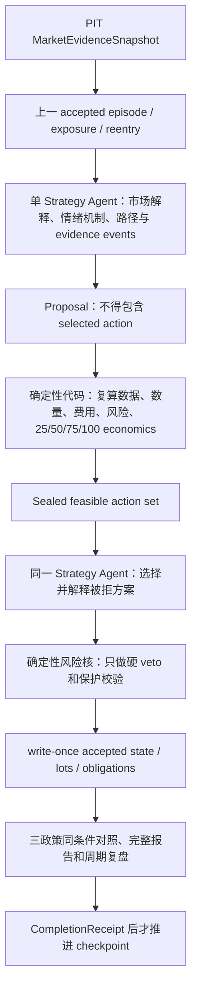

# 市场研究理论与系统实验完整演化审查

> 文档状态：`COMPLETE_REVIEW_PACKAGE`
>
> 截止日期：2026-08-05（Asia/Shanghai）
>
> 审查基线：Git HEAD `3a5af6a0e5e2aff84b482f7e44d03d8153d99196`
>
> 当前理论权威：`CORE_TRADING_THEORY_v2_1.md`
>
> 当前运行理论候选：`CURRENT_RESEARCH_THEORY_v3_DRAFT_FOR_REVIEW.md`，状态仍为 `DRAFT_FOR_USER_REVIEW`
>
> 当前实验权限：`NONE`；所有 prospective 实验均已封存，本文不授权 automation、paper/live、账户、凭据、订单或资金操作

## 1. 总结论

本项目目前不能裁定为“完整理论失败”，也不能裁定为“理论已经有效”。能够成立的最严格结论是：

1. 原始研究思想中“极端压力以后区分继续失衡、吸收修复、反弹延续与衰竭”的核心方向具有研究价值；SNDK V1 在一个已见样本中事前识别并完成了一段有限区间反弹，证明这部分能够生成有价值的候选路径。
2. V1 实际实现的不是用户希望验证的完整连续理论，而是固定期限、固定目标、无核心仓位、无持续战略状态、无动态退出和无重入义务的离散交易生成器。SNDK 后续机会丢失首先是理论形式化失败，随后才是状态、动作、执行和评价失败。
3. Theory Agent V2、seen-V1 和三代 prospective 运行逐步证明了部分结构能力：点时数据、状态连续、CORE/TACTICAL、动态保护、局部重入、三政策对照和成本账本可以运行。但它们也持续暴露出 Agent 被固定 runner、模板、预选动作、伪概率和不完整事件链限制的问题。
4. 截至本报告，最接近用户真实目标的是 `CURRENT_RESEARCH_THEORY_v3_DRAFT_FOR_REVIEW.md`：单个 Strategy Agent 负责多时间尺度解释、情绪机制、竞争路径和可行域内选择；确定性代码负责点时边界、复算、状态提交、风险、成本和执行安全。它是当前最终理论候选，不是已经批准的最终权威。
5. 根因重构已经通过 257 项 Theory Paper V2 聚焦测试，但尚未在新的完整未见顺序窗口中产生 terminal 原始结果。因此，当前证据只支持“结构性修复已实现”，不支持“预测有效、风险调整盈利、优于基准或生产可用”。

当前唯一正确状态是：继续暂停实验，先由用户审查并冻结最终理论；确认后再建立全新 genesis 和全新未见窗口，不能续跑 v1.4 Cycle 5。

## 2. 本报告的范围、口径与证据等级

### 2.1 覆盖范围

本报告覆盖当前权威链中可识别的全部重要研究和系统实验族：

- 原始研究思想到 Core Theory v1.0–v2.1 的理论迭代；
- January/February 数据与可观测性诊断；
- research-system、PIT authority、HAR 数据授权与纯合成门；
- V1 六市场纸面实验及 SNDK 事故；
- Theory Agent V2 的 E0、E0A、E0B；
- historical continuous P0、seen-V1 diagnostic、Single Agent v1.1 和 guided v1.4；
- prospective 的两次启动失败、首个 14-cycle 前缀、v1.3、v1.4；
- 2026-08-05 根因重构和当前 v3 理论候选。

低层单元测试、临时预检和 transport 试验不逐条列出每一个测试用例，但按实验族记录其目标、事实、错误、结论和证据权限。本文没有读取任何封存运行的 future outcome。

### 2.2 证据等级

| 等级 | 定义 | 可以支持 | 不能支持 |
|---|---|---|---|
| `A-DURABLE` | write-once/终态工件、checkpoint、receipt、原始结果可直接核验 | 该运行实际发生了什么 | 跨窗口泛化、盈利能力 |
| `B-RECOMPUTABLE` | 历史原始记录或结果可复算，但窗口已见 | 错误诊断、机制和反事实比较 | 未见预测有效性 |
| `C-PROSPECTIVE_PREFIX` | 事前冻结并顺序运行，但未到 terminal | 已完成前缀中的实际行为 | 完整实验终局和未结 lot 结果 |
| `D-STRUCTURAL` | 合同、合成样本、本地测试或 Agent 输出结构 | schema、状态机、风险/事件不变量 | 市场有效、交易改进、盈利 |
| `UNKNOWN` | 数据缺失、权限不足或未运行 | 保持未知并形成下一步数据需求 | 补零、推定通过或推定失败 |

### 2.3 重要来源限制

Core Theory 声明的原始研究输入是 `/Users/wt/Downloads/deep-research-report (1).md`，但该文件目前不在可读取位置。因此，本文对“原始理论”的还原严格来自 `CORE_TRADING_THEORY_v2_1.md` §1.4 的权威提炼表和版本变更记录，而不是对原始文件逐字复审。凡无法从现有权威材料确认的原始措辞均不作推定。

## 3. 原始理论如何变化为当前研究理论

### 3.1 原始思想的可确认骨架

从 Core Theory 的权威提炼记录，可以确认原始思想大致围绕以下问题：

- 极端情绪或压力之后，行情是继续失衡还是开始修复；
- 当前、上方和下方的承接与抛压如何变化；
- 主动买卖、OI、funding 和强平能否解释多空进攻、撤退与拥挤；
- “恐慌/贪婪系数”及其变化能否描述市场情绪；
- 4H、15m 和微观执行如何协同；
- 下方吸收、当前确认、上方止盈以及试探—确认—趋势加仓；
- 通过持续调权重和阈值提高胜率。

其中有价值的是动态供需、压力—冲击—韧性、跨周期和路径比较；需要纠偏的是不可观测的人数/心理归因、单一情绪分数、OI 的方向化解释、胜率至上和运行中调参。

### 3.2 原始思想到 Core Theory 的逐项变化

| 原始思想 | 保留内容 | 纠偏或删除 | 当前处理 |
|---|---|---|---|
| 极值后观察继续失衡或修复 | 极值能创建需要持续观察的市场 episode | 极值本身不是交易信号 | 研究压力、冲击、韧性和后续响应 |
| 当前/上方/下方承接与抛压 | 价格坐标上的成交和订单簿可分区观察 | OI、funding、账户比不能伪造逐价位归属 | 仅对有价格坐标的数据建立冻结区间 |
| 开多/平多/开空/平空人数 | 保留“参与和拥挤发生变化”的问题 | 公开市场数据无法识别真实人数和身份 | 改用 D/L/C/F/R 可观测代理，并明确不可识别边界 |
| OI 配合主动流判断进攻与撤退 | OI 变化可描述杠杆参与度变化 | OI 本身没有方向，不可单独判多空开平 | `L=Δlog(OI)` 保持无方向，联合其他观测推断 |
| 恐慌/贪婪系数 | 保留压力水平、斜率、冲击变化 | 删除手工合成的单一心理真值分数 | 以多维机制和消融检验增量价值 |
| 多时间尺度 | 保留背景、定位、执行分工 | 禁止短周期噪音直接否定长期战略 | 战略/战术/执行三层权限隔离 |
| 吸收—确认—止盈 | 保留为可证伪路径 | 单次反弹或深度快照不能等同吸收 | 要求持续压力、边际冲击下降、补单恢复及随后响应 |
| 试探—确认—趋势加仓 | 保留仓位逐步建立的思想 | 早期 V1 为降低风险只实现 PROBE，且主动放弃趋势延续 | 后续恢复 CORE/TACTICAL、加仓比较和趋势路径，但必须受风险与成本约束 |
| 提高胜率 | 胜率可作描述指标 | 胜率不能替代成本后收益、尾部和回撤 | 比较成本后结果、机会差、路径捕获和风险调整表现 |
| 持续调权重和阈值 | 保留持续研究与版本迭代 | 禁止根据近期 outcome 在线追涨杀跌式调参 | 事前冻结、未见窗口、对照、复盘后另版修改 |

### 3.3 Core Theory 的版本演化

| 版本 | 日期 | 核心变化 | 当时证据权限 |
|---|---:|---|---|
| v1.0 | 2026-07-22 | 将“人数/恐慌贪婪系数”重构为五因子流量—冲击—韧性理论；加入数据、证据、可证伪和风险治理 | 理论基础 |
| v1.1 | 2026-07-22 | 冻结 7 天前瞻采集、G1、outcome-free episode/state/protocol 和 PASS-G1-only finalizer | 研究合同 |
| v1.2 | 2026-07-22 | 修复 episode terminal/cooldown；使用 1 秒时钟；分离 development/holdout；加入反事实动作和四路径标签 | 研究合同 |
| v1.3 | 2026-07-22 | 废止不一致 Protocol v1；v2 限定 PROBE-only；对齐 H-001–004、G2、闭合 UTC 4H 和证据归档 | 受限 PROBE 研究 |
| v1.4 | 2026-07-23 | 区分严格 post-pressure `R` 与同步 proxy；极值直反只作 control；强化 seen/holdout/cohort 边界 | 测量纠偏 |
| v1.5 | 2026-07-23 | 建立 development/calibration/holdout chronology；登记 January 负面诊断和 February 条件性数据失败 | 证据治理 |
| v1.6 | 2026-07-23 | 新增 future-only RSI-MTF-DLR-PM v0.1 草案 | E0 草案，不授权交易 |
| v2.0 / A4–A4c | 2026-07-23 | RSI-MTF-DRL-PM v0.2；方向独立确认、lane clocks、control-indexed EntryZone、cohort/序列化/风险账本 | E0 草案/返工 |
| v2.0-P0-RSI-01/02 | 2026-07-23 | 理论门、合同门和纯合成 primitive 门通过 | 仅合同/合成验证 |
| v2.1 | 2026-07-26 | 广义多视角竞争机制、稳定对象、OTHER、证据事件生命周期、非定长偏序和效用收据 | 当前 Core 权威；不扩大 V1 或交易权限 |

这个演化解决了“什么可以被知道、如何被证伪、如何避免前视”，但没有自动解决“完整理论如何编译成每轮连续仓位决策”。后一个缺口直到 SNDK 事故后才被明确识别。

## 4. 理论到系统的迭代主线

| 阶段 | 系统实际优化的对象 | 获得的能力 | 新暴露的根本问题 |
|---|---|---|---|
| V1 固定规则 | 一笔有限期限的区间反弹交易 | PIT、固定几何、风险门、可审计成交 | 完整理论被缩成静态目标交易；没有连续战略状态和重入 |
| Theory Agent V2 / cluster | 输出结构、挑战覆盖和审查质量 | 多角色审查、结构化路径与风险字段 | Agent 平台/transport 成为主因；动作几乎不分化，偏离市场研究目标 |
| continuous P0 | 三政策连续状态与同条件对照 | 状态/账本/成本/机会差可复算 | 固定 runner 把 Agent 限制为 16 次 WAIT，增量价值为零 |
| seen-V1 diagnostic | 在历史 V1 数据上检验已知问题 | CORE/TACTICAL、动态保护、重入合同、逐 bar 执行 | 已见窗口、资金费缺失、Agent 机制仍不可靠 |
| Single Agent v1.1 | 单 Agent 完整决策，不用 cluster | 状态连续、动态 geometry、保护与动作忠实 | 所有新风险 lot 止损、0 个重入履约、新闻不可见、机会捕获失败 |
| guided v1.4 | 加强理论说明和情绪数据 | 主动动作、正策略归因、新闻可见、CORE 保留 | 仍是 seen；未证明重入；明显落后静态持有 |
| prospective v1 | 新的 24h/1h/4h 顺序纸面前缀 | 真实状态连续、核心/战术、重入、成本账本 | 强制概率、重复证据、模板动作、代理和执行偏差；网络中断 |
| prospective v1.3 | 针对前述问题的 successor | 16 个完整 clean cycles、动作显著分化 | Cycle 17 接受后 lot truth 冲突；验证器未捕获，必须失败关闭 |
| prospective v1.4 | fresh genesis 和更强指导 | 4 个 PIT 周期、真实开/止损/局部减持 | selected-first、模板化反事实、belief 任意变化、事件链/复盘缺失 |
| 当前根因重构 | 让 Agent 真分析、代码只执行硬边界 | evidence reducer、无选择评估、独立 selection、事件链和 completion | 只有结构测试，尚无 fresh unseen 市场结果 |

## 5. 全部实验总登记

### 5.1 实验总表

| 编号 | 实验/运行 | 类型与完成度 | 主要结果 | 正确结论 | 证据级别 |
|---|---|---|---|---|---|
| X01 | January 2025 COIN-M `BTCUSD_PERP` diagnostic | 已见数据诊断 | `bookDepth` 为约 30 秒聚合深度；无候选交易；候选 log loss/Brier 未优于 D-only；状态覆盖集中 | `SEEN_DEVELOPMENT + NEGATIVE_DESCRIPTIVE + INCONCLUSIVE_COVERAGE` | B |
| X02 | February fragment | 已见、永久删失 | 23 分钟 bookDepth 缺口 | `SEEN + WAIT_DATA_NOT_SCORED`；不能回填并重标未见 | B/UNKNOWN |
| X03 | research-system reconstruction / V5-M00 / dynamic hypothesis graph P0.1 | 合同与合成 | facts/state/mechanism/path/action、OTHER/UNKNOWN、dependency DAG 和证据半衰期被形式化 | 仅 E0 contract/synthetic PASS，不是市场结果 | D |
| X04 | PIT authority / P1A / HAR1–HAR1R5 数据授权链 | 数据权威与客户端失败实验 | 多轮发现来源身份、许可、时间、payload、alias、cleanup 和 response-first 缺口；未取得可纳入的完整市场数据 | 这是数据权威/客户端研究，不是交易理论验证 | D/UNKNOWN |
| X05 | Theory Agent V2 Round 1 synthetic | 32/32 canonical 合成场景 | 动作、账本和重放一致，V1 源树未改 | 证明合同/合成一致性，不证明市场有效 | D |
| X06 | V1 六市场纸面运行 `msta-paper-20260729T212716Z-87cc29bb` | 24 个已提交周期，terminal | 总净 PnL -70.4692；SNDK 策略部分 +62.1834；SNDK 总计 +5.6906；资金费未模拟 | V1 窄区间路径在 SNDK 获支持；完整理论未被验证 | A/B |
| X07 | E0 transport diagnostics T110012/T111022/T112457 | 诊断失败 | 0 输出、context 文件泄漏或完整 packet transport 失败 | transport 失败，不能归因于理论或市场 | D |
| X08 | practical E0 `native-codex-e0-btcusdt-20260801T043054Z` | 32/32、192 输出、终态 | cluster challenge coverage 0.984375 vs single 0.635417；动作两臂完全相同 | 审查覆盖改善；动态交易和收益没有改善证据 | D |
| X09 | E0A formal `...T064710Z` | 0/32 失败关闭 | 正式调用缺 canonical packet | 协议无效，无实验结果 | D |
| X10 | E0A inline `...T070500Z` | 3/32，sample 131 前停止 | sample 129 首次动作分歧；Selector 因 thread limit 未创建 | 局部结构诊断；不得评价终局 | D |
| X11 | E0B `native-codex-action-e0b-btcusdt-20260801T102202Z` | 3/32，永久失败关闭 | sample 160–162 形成 18 输出；sample 163 controller compact；无 outcome/evaluation | full-packet cluster 架构不适合长期研究；不否定理论 | D |
| X12 | continuous P0 `continuous-p0-btcusdt-20260731T100000Z-20260801T010000Z` | 16-cycle 历史反事实，终态 | V1 -5.3925；deterministic 0；Agent 0；Agent 与 deterministic 都 16 WAIT | Agent 增量动作价值为零；raw leader 标记错误，正确为并列 | B |
| X13 | seen-V1 diagnostic `seen-v1-diagnostic-schema-v15-20260802t062500z` | 24-cycle 已见诊断，终态 | V1 -70.4692；deterministic -107.9725；Agent -88.7838；hold +126.0739（成本前） | 当前 Agent 不优于 V1 或 hold；只优于 deterministic | B |
| X14 | Single Agent seen-V1 v1.1 | 24-cycle 已见诊断，终态 | Candidate -110.8927；策略归因 -20.6815；7 个新风险 lot 均保护退出；4 个重入合同 0 履约 | 结构有改善，市场政策不获支持 | B |
| X15 | Single Agent guided v1.4 | 24-cycle 已见诊断，终态 | Candidate +28.1583；策略 +39.6271；hold +126.0739 成本前/+123.1161 终端平仓后；0 重入合同 | 主动分析和策略归因改善；仍显著落后持有，不能证明预测有效 | B |
| X16 | prospective 启动 `...064523z` | manifest 前失败 | MU 1W 缺失被错误当作硬要求 | 零周期，不可复用部分采集 | D |
| X17 | prospective 启动 `...065717z` | manifest 前失败 | OKX 间歇缺 SNDK 1d/1h 与 ETH 4h | 零周期，不可复用部分采集 | D |
| X18 | 首个 prospective `single-agent-prospective-24h-20260803t085252z` | 14/24 前缀，网络中断封存 | Agent -1.4851；static -25.2461；deterministic -30.4308；hold +11.4922；7 个开放 lot 未结 | 前缀证明连续仓位机制运行；不能作 terminal/盈利裁决 | C |
| X19 | prospective v1.3 `single-agent-prospective-24h-v13-20260804t100154z` | 17/24，Cycle 17 后失败关闭 | C16 clean 时 Agent -10.4556，领先三对照；C17 接受后发现 120/144 反事实 lot 数据陈旧 | C1–16 可用；C17 是内部真实性冲突，不能续跑 | C/A（前缀） |
| X20 | prospective v1.4 `single-agent-prospective-24h-v14-20260805t074500z` | 4/24，用户暂停封存 | Agent -92.0526，落后 static 11.1319、deterministic 5.4058；实际有开仓、止损和减持 | PIT/状态/成交链可用；理论忠实度严重不合格；四轮不足以判市场失败 | C/D |
| X21 | 2026-08-05 根因重构 | 本地非执行验证 | 257 项 Theory Paper V2 测试通过；新增 reducer、无选择评估、事件链、completion | 结构性问题已实现修复；市场效果尚未验证 | D |

### 5.2 当前全部实验状态

- V1、E0、seen-V1 等完成运行：只读保留，不改写。
- E0A、E0B：失败关闭，不得恢复。
- 首个 prospective：`INTERRUPTED_OUTCOMES_SEALED / completed=14 / next=15`，不得恢复。
- prospective v1.3：`INTERRUPTED_OUTCOMES_SEALED / completed=17 / next=18`，不得恢复。
- prospective v1.4：`INTERRUPTED_OUTCOMES_SEALED / completed=4 / next=5`，`resume_allowed=false`，不得恢复或自动创建 successor。
- 当前没有被授权的 automation 或新实验。

### 5.3 上游数据权威与客户端实验子登记

这组工作曾占用大量工程时间，但没有形成交易策略结果。为避免以后把它们误写成“市场实验已通过”，在此单独归档：

| 子阶段 | 实际结论 | 没有获得的权限或证据 |
|---|---|---|
| P1A R3.1 authority chain | `TERMINAL_P1A_AUTHORITY_CHAIN_BLOCK`；冻结候选无法证明其权威链，按单次修复规则终止 | 未评价 source data、market、backtest、paper/live；交易拒绝 |
| HAR1 v1 preflight | 在任何 network request 前因 create-once baseline 不完整而非重试失败 | 只有本地流程失败记录，无来源或市场数据 |
| HAR1 R2 | 只授权无网络的 baseline 和 static client | 无网络、source permission、data、backtest 或交易 |
| HAR1 R2C | static contracts/tests 可接受；只允许 dormant bounded executor 修补 | 没有自动网络权限 |
| HAR1 R2D | strict raw activation 和 evidence durability 未闭合 | 只允许两文件离线修复 |
| HAR1 R2E | protocol termination 与 whole-file sealing 语义仍冲突 | 只允许离线语义修复 |
| HAR1 R2F | 发现 JSON 中 `true==1`、integral float 等精确类型漏洞 | 只允许 schema/provenance/TTL 修复 |
| static downloader route | 最多证明五个官方来源 preflight 和下一对象列表可定义 | 不证明许可、历史 PIT 真值、数据正确或市场有效 |
| HAR1R3 | R2 作为 sealed protocol failure 关闭，分技术/terms 双 lane | static/offline only，无 download 或训练 |
| HAR1R4 | source terms raw route 只建立静态门 | terms 仍 unresolved，无法律或许可结论 |
| HAR1R5 | LICENSE candidate 只能机械分类供人工审查 | 无法律结论、archive scope、data 或交易权限 |
| PITAR E0 gate | E0 contract 接受，SD0 为 `WAIT_DATA`，D0 及以后拒绝 | 无 real dataset、四政策评分或 backtest |
| PITAR client R2–R6 | 连续发现 precheck、authority binding、response-first、cleanup 和 conformance 缺口；R6 最终只离线接受 | production/network 始终暂停 |
| PITAR R7 | gate rebinding 离线接受 | production 仍无条件暂停 |
| PITAR R8 | call-layer activation route 离线接受，并只定义 capability-scoped SD0 preflight/七请求边界 | 当前权威链中没有由此形成可采纳 dataset、backtest 或市场结论 |

这组实验的正确价值是证明“来源身份、许可、时间、payload 和失败原文必须可追溯”；其错误方向是让许可/客户端门逐渐演变成与市场理论脱节的基础设施主线。当前项目只按真实数据阻塞使用其中最小必要部分，不再恢复该工程路线。

## 6. 各实验的正确事实、错误信息与根因

### 6.1 January、February 与研究数据基础

#### 正确事实

- January 数据只能支持已见 development 诊断；聚合 `bookDepth` 不是严格逐事件 L2 韧性数据。
- 没有 candidate trade 被选择，候选损失指标没有优于 D-only，覆盖又集中，所以负面结果是“当前测量和覆盖下没有增量支持”，不是全理论被证伪。
- February 存在不可恢复的 23 分钟深度缺口；保持 `WAIT_DATA_NOT_SCORED` 是正确做法。
- research-system 的合成门确实改善了类型、UNKNOWN、依赖去重、路径对象和证据生命周期。

#### 曾经或可能出现的错误信息

- 把聚合深度当作严格 `R`，会把同步 proxy 冒充 post-pressure 韧性。
- 把 January 的负结果写成“理论失败”，忽略了无交易、覆盖集中和测量不充分。
- 为 February 补数后重新称为 unseen，会破坏点时与删失边界。
- 把 E0 contract/synthetic PASS 写成“市场研究系统已验证”。

#### 根因与当前处置

根因是可观测对象、数据质量、许可和研究目标未完全分层。Core v1.4–v1.5 已在理论上区分 strict `R`、proxy、seen/holdout 和永久删失；当前 v3 继续要求每项观测记录来源、available_at、质量、公式和局限。数据不足仍保持 `UNKNOWN`，而不是新建数据平台或伪造完整性。

### 6.2 V1 六市场纸面实验与 SNDK 事故

#### 可直接确认的事实

- 运行共有 24 个已提交周期；Cycle 25 没有提交，不能计入。
- 审计未发现前视：`available_at <= decision_at` 的点时边界基本通过。
- 第 16 轮 SNDK `lot-000007` 因冻结目标 `1124.99` 被触发并在 `1215.46447692` 退出；在 V1 的窄合同内，这是合规动作，不是执行器擅自违反规则。
- 第 17 轮首次 SNDK 空仓；第 19、21 轮已识别向上延续，但旧 support geometry 仍阻止重入。
- 第 22 轮才是整个组合首次空仓，不能把它写成 SNDK 首次空仓。
- SNDK 外生初始仓净收益约 `-56.49280098`，策略仓净收益约 `+62.18337755`，SNDK 合计约 `+5.69057657 USDT`。因此“SNDK 策略判断导致净亏损”不成立。
- V1 全账户净 PnL `-70.46915232`、Profit Factor `0.490737`、总 R `-7.424328`；这包含外生和 chaos attribution，不能全部归因于 SNDK 策略。
- 资金费为 `UNKNOWN/NOT_SIMULATED`，不是零。

#### 正确裁决

1. 原始数据和冻结 V1 规则执行基本通过。
2. `PHI_RANGE` 在这一已见样本中获得支持，有限区间反弹交易完成。
3. 用户完整理论没有被真正验证：趋势延续、跨周期状态、CORE、动态退出、重入和持续审批没有完整编码。
4. 第一责任是理论形式化和需求抽取失败；第二责任是跨轮状态管理；随后是动作语义、重入不对称、评价和调度执行。

#### 不正确的说法

| 说法 | 裁决 | 原因 |
|---|---|---|
| “第 16 轮全平违反冻结规则” | 错误 | V1 目标就是固定目标区间兑现 |
| “后来涨到 1348.75，所以第 16 轮必然应继续持有” | 后见推断 | 后续价格只能用于机会成本和反事实，不得改写当时规则 |
| “完整理论失败” | 证据不足 | 完整理论没有被实现，也没有被公平测试 |
| “只是一个小执行 bug” | 错误 | 核心是理论编译、状态、动作和评价多层错位 |
| “SNDK 策略本身亏钱” | 错误 | 策略归因净收益为正；损失主要来自外生仓和机会未捕获 |
| “V1 已有 CORE/TACTICAL” | 错误 | 这些角色是事故后引入，不能追溯赋予旧 lot |

#### 机会成本与执行偏差

- 若 `lot-000007` 持有到 Cycle 24，反事实净收益约 `74.08719257`，比实际多 `30.52866745`。这只说明旧政策可能遗漏趋势，不代表当时可知的最优答案。
- 若严格按冻结的 `1124.99` 目标模拟成交，该 lot 净收益约 `21.77573671`，而实际模拟为 `43.55852512`。原因是目标只用闭合 1H K 线处理，Agent 后续以更高市价退出；因此旧模拟对固定止盈成交偏乐观。

#### 根因

- 每轮函数是“当前快照 → 新 PHI → 新静态 geometry → 当轮动作”，不是“上一战略状态 + 新证据 → 状态更新 → 动作”。
- 历史状态被保存但没有作为下一轮强制输入；组合被压缩成少量摘要。
- `OPEN/KEEP/CLOSE/MODIFY/ABSTAIN` 无法表达战略退出、战术减仓、核心保留、重入义务和 geometry 失效。
- 退出门槛低，重入需要新 PHI、READY geometry、价格进入旧 entry zone、stop/target/RR 和风险授权；空仓因此成为吸收态。
- 评价偏重字段完整、风险合规和短期避免损失，没有惩罚无依据空仓、重入延迟和路径未捕获。

### 6.3 Theory Agent V2、E0、E0A 与 E0B

#### practical E0 的正确结果

- 权威 E0 完成 `32/32` paired samples、`192` 份输出并形成终态。
- cluster/single 平均综合分为 `0.9895833 / 0.8706597`，challenge coverage 为 `0.984375 / 0.6354167`。
- 但两臂动作完全相同：`HOLD_STATE=31`、`WAIT_FLAT=1`；1h PnL、成本和路径捕获也相同。
- 因而只支持“专职 blind Challenger 提高冻结指标下的审查覆盖”，不支持“集群改善了动作、收益、预测或连续重入”。

#### E0A/E0B 的正确结果

- E0A 首个正式 run 因角色调用未包含 canonical packet，以 0/32 失败关闭。
- E0A inline successor 完成 3/32；sample 129 出现真实动作分歧，但 sample 131 Selector 创建前触发 thread limit，不能形成完整事件或终局。
- 后续内部效度审计发现 E0A 的逐 lot 止损端点、trailing、partial、exit/reentry 和多 horizon 合同不完整，因此旧 3/32 不得 evaluate。
- E0B 修复了这些合同问题并冻结 160–191，但正式运行只完成 3/32、18 输出。sample 163 的 Single child 虽在原会话中产生输出，controller 在 receipt 前发生 context compaction，冻结恢复合同又没有该状态的恢复分支，因此不能补录。
- E0B 永久失败关闭；没有读取 future outcome，没有 evaluate。

#### 错误方向与根因

- 把多 Agent 集群当作市场研究主线，使 transport、packet、线程限制和 controller token 生命周期成为无法得到市场结果的主因。
- E0B 最坏 packet `43,325` bytes，预检只覆盖 `20,698` bytes；13 次 spawn initial message 累计约 `593,432` characters，和 `258,400` token 控制器上限不匹配。
- 该失败属于架构和编排，不属于金融理论或市场预测失败。

#### 当前裁决

集群路线已经退出主线。当前只保留单个 Strategy Agent；不再建设 transport、角色集群、Critic、插件或指标平台。只有在单 Agent 已产生可比较的市场动作后，才可能另行讨论条件式 blind review 的增量价值。

### 6.4 continuous P0：全程 WAIT 的错误基线

#### 正确事实

- 这是一个 16-cycle 历史反事实窗口，不是 contemporaneous paper run。
- `STATIC_V1=-5.39253428`，`DETERMINISTIC_CONTINUOUS=0`，`SINGLE_STRATEGY_AGENT=0`，core hold `=-8.15351847`。
- deterministic 与 Agent 都连续 16 次 `WAIT_WITH_REVIEW`、全程空仓，动作和净值完全相同。
- 两者 24h 重叠机会损失均为 `7.53378259`；Agent 在 Cycle 5–7 错过后见为正的 open cluster。
- raw evaluator 用 arm_id 字典序打破净值并列，错误写出 Agent 独占 leader；审计已纠正为 `TIE`。

#### 正确裁决

WAIT 在该下跌长仓窗口描述性保护了本金，但 Agent 没有相对确定性 policy 产生任何动作增量。该实验直接证明固定 runner 和硬动作排序限制了 Agent，而不是证明“空仓就是优秀策略”。

#### 未解决内容

- 没有持仓就无法验证加仓、减仓、退出、重入和 CORE 管理。
- 数据只有公开 K 线和 funding；OI、簿、强平等为 UNKNOWN；funding settlement 仍用代理，成本不完整。
- 单一短窗口、long-only、重叠 horizon，不能泛化。

### 6.5 seen-V1 diagnostic：系统结构能运行，但政策不获支持

#### 正确结果

- V1 baseline `-70.46915232`。
- deterministic continuous `-107.97245971`。
- Single Strategy Agent 约 `-88.7838`。
- 初始组合静态持有成本前 `+126.07392361`。
- 因此 Agent 只比 deterministic 好约 `19.19`，但仍落后 V1 和 hold；终局为 `SEEN_DIAGNOSTIC_AUDITED_CURRENT_POLICY_NOT_SUPPORTED`。

#### 审计纠正

- raw 最大回撤未把 genesis equity 放入曲线；Agent 修正约 `1.35283%`，deterministic 约 `1.40377%`，V1 约 `1.34976%`。
- digest 连续只能证明 state bytes 连续，不能证明语义上同一假说被合理推进。
- 21 个 FeatureRequest 被记录，但 0 个 fulfilled；“可以请求数据”不等于“Agent 实际看到数据”。
- 24 次调用每次记录的 output token 极低，且无服务模型身份 attestation；不能用文件中的自述证明模型身份或充分推理。
- reentry 只是部分存在；`INVALIDATE_AND_EXIT` 没有复核义务。

#### 正确价值

该运行证明候选 replayer 能顺序处理已见 V1 数据、保持状态、区分 attribution 并表达更多动作；没有证明当前 Agent policy 有市场价值。

### 6.6 Single Agent seen-V1 v1.1

#### 正确结果

- 首个运行曾将 `HOLD` 错分成 `WAIT`；fresh v1.1 successor 修复后完成 24 cycles。
- Candidate 净 PnL `-110.89268243`，比 V1 差 `40.42353011`，比静态持有差 `236.96660604`。
- 策略归因 `-20.68152406`，外生归因 `-90.21115837`。
- 7 个新增风险 lot 最终都由保护止损结束；没有 tactical target fill。
- 4 个 reentry contract 全部因 invalidation 取消，0 个履约；SNDK 约空仓 `24.58h`，没有恢复 long。
- V1 源中 841 条公开新闻时间都可解析，但候选 Agent 可见数量为 0，根因是 timestamp parser 不一致。

#### 已解决与未解决

- 固定 CORE 目标自动全平、CORE/TACTICAL、15m stop-first 和旧 geometry 替换在结构上得到修复。
- 动态利润捕获、实际 reentry、情绪新闻可见性和机会成本仍失败。
- 因为是 seen historical diagnostic，哪怕结构改善也不能晋级为预测证据。

### 6.7 Single Agent guided v1.4

#### 正确结果

- 完成 24 cycles 和 terminal。
- Candidate 净 PnL `+28.15827680`（资金费未知）；策略归因 `+39.62712792`，外生归因 `-11.46885113`，fees `1.89991942`。
- 169 个 selected、168 个 applied、1 个 risk reject；6 个新增风险动作。
- 111 个唯一新闻项；150 个 symbol-cycles 中 123 个可见新闻 metadata，修复了上个版本的新闻可见性错误。
- 初始持有 benchmark 为成本前 `+126.07392361`、终端平仓成本后 `+123.11609447`；Candidate 分别落后约 `97.91565` 和 `94.95782`。
- 没有创建任何记录在案的 reentry contract；虽然存在战术 stop/reopen 行为，CORE reentry 仍未验证。

#### 正确裁决

这次已见回放证明：更完整理论提示可以让 Agent 产生主动交易，且策略 attribution 由负转正；但它仍明显落后最简单的持有，且规则和提示受到已见数据影响。它不能证明预测、因果、稳健盈利或当前最终理论成立。

### 6.8 首个 24h prospective 前缀

#### 启动失败

前两个尝试均在 manifest 前停止：一次把 MU 1W 缺失错误升级为硬阻塞；一次遇到 OKX 间歇性高周期缺失。两次都没有接受周期，部分采集不得移入正式 run。这些失败促成 direct/fallback/完整 UTC 聚合/UNKNOWN 的分层数据策略。

#### 成功 run 的正确事实

- 完成 14/24 cycles，实际覆盖约 13.09 小时；因用户报告约 8 小时网络中断提前结束。
- checkpoint 为 `INTERRUPTED_OUTCOMES_SEALED / completed=14 / next=15`；Cycle 15 context 不存在，未读取 future outcome。
- 截止 Cycle 14：Agent `-1.4851`、static V1 `-25.2461`、deterministic `-30.4308`、initial hold `+11.4922`。
- Agent fees `5.1626`、funding `-0.1960`；成本前约有 `+3.8735` 毛优势，但成本 `5.3586` 吃掉该优势。
- 14 cycles、84 symbol-cycles 中记录 124 actions、13 opens、11 core trails、10 stops、2 core reentries、1 core reduce、1 tactical exit，只有 12 WAIT；不是全程空仓。
- 中断时还有 5 个 CORE 和 2 个 TACTICAL lot 未结，不能补算 terminal。

#### 证明了什么

- 上一 accepted state、CORE/TACTICAL、固定目标不全平、动态 geometry、保护后 reentry 和成本账本在真实顺序前缀中运行过。
- Agent 能产生积极动作，而非被固定为空仓。

#### 暴露的 P0/P1

- 强迫 4 条非互斥机制路径概率合计 100%，却没有 partition proof、calibration 或 OTHER；数字不可复算。
- 没有 dependency groups，相关指标和相同事实可能重复加权。
- 672 张 action cards 中 576 张为模板；23 张 EXIT 卡出现语义反转。
- `recent 100 trades` 的实际跨度从约 0.013 秒到 60 秒，不能作为等时尺度比较。
- strict `R` 为 0/84，F/crowding 稀疏；signed impact 相对 mark 的符号处理存在错误。
- 新闻只有 headline metadata，不能冒充完整事件影响研究。
- HYPE target/market exit 约有 `0.661` 的乐观成交偏差；缺少 `REENTER_TACTICAL`。
- 中断时没有即时 durable receipt，后续才补做封存。

#### 正确裁决

这是有价值的 prospective prefix，而不是完整实验。Agent 当时领先两个动态对照但落后静态持有；成本已经显示主动交易可能吞噬微弱 edge。不能因前缀领先宣称成功，也不能因中断宣称理论失败。

### 6.9 prospective v1.3

#### 正确事实

- fresh successor 从独立 genesis 开始，Cycle 1–16 完整通过并接受。
- Cycle 17 已 write-once accept，之后发现 120/144 action counterfactual 文本复用了 Cycle 16 的 mark/notional/open-risk，另有 6 个 dynamic update label 错误。
- 现有 validator 没有在 accept 前识别这些真实性冲突，因此必须停止；checkpoint 为 `completed=17 / next=18`，resume=false。
- interruption receipt 的 `reason_code` 正确，但 `failure_time_status` 保留了旧网络中断描述，是 serializer 的记录错误。
- C16 最后 clean 比较点：Agent `-10.4556`、static `-15.5552`、deterministic `-31.6195`、hold `-21.2948`，Agent 当时领先。
- C17 事故点净值为 Agent `+10.8162`、static `+9.4347`、deterministic `-26.7268`、hold `+5.4111`；但它不是 clean terminal，不能晋级。

#### 证明与限制

v1.3 证明动作空间确实被使用：SNDK tactical open/horizon exit、MU tactical open/partial/exit、ETH/HYPE reductions 等均出现。它同时证明“报告内容看似完整”仍可能包含跨周期陈旧 lot truth，而字符串 validator 无法保证事实。accepted 后发现冲突时失败关闭是正确行为。

### 6.10 prospective v1.4

#### 当前封存事实

- run：`single-agent-prospective-24h-v14-20260805t074500z`。
- checkpoint：`INTERRUPTED_OUTCOMES_SEALED / completed=4 / next=5`。
- accepted state digest：`e76f9ad7fb1a41cf578db1f4bb88bb059677cf15a53fb392696e950eb068780d`。
- interruption digest：`0a7326be0fb2f750c753c80552ea64d5e065fafede1d5564c088c3cf7372c7e1`。
- `resume_allowed=false`、`successor_creation_authorized=false`、Cycle 5 所有工件不存在。

#### 真实发生的市场动作

- Cycle 1：MU `500 USDT` TACTICAL open；ETH CORE 减持 25%；其余按判断持有。
- Cycle 2：MU 保护止损触发并使 episode invalidated，没有违规立即重入。
- Cycle 3：以 HOLD/WAIT 为主，accept 前完成两项有界合同修正。
- Cycle 4：SNDK CORE 减持 25%；其余持有或等待。
- 因此 v1.4 不是全程空仓，也不是没有仓位管理。

#### 严重理论忠实度问题

1. 728 行 decision builder 在每个 symbol 的配置中先写 `selected`，然后才把同一动作解释为 `HIGHEST_CURRENT_RELATIVE_UTILITY`。这不是“先分析后选择”。
2. 144 条动作路径结果去掉标签后只剩 8 套通用叙事；30 张路径卡只剩 6 套。validator 比较含 label 的完整字符串，标签不同即可绕过模板查重。
3. support level 没有由上一 accepted support 和本轮去重 delta 计算。Cycle 2–4 共发现 10 次无法由 ledger 解释的支持变化。
4. 没有独立 PathEvent/UpdateReceipt 链，也没有可证明的模型 invocation/attempt/timing receipt。cycle receipt 只绑定最终 context、decision 和 state，不能证明 Agent 如何推导。
5. comparator、完整报告和四周期 review 不在主完成事务内；复盘文字没有逐项计算预测前缀、路径捕获、机会差、加仓、重入延迟，却声称复盘完成。
6. SNDK 25% 减持有 PIT 理由，但没有与 25/50/75/100、剩余风险和成本后效用并列比较。当时 mark-to-stop risk 约 `8.5423 USDT`，远低于单标的 cap 约 `99.0795 USDT`，比例不是硬风险迫使。
7. 用户只收到一句式 heartbeat，无法审查数据、推论、路径、仓位和交易全过程。

#### 市场结果边界

截至 Cycle 4：Agent `-92.05256732`，落后 static `11.13186579`，落后 deterministic `5.40583695`。只有四轮且包含主动调整摩擦，不能据此判定市场理论失败；但也绝不能说“Agent 严格遵循理论”或“首个四周期复盘已完整通过”。

### 6.11 2026-08-05 根因重构

#### 已实现的最小修复

- `trade_system/theory_paper_v2/domain/research_integrity.py`：active evidence reducer、显式 lifecycle events、可重放 transition receipt、无选择 action economics、25/50/75/100 尺度比较。
- `trade_system/theory_paper_v2/infrastructure/research_cycle_store.py`：append-only cycle event chain、post-accept finalization 和 completion receipt。
- `trade_system/theory_paper_v2/application/continuous_cycle.py`：按阶段推进采集、提议、复算、选择、风险、状态和完成事务。
- `trade_system/theory_paper_v2/presentation/continuous_cycle_report.py`：完整数据、理论链、路径、动作、仓位、成本和复盘报告投影。
- v1.4 automation 已暂停，Cycle 1–4 未改写，Cycle 5 未创建。

#### 验证结果

Theory Paper V2 聚焦范围 257 项通过，包括：

- selected 注入拒绝；
- 非模板多标的候选；
- evidence add/supersede/expire/soft contradiction/hard falsifier；
- digest 重放和 event-chain 断裂拒绝；
- report/comparator/review 未绑定时不能 completion；
- accepted 后可只恢复确定性尾部；
- 完整用户摘要不可降级为一句话。

#### 仍不能声称

这些是结构性验证。尚无 fresh unseen window 使用新主链完成 genesis→terminal，也没有实际结果证明 Agent 的路径分析优于静态 V1、deterministic continuous 或持有基准。

## 7. 全项目错误总账

| 错误编号 | 错误 | 市场/系统后果 | 根因 | 当前状态 |
|---|---|---|---|---|
| E01 | 完整理论被编译成固定目标区间策略 | 趋势正确时全平并永久离场 | 需求抽取和形式化错配 | v3 结构修复；未见市场未验证 |
| E02 | 每轮从零生成 PHI | 战略状态丢失，短期噪音重写长期路径 | 上一 accepted state 非强制输入 | reducer/episode 已实现 |
| E03 | 无 CORE/TACTICAL/HEDGE 语义 | 战术兑现等同战略否定 | lot schema 和动作语义不足 | 已结构实现 |
| E04 | 退出低门槛、重入高门槛 | 空仓成为吸收态 | 无 reentry contract、旧 geometry 不失效 | 部分运行见过重入；最终政策未验证 |
| E05 | WAIT/空仓被当作零成本 | 高通过率但持续错失路径 | 评价偏工程合规和短期保守 | 已纳入机会差；市场改善未知 |
| E06 | 固定目标只由闭合 1H barrier 处理 | 固定止盈模拟获得不现实高价 | 执行语义处于挂单和动态退出之间 | 15m stop-first/明确 target event 已修正 |
| E07 | 强迫非互斥路径概率合计 100% | 伪精确、重复证据、不可校准 | 无 partition proof/OTHER/calibration | v3 改用序数 operational lead；待用户确认 |
| E08 | 相关观测重复计数 | 夸大路径支持 | 无 dependency group/evidence identity | reducer 已实现 |
| E09 | selected-first，事后补理由 | Agent 没有真实比较动作 | runner/config 预先指定结果 | 两阶段 proposal→sealed evaluation→selection 已实现 |
| E10 | 模板路径和动作卡 | 报告很长但无市场区分力 | 用字符串多样性代替因果差异 | 以 path-specific evidence/economics 替代文本查重 |
| E11 | support 可任意覆写 | “只用新增证据更新”不成立 | Agent 同时拥有解释与状态提交权 | Agent 只发 event，reducer 提交 support |
| E12 | 数据代理误用 | 聚合深度、短 trades 窗、signed impact 被过度解释 | 数据时间尺度和语义未显式化 | v3 要求来源/窗口/公式/局限；仍需市场数据验证 |
| E13 | 新闻时间解析失败或仅标题 | 情绪维度实际不可见或被高估 | parser 和来源语义错误 | guided v1.4 修复 metadata 可见；完整事件影响仍未知 |
| E14 | funding 缺失被忽略 | 成本后 PnL 不完整 | V1 无逐仓结算数据 | 保持 UNKNOWN，禁止称零或成本完整 |
| E15 | 无 accepted 后原子完成事务 | 网络/报告异常后只会停播或复制 run | checkpoint 推进早于 comparator/report/review | completion receipt 和阶段恢复已实现 |
| E16 | 事件链不能证明 Agent 推导 | 自述和长报告冒充真实调用/过程 | 无独立 invocation/evidence/selection receipts | 新 append-only chain 已实现；平台级模型 attestation 仍未知 |
| E17 | 最大回撤遗漏 genesis | 风险被低估 | equity curve 从 Cycle 1 后开始 | 评估器已纠正 |
| E18 | 并列 leader 被字典序打破 | 错称 Agent 独占最佳 | evaluator tie handling 错误 | 已修复为 TIE |
| E19 | heartbeat 只播一句完成 | 用户无法判断理论忠实度 | 把内部文件存在当作用户交付 | 完整摘要合同已实现 |
| E20 | 集群/transport 扩张 | 工程成为无法得到市场结果的主因 | 将 Agent 架构误当核心目标 | 集群退出主线；单 Agent |

## 8. 已知信息的正误对照

| 命题 | 当前裁决 |
|---|---|
| “V1 原始数据存在明显前视” | 未发现；PIT 基本通过 |
| “V1 第 16 轮退出违反当时冻结规则” | 错误 |
| “V1 完整表达并验证了用户理论” | 错误 |
| “SNDK 策略仓净亏损” | 错误；策略归因约 +62.18 USDT |
| “一直持有到最高点是唯一正确策略” | 错误；这是后见反事实，不是事前政策 |
| “E0 cluster 改善了交易动作” | 错误；32 个动作完全相同 |
| “continuous P0 的 Agent 是有效策略” | 不支持；与确定性臂 16 次完全相同 WAIT |
| “seen-V1 Agent 优于原 V1 和持有” | 错误 |
| “guided v1.4 证明 Agent 可以盈利” | 错误；已见单窗且资金费未知，仍大幅落后持有 |
| “首个 prospective 完成了 24h 实验” | 错误；只完成 14/24 |
| “首个 prospective 全程空仓” | 错误；有大量开仓、trail、stop、reentry 和未结 lot |
| “v1.3 完成了 17 个完全有效周期” | 错误；C1–16 clean，C17 接受后发现 truth conflict |
| “v1.4 没有交易或仓位动作” | 错误；有 MU 开仓/止损、ETH/SNDK 减持 |
| “v1.4 严格按理论先分析后选择” | 错误；存在 selected-first 和模板推论 |
| “v1.4 四轮落后证明理论失败” | 证据不足 |
| “本地 257 项 PASS 证明市场有效” | 错误；仅结构性验证 |
| “funding 缺失可按 0 处理” | 错误；必须保持 UNKNOWN |
| “当前 v3 已是批准后的最终理论” | 错误；它是最终候选审查稿 |
| “当前可恢复 v1.4 Cycle 5” | 错误；resume 和 successor 均未授权 |

## 9. 当前最终理论候选

本节是对 `CURRENT_RESEARCH_THEORY_v3_DRAFT_FOR_REVIEW.md` 的完整、可审查摘要。若与 Core v2.1 冲突，以点时事实和 Core 权威为先；用户确认前，本节不产生实验授权。

### 9.1 唯一目标

在不突破风险预算的前提下，从每个决策时点当时可得的数据出发，持续维护可证伪的竞争路径；只用新增、替代、到期或明确反证的证据更新上一战略状态；比较所有合法仓位动作的成本后风险收益，由一个 Strategy Agent 在确定性可行域内选择，并在新的未见连续窗口中用实际顺序结果检验。

目标不是每轮猜涨跌，也不是永远持有，而是：

- 正确路径仍有效时，不被单次短周期噪音或静态 target 永久驱逐；
- 战术退出后保留可执行的重入义务；
- 空仓、等待和错失机会都有显式成本；
- 市场失败、理论失败、形式化失败、数据失败、执行失败和 Agent 推理失败能够分开归因。

### 9.2 合法推论链

```text
OBSERVATION（点时原始事实）
  → DERIVED MEASURE（可复算指标或聚合）
  → INFERENCE（说明假设、尺度和局限的解释）
  → HYPOTHESIS / FORECAST（有 horizon、证据、反证和到期的路径）
  → POLICY / ACTION（经风险、成本和可行域比较后的仓位动作）
```

任何新闻、OI、funding、订单簿、K 线形态和指标都不能直接跳到交易结论。缺失保持 `UNKNOWN`；旧值不能静默变成当前事实；推论不能冒充观测。

### 9.3 市场状态：D/L/C/F/R/K

| 维度 | 研究含义 | Agent 主要问题 |
|---|---|---|
| `D` | 方向性成交压力、价格响应和冲击 | 主动流是否持续，价格对同等压力的响应是否变化 |
| `L` | 杠杆参与度变化，核心为无方向的 OI 变化 | 杠杆是在扩大还是收缩；方向只能联合推断 |
| `C` | 拥挤向量，包括 funding、basis、账户比等代理 | 哪一侧拥挤，是否出现成本和脆弱性积累 |
| `F` | 被迫流，例如强平或 forced-flow 下界 | 是否发生单边被迫平仓，覆盖是否完整 |
| `R` | 市场韧性、边际冲击和流动性补充 | 压力持续时冲击放大还是被吸收，深度是否恢复 |
| `K` | 事件、制度、跨市场和状态背景 | 是否存在改变路径先验或可行域的外生/近似外生信息 |

Agent 可主动请求 Bollinger、bandwidth、%B、rolling/session/anchored/event VWAP、ATR、实现波动、EMA、ADX、效率比、相对成交量、订单流/CVD proxy、spread、depth、impact、OI、funding、basis、跨市场相对强弱和公开事件。指标不是投票器；每项新增观测只需回答：区分哪条路径、适用什么尺度、改变什么前提、局限是什么。

### 9.4 市场情绪

当前理论不输出单一“恐慌/贪婪真值”，而分析四类可观察机制：

1. 价格与交易流情绪：追涨、恐慌卖出、吸收、拒绝、冲击变化；
2. 杠杆与拥挤情绪：funding、basis、OI、账户比及其脆弱性；
3. 公开事件与叙事情绪：只用点时可见的标题、发布时间、来源和可审计 metadata；
4. 跨市场风险偏好：BTC/ETH、相关资产、指数或宏观代理的相对强弱和同步性。

Agent 可以形成有标签的推论，但必须明确“观测事实”和“解释”。标题可见不等于事件真实性、影响方向或市场已定价程度。

### 9.5 时间尺度权限

| 层级 | 职责 | 不允许 |
|---|---|---|
| 战略层 | 决定 episode、主方向、regime、核心失效和 CORE 暴露 | 被单根 15m K 线直接推翻 |
| 战术层 | 处理回撤、突破、加减仓、获利、重入和动态 geometry | 静默结束战略 episode |
| 执行层 | 处理 stop、barrier、slippage、fees、funding、数量和成交顺序 | 自行发明市场观点 |

实验中的 24h 总窗、1h 决策和 4h 复盘只是参数，不是永久理论。102% 初始成本也是提高难度的实验参数，不应被写成市场规律。

### 9.6 稳定竞争路径

每个 episode 至少维护：

- `TREND_CONTINUATION`：原方向延续或加速；
- `NORMAL_PULLBACK`：战略方向未失效的正常回撤；
- `EXHAUSTION_OR_FAILURE`：动量衰竭、突破失败或战略反转；
- `RANGE_REFORMATION`：趋势退化并重新形成区间；
- `OTHER_OR_UNKNOWN`：当前路径集合无法充分解释的残差。

可按数据增加 event repricing、liquidity stress、artifact/data fault 等路径，但不能为了完整而无限扩张。每条路径必须有稳定 `path_id`、horizon、支持证据、反证、hard falsifier、到期和对仓位的含义。

这些路径通常不是数学上互斥穷尽的结果分区，所以默认不用“概率合计 100%”。当前候选采用 `UNKNOWN / WEAK / PLAUSIBLE / SUPPORTED / DOMINANT / INVALIDATED` 的序数支持和 operational lead/runner-up。只有未来具备冻结 partition proof、互斥穷尽域、OTHER 和 calibration 时，才可输出归一概率。

### 9.7 连续 belief 更新

上一 accepted state 是下一轮强制输入。Agent 不能直接覆写 support，只能提出五类 evidence lifecycle event：

- `ADD`
- `SUPERSEDE`
- `EXPIRE`
- `SOFT_CONTRADICTION`
- `HARD_FALSIFIER`

确定性 reducer 根据 stable evidence identity、dependency group、时效和上一状态计算 active evidence、净变化、support 和 transition receipt。数据缺失、Agent 沉默或没有新证据不能自动降级路径。

当前草案中的序数映射 `net<1→WEAK、1–2→PLAUSIBLE、3–4→SUPPORTED、≥5→DOMINANT` 仍是待用户审查的实验形式化，不是已证明的市场阈值。

### 9.8 episode、战略状态、暴露状态和重入

系统必须分开维护：

- `StrategicEpisodeState`：主方向、regime、路径集合、invalidators、review clock 和 revision；
- `ExposureState`：实际 CORE/TACTICAL/HEDGE、成本、保护和剩余风险；
- `ReentryWorkflow`：暂时退出后需要观察、复核和履约的恢复路径。

战略状态至少区分 `ACTIVE / CHALLENGED / RISK_REDUCED / INVALIDATED / REENTRY_PENDING / CLOSED`。空仓不等于 episode closed。

lot 角色：

- `CORE`：捕获战略主路径；固定 target 只能触发管理事件，不能默认全平；
- `TACTICAL`：执行支撑回测、突破、回撤和短周期机会，可有明确 target/horizon；
- `HEDGE`：降低风险，不自动代表战略反向。

CORE 全退只允许由核心假说 hard invalidation、账户/组合风险、预注册 episode 终止或显式战略退出触发；如果战略仍有效而暴露降为零，必须创建 reentry obligation。

### 9.9 八类动作与仓位尺度

每轮必须比较：

1. `HOLD`
2. `OPEN`
3. `ADD`
4. `REDUCE`
5. `PARTIAL_TAKE_PROFIT`
6. `EXIT`
7. `REENTER`
8. `WAIT`

每个动作需说明适用路径、数量、角色、成本、最坏止损损失、剩余风险、保护、机会成本、拒绝原因和复核义务。`WAIT` 不是默认安全答案，必须给出具体数据缺口、硬风险 veto 或相对效用理由。

对于减仓、保留核心和重入，至少比较 25%/50%/75%/100% 的相邻尺度，以及风险允许时的连续数量。比例不能只靠语言直觉，也不能根据 SNDK 后见结果固化。

### 9.10 单 Strategy Agent 的两阶段决策



第一阶段 Agent 只能生成分析、路径、evidence events 和 action candidates，不能预先写 selected。确定性代码生成封存的可行集合和成本风险结果。第二阶段同一 Agent 才选择动作，并解释为何不选最强相邻替代方案。这样既保留 Agent 主观能动性，又阻止事后补理由。

### 9.11 Agent 与确定性代码的边界

| 单 Strategy Agent | 确定性代码 |
|---|---|
| 解释多时间尺度结构和市场情绪 | 校验 `available_at <= decision_at` |
| 请求能够区分路径的新观测 | 采集、解析、质量、缺失和 source hash |
| 维护竞争路径和 falsifier | 指标复算、dependency 去重、support reducer |
| 比较正常回撤、延续、衰竭、区间和 OTHER | 数量、费用、funding、slippage、止损风险和保证金 |
| 在 sealed feasible set 中选仓位动作 | 风险硬 veto、barrier 顺序和 write-once 提交 |
| 解释持有、加减仓、退出、重入、等待的相对效用 | 账本、三政策对照、事件链、checkpoint 和 completion |

风险内核可以拒绝越过账户/组合/杠杆/保护边界的动作，但不能以“谨慎”为由静默删除可行的持有、加仓或重入。Agent 也不能越过风险核、修改事实或倒签状态。

### 9.12 完整每轮事件链

新主链要求：

```text
COLLECTED
→ PIT_VALIDATED
→ STATE_REPLAYED
→ CONTEXT_BOUND
→ AGENT_PROPOSAL_RECORDED
→ BELIEF_REDUCED
→ ACTIONS_EVALUATED
→ AGENT_SELECTION_RECORDED
→ RISK_DECIDED
→ STATE_ACCEPTED
→ COMPARATORS_RECOMPUTED
→ REPORT_RENDERED
→ REVIEW_RENDERED（到期时）
→ COMPLETED
```

每个事件 append-only、带前一事件摘要和输入/输出摘要。只有 `COMPLETED` 才推进 checkpoint。若网络或 Agent 调用在 accept 前失败，从缺失阶段继续；若 accept 后报告失败，只恢复确定性尾部，绝不重做市场决策；任何内容冲突失败关闭。

### 9.13 三政策与评价

同一 PIT 数据、风险、成本和执行语义下比较：

- `STATIC_V1`：冻结的旧基线；
- `DETERMINISTIC_CONTINUOUS`：无 Agent 的持续政策；
- `SINGLE_AGENT_DYNAMIC`：当前候选。

评价至少包括：已实现/未实现 PnL、fees、funding、slippage、最大回撤、尾部、多 horizon、基准持有收益、机会差、路径捕获、空仓持续、重入延迟、加仓利用、动作忠实度和 lot 角色连续。工程 PASS 只说明流程有效，不能替代市场结果。

### 9.14 失败归因

终局必须把失败分成：

- `DATA_FAILURE`
- `THEORY_FAILURE`
- `FORMALIZATION_FAILURE`
- `AGENT_REASONING_FAILURE`
- `POLICY_FAILURE`
- `RISK_OR_EXECUTION_FAILURE`
- `ORCHESTRATION_OR_RECOVERY_FAILURE`
- `INCONCLUSIVE`

同一运行可以有多个层次的失败，不能把网络中断、模板 Agent、策略亏损和理论 falsification 混成一个“失败”。

## 10. 当前理论与用户原设计的对应关系

| 用户核心要求 | 当前 v3 对应 | 当前证据 |
|---|---|---|
| 多时间尺度市场分析 | 战略/战术/执行权限 + 自由指标请求 | 结构已实现；fresh unseen 未验证 |
| 完整市场情绪 | D/L/C/F/R/K + 四维情绪，不使用单一分数 | metadata 可见性曾验证；质量和增量价值未知 |
| 多路径假说与概率判断 | 稳定路径 + OTHER + 序数支持；拒绝无依据合计 100% | 理论上更严谨；需用户批准 |
| 动态推进而非每轮重写 | previous state + evidence lifecycle + reducer | 本地重放通过；市场未验证 |
| 积极但风险内的仓位 | 八动作 + 25/50/75/100 + 硬风险可行域 | 结构已实现；行为未见验证 |
| CORE/TACTICAL、动态退出和重入 | 双维状态、target event、reentry workflow | 旧前缀局部运行；新主链未验证 |
| Agent 不被模板和 runner 限制 | proposal 无 selected，sealed evaluation 后再选 | 本地注入测试通过 |
| 每轮全过程汇报 | 数据、理论、路径、动作、lot、成本、复核的完整摘要合同 | 本地格式验证通过 |
| 遇到网络/报告错误自动续研究 | stage-level durable recovery，accept 后只恢复确定性尾部 | 结构验证通过；不等于自动改写市场状态 |
| 纸面实测证明理论和系统 | 新 genesis→terminal、三政策同条件对照 | 尚未完成，是当前最大证据缺口 |

## 11. 当前最终理论仍需用户确认的事项

以下不是工程细节，而是会改变研究结论的理论选择：

1. 是否接受战略/战术/执行三个时间尺度的权限分离；
2. D/L/C/F/R/K 与四维情绪是否覆盖实际需要；
3. 五条最小路径及 optional path 是否足够开放；
4. 是否接受 Agent 只发 evidence events、确定性 reducer 提交 support；
5. 是否接受 operational lead/runner-up 的序数判断，暂不输出伪精确概率；
6. 当前 support 数值到序数的草案映射是否保留、修改或删除；
7. target 作为 CORE 管理事件、CORE 全退硬条件和重入义务是否符合用户理论；
8. 25/50/75/100 是否作为默认尺度反事实；
9. 同一 Agent 的 proposal→evaluation→selection 是否保留了足够自由；
10. 102% 初始成本、24h 总窗、1h 决策、4h 复盘是否继续作为下一轮实验参数。

用户确认这些内容后，v3 才能形成冻结版本。未确认前，不能把它称为最终批准理论，也不能启动新实验。

## 12. 当前真实能力、未知与禁止主张

### 12.1 已确认能力

- 可以从 durable checkpoint 恢复上一 accepted state，而不是依赖聊天上下文；
- 可以按 PIT 收集公开无凭据数据并保持缺失为 UNKNOWN；
- 可以计算和呈现 D/L/C/F/R、技术指标、新闻 metadata 和跨市场代理；
- 可以维护 CORE/TACTICAL lot、保护、费用、funding 状态和重入对象；
- 可以运行静态 V1、确定性持续政策和单 Agent policy 的同条件复算；
- 新实现可以阻止 selected-first、support 任意覆写、事件链断裂和 completion 过早推进。

### 12.2 仍未知

- 单 Agent 是否能在 fresh unseen 市场持续做出真正有区分力的路径判断；
- 当前序数 support 是否与真实市场结果校准；
- 动态政策是否优于 static V1、deterministic continuous 或 hold；
- 主动交易边际是否能覆盖 fees、funding、slippage 和错误重入；
- 跨资产、跨 regime、尾部风险和长期稳定性；
- 新闻、订单流、OI、basis、depth 等新增观测是否有增量价值。

### 12.3 禁止主张

- 不宣称预测有效、稳定盈利、生产就绪；
- 不宣称结构测试通过就是市场通过；
- 不宣称 Codex 文件自述等于平台服务模型 attestation；
- 不宣称缺失 funding、强平、深度或新闻为零；
- 不宣称任何账户、paper/live、订单或资金权限；
- 不允许用 v1.4 Cycle 5 或其他 future outcome 修改已封存理论和动作。

## 13. 审查后的唯一推荐路径

先由用户审查并批准或修改第 11 节的十项理论选择；随后将批准版本冻结为新的不可变 theory/manifest，以当前根因重构为唯一实现，建立全新 genesis 和全新连续未见窗口。实验必须从第一轮开始完整输出数据采集、理论来源、事实—推论链、竞争路径、八动作/尺度比较、具体 lot/成本/保护/重入和三政策对照，并持续到 terminal 后先封存 raw 再审计。

不应续跑 v1.4 Cycle 5，不应恢复 E0/E0B，不应再增加 Agent 集群、transport、插件、通用指标平台或更多门禁文档。下一步的价值只来自一份用户认可的冻结理论和一份完整的新未见原始结果。

## 14. 主要证据索引

### 理论与需求权威

- `CORE_TRADING_THEORY_v2_1.md`：当前 Core 权威；SHA-256 `2c9673127f85f587651130997d1454d7d0862bdc8677f5132e322d7da5ae0d3d`。
- `CORE_TRADING_THEORY.md`：当前权威镜像，与 v2.1 摘要一致。
- `PROJECT_CORE_GOAL_RELOAD_2026-08-02.md`：项目目标重载。
- `CURRENT_RESEARCH_THEORY_v3_DRAFT_FOR_REVIEW.md`：当前最终理论候选；SHA-256 `b353274dc90ae7af1493577b872032b00a845553db6f2512d6cce709cbaa86ef`。
- `requirements/2026-07-30-theory-paper-practice.md`：完整需求、实验和裁决演化记录。

### V1 与形式化审查

- `audits/2026-07-31-sndk-execution-incident/EVIDENCE_INDEX.md`
- `audits/2026-07-31-sndk-execution-incident/SNDK_EXECUTION_INCIDENT_AUDIT.html`
- `THEORY_AGENT_V2_THEORY_FORMALIZATION_AUDIT_v0_1.md`
- `THEORY_PAPER_MULTI_TIMESCALE_GOVERNANCE_AUDIT_v1.md`

### Agent 与历史对照实验

- `agent-cluster/experiments/native-codex-e0-20260731/HANDOFF.md`
- `agent-cluster/experiments/native-codex-action-discrimination-e0a-20260801/HANDOFF.md`
- `agent-cluster/experiments/native-codex-action-discrimination-e0a-inline-20260801/HANDOFF.md`
- `agent-cluster/experiments/native-codex-action-discrimination-e0b-20260801/HANDOFF.md`
- `THEORY_AGENT_V2_ACTION_DISCRIMINATION_INTERNAL_VALIDITY_AUDIT_v0_1.md`
- `artifacts/theory-agent-v2-continuous-p0/continuous-p0-btcusdt-20260731T100000Z-20260801T010000Z/result.json`
- `artifacts/theory-agent-v2-continuous-p0/continuous-p0-btcusdt-20260731T100000Z-20260801T010000Z/audit-result.v1.json`
- `artifacts/theory-agent-v2-seen-v1-diagnostic/seen-v1-diagnostic-schema-v15-20260802t062500z/raw-result.json`
- `artifacts/theory-agent-v2-seen-v1-diagnostic/seen-v1-diagnostic-schema-v15-20260802t062500z/audit-result.v1.json`
- `artifacts/theory-agent-v2-single-agent/single-agent-seen-v1-20260802-v11/raw-evaluation.json`
- `artifacts/theory-agent-v2-single-agent/single-agent-seen-v1-20260802-v11/post-result-audit.json`
- `artifacts/theory-agent-v2-single-agent/single-agent-seen-v1-20260802-v14-guided/raw-evaluation.json`

### Prospective 与当前封存状态

- `audits/2026-08-04-prospective-24h-network-interruption/POSTMORTEM.md`
- `audits/2026-08-04-theory-conformance-successor/DEEP_REVIEW.md`
- `.runtime/theory-paper-v2-prospective/single-agent-prospective-24h-20260803t085252z/checkpoint.json`
- `.runtime/theory-paper-v2-prospective/single-agent-prospective-24h-v13-20260804t100154z/checkpoint.json`
- `.runtime/theory-paper-v2-prospective/single-agent-prospective-24h-v14-20260805t074500z/checkpoint.json`
- `.runtime/theory-paper-v2-prospective/single-agent-prospective-24h-v14-20260805t074500z/receipts/interruption.json`

## 15. 最终审查裁决

| 审查对象 | 当前裁决 |
|---|---|
| 原始研究思想 | 有可研究核心，但不可观测人数/心理真值和单一情绪分数已被正确删除 |
| Core Theory v2.1 | 当前理论权威；提供认识论和动态路径方法，不是已盈利策略 |
| V1 | 窄区间策略在 SNDK 获支持；完整理论形式化严重失败 |
| Agent cluster | 审查覆盖有结构增量；交易行为无增量，架构已退出主线 |
| historical/seen runs | 对定位已知问题有价值；不能证明未见预测有效 |
| prospective v1 | 有价值的 14-cycle 前缀；不完整，且形式化问题严重 |
| prospective v1.3 | C1–16 clean；C17 truth conflict，正确失败关闭 |
| prospective v1.4 | 有真实动作但不符合“先分析后选择”和连续 belief 理论；已暂停封存 |
| 根因重构 | 结构修复已通过聚焦验证；尚无市场结果 |
| 当前 v3 | 最终理论候选，等待用户逐项审查；尚未冻结、尚未授权实验 |
| 盈利/预测/生产 | 全部未证明 |

因此，本项目没有“从头全部推倒”的必要，但必须停止把旧运行、长报告或测试 PASS 当作理论忠实度。应保留已经证明可靠的 PIT、状态、风险、成本和账本组件；以 v3 候选为审查对象，删除 selected-first、模板 runner、伪概率和集群工程对研究的控制；下一次只用一份冻结理论、一名 Strategy Agent 和一个完整未见窗口来回答真正的问题。
