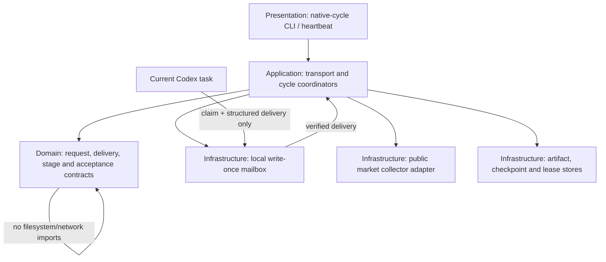
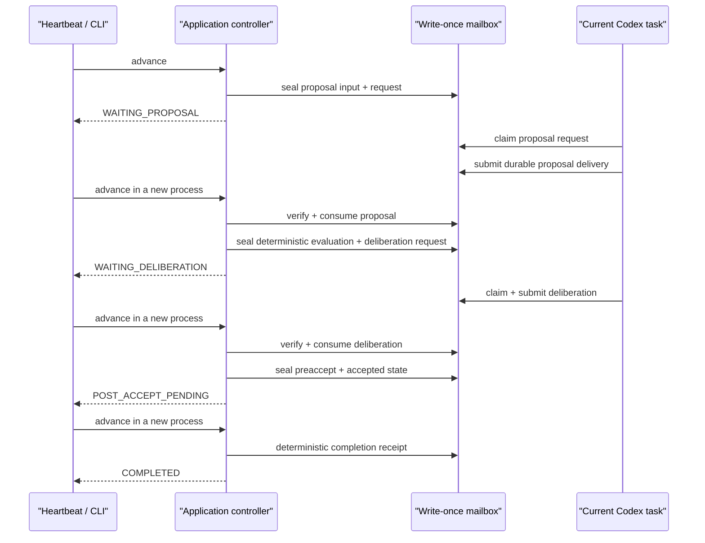

# Native Codex 新周期实验设计

> **历史记录，已被替代：**本文件只描述 2026-08-06 的 V3.1 设计与当时状态；其中 `HEARTBEAT_ACTIVE` 已在旧 run 永久失败关闭后失效。它不是 V3.2 authority、不得用于恢复旧 run，也不得作为新实验操作入口。当前入口见 `requirements/2026-07-30-theory-paper-practice.md`、`CURRENT_RESEARCH_THEORY_v3_2_DYNAMIC_AGGRESSIVE.md` 与 `V3_2_SYSTEM_AND_EXPERIMENT_DESIGN_2026-08-07.md`。

> 日期：2026-08-06  
> 状态：`PHASE_C_FINAL_SUCCESSOR_CYCLE_1_ACCEPTED / POST_REVIEW_PASS / HEARTBEAT_ACTIVE`  
> 理论 authority：`CORE_TRADING_THEORY_v2_1.md`  
> Agent：当前 Codex 任务，单 Agent，无 API key、无子 Agent  
> 执行边界：公开数据、本地不可执行研究；无账户、订单、资金、LIVE/broadcast

## 1. 结论

新的周期实验不能直接恢复旧 prospective 应用，也不能把当前聊天窗口当作 Agent 状态。当前可行的最小方案是：在已经修复的四层 successor 旁增加一个内容寻址的 native Codex 文件邮箱。确定性 controller 写输入请求后停止；当前 Codex 只读取请求工件、claim 并提交结构化输出；下一次 controller 调用验证交付后再推进。controller 与 Agent 永不在同一未持久化调用栈中交换唯一状态。

该设计首先完成 Phase B 非市场 transport 演练。只有 proposal、deliberation 和 postaccept 三处跨进程中断均通过，才冻结 Phase C 市场 manifest。无法机器证明服务模型或精确 token 预算时，证据标签固定为 `PRACTICAL_CODEX_NATIVE_AGENT_TRANSPORT`，不得称为 provider-attested。

## 2. 需求结构

### 2.1 User Intent

启动全新周期实验，持续监控系统；软件问题可复现后修复，外部限制过多时重设计，不牺牲理论与金融正确性。

### 2.2 System Outcome

- 新窗口只凭耐久工件恢复；
- Codex 能完整读取当前周期输入并开放提出假说、预期和动作；
- 确定性程序负责 PIT、来源、金融、风险、事件顺序和 accept；
- 任一部分交付、摘要漂移、重复 claim、错周期或并发推进均失败关闭；
- 监控器每次最多推进一个合法阶段或一个到期周期。

### 2.3 Core Features

1. write-once Agent request、claim、delivery 与 consume receipt；
2. 内容摘要、物理 SHA-256、run/cycle/stage/input/schema 全绑定；
3. checkpoint self-digest 和独占 lease；
4. proposal、deliberation、postaccept 三个显式恢复边界；
5. 真实市场阶段的 PIT 数据、情绪、动态假说/预期、动作评价和报告；
6. heartbeat 只读状态后推进一个合法单元，异常时先写 failure receipt。

### 2.4 Enhancement Features

- 真实 provider model receipt；
- 多 venue 数据冗余；
- 多 Agent 竞争；
- 实时 UI。

以上均不是当前启动条件，不在本轮建设。

### 2.5 Non-goals

- 不恢复 v1.3、v1.4、E0、E0A 或 E0B；
- 不调用 OpenAI API，不创建或读取 API key；
- 不访问账户、凭据、订单或资金；
- 不让 Codex 直接写 checkpoint、accepted state、仓位账本或风险结果；
- 不把私有思维链写入工件；
- 不因运行失败修改冻结理论、评价或已接受历史。

### 2.6 IO

输入：冻结 manifest、checkpoint、当前 request、内容寻址输入工件、上一 accepted state、公开市场事实。  
输出：Codex 公开结构化 proposal/deliberation、delivery receipt、确定性评价、accepted state、周期报告、monitor receipt。  
触发：人工首次启动与附着当前任务的 heartbeat；每次只处理一个 request 或一个到期周期。

### 2.7 成功指标

- transport 演练：3 个中断边界恢复，重复 Agent 产出 `0`，digest 漂移接受 `0`；
- 稳定性：同 run 并发 controller `0`，错阶段推进 `0`，accepted partial state `0`；
- 数据：必需 PIT 事实覆盖通过或显式失败，future evidence `0`；
- 金融：逐 lot 与组合真值差额 `0`，风险/费用由确定性内核计算；
- 治理：真实交易权限始终 `0`。

## 3. 四层架构



依赖只能向下。Codex 被视为 Infrastructure 侧可替换的认知 adapter，但通过文件邮箱与 Application 交互；它没有 commit 权。

## 4. 模块拆分

| 层 | 模块 | 责任 | 输入/输出 | 数据 owner | Mock / 独立测试 |
|---|---|---|---|---|---|
| Presentation | `native_cycle_experiment_cli.py` | status、advance、claim、submit | CLI args / JSON 状态 | 无 | 临时目录端到端 |
| Application | `native_agent_transport.py` | 单阶段推进、恢复、consume | ports / typed result | workflow cursor | fake mailbox |
| Domain | `native_agent_transport.py` | schema、digest、不变量、转换 | mappings / validated documents | transport contracts | 纯函数测试 |
| Infrastructure | `native_agent_mailbox.py` | write-once request/claim/delivery、锁、物理 SHA | local paths / bindings | mailbox artifacts | 临时目录 |
| Infrastructure | `native_market_collector.py` | 公开 OKX PIT 数据 adapter、原始响应与完整市场信息快照 | source contract / market facts | raw acquisition | frozen fixture + public preflight |
| Infrastructure | 既有 canonical stores | event、checkpoint、artifact | schemas / bindings | chronology | 已有回归 |

## 5. IO 契约

### 5.1 `native_agent_request.v1`

必需字段：run ID、cycle index、stage、request ID、created_at、input binding、expected output schema、output byte cap、agent identity、evidence level、forbidden authority、self-digest。

### 5.2 `native_agent_claim.v1`

必需字段：request digest、claimant=`CURRENT_CODEX_TASK`、claim ID、claimed_at、single claimant、chat authority=false、self-digest。同一 request 只允许完全相同的重复读取，不允许第二 claim。

### 5.3 `native_agent_delivery.v1`

必需字段：`COMPLETE/STOP/nontruncated/complete_json_object`、request/input/schema 精确匹配、payload、payload digest/bytes、claim digest、`durable_before_controller_consume=true`、private chain-of-thought=false、model/token attestation=false、evidence label 与 self-digest。

### 5.4 `native_transport_consume_receipt.v1`

绑定 request、claim、delivery 的语义 digest 与物理 SHA；记录 consumer stage、consumed_at 和 next state。只有 consume receipt 形成后 controller 才能生成下一 request 或 accepted state。

### 5.5 错误契约

- `NATIVE_REQUEST_BINDING_INVALID`
- `NATIVE_CLAIM_CONFLICT`
- `NATIVE_DELIVERY_INCOMPLETE`
- `NATIVE_DELIVERY_BINDING_MISMATCH`
- `NATIVE_DELIVERY_TOO_LARGE`
- `NATIVE_STAGE_TRANSITION_INVALID`
- `NATIVE_CHECKPOINT_DIGEST_INVALID`
- `NATIVE_CONTROLLER_LEASE_HELD`
- `NATIVE_ACCEPTED_STATE_IMMUTABLE`
- `NATIVE_MARKET_SENTIMENT_NUMERIC_SIGN_MISMATCH`
- `NATIVE_MARKET_TIMEFRAME_COHERENCE_GROUNDING_INVALID`

## 6. 事件流



## 7. 扩展结构

核心不是通用插件平台，只保留已注册 adapter：

```text
Stable Core
  Transport contracts
  Cycle state machine
  PIT / financial / risk / acceptance gates

Registered Adapters
  CURRENT_CODEX_TASK_FILE_MAILBOX (active candidate)
  SYNTHETIC_STRATEGY_AGENT (test only)
  PUBLIC_MARKET_COLLECTOR (Phase C active, official OKX public endpoints)
  PROVIDER_API_AGENT (inactive, not authorized)
```

adapter 注册必须在 manifest 中按 ID 和实现摘要冻结；禁止动态扫描、隐式 fallback 或运行时安装。

## 8. 数据 schema 与所有权

| 对象 | Owner | 可写者 | 不可写者 |
|---|---|---|---|
| raw market fact | collector store | collector adapter | Codex、report |
| request/input plan | Application | controller | Codex |
| Agent proposal/deliberation | mailbox | 当前 Codex，经 submit contract | controller、collector |
| financial evaluation | Domain/Application | deterministic evaluator | Codex |
| accepted state/checkpoint | chronology store | deterministic controller | Codex、report、heartbeat prompt |
| report | report builder | deterministic tail | Agent、collector |
| monitor state | controller store | monitor reconciler | desired-state prompt |

所有 schema 采用显式版本；v1 扩展只可增加可选字段，破坏性变化建立 v2 和新 run。旧 runtime 不迁移。

## 9. 三阶段路线

### Phase A：本地 successor 可靠性

已完成：最终 Theory Paper V2 全范围 307 项通过；新窗口、市场合同、PIT、当前授权、source-anchor、数值符号和关系型周期一致性故障门均纳入验证。

### Phase B：native Codex transport

实现邮箱、CLI 和测试；用当前 Codex 完成 proposal/deliberation；分四次 controller 进程经过三个中断边界。通过后只证明 transport 与恢复。

### Phase C：新鲜市场 pilot

冻结 Core v2.1、单一新 run、公开数据计划、4 个周期、比较与停止规则；先运行一个周期并验证，再启用唯一 heartbeat。pilot 通过后才讨论扩展市场、周期或研究终端。

当前已进入本阶段：最初 run `native-codex-btc-pilot-20260806t0834z` 在完成一个周期后发现情绪合同降级、当前撤权未复核和资金费观察时间错误，已用 halt digest `1fc2330011ffdf269e3a460364827430d272c64f16a9c5953562c14b125ca770` 永久封存，未来周期未启动。纠正不得回写该 run，而是建立新标准、新 config、新授权和 successor。

第二个 run `native-codex-btc-pilot-v2-20260806t0856z` 的第 1 周期虽然形成 accepted digest=`25ca9ed623d46f835196d5ce7c10d977dfd9762122ec1a3c7881e69e0a8f07da` 和 completion digest=`9c6930990ca354aaaa4326def028d7ba7eb457c81f3cc6d5d0eb50716b6c8c26`，但后置语义复核发现：低成交量被错误计为卖方负向参与，使 `PARTICIPATION_AND_FLOW=-2` 与“方向未确认”的公开推论冲突；跨周期 OI delta 也没有当前周期事实合同。该 run 以 halt digest=`79896b0dc827ba8abad4c077c98b1a37c936c651c672fe63604f72d32d6dc290` 永久封存，第 2 周期未启动，唯一 heartbeat `btc-agent` 已 PAUSED。M2 因理论语义不一致被撤销，必须建立 v1.1 标准、确定性语义门和全新 successor。

第三个 run `native-codex-btc-pilot-s2-20260806t0928z` 在首周期 proposal 提交前发现通用加法会把 `3` 个正向周期与 `1` 个负向周期误标为强一致，且 contributor 符号尚未与数值事实确定性绑定。该 run 以 halt digest=`94cd269d8a2cb93d913a31ef0641d092261e5867ed1ff5157cd62756744421b7` 永久封存，accepted=`0`，没有未来周期或订单。

最终 successor=`native-codex-btc-pilot-s3-20260806t0942z` 使用累计标准 v1.2。v1.2 对所有矛盾轴禁止强标签，对 `TIMEFRAME_COHERENCE` 使用关系型聚合，并把直接数值 contributor 与事实正负号机器绑定。最新公开数据预检命中 `15m<0 / 1h,4h,1d>0`，结果为 `0/CONTRADICTORY`。第 1 周期完成 proposal、确定性金融评价、deliberation、preaccept、accepted、report、completion 与后置语义复核，选择非执行 `WAIT`；M2/M3 已通过并恢复唯一 heartbeat。

## 10. 验证门

| Gate | 条件 | 未通过处置 |
|---|---|---|
| T0 | 需求、理论、实现、config digest 冻结 | 不创建 runtime |
| T1 | request/claim/delivery/consume 全部 self-digest + physical SHA | 失败关闭 |
| T2 | proposal 新进程恢复且不重复产出 | 不进入 deliberation |
| T3 | deliberation 新进程恢复且不重复产出 | 不 accept |
| T4 | postaccept 新进程只完成确定性尾部 | 永久封存或修复 tail |
| M0 | Phase B 全通过 | 不访问市场 |
| M1 | 新 manifest、authority receipt、PIT/data plan、停止规则冻结 | 不采集 |
| M2 | 首周期完整收据、金融真值和报告通过 | 不启 heartbeat |
| M3 | heartbeat actual state、lease、checkpoint 可复核 | 保持 PAUSED |

## 11. Legacy 策略

- 旧 prospective collector/portfolio 只能在未来作为被测试的 adapter 候选，不再拥有 controller、checkpoint 或 accept；
- 旧 mutation CLI 继续拒绝；
- v1.3/v1.4/E0/E0B runtime、automation 和 accepted artifacts 不迁移、不修补、不续跑；
- 新设计失败时保留新 run failure receipt，建立全新 successor，绝不回落到旧中心。

## 12. 当前未知

- Codex 服务模型身份和精确 token 预算无法由本地文件机器证明；
- heartbeat 当前 ACTIVE，仅绑定最终 successor，每次最多推进一个到期周期；旧 automation 和旧 run 继续 PAUSED/不可恢复；
- 仅完成 1/4 周期；第 2 周期的真实跨周期 OI fact、后续假说/预期演化和 terminal 复核尚未发生；
- 真实公开数据首周期覆盖已记录，但市场判断增量、预测和收益尚未评估；
- 因此当前最高允许结论仍是 practical native transport 和本地不可执行周期研究。

## 13. 当前运行裁决

- 最终 Phase B run=`native-codex-transport-phase-b-v12-20260806t094036z` 已跨越 proposal、deliberation、postaccept 三处恢复边界：manifest=`b828d85836afc9b73daab31e2bfdaf2fabb37702e40ce05923711540c0bce37c`，final checkpoint=`55e7b6cdebd4d41f61aff5121a35a5539d5ba1b5f931d2dd5289623291a6d3dd`，accepted=`4edb08b84967048750f1cd504e9a9bbd406a68f40bd53501e58ee51ccc1269ac`，completion=`f78967b67688fec905784dc71551da4092c6e0d8465f96441f6b00b3cf09d632`；Agent 重入、模型 API、市场访问和交易均为零；
- 最终 config semantic digest=`8de86115c2ec6a627409ff52d13676b05ddfa0e1d69010b797f6cd950516383f`，physical SHA-256=`624e1cfa0c146739366e0d549542b954662ef54225c663d27326c09493c72ef3`，authorization receipt=`ff00f872fb3bbf20804fd181c4ef8fcbb4c0b595d1ab0def759c27419c75a2e7`，market manifest=`53d6a65f1f222416040cb1bbd7fed41e6c1c9bd46c28d9c0866e6b52c346f2f8`；
- 正式第 1 周期 snapshot=`9edea443b940a1b3353d91ec2c3ab53f778ba9b830f40a5c90348b52573429d6`，sentiment=`bc777140c6f3ad4b88a81322cd0453ac8db8e0a19b83cbf7834f8ab7af55eae8`，evaluation=`5724576bb5c9d938d9dfd5825c4fc912320c764d56c7555a0138ac4dadf9c6bf`，accepted=`451eae1db96897a7d89e734a4df30a1774ba2414ae389a05283039b13d3d96bc`，report=`840724992070aed6c1bb97716a356c3c247044acc973f0ff51ef1d9cd9560fd8`，completion=`8c2f457f254e9f4278deccb3d23a07858dc9cd07360e1f9bd5ecd97583762827`；
- 第 1 周期情绪为价格压力 `+1/CONTRADICTORY`、结构 `+1/CONTRADICTORY`、参与/流量 `+1`、拥挤 `+1/PARTIAL`、杠杆与严格流动性韧性 `UNKNOWN`、波动压力 `0/PARTIAL`、跨市场与事件 `UNKNOWN`、周期一致性 `0/CONTRADICTORY`。3 个假说和 3 条预期进入耐久 registry；多空影子候选净风险约 `2.7443/2.7558 USDT`、净 RR 约 `1.9079/1.9103`，选择 `WAIT`；
- 后置复核确认所有直接数值同号、成交量贡献为零、矛盾轴无强标签、首周期 OI change 保持 UNKNOWN、工件摘要链一致、Agent 重入为零，`order_sent=false / account_accessed=false`；checkpoint=`READY_FOR_CYCLE 2`，next due=`2026-08-06T10:42:00Z`；
- 当前只支持 `CYCLE_1_PROCESS_AND_SEMANTIC_GATE_PASS / 1_OF_4 / MONITORING_ACTIVE`，不支持预测有效、盈利、生产就绪或任何真实交易授权结论。
