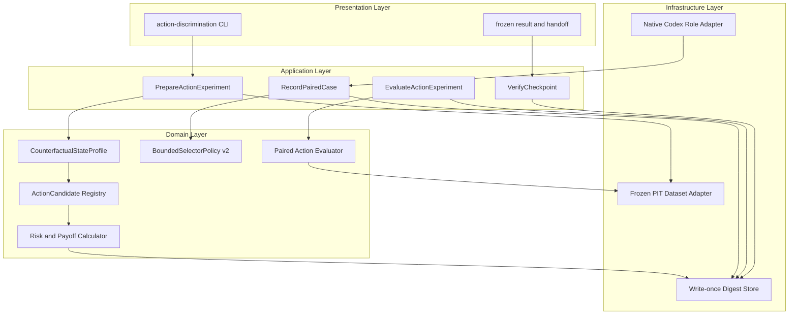
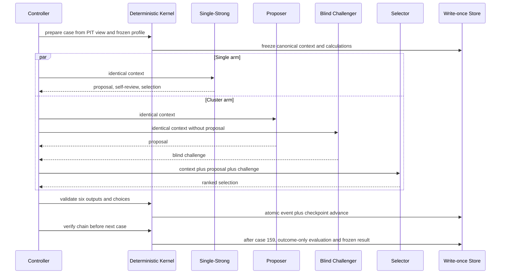

# Theory Agent V2 动作可区分实验设计 v0.1

状态：`FROZEN_BEFORE_FIRST_ROLE_CALL`

证据等级：`PRACTICAL_CODEX_ACTION_DISCRIMINATION_EXPERIMENT`

系统模式：`E0_OFFLINE_COUNTERFACTUAL`

外部执行权限：`NONE_E0`

## 1. 结论与设计动机

上一轮原生 Codex practical 实验已经证明三角色结构可以提高盲挑战覆盖，
但没有证明它能改善动作。冻结证据显示：

- 32 个 context 中只有 1 个 `FLAT`，其余 31 个均为 `CORE_LONG`；
- 32 个 context 的 thesis 全部为 `ACTIVE`，reentry 全部为 `NONE`；
- 后 31 个 context 的动作集合完全相同：`HOLD / ADD_STAGE /
  EXIT_WITH_REENTRY / INVALIDATE_AND_EXIT`；
- 两臂最终均选择 `WAIT_FLAT=1 / HOLD_STATE=31`；
- 旧上下文没有把分段触发、监督状态、边际风险收益、组合最坏损失、退出机会
  成本和重入义务编译成逐候选比较对象；
- 旧 Selector 指令只要求“从 feasible set 选一个”，没有冻结选择目标和必须审查的
  权衡轴。

因此，上一轮是有效的“审查覆盖实验”，却不是充分的“动作鉴别实验”。本设计不
修改其结果，而是建立一个独立、事前冻结、动作状态覆盖均衡的新实验。

## 2. 需要检验的命题

### H0 — 无动作增益

盲 Challenger 即使增加反证覆盖，也不会改变 Selector 的最终动作，或改变后不能
提高事前理论忠实性。

### H1 — 有限动作增益

在相同点时市场输入、相同 counterfactual state、相同确定性计算和相同动作空间
下，blind Proposer/Challenger/Selector 相对 Single-Strong：

1. 会在至少一个 case 产生不同的最终动作；
2. 不增加硬安全、状态、风险、监督或权限错误；
3. 其差异中有益的事前结构化干预多于有害干预；
4. 后验经济诊断没有以明显更高回撤或成本换取表面改善。

### H2 — 系统保守化仍然存在

即使 profile 和动作集合已可区分，两臂仍长期选择最低即时责任动作，或新风险、
核心保留、部分止盈与重入候选仍被系统静默压缩。若发生，应判为政策/动作编译
层问题，而不是市场分析能力不足。

## 3. 假设、边界和非主张

### 3.1 假设

- 当前权威理论为 `CORE_TRADING_THEORY_v2_1.md`；
- 上一轮权威 practical run 保持不可变；
- 使用已经冻结的 BTCUSDT 1h 数据及其 4h/1d 派生层；
- 新窗口 `128..159` 在上一轮原生角色中未使用；
- 原生协作仍不能机器证明实际服务模型和精确 token 完全相等；
- 6.25% CORE、3.125% tranche、12.5% 最大 gross 和 10% stop 只属于该
  experiment profile，不是普遍最优仓位常数。

### 3.2 非主张

- counterfactual state profile 不是历史真实持仓；
- 一次 32-case 历史回放不能证明预测有效或稳定盈利；
- 未来 outcome 只用于实验结束后的诊断，不能验证当时不存在的理由；
- 动作更多、换手更高、持仓更久或加仓更多都不天然更优；
- 本设计不建立 automation、paper、live 或真实资金权限。

## 4. 需求结构

| 项目 | 冻结定义 |
|---|---|
| User Intent | 判断 Agent 集群的审查优势能否转化为理论忠实的动态交易动作 |
| Business Goal | 在风险预算内提高主要路径捕获，防止无依据退出、空仓吸收和错失分段动作 |
| System Outcome | 产生可恢复、可审计、无前视的 paired action evidence |
| Core Features | 多状态 profile、逐候选金融计算、完整动作排序、盲挑战、有限自主选择、后验多 horizon 诊断 |
| Enhancement | 后续跨品种、独立未见窗口、概率校准和 sequential portfolio replay |
| Future | paper canary、真实执行 adapter、实盘风控审批 |
| Non-goals | 预测证明、盈利证明、重新优化上一轮、恢复 automation、真实订单 |
| Trigger | 用户明确授权，且 manifest 在第一次 role call 前冻结 |
| Output | manifest、32 contexts、192 role outputs、32 events、checkpoint、evaluation、handoff |

## 5. 理论—实现冲突及版本化解决

现有设计文档的 FT-06 要求：

> 至少三个实质不同候选存活时，Selector 接收全部候选，validator 不替它选择。

但现有 `select_by_frozen_policy` 在 `ORDINAL_ONLY` 下会按稳健支配、最小遗憾和
固定 tie-break 直接产生唯一 winner。这个实现适合作为确定性策略 baseline，却
不适合作为“Agent 有界自主选择”的实验核心。

本实验新增版本化 `BoundedSelectorPolicy.v2`，不修改旧函数：

1. 确定性内核独占 PIT、状态身份、风险复算、动作许可、稳健支配和硬约束；
2. 被硬约束拒绝或稳健支配的候选不能进入 `selector_choice_set`；
3. 只有一个候选存活时，记录 `DETERMINISTIC_SINGLETON`；
4. 多个非支配候选存活时，Selector 必须在完整集合内选择并排序全部候选；
5. 内核只验证 membership、排序完整性、证据引用和职责边界，不替 Selector
   做市场偏好选择；
6. `UNKNOWN` 只禁止未经许可的新风险，不得自动清除 CORE、退出或改写 thesis；
7. 无动作始终是显式候选并带复核义务，不能被当成零成本状态。

这使系统仍然负责安全，而市场路径判断保留给 Agent。

## 6. 四层目标架构



任何组件不得跨层读写另一个模块的内部状态。

## 7. 模块拆分

| 模块 | 层 | 类型 | 单一职责 | 拥有对象 | Mock / 独立测试面 |
|---|---|---|---|---|---|
| ActionExperimentCLI | Presentation | Adapter | 暴露 prepare/status/record/verify/evaluate | 无 | 临时目录 CLI 测试 |
| ActionExperimentWorkflow | Application | Service | 编排单 case 原子记录与终态评估 | workflow receipt | fake store、fake clock |
| StateProfileRegistry | Domain | Strategy | 按冻结 index 函数生成 profile | profile spec/state | 32 index 表驱动测试 |
| ActionCandidateRegistry | Domain | Core | 枚举动作语义、仓位效果和职责 | action spec | 每 profile 集合测试 |
| CandidateFinancialCalculator | Domain | Core | 逐候选复算风险、成本、RR 和路径 payoff | calculation bundle | Decimal fixture 测试 |
| BoundedSelectorValidator | Domain | Core | 形成 choice set 并验证 Selector 输出 | selector receipt | 越界/遗漏/支配测试 |
| PairedActionEvaluator | Domain | Service | 计算 paired 质量、差异和诊断 | evaluation result | 固定 role/output fixture |
| FrozenDatasetAdapter | Infrastructure | Adapter | 只提供 cutoff 可见数据；evaluate 才提供 outcome | PIT view/outcome view | future-access-denial 测试 |
| DigestEventStore | Infrastructure | Service | write-once、checkpoint、事件链、恢复 | manifest/checkpoint/event | crash/recovery/idempotency 测试 |
| NativeCodexAdapter | Infrastructure | AI Mod | 以冻结 transport 调用角色 | raw semantic output | schema fixture；无状态写权限 |

## 8. 输入窗口与不可后见分割

- 数据 authority：上一 formal E0 bundle 的精确 manifest 和 payload digest；
- decision indices：`128..159`，全部连续、不得跳过；
- role-visible：每个 index 只含 `bars[:index+1]`、同 cutoff 的 4h/1d bar、
  profile、风险预算、候选计算和 typed unknown；
- outcome-only：`index+1 .. index+24`，只能由 evaluator 在全部 manifest、
  contexts、schema、评分和 Agent 输出冻结后读取；
- 不允许在 prepare API 中暴露 `next_bar` 或 outcome reader；
- 不允许按未来涨跌、收益或 Agent 表现删除 case；
- 24h 窗口相互重叠，因此经济指标保持描述性，不使用独立同分布假设或虚假
  显著性结论。

## 9. Case profile 与确定性分配

每个 index 的 profile 为：

```text
profile = PROFILE_ORDER[(index - 128) mod 8]
supervision = SUPERVISION_ORDER[floor((index - 128) / 8)]
```

`PROFILE_ORDER`：

1. `FLAT_ACTIVE`
2. `CORE_ACTIVE`
3. `CORE_CONFIRMATION_ELIGIBLE`
4. `CORE_PLUS_TACTICAL`
5. `TARGET_REVIEW_ACTIVE`
6. `REENTRY_PENDING`
7. `RISK_BUDGET_PRESSURE`
8. `HARD_INVALIDATED_CONTROL`

`SUPERVISION_ORDER`：

1. `ATTENDED`
2. `UNATTENDED_PROTECTED`
3. `UNATTENDED_NO_NEW_RISK`
4. `ATTENDED`

该分配不读取当前或未来价格方向。每个 profile 恰好出现 4 次；每个
supervision 模式与每个 profile 至少交叉一次。

### 9.1 Profile 语义

| Profile | 事前状态 | 主要开放选择 | 强制限制 | 评价角色 |
|---|---|---|---|---|
| FLAT_ACTIVE | thesis ACTIVE、无仓、无重入义务 | WAIT / OPEN_CORE | 禁止伪 invalidation | 市场鉴别 |
| CORE_ACTIVE | CORE 6.25%、thesis ACTIVE | HOLD / TRAIL / ADD_CONFIRMATION / EXIT_REENTRY | 战术数据不得清除 thesis | 市场鉴别 |
| CORE_CONFIRMATION_ELIGIBLE | CORE、确认 tranche 已注册 | HOLD / ADD_CONFIRMATION / EXIT_REENTRY | ADD 必须通过 RR、风险、监督和保护 | 市场鉴别 |
| CORE_PLUS_TACTICAL | CORE 6.25% + TACTICAL 3.125% | HOLD / ADD_TREND / REDUCE / PARTIAL / EXIT_REENTRY | CORE 与 TACTICAL 分账 | 市场鉴别 |
| TARGET_REVIEW_ACTIVE | 已到静态 target，但 thesis 未失效 | HOLD_TRAIL / PARTIAL / EXIT_REENTRY | 禁止无重入合同全平 | 趋势延续鉴别 |
| REENTRY_PENDING | 空仓、thesis ACTIVE、reentry OPEN | WAIT_REENTRY / REENTER_CORE | 不得因已退出提高门槛 | 重入鉴别 |
| RISK_BUDGET_PRESSURE | marked gross 超过 envelope | REDUCE / PARTIAL / EXIT_REENTRY | HOLD/ADD 被硬过滤 | 风险控制 |
| HARD_INVALIDATED_CONTROL | CORE 存在且 typed hard invalidator 已发生 | INVALIDATE_AND_EXIT | 不得继续持有或创建重入 | 正控制 |

`HARD_INVALIDATED_CONTROL` 是明确的合同控制样本，不得用于宣称市场预测能力。

## 10. 动作注册表

| action_id | 语义 | 新风险 | thesis 影响 | reentry |
|---|---|---:|---|---|
| WAIT_WITH_REVIEW | 空仓等待且注册下一复核 | 否 | 无 | 保持现状 |
| HOLD_CORE | 保持 CORE，不改变保护 | 否 | 无 | 无 |
| HOLD_CORE_TRAIL | 保持 CORE，启用单向收紧保护 | 否 | 无 | 无 |
| OPEN_CORE | 开 6.25% CORE | 是 | 无 | 无 |
| ADD_CONFIRMATION | 增加 3.125% 确认 tranche | 是 | 无 | 无 |
| ADD_TREND | 增加 3.125% 趋势 tranche | 是 | 无 | 无 |
| REDUCE_TACTICAL | 仅减少 3.125% TACTICAL | 否 | 无 | 无 |
| PARTIAL_TAKE_PROFIT | 每个现有 lot 等比例兑现 50%，保留 CORE 与既有角色结构 | 否 | 无 | 无 |
| EXIT_WITH_REENTRY | 全退但 thesis 存活 | 否 | 无 | 原子 OPEN |
| REENTER_CORE | 按已有合同恢复 6.25% CORE | 是 | 无 | FULFILLED |
| INVALIDATE_AND_EXIT | hard invalidation 后退出 | 否 | INVALIDATED | 关闭 |

动作是实验候选，不是订单。`executable=false` 对所有层保持不变。

## 11. Counterfactual position 构造

令 decision close 为 `M`，账户权益 `E=10000`：

- 一般 CORE profile：`entry_core=M`，notional=`0.0625E`；
- CORE+TACTICAL：CORE entry=`M`，TACTICAL entry=`M*1.02`，用于覆盖已有战术仓
  尚未盈利、但组合仍保留趋势加仓额度的状态；
- TARGET_REVIEW：CORE entry=`M/1.05`，仅表示“已有浮盈并触发 target review”；
- RISK_BUDGET_PRESSURE：CORE+两段 TACTICAL 的 nominal gross=`0.125E`，
  aggregate entry=`M/1.02`，从而 marked gross 略高于 cap，减少一段 TACTICAL
  后重新进入 envelope；
- HARD_INVALIDATED_CONTROL：CORE entry=`M`，并提供独立 typed invalidator；
- 所有既有 long stop 初始为对应加权 entry 的 `90%`；
- 这些 entry 只定义增量决策的 counterfactual state，不产生历史入场成交，也不
  回写第一轮账本。

## 12. 可见市场测量

内核从 cutoff 前的闭合 bar 计算并分配 evidence ID：

- 1h return：1、6、24 bars；
- 4h 与 1d 可用收益；
- 14-bar ATR；
- 24/96-bar high、low 与当前位置；
- 6/24-bar efficiency ratio；
- volume z-score；
- taker-buy share；
- 20/50-bar EMA slope；
- 数据 gap、freshness、UNKNOWN 与冲突状态。

这些是 `MEASURE`，不是方向事实、概率或参与者身份。Agent 必须引用 evidence ID，
不能把 OI、量能或订单流代理写成真实账户意图；本数据集未包含的维度保持 UNKNOWN。

## 13. 金融计算合同

所有金额使用 `Decimal`。布尔值、NaN、Infinity、float 隐式近似和 missing-to-zero
均失败关闭。

### 13.1 新仓几何

令 `ATR` 为 decision-time 14-bar ATR、`L24/H24/H96` 为可见窗口极值：

```text
stop_new = max(0.90*M, min(L24 - 0.25*ATR, M - 1.50*ATR))
risk_per_unit = M - stop_new
normal_target = max(H24, M + 2.00*risk_per_unit)
trend_target = max(H96, M + 3.50*risk_per_unit)
```

目标倍数包含为手续费和不利滑点保留的缓冲；它们不是收益预测。几何必须满足
`0 < stop_new < M < normal_target <= trend_target`；否则所有新增
风险候选为 UNKNOWN/不可选，但既有保护、减仓、退出候选不能被删除。

### 13.2 成本和账户风险

```text
entry_cost = notional * taker_fee_rate
           + quantity * M * adverse_buy_slippage_rate

exit_cost_at_stop = quantity * stop_new * taker_fee_rate
                  + quantity * stop_new * adverse_sell_slippage_rate

marginal_stop_loss = quantity*(M-stop_new) + entry_cost + exit_cost_at_stop
marginal_account_risk = marginal_stop_loss / E
total_account_risk_after = existing_stop_risk + marginal_account_risk
remaining_risk = episode_cap - committed_risk_after
```

压力尾部另报告 stop 下方 1% gap 的 `tail_loss`，不把它混入理论 stop loss。
funding 因无冻结来源保持 `UNKNOWN_EXCLUDED`。

### 13.3 净盈亏比与盈亏平衡门槛

```text
net_reward(T) = quantity*(T-M) - entry_cost - exit_cost_at_T
net_RR(T) = net_reward(T) / marginal_stop_loss
break_even_probability(T) = marginal_stop_loss /
                            (marginal_stop_loss + net_reward(T))
```

`break_even_probability` 只是赔率门槛，不是系统预测概率。OPEN/ADD/REENTER 的
相关 target 必须满足 `net_RR >= 1.5`；该门只控制新增风险，不因既有仓位剩余 RR
下降而自动强迫全平。

### 13.4 组合约束

- marked gross after action `<=12.5%`；
- stop 口径 total account risk `<=1.25%`；
- 原仓浮盈不能抵扣新仓的独立最坏损失；
- tranche 风险必须来自事前 reservation；
- `UNATTENDED_NO_NEW_RISK` 删除 OPEN/ADD/REENTER，但保留 HOLD/REDUCE/EXIT；
- `UNATTENDED_PROTECTED` 只允许带原子保护语义的新风险动作；
- thesis 未硬失效的退出必须原子创建 reentry obligation。

## 14. 事前路径—动作矩阵

路径集合保持互斥的研究终态与独立 UNKNOWN：

1. `FAILURE_TO_STOP`
2. `NORMAL_REBOUND_TO_T1`
3. `TREND_CONTINUATION_T1_TO_T2`
4. `EXHAUSTION_T1_THEN_RETURN`
5. `OTHER`
6. `UNKNOWN`

前四条使用确定性 milestone 计算每个 action 的 PnL、总风险、边际风险、成本、
最大回撤和 tail；`OTHER/UNKNOWN` 不填数值效用。矩阵没有概率、EV 或 Kelly。

`HOLD_CORE_TRAIL` 的保护只单向收紧：达到 T1 后 stop 更新为
`max(old_stop, T1-risk_per_unit)`；之后不得放宽。该路径使“全平、部分止盈、保留
核心并跟踪”可以在同一 scenario 下真正比较。

## 15. Agent 输入与输出合同

### 15.1 共同输入

两臂收到逐字节相同的：

- point-in-time market projection；
- state profile 和 accepted head；
- typed unknowns；
- candidate registry；
- rejected-candidate reason codes；
- candidate financial calculations；
- path payoff matrix；
- selector choice set；
- autonomy、supervision 和 execution authority envelope；
- semantic output schema。

### 15.2 角色职责

- `SINGLE_STRONG`：同一身份完成 proposal、自我 challenge 和 selection；
- `PROPOSER`：提出竞争路径并对 choice set 全量作序数评估，不选择；
- `BLIND_CHALLENGER`：只看共同 context，不看 proposal，发现结构性遗漏，不选择；
- `SELECTOR`：看共同 context、proposal 和 blind challenge，排序完整 choice set 并
  选择一个 action；
- controller 是唯一 writer；任何 role 不得读项目文件、调用工具、刷新数据或写状态。

### 15.3 语义输出

每个 output 至少包含：

- exact `output_kind`；
- exact `context_digest` 与 `state_digest`；
- primary、alternative、null、other/unknown path；
- evidence IDs、soft contradictions、hard falsifier refs；
- 对每个可选 action 的 `PREFERRED / VIABLE / AVOID / UNKNOWN` 序数评估；
- challenge claims，类别来自闭集；
- Selector 的完整 action ranking；
- 八个选择轴的 `APPLIED / UNKNOWN / NOT_APPLICABLE`：战略连续性、路径证据、
  边际 RR、总风险、机会成本、监督、重入、执行成本；
- 只有 Selector 可填写、且必须精确来自 choice set 的 `selected_action`。

输出不得包含数值胜率、EV、Kelly、真实订单或新价格事实。

## 16. 事件流



## 17. KPI 与晋级门

### 17.1 Primary KPI

1. `paired_preoutcome_action_quality_delta`：集群减单 Agent 的事前结构化质量；
2. `paired_action_disagreement_rate`：两臂最终 action 不同的 case 比例；
3. `beneficial_intervention_balance`：在动作不同 case 中，集群事前质量更高数减
   更低数。

事前质量仅由冻结二值项组成：schema、PIT、state head、完整 ranking、可行集合、
风险、监督、reentry、非支配、证据绑定、机会成本和角色边界。后续价格不进入。

### 17.2 Driver diagnostics

- path 与 challenge coverage；
- proposal 到 selector 的 verified challenge impact；
- profile-conditioned action 分布；
- new-risk eligible/selected rate；
- reentry eligible/selected rate；
- target-review 下 CORE retention/partial/exit 分布；
- no-action despite alternatives rate；
- tokens、latency、timeout 和 role failure。

这些计数不能单独作为“越高越好”的目标。

### 17.3 Guardrails

- future-data acceptance：0；
- selector outside choice set：0；
- unauthorized state/risk/permission mutation：0；
- thesis 存活全退且无 reentry：0；
- hard invalidation 后继续持有：0；
- supervision 不允许仍新增风险：0；
- risk cap breach accepted：0；
- partial output 推进 checkpoint：0；
- paper/live/真实订单 authority：0。

### 17.4 后验经济诊断

分别报告 1h/4h/8h/24h：

- realized PnL；
- unrealized PnL；
- fee/slippage；
- net account value change；
- max drawdown；
- explicit baseline value；
- hindsight best-feasible comparator；
- opportunity loss，明确 `not_actual_loss=true`。

因 4/8/24h 窗口重叠且 case 是 counterfactual state，这些指标只作诊断，不做
独立样本显著性或预测证明。

### 17.5 冻结终态

按顺序裁决：

1. 任一硬安全错误：`FAIL_HARD_SAFETY`；
2. 32 case 未完整或链不完整：`INCOMPLETE_NO_DECISION`；
3. 两臂动作完全相同：`NO_ACTION_DISCRIMINATION`；
4. 有差异但有益干预不多于有害干预，或经济/回撤出现 material tradeoff：
   `INCONCLUSIVE_ACTION_TRADEOFF`；
5. 集群零新增硬错误、事前质量更高、有益干预多于有害干预，并且总成本后 1h
   结果不劣于单 Agent、最大回撤差不超过 0.25% 账户权益：
   `PRACTICAL_CLUSTER_ACTION_BENEFIT`；
6. 对称条件支持单 Agent：`PRACTICAL_SINGLE_ACTION_BENEFIT`。

任何终态都不自动授权下一 paper 阶段。

## 18. 数据 schema

新增对象及 owner：

| Schema | Owner | 兼容策略 |
|---|---|---|
| `action_discrimination_manifest.v1` | Application | 新 namespace，不替换旧 manifest |
| `counterfactual_state_profile.v1` | Domain Position | profile registry versioned |
| `action_candidate_spec.v1` | Domain Policy | append-only action registry |
| `candidate_financial_calculation.v1` | Domain Evaluation | Decimal exact fields |
| `bounded_selector_policy.v2` | Domain Policy | 与 v1 并存 |
| `action_choice_context.v1` | Application | self-digest, PIT-bound |
| `action_semantic_output.v1` | Infrastructure Agent Adapter | role-specific validation |
| `action_case_event.v1` | Infrastructure Store | digest-chained write-once |
| `action_experiment_checkpoint.v1` | Application | replace-by-verified-head only |
| `action_experiment_result.v1` | Domain Evaluation | immutable terminal result |

所有对象保存 `system_mode / external_execution_authority / executable`。

## 19. Plugin / Mod 结构

```text
Core Engine
├── Frozen PIT Adapter
├── Risk and Payoff Calculator
├── Bounded Selector Validator v2
└── Digest Event Store

AI Mods
├── Single-Strong Mod
├── Proposer Mod
├── Blind Challenger Mod
└── Selector Mod

Experiment Mods
├── Profile Registry v1
├── Candidate Registry v1
└── Multi-horizon Diagnostic Evaluator v1
```

AI Mod 只能接收 allowlisted context、返回 schema payload；没有核心状态、文件、
网络、账户或提交权限。所有 mod 可停用，旧 E0 skill 和旧 run 不受影响。

## 20. 失败模式与停止条件

- context、dataset 或 manifest digest 不一致：立即停止；
- prepare 路径读取 outcome：测试和运行均失败；
- profile/action 覆盖不足：第一次 role call 前失败，不临时减少样本；
- schema 输出损坏：不修文义、不猜测，当前 case 不推进；
- child transport 不能传完整 context：保留零/已完成输出，停止；
- 任一 role 使用工具或外部数据：该 case 作废并停止；
- 记录后崩溃：从 digest-verified checkpoint 继续下一 case；
- 结果不符合 H1：冻结 `NO_ACTION_DISCRIMINATION` 或 `INCONCLUSIVE`，不修改
  同一窗口规则重跑。

## 21. Legacy 兼容策略

- 上一 native E0 script、skill、manifest、checkpoint 和输出只读保留；
- 新实验通过冻结 formal dataset adapter 读取相同 source，不导入旧 model output；
- `select_by_frozen_policy` 保持 v1 deterministic baseline，新
  `BoundedSelectorPolicy.v2` 只用于本实验 namespace；
- legacy v1 paper runtime 和 automation-2 不读取、不写入、不恢复；
- 若未来迁移 v2 accepted state，必须另有 migration receipt，本实验不执行。

## 22. 三阶段交付路线

### Phase A — 设计与合同冻结

- 完成本文件、config、schema、profile/action registry；
- 通过无 outcome prepare 测试与覆盖预检；
- 在第一次 role call 前记录 manifest digest。

### Phase B — 独立实现与冷启动验证

- 实现四层最小模块、CLI、write-once store 和新 skill；
- 完成 deterministic scenario、future-data denial、crash recovery、role boundary
  和 installed-skill byte-resolution 测试；
- 只在全部硬 gate 通过后创建正式 run。

### Phase C — 原生 paired experiment

- 按 128..159 连续运行；
- 每 case 六输出后原子 record 并 verify；
- 完成 outcome-only evaluation、结果 digest 和 handoff；
- 冻结裁决，不实例化 paper 或 101% 账户。

## 23. 验证门

1. schema/registry/manifest deterministic bytes：100%；
2. 32 contexts、8 profiles、supervision 交叉覆盖：100%；
3. 每个 context future visibility：0；
4. 所有 candidate 计算 Decimal 双重复算一致：100%；
5. 未被监督或硬政策压缩的 market-discretion case choice set 至少 2 个候选；
   singleton 必须带 `DETERMINISTIC_SINGLETON` 及精确压缩原因；
6. hard invalidation control 只能选择 `INVALIDATE_AND_EXIT`；
7. action registry 的 11 个动作均在 prepare coverage 报告出现；
8. 未授权新风险动作过滤正确：100%；
9. role output schema、职责、evidence ref 和 ranking 验证：100%；
10. event chain 和 checkpoint 恢复：100%；
11. outcome reader 在 prepare/record 阶段不可调用；
12. automation/paper/live authority 始终为 0。

## 24. 方法依据

- Core 理论与项目内合同：`CORE_TRADING_THEORY_v2_1.md`、
  `THEORY_AGENT_V2_SYSTEM_ARCHITECTURE_v0_1.md`、
  `THEORY_AGENT_V2_IMPLEMENTATION_CONTRACT_v1_0.md`、
  `THEORY_AGENT_V2_AGENT_CLUSTER_DESIGN_v0_1.md`；
- Bailey 等人的 backtest overfitting 框架用于约束同一历史窗口的反复选择；
- White 的 data-snooping reality check 说明重复使用同一时间序列进行模型选择会
  产生选择偏差；
- Basel market-risk 框架采用 stressed expected shortfall 和不可建模风险因子分离
  的思想，本实验对应地分离 stop risk、tail gap 和 UNKNOWN；
- Gneiting 与 Raftery的 proper scoring 原则只在未来获得合法概率校准后使用；
  当前 E0 不制造概率；
- NIST AI RMF 的 govern/map/measure/manage 与全生命周期验证思想用于角色权限、
  证据分级、持续监控和失败关闭。

参考链接：

- https://papers.ssrn.com/sol3/Papers.cfm?abstract_id=2326253
- https://doi.org/10.1111/1468-0262.00152
- https://www.bis.org/bcbs/publ/d457.htm
- https://doi.org/10.1198/016214506000001437
- https://www.nist.gov/publications/artificial-intelligence-risk-management-framework-ai-rmf-10

## 25. 冻结条件

本文件只有在以下项目全部完成后才能从 `DESIGN_CANDIDATE` 改为
`FROZEN_BEFORE_FIRST_ROLE_CALL`：

- 实现与本设计逐字段一致；
- config 和 schema digests 已生成；
- source dataset、indices 和 context digests 已冻结；
- outcome-access denial 测试通过；
- action/profile coverage gate 通过；
- skill package 与安装副本逐字节一致；
- 尚未产生任何正式 role output。

冻结时绑定：

- config digest：`0a362c06abd9aec8f501ddee52bb34540549f31291856c4b3722b88cd2b85a67`；
- semantic schema digest：`52f2c564da928a3849e51d24a65904b15eebb0308bf15571be0e27486a0080a4`；
- source dataset manifest digest：`2a3ea95ef9f9cf4fc4c85f684cca05f5be74cbced84deeae75534150fed439b1`；
- source dataset payload digest：`c62f036a5bd5245aa73a01e545d8ebb696aaa03fb9212146e50d93680f71ab05`；
- source run bindings digest：`811d911890b115e6f9b426a83b29b9ffb125dea564a37bf67a52036c3d35d4aa`；
- 正式 manifest 将在本文件该状态和精确物理字节下生成；在 manifest 完成完整性
  校验前不得发起首个 role call。
