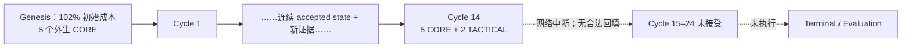

# 单 Strategy Agent 24 小时前瞻纸面实验中断复盘

## 1. 结论

本次不能裁定为“理论有效”，也不能裁定为“新系统仍然只是全程空仓”。准确结论是：

> 新系统在已接受的 14 个周期内，直接证明了连续战略状态、CORE/TACTICAL 分层、固定目标不再自动全平、保护后重入和动态 geometry 确实能够运行；但 24 小时实验因用户报告的约 8 小时网络中断只完成 14/24 个决策，缺少 terminal 和 7 个开放 lot 的后续结果。市场增量证据混合，路径概率的形式化又与当前核心理论冲突，因此本次只能封存为 `INTERRUPTED_PROSPECTIVE_PREFIX`，不能作为完整前瞻验证。

阶段性市场结果不是失败到毫无价值：Agent 成本后净 PnL 为 `-1.4851 USDT`，领先 STATIC_V1 `23.7610 USDT`、领先确定性持续政策 `28.9457 USDT`，但落后初始静态持有 `12.9772 USDT`，且四臂中最大回撤最高。更关键的是，Agent 的费前总边际只有 `+3.8735 USDT`，`5.3586 USDT` 的费用与 funding 已将其完全吞噬。它证明了新系统会分析、会持仓、会分层和重入；没有证明这些判断已产生稳定、成本后、风险调整的市场优势。

当前 P0 不是继续补跑旧窗口，而是先修正三类会让下一次结果失真的问题：中断必须有失败关闭状态；路径支持不得伪装成归一概率；八动作表必须真正比较不同市场路径下的收益、风险和机会成本。旧 run 不应恢复或拼接。

## 2. 审计边界与证据等级

- run：`single-agent-prospective-24h-20260803t085252z`
- 最后 accepted：cycle 14，`2026-08-03T22:05:26.296Z`
- accepted head：`33a770b0b83eff5b1e764201076c8edf6404225ba0e7ab94f8a27dfc73e60f10`
- 当前 checkpoint：`RUNNING_OUTCOMES_SEALED / completed_cycles=14 / next_cycle_index=15`
- 权限：`LOCAL_PAPER_RESEARCH_NON_EXECUTABLE / NONE_LOCAL_SIMULATION`
- 未读取或采集 cycle 15 以后行情；未调用 `collect`、`finalize` 或 `evaluate`；未打开 V1 decision/outcome。

证据分级如下：

1. **直接证据**：manifest、checkpoint、cycle 1–14 的 context/decision/state/receipt、原始公开请求收据和冻结逐轮报告；
2. **可复算派生**：摘要链、点时计数、成交/仓位/成本归因、三政策同截面 comparator、回撤和数据覆盖率；
3. **弱代理**：100 笔 recent trades、单次 20×20 order book、OI/funding/basis、多空比、Google News RSS 标题元数据；
4. **UNKNOWN**：中断八小时的逐请求错误、cycle 15–24 的市场结果、terminal 强制平仓/持有结果、完整 24 小时 path outcome。

数据质量复盘按“预定粒度、完整性、连续性、及时性、前视泄漏”检查；这避免用请求总数或字段存在代替市场可用性。

## 3. 实际停止边界

- 实际覆盖 `14/24 = 58.33%`，从首轮到末轮约 `13.09` 小时；四小时复盘完成 cycle `4/8/12`，即 `3/6`。
- 以最后一次 heartbeat `2026-08-04T06:05:23.657Z` 为时点，cycle 15–22 的八个截止点已经过去；实验终止时总计仍有 10 个计划决策未被接受。
- cycle 15 以后不存在 context、decision、pre-state、receipt 或 accepted state；无半提交 pending context。
- 运行没有 interruption/failure receipt，checkpoint 仍错误地显示 `RUNNING_OUTCOMES_SEALED`，同时也没有 terminal receipt 或 evaluation。这是状态治理缺陷，不是市场结果。
- cycle 14 的下一小时 `review_by` 和 `valid_until` 已在中断期间过期，路径本应在 `2026-08-04T00:00:19.280Z` 的 cycle 16 四小时复盘续期或淘汰。因没有新 accepted state，末态只能视为“最后合法状态但已经陈旧”，不能继续授权任何模拟动作。
- 24 小时定时任务 `24h-agent` 已删除，防止恢复网络后自动补写。冻结合同的 `no_backfill=true` 与最大迟到 90 分钟也使八小时后续跑不合法。

## 4. 完整性、点时与数据质量

| 检查 | 结果 | 裁决 |
|---|---:|---|
| 自摘要与链绑定 | 99 项复算，0 失败；逐轮 prior state、pre-state、decision、receipt、accepted state 全部吻合 | 直接支持状态链完整 |
| `available_at <= decision_at` | 47,429/47,429，通过 | 未发现前视 |
| 硬输入 | 84 个 symbol-cycle 的 instrument/mark/closed 15m，252/252 成功 | 执行前缀完整 |
| 市场请求 | 1,309/1,332 成功，98.27% | 23 个失败均保留 UNKNOWN；其中 22 个在 genesis 的非硬输入，另 1 个为 cycle 9 MU funding history TLS 失败 |
| 新闻查询 | 83/84 成功；context 内 293 行、72 个唯一 headline ID | 只有标题元数据，无正文与因果 |
| 高周期 lineage | 418/420 direct，2/420 由完整低周期 UTC 桶聚合 | 来源可追溯 |
| 技术状态 | 392/420 observed，28/420 UNKNOWN | 28 个均为 SNDK/MU 的 1W 历史不足，没有补零 |
| 周期及时性 | cycle 2–14 平均晚 `355.85s`，范围 `257–454s` | 未超过 90 分钟门，但每小时 90/108 请求的链路偏重且易受网络影响 |

数据层真实暴露的问题：

1. **时间粒度不一致**：所谓 recent trades 固定取最近 100 笔，不是固定一分钟或一小时窗口。82 个可用 symbol-cycle 中，100 笔覆盖跨度从 BTC 的 `0.013s` 到 MU 的 `60.002s`；不同标的、不同轮次的买方 quote share 不能直接横向或跨轮比较。它在多轮概率更新中被高频引用，因此会制造虚假的情绪跃迁。
2. **R 不可观测**：严格 liquidity resilience 在 84 个 symbol-cycle 中 `0/84` 可用；82 次有的只是单张订单簿。单快照能说明 spread/depth/imbalance，不能证明压力后的补单、撤离或吸收。
3. **F 与拥挤覆盖有限**：forced deleveraging 只在 23/84 次得到近期不完整行；hourly taker 为 24/84，global account ratio 为 21/84，top-position ratio 为 0/84。系统正确保持 UNKNOWN，但这些缺口使强平、拥挤和参与者情绪结论只能是弱推论。
4. **冲击字段语义错误**：82 个有订单簿的 symbol-cycle 中，69 个至少有一侧 `buy/sell_1000_impact_bps` 为负。计算相对 mark 而不是订单簿 midpoint，字段却像单边冲击幅度。Agent 没有引用这些字段，这是正确降级；实现仍应删除或重命名，避免以后误用。
5. **新闻不是完整事件研究**：84 次标的分析均填写四个情绪维度并实际引用了 126 个 headline evidence ref，说明并非“完全没分析情绪”；但标题重复、无正文、无 surprise、无事件到价格的因果时序，最多支持公开叙事背景。
6. **中断不可审计**：本轮网络中断没有逐请求 receipt 或 failure terminal，精确 endpoint、错误类型、开始/恢复时间只能保持 UNKNOWN。用户报告足以终止实验，不足以定位单一传输根因。

## 5. Agent 分析、路径与动作质量

### 已经成立的部分

- 84 个标的周期全部输出四个情绪维度、市场结论、证据增量、primary/runner-up、四条路径和八类动作比较；不是无分析的机械 WAIT。
- 共 336 张 path card，所有 episode 内 `path_id` 稳定；14 轮发生 21 次 primary 变化，路径权重平均绝对变化 `5.44` 个百分点，说明输出不是每轮原样复制；这不证明变化幅度正确。
- 共选择并执行 124 个动作，包含 13 次策略开仓、11 次 CORE trail、10 次 stop 调整、2 次 CORE 重入、1 次 CORE 减仓和 1 次战术退出；只有 12 次 WAIT。新系统没有复现“全程空仓”。
- 124/124 动作均 applied，所有 accepted state 均为 0 unprotected lot；组合开放风险最高为 `163.2480 USDT`，只占当时 3% 组合风险上限的 `54.87%`，没有突破硬风险。

### 新暴露的分析问题

1. **P0—归一概率不符合理论**：每轮强制四条路径合计 100%，但 `TREND_CONTINUATION` 与 `NORMAL_PULLBACK` 可以在同一路径先后共存，四类并非已证明互斥完备，也没有 `OTHER_PATH`、`partition_proof_id`、`calibration_version` 或 dependency group。`CORE_TRADING_THEORY_v2_1.md` §16.2/§16.5 与 T-027/T-031 明确规定无互斥/完备证明不得归一，`THEORY_AGENT_V2_THEORY_FORMALIZATION_AUDIT_v0_1.md` §3.10 只允许 ordinal support，作战手册 §7 也写明 primary 不是归一概率。用户当时要求逐轮概率判断，合同照此完整汇报；本次复盘确认“汇报要求的实现”和“核心理论边界”互相冲突。报告虽标注“主观、未校准”，仍把 336 个数当成 top-path 权重并据此升降；这些数只能降级为主观排序注释，不能用于概率准确率、EV 或置信度结论。
2. **P0—重复证据无法去重**：context/decision 中没有任何 `dependency_group`。同一底层价格变化会同时进入 trend、RSI、Bollinger、VWAP、量价描述和自然语言推论，无法证明权重变化没有重复计票。稳定的 evidence ref 也没有逐轮 instance/version，虽然整个 context digest 被绑定，但单项 `what_changed` 不能独立复算。
3. **P1—八动作比较“字段完整、反事实不足”**：672 张动作卡中，576 张 best/failure case 使用通用模板；84/84 个 symbol-cycle 给八种动作使用完全相同的 primary/runner-up path 集。至少 23 张 EXIT 卡甚至写成“若 TREND_CONTINUATION 展开，EXIT 捕获其预期收益”。这在逻辑上反向，不能称为严谨的持有/加仓/减仓/退出效用比较。symbol-specific reason 和唯一 HIGHEST 仍有信息，但表格完整率高估了 Agent 的真实比较能力。
4. **P1—概率变化缺少可复算更新规则**：平均变化 5.44 个百分点、最大单次 37 点，但没有先验、依赖聚合器、校准版本或数值更新 receipt。文字可以解释为什么排序变了，不能复算为什么是 54% 而不是 48%。
5. **P1—模型运行不可重复**：14 轮都有自然语言 attestation，但没有 served model、token/temperature 或相同输入重放证据。作者脚本只序列化当轮 Strategy Agent 判断；确定性风险和账本可重算，主观市场判断不能确定性重放。

## 6. 仓位、成交、风险与成本结果

### 终止截面的真实账本

- 初始权益 `10,000 USDT`；102% 初始成本使所有可比臂从 `-82 USDT` 开始，这测试的是逆风恢复能力，不是自然入场质量。
- cycle 14 equity=`9,998.5149`，成本后净 PnL=`-1.4851`；费前已实现=`-14.5276`、未实现=`+18.4011`、费用=`5.1626`、funding=`-0.1960`。
- 费前已实现加未实现为 `+3.8735`，总成本 `5.3586`，说明当前主动决策的毛边际尚不足以覆盖成本。
- 18 个 lot、25 笔 fill；终止时 7 个 lot 开放，角色为 5 CORE + 2 TACTICAL，gross=`4,624.4011`，stop 风险=`34.9070 / 299.9554 USDT`。
- equity 最低为 cycle 4 的 `9,888.9301`，最高为 cycle 10 的 `10,037.8566`；cycle 10 到 cycle 14 回吐 `39.3417 USDT`。最大回撤 `1.1107%`。
- 策略归因 lot 在 cycle 14 的费前已实现、未实现、费用合计后为 `+32.4252 USDT`；外生初始 lot 为 `-33.7143 USDT`，未分配 funding 前相抵为 `-1.2891 USDT`。这说明新增策略 lot 并非整体亏损，但因入场时点与外生 lot 不同，不能当作因果 alpha 证明。

### 同截止点对照

| 政策 | 成本后净 PnL | 最大回撤 | 费用 | funding | 开放仓位 |
|---|---:|---:|---:|---:|---:|
| Single Strategy Agent | `-1.4851` | `1.1107%` | `5.1626` | `-0.1960` | 7 |
| STATIC_V1 | `-25.2461` | `0.9159%` | `0.7755` | `-0.1349` | 1 |
| DETERMINISTIC_CONTINUOUS | `-30.4308` | `0.8815%` | `0.6852` | `-0.1060` | 5 |
| INITIAL_STATIC_HOLD | `+11.4922` | `1.0742%` | `0` | `-0.1445` | 5 |

这是截尾、同 mark 的阶段比较，不是 terminal 排名。Agent 的优势来自更主动的分层管理，代价是更高换手、费用和回撤；静态持有尚未支付退出费且仍全部 mark-to-market。七个 Agent 开放 lot 没有完成后续路径，不能用当前截面锁定最终结论。

### 执行层缺陷

1. 25 笔 fill 包含 13 次 entry、9 次 15m protective stop、1 次 CORE 减仓、1 次 Agent 战术退出和 1 次 15m target。SNDK 的真实战术 target 在 cycle 14 精确按 `1320.77` 成交，同时 CORE 只触发 checkpoint，正确解决了 V1 的“目标=全平”。
2. cycle 8 HYPE 的最后闭合 15m high 为 `54.43`，未触及 `54.4643` target；Agent 却按 decision mark 以 `54.534091` 退出，费前收益比 resting target 约乐观 `0.661 USDT`。这是“barrier 挂单”和“当轮市价退出”混合语义。
3. 固定费率、2/3 bps 滑点和 latest closed 15m funding mark proxy 可复算，但不含真实排队、部分成交、动态 spread/depth impact。它是成本模型，不是可执行成交证明。
4. cycle 1 接受态的外生 CORE lot contract 仍保留空 risk budget/旧 exit intent，到 cycle 2 才向前修正；cycle 5 把已有盈利的 HYPE partial take profit 错标为 infeasible，到 cycle 6 才纠正。两者没有改写历史，也说明 `action_fidelity_failures=[]` 只证明动作按提交执行，不证明分析语义全部正确。
5. schema 没有 `REENTER_TACTICAL`。MU 止损后的战术重开只能编码为 OPEN_TACTICAL，因此 `reentry_delays_hours` 只记录 `0.8666h` 和 `0.3406h` 两次，低估真实战术恢复行为。
6. 124 个动作全部通过、0 veto，并不能证明风险 veto 有判别能力；本轮动作在提交前已经按可行集合和风险预算调整，没有独立的非法/边界候选样本。

## 7. 对 V1 已知问题的逐项裁决

| V1 问题 | 本前缀裁决 | 直接依据 |
|---|---|---|
| 每轮从快照重建、上一战略状态不被消费 | **已解决（本前缀）** | 14 轮 state/pre-state/decision/receipt 链 0 断点；episode 跨轮更新 |
| CORE/TACTICAL 混同 | **已解决（本前缀）** | 目标、stop、checkpoint 均按 lot role 处理；末态 5 CORE + 2 TACTICAL |
| 固定目标自动全平 | **已解决（本前缀）** | SNDK/HYPE 战术兑现均未自动关闭 CORE |
| 退出后空仓成为吸收状态 | **部分解决** | SNDK/MU replacement、HYPE CORE 重入真实发生；但战术重入语义缺失，窗口未完成 |
| 没有 ReentryContract | **部分解决** | HYPE 保护退出后合同生成并在 `0.3406h` 履约；样本太少且 terminal 未完成 |
| 旧 geometry 成为永久门槛 | **本前缀未重现** | SNDK/MU 使用新 episode/new geometry 替换；中断后 cycle 14 geometry 过期但系统没有自动关闭状态 |
| 静态退出、不能动态 trail | **部分解决** | 11 次 CORE trail、10 次 stop move；仍有 HYPE 混合执行语义 |
| WAIT/空仓不计机会成本 | **部分解决** | 有 hold comparator 和有义务 WAIT；完整 path capture/最长空仓/terminal opportunity 尚不可算 |
| 没有市场情绪分析 | **部分解决** | 84 次四维情绪分析齐全；recent trades、R/F 和新闻质量不足，不能证明参与者情绪真值 |
| Agent 能力被规则限制为保守 | **本前缀不成立** | 13 次策略开仓、2 次重入、124 个动作；但动作反事实模板和非法概率限制了真正分析质量 |
| 调度/连续运行不可靠 | **未解决且再次发生** | 网络中断后缺 10 个决策，无 interruption receipt，run 状态仍显示运行中 |
| 盈利与市场有效性 | **未验证** | 截尾净亏、领先两交易臂但落后持有且 MDD 最高；无 terminal、无独立窗口 |

## 8. 问题优先级

### P0：下一次实验前必须解除

1. **中断状态不诚实**：添加一个最小、write-once `INTERRUPTED` receipt/status；保留最后 accepted head、缺失周期、原因来源和未决 lot，不允许旧 run 继续。
2. **理论与路径概率冲突**：取消当前四路径强制 sum100/top-probability。未有合法 partition/calibration 前，只输出 `LEADING/SUPPORTED/PLAUSIBLE/WEAK/UNKNOWN`、runner-up 和证据交换条件；加入 `OTHER/UNKNOWN` 与 dependency group。
3. **动作比较不构成真实反事实**：八类动作必须分别写清在 primary、runner-up 和 failure 下的盈亏、回撤、成本、机会损失与剩余风险，禁止同一个模板套八种动作。

### P1：可以在同一个最小 successor 中降级或修正

1. recent 100 trades 改成固定时间窗或至少附带实际跨度并禁止跨窗直接比较；单快照 R、近期 F、headline 继续显式弱代理/UNKNOWN。
2. 删除或改名相对 mark 的 signed impact；补 `REENTER_TACTICAL`，使重入义务和延迟可正确计量。
3. 统一 target/stop/Agent 市价退出的模拟语义；funding 和冲击继续标明代理，不声称 cost-complete。
4. 中断时将过期 path/geometry 标为 stale，并冻结所有本地纸面义务，避免控制面已停、状态面仍 RUNNING。

### 当前不能裁定

- 四条路径的概率准确率、4h/8h/24h calibration；
- Agent 是否优于持有、是否改善风险调整收益、是否长期覆盖费用；
- 未完成的 7 个开放 lot、cycle 14 后重入合同、path capture 与 opportunity cost；
- 网络中断的精确 endpoint 根因；
- 生产就绪、paper/live 权限或稳定盈利。

## 9. 唯一推荐下一步

不要恢复、补跑或终结旧 run。先做一个**只解决上述三个 P0 的最小 successor 合同**：中断可失败关闭；路径改为理论允许的序数支持和依赖去重；八动作改为真正的路径条件反事实。recent trades 与不可靠 R/F 先降级即可，不建设数据平台。完成同输入静态校验后，再由用户确认是否启动全新 chronology 的 24 小时不可执行纸面实验；新 run 必须从新的 genesis 开始，不能读取或拼接 cycle 15 以后的旧窗口结果。
