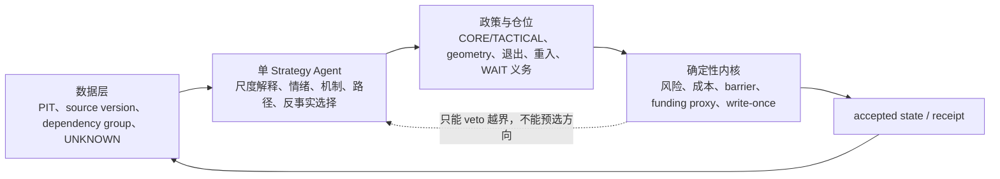

# 单 Strategy Agent 理论符合性修复与深层复盘

## 1. 最终裁决

旧的 14-cycle 前瞻前缀不能被重新解释为“Agent 已完全按照 Core v2.1 运行”。它在连续状态、CORE/TACTICAL、动态保护、目标后保留 CORE 和局部重入上明显优于 V1；但强制四路径 sum-to-100、没有 dependency group、八动作大量复用模板，构成真实的理论形式化偏差。旧结果仍是有价值的截尾市场证据，不是完整理论验证。

本轮已经把可定位的代码、合同和指导问题收敛到一个单 Agent successor：路径使用非归一序数支持且强制 residual OTHER；证据按权威 dependency group 去重并禁止跨轮重复增量；八动作必须分别对 operational lead、runner-up、OTHER 写仓位反事实；初始 lot、barrier、战术重入、funding、recent trades、盘口冲击、角色周期和中断状态均有明确真值语义。

因此当前可以裁定：

> **successor 的输入、输出和确定性校验已在结构上对齐 Core v2.1；旧 Agent 的 14 轮行为只属于“部分符合理论”。由于 successor 尚未启动新的市场周期，不能把结构符合性提前写成实际 Agent 已持续遵循理论、预测有效或成本后盈利。**

## 2. 四层职责现在如何对应

这不是 Agent 平台，也没有第二决策中心。Agent 仍可使用任意当时可得、来源可追溯的观测；代码只验证事实谱系、理论合同、状态、风险和执行语义。

## 3. 市场金融层的深层复盘

### 3.1 前缀的真实经济结果

- cycle 14 成本后净 PnL 为 `-1.485085302540... USDT`；费前已实现加未实现为 `+3.873507010830...`，费用与 funding 合计 `5.358592313371...`。成本是毛边际的 `138.34%`，不是一个可以忽略的尾项。
- Agent 费用 `5.1626` 约为 STATIC_V1 的 `6.66` 倍、确定性持续政策的 `7.53` 倍。主动性已经得到验证，但新增判断必须产生更高的边际质量，不能靠更多动作证明理论。
- Agent 领先 STATIC_V1 `23.7610`、领先确定性持续 `28.9457`，但落后 INITIAL_STATIC_HOLD `12.9772 USDT`。这意味着“修复固定退出”取得阶段性价值，“战胜少操作持有的机会成本”仍失败。
- 末态 gross notional 约占权益 `46.25%`，不是全程空仓；旧前缀账本记录的开放 stop 风险占权益 `0.349%`、占组合风险 cap `11.64%`。但该旧口径是 entry-to-stop 且未含退出成本，不是从当前权益出发的精确最坏损失；successor 已改为 current-mark-to-slippage-adjusted-stop 加退出费，因此不能沿用 `0.349%` 证明真实剩余风险很低。尾段 tight protection 与风险利用仍须由新窗口判断，不能后见放宽 stop。
- Agent 最大回撤 `1.1107%`，比持有高约 `0.0365` 个百分点；领先两交易政策并未同时形成更低回撤。当前没有风险调整优势证明。

### 3.2 102% 初始成本的正确解释

五个外生 CORE 以 genesis mark 的 102% 作为成本，开局约 `-82 USDT`。这是用户授权的逆风压力测试，不是 Agent 选择的入场，也不应纳入新增策略 alpha 归因。前缀中策略 lot 贡献为正、外生 lot 为负，说明策略层有增量，但不同入场时钟、截尾开放仓和非随机中断使它不能成为因果收益证明。

### 3.3 为什么不能再使用“路径概率”

`TREND_CONTINUATION`、`NORMAL_PULLBACK`、事件重定价和流动性压力可以同时或先后发生。它们不是互斥价格终态，强制加总 100% 会产生三个金融错误：

1. 新增 continuation 证据会机械压低 pullback，即使“上涨中的正常回撤”同时更受支持；
2. 重复的价格/技术文字会被当成多个独立概率增量；
3. 未覆盖机制和数据异常没有 residual，虚假的精确度会进入动作选择。

successor 只保留序数支持和 operational ordering。没有合法 partition/calibration 时不计算路径概率或 EV；动作通过路径条件的收益过程、失败过程、成本、尾部和机会成本做保守比较。这不会给出伪精确期望收益，但能让 Agent 在硬风险内实际选择。

## 4. Agent 设计层的深层复盘

### 4.1 旧系统为什么“字段齐全仍没完全按理论”

- `336` 张 path card 都有文字和数值，但数值违反 primitive mechanism 可共存边界；
- `672` 张动作卡形式齐全，`576` 张 best/failure 使用通用模板，至少 `23` 张 EXIT 把 long continuation 写成有利过程；
- `action_fidelity_failures=[]` 只证明执行器忠实执行所提交动作，不证明动作比较逻辑一致；
- 124/124 动作通过只说明提交前已做可行化，不能证明风险内核能拒绝越界样本；
- 每轮 attestation 不能证明相同模型、token、temperature 或自然语言输出可复现。

所以“有分析字段”“引用了理论”“动作被 applied”不是理论符合性的充分条件。

### 4.2 successor 如何让理论符合性可检查

1. **路径集合**：至少五条稳定 identity，四条市场路径加 `OTHER_OR_UNKNOWN`；OTHER 只绑定 `OTHER` mechanism。
2. **支持边界**：只接受 `DOMINANT/SUPPORTED/PLAUSIBLE/WEAK/INVALIDATED/UNKNOWN`；存在 `probability_pct`、sum-to-100、top probability、margin、entropy 或 EV 即失败。
3. **合法竞争边界**：固定输出 `UNKNOWN_NO_VALID_COMPETITION_SET`；operational lead/runner-up 只用于动作排序，不冒充概率 top path。
4. **证据 ledger**：exact nine fields 与 context 的 available_at、source version、dependency group 完全匹配；非 `VALID` 不改变支持。
5. **同源去重**：同一 target/group 只取绝对强度最大证据，稳定 evidence ID 破同值；episode 累积保存 consumed keys，相同增量不能跨轮再计。
6. **动作反事实**：八类动作都覆盖 lead、runner-up、OTHER，且分别记录 position effect、兼容性、兑现、失败、机会成本和成本风险；完全重复模板、语义倒置和“选了但声明不可行”会失败。
7. **决策证据标签**：固定为 `PRACTICAL_SINGLE_AGENT_JUDGMENT`，明确自然语言判断不是 transport-attested 或确定性重放证据。

### 4.3 仍然保留的 Agent 自由

校验器没有固定方向、概率、仓位比例、必须交易次数或指标阈值。Agent 可将同一证据同时指向多个机制，可在 hard risk 内持有、加仓、减仓、退出和重入，也可在明确相对效用下等待。dependency group 只防重复贡献，不规定哪条机制必须领先；operational lead、support level、geometry 和动作仍由单 Agent 解释与选择。

### 4.4 当前理论符合性的边界

dependency group 能消除同一冻结增量的确定性重复计票，但不能证明不同时间尺度、venue 或代理在统计上独立。序数支持能避免伪概率，但不能自动保证排序正确。动作语义检查能拒绝明显倒置和模板复用，但不能机器证明自然语言反事实具有市场洞察。这些只能由新的连续未见 outcome 审计。

## 5. 数据、状态与执行修复

### 5.1 数据真值

- recent trades 现在报告请求条数、原始/有效条数、首末交易时间、真实跨度，并固定标记 `LATEST_N_TRADES_NOT_FIXED_TIME_WINDOW` 与 `cross_cycle_comparable=false`；没有伪装成统一一分钟情绪。
- order book buy/sell impact 改用有效 best bid/ask midpoint，输出非负 adverse impact；锁定/交叉簿保持 UNKNOWN。单快照仍明确不能证明补单韧性。
- 每个 evidence ref 带 capture/version 和权威 dependency group；技术证据以该 timeframe 最新闭合 bar 作为 group 版本，未新增闭合 bar 时不能跨轮重复增加支持。
- SNDK/MU 使用带现金市场 gap/时段限制的 equity-reference profile；四个 24/7 crypto swap 使用各标的独立 profile。相同周期文字不再声称是通用 BTC 模板。
- strict R、完整强平、top-position、新闻正文与参与者身份仍不可得；正确结果是 UNKNOWN/弱代理，不是造数据或扩大平台。

### 5.2 Genesis 和连续仓位

- 每个外生初始 CORE 在首轮 Agent 输入前已有 episode、role、102% cost、`genesis mark - 2×1h ATR14` stop、风险预算、management checkpoint、geometry、退出意图和 24h horizon；不再到 cycle 2 才补合同。
- `REENTER_TACTICAL` 成为独立动作；它要求同 episode 已有真实 tactical exit、当前没有仍开放 tactical lot，并从真实 exit fill 计算 delay。已有 tactical lot 时必须使用 ADD，不能把加仓伪装成重入。
- profitable open position 的 HOLD、REDUCE、PARTIAL 和 EXIT 不允许被“谨慎”标记为不可行；这直接阻止 cycle 5 同类的 partial-profit 误标。ADD/OPEN/REENTER 仍可因具体风险或数据 veto 不可行。
- 开放 lot 的硬风险改为当前 mark 到含冻结止损滑点的 stop fill，再加退出费；active pending order 优先使用已登记的成本后 risk budget。负 funding 代理会降低有效权益与风险容量，正 funding 也不能把容量抬高到初始权益以上。这修复了盈利仓 stop 仍落后于 mark 时被旧 entry-to-stop 口径低估的组合回撤。

### 5.3 barrier、funding 和中断

- 新闭合 15m bar 仍按 stop-first 重放；若公开 last trade 在 decision boundary 已越过尚未处理的冻结 stop/target，barrier 先按冻结价格成交，Agent 不能随后用更优市价覆盖。CORE checkpoint 仍只触发审查，不自动退出。
- funding 状态改为 `MODELED_OKX_REALIZED_RATE_WITH_CLOSED_15M_TRADE_PRICE_PROXY_ACCRUAL`。它是 realized public rate 和闭合成交价代理的模拟应计，不称真实 settlement mark 或账户现金流。
- 原 run 已写入 write-once interruption receipt，digest=`0917660fc3f5acfed5a55c37c73a0e58248a342eb18e6238c31eac41f5415e25`；checkpoint 已变为 `INTERRUPTED_OUTCOMES_SEALED / completed=14 / next=15`。accepted state digest 仍为 `33a770...f10`，cycle 15 context 仍不存在，collect 会在任何网络调用前拒绝。

## 6. 全部已知问题裁决

| 问题 | 当前裁决 | 说明 |
|---|---|---|
| 中断后仍显示 RUNNING、无失败回执 | **已解决** | write-once interruption receipt、不可恢复状态、幂等关闭 |
| 四路径强制 sum100、无 partition/calibration | **已解决（结构）** | 序数支持、OTHER、非法数值概率 fail closed；市场排序仍待验证 |
| 同源指标/文字重复计票 | **已解决（确定性同源）** | 权威 dependency group、max-abs 聚合、跨轮 consumed key；统计相关性仍未知 |
| 八动作模板化、EXIT 语义倒置 | **已解决（结构）** | 三路径逐动作反事实、重复模板和明确倒置拒绝；洞察质量待市场验证 |
| recent 100 trades 窗口不可比 | **已解决（语义）** | 真实跨度披露并禁止跨轮直接比较；未建设固定窗 stream |
| signed impact 相对 mark 出现负值 | **已解决** | midpoint + nonnegative adverse legs；strict resilience 仍 UNKNOWN |
| `REENTER_TACTICAL` 缺失和 delay 少计 | **已解决（结构）** | 新动作、同 episode/role/exit receipt/delay；实际履约待新窗口 |
| target barrier 与下轮更优市价混合 | **已解决（结构）** | closed bar + visible last trade barrier 优先；真实 queue/partial fill 仍未模拟 |
| funding 代理被称 settlement | **已解决（表述和账本）** | 真实 rate + trade-price proxy 明示；账户现金流不可得 |
| cycle 1 初始 lot contract 不完整 | **已解决** | Agent 输入前完成保护、风险和管理合同 |
| cycle 5 partial take profit 被误标 infeasible | **已解决（校验）** | 有仓时 HOLD/REDUCE/PARTIAL/EXIT 必须保持可行 |
| 0 个 risk veto 不能证明判别能力 | **部分解决** | 合成边界验证合法新风险通过、trade/symbol cap 越界被 veto；真实窗口样本待观察 |
| 开放风险按 entry-to-stop 且漏退出成本/funding | **已解决（结构）** | current mark 到滑点后 stop 加退出费；pending risk budget 与 funding-adjusted equity 进入同一硬门；真实窗口数值待观察 |
| 模型运行不可重复却可能被高估 | **已解决（证据声明）** | 降级为 practical judgment；自然语言生成仍不具确定性重放证明 |
| BTC 周期职责被通用于所有标的 | **已解决（结构）** | 每标的 profile；SNDK/MU 加 reference-session caveat |
| 严格 R、完整 F/C、新闻正文不可得 | **数据不可判** | 保持 UNKNOWN/弱代理；未用平台建设伪装解决 |
| 高请求量与网络脆弱 | **部分解决** | 中断可诚实失败关闭；精确网络根因未知，尚未证明新窗口能连续完成 |
| 成本吞噬毛边际、落后持有 | **市场问题未解决** | 不以代码或放宽风险后见修复；必须由新 Agent 决策和新 outcome 验证 |
| CORE 全退后跨 regime 重入 | **结构已解决但市场未充分验证** | contract 和 action 存在；旧前缀样本太少且 terminal 缺失 |
| 预测有效、稳定盈利、生产就绪 | **未验证** | 不能由工程 PASS 或 14-cycle 截尾前缀证明 |

## 7. 验证证据与冻结物

- 旧 run interruption receipt 通过 self-digest；重复调用返回同一 digest；status 为 `INTERRUPTED_OUTCOMES_SEALED`，cycle 15 collect 在网络前返回 `RUN_NOT_COLLECTABLE`。
- cycle 14 accepted state、Agent decision 和 receipt 未被改写；accepted state physical SHA-256=`a638532ca16e17af717b1e490a25dc0405052204ac2cf1cb20ca0aa21dbcefb9`。
- 旧 prefix comparator 仍以相同 digest=`1fa1734e4b3c87f435bd64a5a41e46d453f04607b4ddc681c7f47a65409da09e` 复算原阶段结果，说明 funding 字段兼容没有改变旧结果。
- 35 项本切片测试通过；243 项 Theory Paper V2 相邻回归通过；25 项旧 market/theory/inference 回归通过。测试覆盖数值概率拒绝、OTHER、依赖组 max-abs、跨轮增量复用拒绝、动作语义倒置、partial 可行性、合法风险与 cap veto、current-mark 成本后开放风险、负 funding 风险容量、战术重入 exit time、Genesis 合同、visible-last barrier、recent-trade span、midpoint impact 和中断幂等。
- successor playbook=`config/single_strategy_agent_research_playbook.v3.md`，SHA-256=`bcfb08bcdc1d79f512c7ed5a5f01637170e8b07e6b444b6af98f601f29568c76`。
- successor template=`config/theory_paper_v2.prospective_24h.v1_3.json`，physical SHA-256=`231a2ff1b61982760e44e1da4b20c613647df4079975ab0ba476ce62e7ddefb4`，canonical digest=`3b254e44041696353bd8133381124cc37baab8a5b201ce216b5f05d1fb6ca1a2`；`start_authorized=false`，不会启动市场采集。

## 8. 唯一下一步

保持旧 run 封存，不再修改理论或合同。下一步只能是在用户重新确认后，把 `start_authorized` 作为唯一授权变更冻结到新模板，并从新的 genesis、全新 chronology 开始一次完整 24 小时未见实验。该实验首先检验 Agent 是否实际提交符合 v3 的证据 ledger、序数路径和动作反事实，其次才比较成本后 PnL、回撤、路径捕获和持有机会差；未完成 terminal 前不修改规则。
