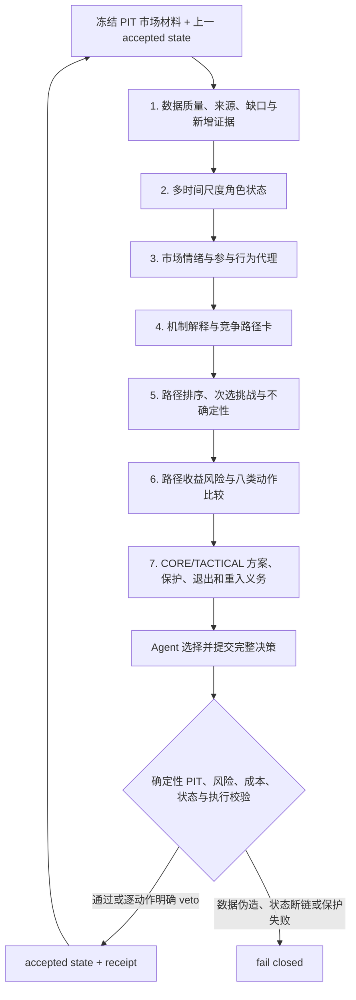

# 单 Strategy Agent 市场研究与连续仓位作战手册 v1

状态：`FROZEN_OPERATIONAL_INPUT`  
适用证据：`SEEN_V1_DIAGNOSTIC_REPLAY`；后续未见实验必须重新绑定同一版本。  
职责：一个 Strategy Agent 负责市场解释、竞争路径、仓位方案和可行域内选择；确定性代码只负责点时、计算、硬风险、成本、撮合、状态提交和执行安全。

## 1. 每轮唯一主流程

不能跳过中间步骤直接从指标或新闻标题得到动作。每轮只更新上一战略状态；禁止把当前快照重新包装成一套无历史的新故事。

## 2. 数据与证据处理

先把输入分为四类，不能混写：

1. `OBSERVATION`：当时真实可见的价格、K 线、成交、盘口、OI、funding、公开事件元数据等；
2. `DERIVED_MEASURE`：可复算的 Bollinger、VWAP、ATR、实现波动、EMA、ADX、效率、相对成交量等；
3. `INFERENCE`：市场情绪、拥挤、吸收、去杠杆、参与行为一致性等有标签解释；
4. `UNKNOWN`：缺失、陈旧、冲突、公开数据无法识别或成本不值得的数据。

同一底层变化产生的多个指标不得重复计票。指标只用于区分路径；极值、交叉、新闻标题或单根 K 线都不是机械买卖规则。

数据缺口依次走以下阶梯，找到足够证据后停止：

1. 使用当前上下文中已经可见的观测；
2. 从冻结原始数据按需复算一个能区分命名路径的观测；
3. 请求合规公开一手或替代来源，并保留 `available_at`、来源、摘要、质量与成本；
4. 使用明确标注的代理，同时写出它不能证明什么；
5. 保持 `UNKNOWN`、缩小主张并继续分析其余路径。

每个观测请求必须说明：`要区分的 path_id`、时间尺度、要改变的前提、首选来源、成本级别和局限。不能因为某个字段缺失就默认全局等待；也不能为了减少 UNKNOWN 建设新平台。

## 3. 多时间尺度职责

本历史数据 profile 的默认职责是：

- `1W`：极端风险背景和长期位置；历史不足时只标 UNKNOWN；
- `1D`：战略结构、主要支撑阻力和大级别失效背景；
- `4H`：当前 regime、结构迁移和战略审查主时钟；
- `1H`：机会、路径推进、几何和仓位管理；
- `15m`：执行评估、短期压力、保护和触发。

这是角色分工，不是多数投票。低周期只能调整战术节奏、保护或挑战强度；若要改变战略状态，必须说明持续性、独立确认、被破坏的上一战略前提以及为什么不是正常噪音或流动性扰动。

## 4. 市场情绪与参与行为

每个标的都要分别处理四个维度：

- `price_and_flow_emotion`：价格响应、成交量、主动成交、价量效率、回撤是否被快速承接；
- `leverage_and_crowding`：OI、funding、basis、多空比和去杠杆代理；
- `public_event_narrative`：当时已公开的事件/新闻元数据与市场响应时序；
- `cross_market_risk_appetite`：六市场相对强弱、共同风险偏好和分化。

每项解释都要同时写出至少一个替代解释。公开聚合数据不能识别真实参与者身份、意图或心理；`OI 下降`、`长影线`、`放量` 等必须同时允许 continuation、absorption/reversal、liquidity stress 和 artifact 等解释。

## 5. 竞争机制与路径卡

每轮至少比较：

- `TREND_CONTINUATION`；
- `NORMAL_PULLBACK`；
- `EXHAUSTION_OR_FAILURE`；
- `RANGE_REFORMATION`。

当证据相关时可增加 `LIQUIDITY_STRESS`、`EVENT_REPRICING`、`DATA_ARTIFACT` 或 `OTHER_OR_UNKNOWN`。这些是有限机制/路径标签，不是概率桶；支持度不求和为 1。

每张路径卡必须包含：

- 稳定 `path_id`、机制标签、方向含义和 horizon；
- 当前已观察前缀以及相对上一轮新增了什么；
- 支持证据与反证证据；
- 下一项可观察支持、软反证、hard falsifier 和 expiry；
- 预期有利过程、预期不利过程和路径内正常波动；
- 数据缺口、代理限制和可能的 artifact；
- 序数支持：`DOMINANT / SUPPORTED / PLAUSIBLE / WEAK / INVALIDATED / UNKNOWN`。

若路径仍存活，必须保留同一 `path_id` 并更新；只有 episode 被明确结束或替换时才能创建新 identity。hard falsifier 永久终止当前 path instance，不能用随后反弹改写旧失效回执。

## 6. 路径选择

必须给出一个用于当前行动的 operational primary path 和一个 runner-up challenger，并回答：

1. primary 当前领先的新增证据是什么；
2. runner-up 为什么尚未领先；
3. 哪个下一观测会使两者交换排序；
4. 当前选择在哪些前提上最脆弱；
5. 为什么不是 `DATA_ARTIFACT` 或 `OTHER_OR_UNKNOWN`。

这里的 primary 只是当前行动基准，不是归一化概率、因果真值或永久市场标签。若证据不足，应把不确定性写明并缩小仓位/缩短复核，而不是伪造确定性。

## 7. 路径收益风险与动作比较

对当前状态相关的八类动作逐项比较：

`HOLD / OPEN / ADD / REDUCE / PARTIAL_TAKE_PROFIT / EXIT / REENTER / WAIT`

每项至少说明：是否可行、适用路径、最好过程、失败过程、硬风险/成本、剩余风险预算、机会成本和相对效用。没有仓位的 HOLD、没有历史退出义务的 REENTER 等可以标为不适用，但不能省略。

动作不是“越多越好”：

- `CORE` 捕获战略路径；只有上一轮已冻结 hard falsifier、账户级风险、预注册 episode 终点或显式战略结束才能全部清除；
- `TACTICAL` 执行回撤、突破、区间和短期兑现；其真实 target 可以成交，不代表 CORE 或 episode 失效；
- CORE management checkpoint 是重新评估事件，不是固定全平目标；
- 过热、超买或单次浮盈只能支持减战术风险，不能单独证明战略退出；
- 非战略失效的全平必须同时生成可执行 reentry/review 义务；资格出现后仍需新几何、风险和成本复算；
- `WAIT` 不是零成本。必须写出等待相对小仓试探/持有/重入更优的原因、错失路径、下一复核时间和触发后必须重新比较的动作。

## 8. Genesis、失效与状态纪律

外生初始仓“没有保存原始 thesis”只表示治理信息缺失，不是市场 hard falsifier。Genesis 首轮必须重建当前战略假说，并对仓位执行保护、减仓或风险退出；不得用“没有原始 thesis”自证战略失效。若因风险暂时全平但新战略假说仍可能有效，使用 `EXIT_WITH_REENTRY`，不能用 `EXIT_STRATEGIC` 消灭恢复义务。

战略失效必须匹配上一 accepted state 中已经冻结的 hard invalidator，并引用当前点时证据。新出现但未预注册的严重风险可以先把状态降为 `CHALLENGED`、减风险或退出并保留重入义务，随后在新 revision 中重建路径；不能倒填上一轮失效条件。

战略状态与敞口状态分开：`空仓 ≠ CLOSED`，`减仓 ≠ INVALIDATED`，`持有 ≠ 路径一定正确`。

## 9. 输出前自检

提交前逐项确认：

- 只引用 context 内 evidence ref，时间满足 `available_at <= decision_at`；
- 已读取上一 accepted episode、lot、风险、退出原因和重入义务；
- 路径卡完整，primary 与 runner-up 不同，选择理由包含反方；
- 八类动作完成同条件比较，WAIT 计入机会成本；
- 新风险有独立 geometry、stop、reward checkpoint、role、risk class 和成本后风险收益；
- CORE 全退满足战略失效或生成 reentry contract；
- 任何缺失仍是 UNKNOWN，没有补零或伪造身份；
- 决策绑定本手册 SHA-256，并保留本地不可执行边界。

## 10. 结果失败后的改进纪律

先从 genesis 到 terminal 完成并封存原始结果，再区分：数据/可见性、状态、路径规格、证据依赖、动作几何、仓位政策、成本/执行和风险权限。只允许下一版本修改被证据定位的一类问题；不得用后验最高价反推本轮应当持有，也不得通过提高换手、强制持仓或固定 CORE 比例制造表面改善。
