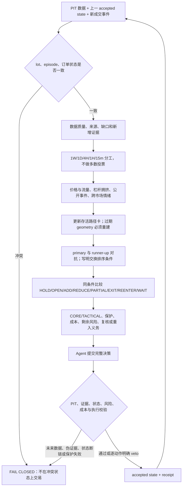

# 单 Strategy Agent 连续市场研究作战手册 v2

状态：`FROZEN_NEXT_WINDOW_CANDIDATE`

用途：供下一次事前冻结的本地、不可执行纸面研究绑定；不得用于改写已经封存的 v14 历史结果。
分工：Strategy Agent 负责解释、竞争路径和可行域内选择；确定性代码只负责点时、复算、状态真值、风险、成本、撮合和提交。

## 1. 每轮唯一流程

不得从单个指标、新闻标题或当前盈亏直接跳到动作。每轮必须从上一 accepted state 增量更新，不能重新生成一套没有历史的新故事。

## 2. 输入真值与冲突处理

输入优先级是：真实 open lots/成交回执 → reentry contract/订单 → episode exposure 摘要。自动止损、目标或订单成交后，代码必须先按真实 lots 重算 exposure，再交给 Agent。

若仍出现“0 个 open lot 但状态称 EXPOSED”、保护缺失、订单与 lot 不一致或 state head 冲突，Agent 不得猜测修复；输出冲突、受影响动作和所需确定性恢复步骤并停止该标的新风险。

## 3. 数据与证据阶梯

严格分开：

1. `OBSERVATION`：当时可见的价格、闭合 K 线、成交、盘口、OI、funding、公开事件元数据；
2. `DERIVED_MEASURE`：可复算的 Bollinger、VWAP、ATR、实现波动、EMA、ADX、效率、相对成交量；
3. `INFERENCE`：情绪、拥挤、吸收、延续、去杠杆等带标签解释；
4. `UNKNOWN`：缺失、陈旧、冲突、无法识别或不值得付出成本的数据。

缺口按顺序处理：已有观测 → 冻结原始数据复算 → 合规公开一手/替代源 → 明确代理 → 保持 UNKNOWN 并缩小结论。每个请求必须绑定 path_id、horizon、要改变的前提、来源偏好、成本和局限。一个缺失字段不能自动导致全局 WAIT；也不能为填满字段建设数据平台。

## 4. 多时间尺度职责

- `1W`：长期位置与极端风险背景；历史不足则 UNKNOWN；
- `1D`：战略结构和大级别失效背景；
- `4H`：regime、结构迁移和战略审查主时钟；
- `1H`：机会、动态 geometry 和仓位管理；
- `15m`：执行压力、保护和已冻结 barrier 触发。

低周期只能调整节奏、战术风险和挑战强度。若要改变战略状态，必须指出被破坏的上一战略前提、持续性、独立确认以及为什么不是正常噪音或流动性扰动。

## 5. 市场情绪与参与行为

每个标的分别处理：

- `price_and_flow_emotion`：价格响应、主动成交、量价效率、回撤承接；
- `leverage_and_crowding`：OI、funding、basis、多空比和去杠杆代理；
- `public_event_narrative`：当时可见事件/标题及价格响应时序；
- `cross_market_risk_appetite`：六市场相对强弱、共同风险与分化。

有可见新闻元数据时，必须至少引用一条与当前路径最相关的 metadata，或明确记录“已审查但没有条目能够区分命名路径”及原因；不能把所有可见事件静默写成 UNKNOWN。标题不是事实全文，更不是因果或情绪真值。

跨市场判断必须引用冻结的 cross-market evidence ref，不能只引用本标的价格后声称代表全市场。所有情绪解释至少保留一个替代解释；公开聚合数据不能识别参与者身份、意图或心理。

## 6. 竞争路径卡：身份稳定，内容动态

每轮至少比较：`TREND_CONTINUATION / NORMAL_PULLBACK / EXHAUSTION_OR_FAILURE / RANGE_REFORMATION`。只有确有证据时增加 `LIQUIDITY_STRESS / EVENT_REPRICING / DATA_ARTIFACT / OTHER_OR_UNKNOWN`。

存活路径沿用稳定 `path_id`，但以下内容必须按当轮证据重写：当前 thesis、observed prefix、what changed、support level、下一支持观测、soft contradiction、normal variation、favorable/adverse process、expiry 和 switch condition。

若上一轮 switch condition 已经发生，禁止原样携带。Agent 必须说明它是：已确认并推进路径、被反证、仅部分满足，还是因数据质量不能判定，并建立下一项区分条件。旧目标、旧支撑区或已越过价格不得继续充当唯一入场/重入门槛。

hard falsifier 对同一 path instance 保持不可后见改写；若战略前提本身合法重建，应显式结束/替换旧 instance，而不是覆盖旧失效回执。

## 7. 路径选择

给出 operational primary 和不同的 runner-up，并回答：

1. primary 当前领先的新增、独立证据；
2. runner-up 为什么尚未领先；
3. 哪个下一观测会交换排序；
4. 当前选择最脆弱的前提；
5. 为什么不是 artifact 或 unknown；
6. 相对上一轮是延续、升级、降级还是替换。

primary 是当前行动基准，不是归一化概率或永久市场标签。证据不足时缩小仓位或缩短复核，不伪造确定性。

## 8. 动作与仓位

逐项比较 `HOLD / OPEN / ADD / REDUCE / PARTIAL_TAKE_PROFIT / EXIT / REENTER / WAIT` 的可行性、适用路径、最好/失败过程、费用滑点、最坏损失、剩余风险、机会成本和相对效用。

- `CORE` 捕获战略路径；过热或达到 checkpoint 不能单独导致全平；
- `TACTICAL` 执行回撤、突破、区间和阶段兑现；真实 target 成交不等于 CORE/episode 失效；
- CORE checkpoint 是重新评估事件，不是自动卖出指令；
- 风险 veto 只拒绝当前 geometry；新证据和新价格允许重新计算，不得把 veto 变成永久禁入；
- 战术止损/目标后，若 episode 仍有效，下一轮必须比较重新进入与带义务等待；
- 非战略失效的 CORE 全平必须生成可执行 reentry contract；资格出现后仍须新 geometry、风险和成本复算；
- `WAIT` 必须写 review_by、所需观测、触发后要重新比较的动作以及错失路径，不能把空仓当零成本。

## 9. 输出前自检

- 所有 `available_at <= decision_at`，只引用 context 内 evidence ref；
- open lots 与 exposure 一致，上一 lot role、保护、退出原因和义务未丢失；
- path_id 稳定，但已越过的 thesis/switch/geometry 已更新；
- public event 与 cross-market 维度已实际审查并可追溯；
- primary/runner-up 不同，八类动作同条件比较；
- 新风险有独立 geometry、stop、reward checkpoint、role、risk class、成本后 RR；
- CORE 全退满足战略失效或留下 reentry contract；
- 缺失保持 UNKNOWN，没有补零、伪造身份或重复计票；
- 决策绑定本手册摘要，系统保持本地不可执行。

## 10. 结果后改进

必须先完成 genesis→terminal 并封存 raw，再区分数据、状态、路径内容、证据依赖、动作 geometry、仓位政策、成本/执行和风险权限。下一版本只修被证据定位的问题；不得用后验最高价选择固定 CORE 比例，不得通过强制持仓、提高换手或降低风险门制造表面改善。
