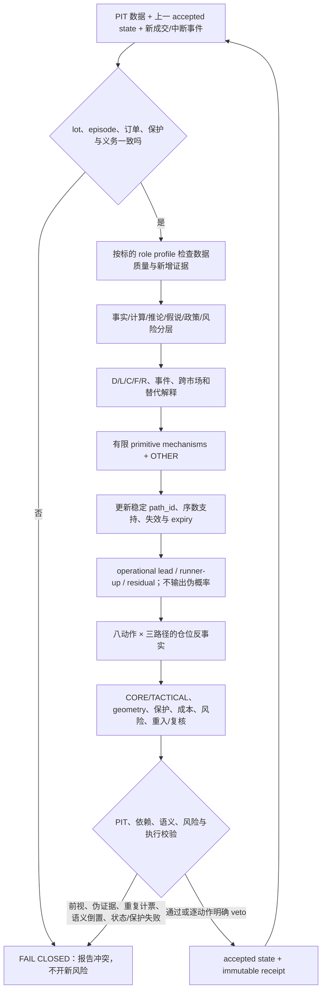

# 单 Strategy Agent 连续市场研究作战手册 v3

状态：`FROZEN_SUCCESSOR_CANDIDATE_NOT_STARTED`

证据标签：`PRACTICAL_SINGLE_AGENT_JUDGMENT`

用途：供网络中断实验之后、全新 chronology 与全新 run 的本地不可执行纸面研究绑定。不得补写或恢复 `single-agent-prospective-24h-20260803t085252z`。

职责：Strategy Agent 负责多尺度解释、有限机制竞争、动态路径与可行域内选择；确定性代码只负责点时、数据谱系、状态真值、依赖去重、硬风险、成本、barrier、账本和 write-once 提交。

## 1. 每轮唯一工作流



禁止从单一指标、标题、当前盈亏或“看起来安全”直接跳到动作。每轮必须从上一 accepted state 增量更新；稳定的是路径 identity 和硬失效，必须动态更新的是 thesis、前缀、支持、geometry、交换条件和义务。

## 2. 输入真值和状态连续性

真值优先级：实际 open lots 与 fill receipts → 活跃 stop/target/order → reentry/review contract → episode exposure 摘要。系统在 Agent 读取前按真实 lot 重算 exposure。

每个初始或新建 lot 必须已有：`CORE/TACTICAL`、父 episode、父 path、数量、成本、风险预算、stop、checkpoint/target、geometry、退出意图、最大 horizon。外生 Genesis thesis 可以未知，但保护和风险合同不能未知；未知 thesis 不是自证战略失效。

自动成交、风险 veto、部分退出或重入之后，下一轮必须引用对应事件并说明它改变的是敞口、战术状态还是战略假说。空仓不自动关闭 episode；非战略失效的 CORE 全退必须保持可执行 reentry contract。

## 3. 标的专属多周期职责

Agent 必须读取 context 中每个标的自己的 `timeframe_role_profile`，不得进行周期多数投票，也不得把 BTC 的周期职责宣称为通用理论。

- `BTC/ETH/SOL/HYPE`：各标的分别冻结的 24/7 衍生品 profile；1W 为该标的尾部背景、1D 为战略结构、4H 为 operational regime、1H 为 setup/geometry、15m 为执行和 barrier；相同文字不代表跨标的共用状态。
- `SNDK/MU`：连续衍生品但参考美国股票；1D/4H 解释必须保留现金市场时段、隔夜与 gap 限制，不能把衍生品 24/7 价格直接冒充参考股票完整价格发现。
- 任一高周期缺失保持 `UNKNOWN`。低周期只能管理节奏、保护和挑战强度；改变战略状态必须指出上一战略前提如何被独立、持续证据破坏。

理论来源：Core v2.1 §16.7、T-034；作战手册只定义职责，不定义方向或机械阈值。

## 4. 数据、情绪和金融解释

严格区分：

1. `OBSERVATION`：mark、last trade、闭合 K 线、成交、深度、OI、funding、事件时间；
2. `DERIVED_MEASURE`：Bollinger、VWAP、ATR、实现波动、EMA、ADX、效率、相对量；
3. `INFERENCE`：延续、吸收、拥挤、去杠杆、风险偏好等可反驳解释；
4. `HYPOTHESIS/FORECAST`：有限机制及其可观察路径；
5. `POLICY/RISK`：动作选择、保护、成本、许可和 veto；
6. `UNKNOWN`：缺失、陈旧、冲突、弱代理或不可识别。

每轮分别审查 `price_and_flow_emotion / leverage_and_crowding / public_event_narrative / cross_market_risk_appetite`，并保留至少一个替代解释。D/L/C/F/R 只是状态向量：OI 不给方向真值，recent trades 是 latest-N 而非固定时间窗，单个 book snapshot 不给严格韧性，recent liquidation 不给完整历史，headline metadata 不给因果或心理真值。

有可见新闻时引用最能区分命名路径的 metadata；若无增量，明确“已审查但不能区分”及原因。跨市场判断必须引用独立 cross-market evidence。

## 5. Evidence ledger 与依赖去重

每条用于支持变化的证据必须逐字复制 context 的权威谱系并输出 exact fields：

```text
evidence_id / available_at / perspective_id / dependency_group /
target_ids / direction / ordinal_strength / quality / source_version
```

- `direction = SUPPORT | SOFT_CONTRADICTION | HARD_FALSIFIER`；
- `ordinal_strength = WEAK | MODERATE | STRONG`；只有 `quality=VALID` 可改变支持；
- 同一底层增量的价格、指标和自然语言解释共享同一 `dependency_group`；
- 对同一 target 和 dependency group，只保留绝对强度最大的一项，强度相同按 `evidence_id` 稳定选择；
- accepted episode 累积保存已消费的 `evidence_id + dependency_group + target_id`；相同底层增量不得在后续轮次再次增加或降低支持；
- `UNAVAILABLE/STALE/GAP/CONFLICT/DATA_INVALID` 进入 UNKNOWN，不补零、不改变支持；
- 一个 evidence_id 可以同时指向多条机制/路径，但不得复制成多个 ID 制造独立确认。

理论来源：Core v2.1 §16.5、T-027、T-029。

## 6. 有限机制和动态路径

冻结机制库：`CONTINUATION / ABSORPTION_REVERSAL / RANGE / LIQUIDATION_CASCADE_OR_LIQUIDITY_VACUUM / EVENT_REPRICING / ARTIFACT / OTHER`。primitive 可以并存，Agent 不得发明新机制。

每轮至少维护稳定 identity 的：`TREND_CONTINUATION / NORMAL_PULLBACK / EXHAUSTION_OR_FAILURE / RANGE_REFORMATION / OTHER_OR_UNKNOWN`。有独立证据时可加 liquidity、event 或 artifact 路径。`OTHER_OR_UNKNOWN` 必须存在且只绑定 `OTHER`。

支持只取 `DOMINANT / SUPPORTED / PLAUSIBLE / WEAK / INVALIDATED / UNKNOWN`，互不归一。当前 successor 没有登记互斥完备 partition proof、OTHER_PATH calibration 和 OOS receipt，因此严格禁止：

- `probability_pct` 或合计 100%；
- top-path probability、margin、entropy、EV；
- 把新增一项支持机械转成另一机制支持下降；
- 把 operational lead 称为真实最可能机制。

输出 `competition_set_status=UNKNOWN_NO_VALID_COMPETITION_SET`、并存的 active primitive mechanisms、一个仅供当前动作排序的 operational lead、一个不同的 runner-up 和 residual。说明新增独立证据、runner-up 尚未领先的原因、交换排序条件、最脆弱前提及为什么仍需 OTHER。

旧 switch/geometry 已发生、越过或到期时必须标记其结果并建立下一项可观察区分；不得原样携带旧价格门槛。路径 hard falsifier 不得后见改写。

理论来源：Core v2.1 §16.3–16.5、T-031；形式化审计 §3.9–3.10。

## 7. 八动作的真实路径反事实

逐项比较 `HOLD / OPEN / ADD / REDUCE / PARTIAL_TAKE_PROFIT / EXIT / REENTER / WAIT`。每张动作卡必须对三个不同 target 分别填写：operational lead、runner-up、`OTHER_OR_UNKNOWN`。

每个 target 必须说明：

- `position_effect`：增加、维持、减少、退出范围、恢复或不改变敞口；
- `compatibility`：该路径为何有利、不利、条件性或中性；
- `path_realization`：路径兑现时动作怎样工作；
- `failure_process`：哪种过程使动作失败；
- `opportunity_cost`：少持、早退、追入、空仓或资本占用的代价；
- `cost_and_risk`：费用、滑点、funding、stop 风险、尾部和剩余预算。

禁止八动作复制同一套 best/failure 模板。已有长期多头时，`TREND_CONTINUATION` 不能被写成 `EXIT` 的无条件有利过程；`EXHAUSTION_OR_FAILURE` 也不能被写成新增长期风险的无条件有利过程。`feasible=false` 必须给具体 hard veto；`feasible=true` 不能同时声称有 hard veto。最终选择的动作必须在自己的比较卡中为可行。

## 8. 仓位、barrier、重入和成本

- `CORE` 捕获战略路径；checkpoint 是重新评估事件，不自动全平；
- `TACTICAL` 执行回撤、突破、区间或阶段兑现；target fill 不等于战略失效；
- 战术退出后的恢复使用 `REENTER_TACTICAL`，保留同 episode、真实 role 和从上一战术退出起算的 delay；已有战术 lot 时应使用 `ADD_TACTICAL`，不能伪称重入；
- CORE reentry contract 可以先用 tactical probe 部分恢复，但 CORE 义务只有 `REENTER_CORE` 或战略失效才关闭；
- 已登记 stop/target 先消费所有新增闭合 15m bar；若当前公开 last trade 已位于尚未处理的 barrier 外侧，按冻结 stop/target 先成交，Agent 不能随后用更优市价覆盖；
- 只有 barrier 触发前的 accepted state 才能改变或取消它；
- funding 只称“OKX 公开 realized rate × 当时开放数量 × 结算前最新闭合 15m 成交价代理”的模拟应计，不称真实 settlement mark 或账户现金流；
- 开放/挂单风险使用“当前 mark 到含冻结滑点的 stop fill，再加退出费用”的当前权益最坏损失，不再用 entry-to-stop 代替；已模拟 funding 进入有效权益，但不能把风险容量抬高到初始权益以上；
- `WAIT` 必须有 review_by、所需观测、触发后重比动作和明确错失路径。空仓、少持和延迟重入都有机会成本。

## 9. 输出前自检

- 证据标签为 `PRACTICAL_SINGLE_AGENT_JUDGMENT`，不声称模型/上下文可复现；
- 所有 `available_at <= decision_at`；ledger 谱系与 context 完全一致；
- 没有数值路径概率、sum-to-100 或非法 competition claim；
- residual OTHER 存在，operational lead/runner-up 不同且只作动作排序；
- 路径支持与 ledger 可追溯，同源增量未重复计票；
- open lots、episode exposure、保护、target、reentry/review 义务一致；
- 八动作有三路径的不同反事实，最终动作已声明可行；
- 新风险有 geometry、stop、reward checkpoint、role、risk class、成本后 RR；
- 风险内核既没有预删合法动作，也逐动作保留 veto receipt；
- 系统为本地不可执行，无账户、凭据、订单接口或资金权限。

## 10. 结果和理论裁决

必须从 fresh Genesis 连续运行到 terminal 并先封存 raw，之后再裁决数据、路径、动作、状态、风险、执行、成本和机会差。代码合同通过只能证明“输出符合当前形式化边界”，不能证明路径预测正确、重入在所有 regime 有效、成本后盈利、稳定性或真实交易就绪。
