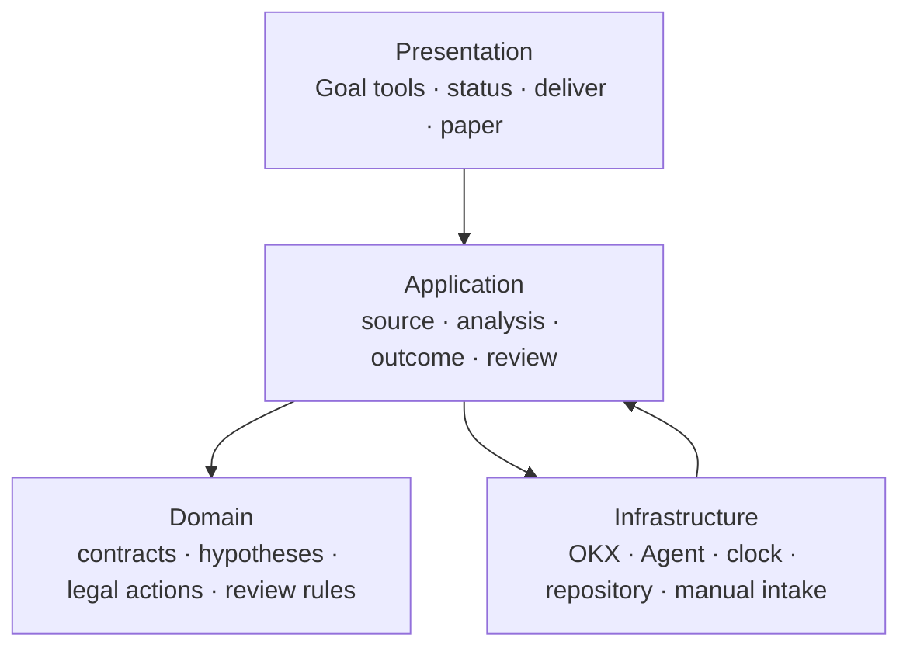
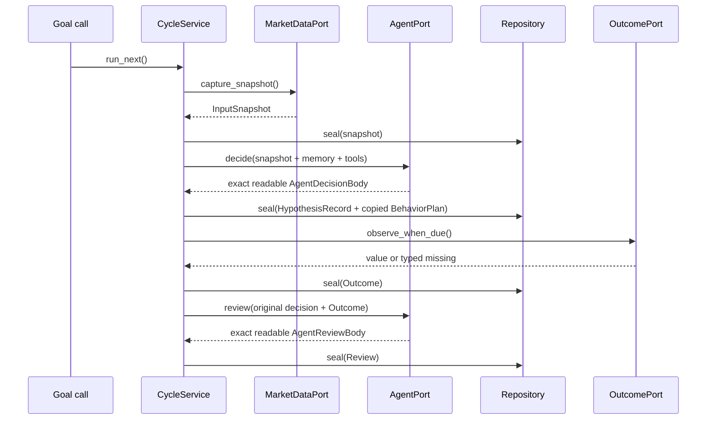
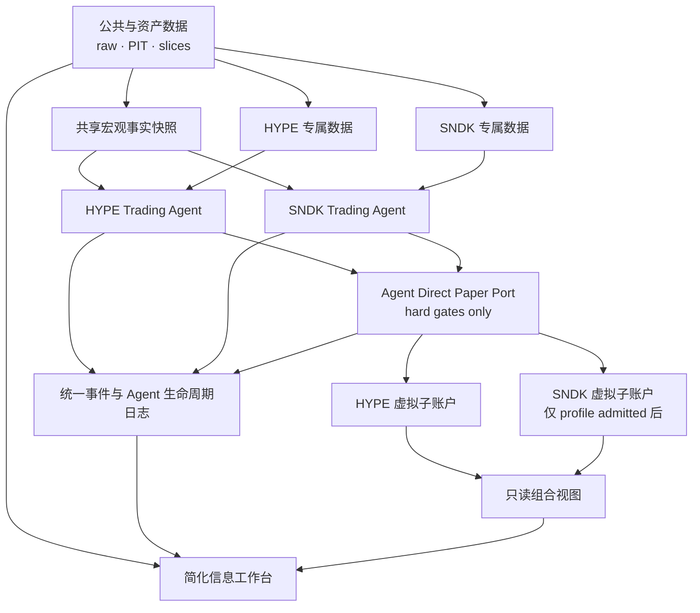

# V3.4 低频战略 Agent 与 V3.3.2 冻结 runtime 蓝图

更新日期：2026-08-17
状态：V3.3.2 r3/E-025 已关闭且只读；V3.4.0 固定 4H FORECAST_ONLY runtime、Durable Strategic State、低 token context 与战略语义检查已实现；当前无活跃市场实验、无 V3.4 paper authority
需求入口：[`requirements/CURRENT.md`](../requirements/CURRENT.md)
legacy 代码基线：`0de6bf87ae3d065205d337ad8996881b159f91f6`；该提交不包含当前
V3.3.0 未提交冻结包，不能作为新理论恢复点

## 1. 结论

当前目标是在 `trade_system/theory_paper_v2` 现有四层内原地演进为 V3.4 低频战略研究工作台，不复制第二套平台。LLM 不再承担 continuous-goal 在线控制：外部确定性 scheduler 只在 UTC `00/04/08/12/16/20` 六个固定 4H slot 赋予新市场判断权；1D+ 管 regime，4H 是最低 decision horizon，1H/15m/5m/tick 只作为 4H 内部证据，不能自行唤醒 LLM。两次 committee 之间，本地系统可以持续记录事实并机械执行上一 committee 已冻结的 bounded action；safety 只能 emergency de-risk。

V3.3.2 r3/E-025 已永久只读关闭。用户先前的 HYPE paper 授权不自动延伸为 V3.4 paper 权限；当前 V3.4 已实现不可执行的 scheduled `FORECAST_ONLY` harness、Durable Strategic State、低 token context 与纯确定性 semantic/payoff checker。任何 FROZEN_PLAN、DYNAMIC_MANAGEMENT 或 paper cohort 仍必须在分阶段 qualification、fresh identity 和明确授权下启动。

Agent 的 UTF-8 可读原文仍是市场判断权威；机器 envelope、索引、计算器和 admission checker 不能选择 LONG/SHORT，也不能补造或覆盖观点。V3.4 新增的边界只是把 `DECISION_SEALED` 与 `STRATEGIC_SEMANTICS_READY` 分开：不完整原文照常保存，但不能因此自动增加 exposure。

资格、Q0–Q8、全仓闭包、历史审计和旧兼容逻辑退出未来热路径。旧 V3.3.2 runtime 只做冻结维护；当前新增验收针对 V3.4 理论/语义和后续分阶段 qualification，并保持独立 theory/implementation/run/cohort 身份。系统架构只由本文拥有，市场知识只由理论包拥有，二者不得再混写。

## 2. 目标、范围与量化结果

| 项目 | 定义 |
|---|---|
| 用户目的 | 快速形成市场判断、产生前瞻样本、观察结果、用真实表现迭代理论 |
| 系统结果 | 单一、可替换、低耦合的数据与纸面交易主链；本轮完成数据、Agent sidecar、账本、评价、funding coverage 与被动连续性证据基础 |
| 核心功能 | 多资产数据快照、单资产 Agent、注意力请求、纸面账户/订单/成交、五工件、outcome、review、日志展示 |
| 增强功能 | OI、funding、盘口、成交、宏观、新闻、情绪、链上与跨资产数据 |
| 延后功能 | 共享资本分配、testnet、真实账户、live、盈利优化 |
| 非目标 | 新平台、事件总线、插件 SDK、新权限体系、新证据体系、全仓重写 |

成功指标：

- HYPE/SNDK 两个逻辑 Agent 不串上下文或请求；只有各自 instrument profile 准入后才能建立隔离虚拟子账户。
- Goal 的 next-check request 只追加一次且替换关系可重放；仓库不派发或唤醒。
- 纸面账户、订单、成交、止盈止损、已实现/未实现 P&L、MARK 净值、有效杠杆和观测点回撤可以从不可变日志与 admitted 市场事实重建；成本覆盖或风险参数不足的结果保持 `UNKNOWN`。
- 一个 cycle 仍只有五类市场业务工件；运行、账户和 UI 对象不成为市场决策 owner。
- 可选数据缺失为 typed UNKNOWN，不阻断核心价格链，也不冒充已获取。
- 市场、交易、仓位、执行、注意力和 runtime 故障分别评价。

## 3. 工作区与文档架构

当前入口固定为四个文件：

1. `AGENTS.md`：工作纲领；
2. `requirements/CURRENT.md`：当前需求；
3. `design/CURRENT_BLUEPRINT.md`：当前架构唯一方案；
4. `reviews/ERRORS.md`：唯一错误复盘。

用户明确要求的 Post-V3.4 多模型管理规划单独位于 `design/POST_V34_MULTI_MODEL_AGENT_MANAGEMENT.md`；它不是当前运行入口，V3.4 不得导入。

具体树和默认不读规则见 [`WORKSPACE.md`](../WORKSPACE.md)。根目录 Markdown 分流已完成；历史变化只保留四字段：改了什么、实现了什么、为什么、问题是什么。

文档不得按日期、一次修复、一次测试或一次 Agent 讨论继续增长。运行证据使用结构化工件，不创建过程日志 Markdown。

## 4. 四层目标架构



逻辑状态变化用函数返回值和五类耐久工件表达，不建设事件总线。

### 目标目录

```text
trade_system/theory_paper_v2/
├── presentation/market_cycle.py
├── application/market_cycle/
│   ├── ports.py
│   ├── service.py
│   ├── source.py
│   ├── analysis.py
│   ├── position.py
│   ├── outcomes.py
│   └── review.py
├── domain/market_cycle/
│   ├── contracts.py
│   ├── theory.py
│   ├── analysis.py
│   └── review.py
└── infrastructure/
    ├── market_data/
    │   ├── okx_transport.py
    │   ├── raw_capture.py
    │   └── okx_snapshot.py
    └── market_cycle/
        ├── theory_package.py
        ├── repository.py
        ├── codex_mailbox.py
        ├── okx_outcome.py
        ├── manual_intake.py  # NOT_IMPLEMENTED
        └── runtime.py
```

### 模块与 owner

| 层 | 模块 | 唯一职责与数据 owner | 独立替身 |
|---|---|---|---|
| Presentation | `market_cycle.py` | 参数、调用和响应；不拥有业务状态 | fake service |
| Application | `service.py` | `RunState` 逻辑与转换、一次 advance 的合法下一步 | fake ports |
| Application | `forecast_qualification.py` | V3.4 固定 4H FORECAST_ONLY context/seal/outcome；不执行交易 | temp strategic-state repository |
| Domain | `scheduled_strategy.py` | 4H 时钟权限、forecast 语义、低 token context、intra-window authority、客观 forecast evaluation | 纯函数 |
| Domain | `strategic_control.py` | V3.4 exposure 语义与 Decimal payoff/PnL/risk 复算；不选方向 | 纯函数 |
| Infrastructure | `strategic_state_repository.py` | 按 asset/4H slot write-once forecast/outcome/evaluation | temp directory |
| Application | `source.py` | 创建唯一 `InputSnapshot` | fake market port |
| Application | `analysis.py` | Agent 决策往返并把完整原文封存到唯一 `HypothesisRecord` | fake agent port |
| Application | `position.py` | 原样绑定 Agent 自选动作与仓位到唯一 `BehaviorPlan`；不选择市场动作 | fixed Agent decision |
| Application | `outcomes.py` | 到期观察，创建 `Outcome` | fake outcome port |
| Application | `review.py` | 将原决策与 Outcome 交给 Agent，并封存其原文 `Review` | fixed artifacts + fake Agent |
| Domain | `contracts.py` | 五工件 schema、时间与不可改写规则 | 纯函数 |
| Domain | `theory.py` | manifest、document binding 与 package identity 纯合同 | fixed manifest |
| Domain | `analysis.py` | 决策正文/envelope 值对象、非阻塞索引与合法动作提示 | fixed readable decision |
| Domain | `review.py` | Outcome 事实与 AgentReview 原文合同；不生成市场评价或自动改理论 | fixed outcome/review text |
| Infrastructure | `market_data/*` | transport、raw-first、provider parse、标准快照 | recorded bytes |
| Infrastructure | `theory_package.py` | 严格验证 checkout 内 manifest 与八个文档；返回只读 named fragments；安装包发现未实现 | temp directory |
| Infrastructure | `repository.py` | 新 run 的唯一物理 writer、摘要和 CAS；不决定转换 | temp directory |
| Infrastructure | `codex_mailbox.py` | Agent 决策/复盘的原文 transport；只验证硬边界和 write-once | scripted mailbox |
| Infrastructure | `okx_outcome.py` | 同口径公开 outcome adapter | recorded response |
| Infrastructure | `manual_intake.py` | 目标：人工官方文件导入与 PIT 校验；当前未实现 | fixture file |
| Infrastructure | `runtime.py` | 依赖装配；不决定流程 | explicit ports |

## 5. IO 合同与五工件

| 合同 | 最小字段 | owner | 规则 |
|---|---|---|---|
| `InputSnapshot` | cycle/source/instrument、cutoff、核心价格时间、可选 observations、UNKNOWN、raw refs | `source.py` | decision 前封存；缺失不伪造 |
| `HypothesisRecord` | AgentDecisionBody 原文/摘要、输入 refs、可选非权威索引、质量缺口、horizon | `analysis.py` | 原文优先；格式/语义缺口不阻断 |
| `BehaviorPlan` | 同一原文/摘要、Agent 自选参考动作与仓位的可选索引、sealed_at | `position.py` | 只复制/引用 Agent 决策；系统不选择 |
| `Outcome` | horizon、due/observed time、value 或 typed missing、raw ref | `outcomes.py` | 同一价格口径；失败也必须有终态 |
| `Review` | Outcome 系统事实、AgentReviewBody 原文/摘要、可选非权威索引 | `review.py` | 复盘判断归 Agent；不自动修改理论 |
| `RunState` | cycle、请求、当前边界、五工件 refs、下一合法动作、terminal | `service.py` | Application 决定转换，Repository 独占物理写入；不是第六类业务工件 |

五工件共用 `schema/version/type/cycle/created_at/theory_identity/predecessor_refs`。
Repository 对 canonical bytes 计算 `{path,size_bytes,sha256}` 并写入 RunState；同一
`cycle_id + artifact_type` 同字节为幂等，不同字节立即冲突。请求先冻结 instrument、profile、
horizon、动作域和理论身份；最终 `decision_at` 在 InputSnapshot 封存时确定，随后不可改写。
Agent 决策正文和复盘正文由 transport 绑定 cycle/request/theory、时间、UTF-8 字节数与 SHA-256；Agent 不手写机器业务 schema。缺少 lead/runner/OTHER、动作、点位、止盈止损、仓位或使用自然语言近义词时，原文照常封存并记录 `AGENT_OUTPUT_INCOMPLETE`、`PARTIAL` 或 `UNKNOWN`，继续 Outcome/Review。只有身份/输入不匹配、PIT/未来泄漏、迟到、覆盖/损坏、空白/不可读正文或未授权外部副作用可以失败关闭。

正式学习连续性只增加一个有界只读投影，不增加事实 owner：`paper_context` 1.5.0 在当前 snapshot cutoff 前选择最近一个已 `COMPLETE` 的 cycle，并分别携带 Decision/Review 的 `verbatim_text`、UTF-8 大小、SHA-256 与工件引用；外层标记 `NON_AUTHORITATIVE_CONTINUITY_CONTEXT`。未来 Review、非 COMPLETE cycle、第二条历史或字节/SHA 不一致均不得进入。`traders/*/state.json` 1.1.0 的 `formal_cycle_obligations`、`prior_sample` 与 `sample_evaluation` 也只是恢复索引，CycleRepository 与 paper ledger 仍是正式 owner。

每次自然 Goal 唤醒先用 CycleRepository 对账未完成 cycle：到期就推进 Outcome、交付 Review 并完成；未到期只把最早 due 写入唯一动态注意力。这条证据义务不触发市场重分析。Agent 已完整读取冻结理论后，普通轮次只取 fresh snapshot、透明 4H/1H/15m 计算、当前 paper 状态、最近完整 Decision/Review 与相关假说；不重复注入静态理论全文。

内部端口只有五个：`MarketDataPort`、`AgentPort`、`ClockPort`、`CycleRepository`、`OutcomePort`。端口使用静态 `Protocol`，不建动态 registry 或生命周期 SDK。

### 事件流



任何阶段重新调用都只读取 `RunState` 并执行一个合法下一步；运行中状态不得启动第二个 advance。

## 6. 四个巨型模块的裁决

| 当前模块 | 行数 | 裁决 | 迁移内容 |
|---|---:|---|---|
| `infrastructure/v32_public_source_collector.py` | 6,899 | `SPLIT` 后删除旧文件 | transport/raw、parser/snapshot、source use case |
| `infrastructure/v32_analysis_material_adapter.py` | 1,645 | `SPLIT` 后删除旧文件 | timeframe/context、Agent input、revision、schedule |
| `infrastructure/v32_local_analysis_lane.py` | 2,964 | `SPLIT` 后删除旧文件 | source、Agent、decision、completion、repository writes |
| `presentation/v32_target_wake_composition.py` | 1,588 | `SPLIT` 后删除旧文件 | 四个公开入口、analysis boundary、runtime wiring |

保留并迁移已有可用逻辑，不直接保留旧编排类：

- `domain/contracts/canonical.py` 的纯规范化/摘要函数；
- `domain/hypothesis/`、仓位几何、outcome 与 evaluation 中符合 V3.3 的纯规则；旧固定概率、
  action grid、qualification identity 和固定 16×3 schedule 不继承；
- `infrastructure/v32_runtime_clock.py`、`v32_durable_json.py`；
- OKX HTTPS/raw-first/解析、mailbox CAS/写一次、outcome mark 解析思想；旧 12 请求 transport、
  双阶段 mailbox、独立 checkpoint/store 和硬编码 qualification attempt 不直接复用。

需要合并职责：

- `v32_prospective_runtime.py` 与 `v32_cycle_composition.py` 的重叠路由 → `service.py`；
- 五个当前状态 store → 新 run 单一 `repository.py`；
- collector 内 verifier 与 `v32_public_evidence_verifier.py` → 一个合同验证 owner；
- `v32_read_only_status.py` → `service.read_status()`。

退出默认主链：qualification composition、target-run composition、actual-capability qualification、qualification materializer、preflight subject、Q0–Q8 和 postcommit qualification 路线。旧数据只读，代码不再成为新功能 owner。

## 7. 数据设计

### 当前实际能力

最近冻结资格快照实际取得并校验了 12 类 OKX 公开数据，但资格随后在 Agent 阶段失败；没有 target cycle，也没有 outcome。因此结论只能是“一次快照已获取”，不能称为 Baseline、持续采集或市场有效。

当前 COLD 新核心已具备四请求 raw-first adapter、单阶段 Agent、mark outcome 和 Review 的本地能力，但本轮没有发起网络或市场实验；因此“COLD 当前实际获取”仍为零，不能从测试 fixture 推导公开覆盖、速度或市场结果。

新 Baseline 的唯一必需数据缩减为：

1. `SERVER_TIME`；
2. `INSTRUMENT`；
3. `MARK_PRICE`；
4. `CLOSED_CANDLES_15M`。

Ticker、1h/4h/1d、OI、funding、order book 和 recent trades 都是可选 mod；缺失写 `UNKNOWN`。单次 OI 不能证明杠杆变化，单次盘口不能证明流动性韧性，缺少 liquidation 不能写成零。公开入口或 adapter 存在只表示“可接入”，只有 raw、`available_at/captured_at`、SHA、PIT 与当次 InputSnapshot 全部成立才表示“已获取”。

### 数据责任矩阵

| 数据族 | 当前状态 / 阶段 | 免费、无账户主入口 | 能使用的事实 | 仍不可声称 |
|---|---|---|---|---|
| OKX 核心价格 | 已有 raw-first adapter；新实验尚未采集 | [OKX Public API](https://www.okx.com/docs-v5/en/) | time/instrument/mark/96×15m closed bars | 跨 venue 真值或盈利 |
| OKX 微观结构/杠杆 | 第一批实现：books、trades、OI、funding；taker/ratio/清算流后置 | [OKX Market/Public Data](https://www.okx.com/docs-v5/en/) | OKX 可见 spread/depth/成交方向、OI、funding | 隐藏单、参与者身份、真实开平角色、完整清算账本 |
| 宏观/利率/美元 | 第二批；先冻结 series、单位、时区、官方发布时间 | [BLS v1](https://www.bls.gov/developers/)、[Fed H.10/H.15](https://www.federalreserve.gov/datadownload/)、[Treasury XML](https://home.treasury.gov/treasury-daily-interest-rate-xml-feed) | 已发布 CPI/就业/汇率/政策与收益率曲线 | 发布前值、实时宏观全景 |
| 新闻/事件 | 第二批；关键词与官方确认源未冻结 | [GDELT 15 分钟文件](https://blog.gdeltproject.org/gdelt-2-0-our-global-world-in-realtime/) + 监管/政府 RSS | 被来源监测到的标题、URL、首次可用时间、实体/事件 | 全媒体覆盖、事件因果、未公开信息 |
| 链上聚合 | 第三批；用途/指标待确认 | [Coin Metrics Community](https://docs.coinmetrics.io/api)、[DefiLlama Free API](https://api-docs.defillama.com/) | provider 定义下的活跃度、费用、供应、TVL、稳定币等 | 原始链完整真值；供应商未覆盖部分 |
| 跨资产 | 第二批低频背景 | Fed/Treasury + [Cboe VIX 日线](https://www.cboe.com/tradable_products/vix/vix_historical_data/) | 美元、收益率曲线、VIX 已发布日值 | 免费实时 SPX/黄金/原油全量行情 |
| 机构申报 | 第二批滞后数据 | [CFTC COT](https://www.cftc.gov/MarketReports/CommitmentsofTraders/index.htm)、[SEC EDGAR](https://www.sec.gov/search-filings/edgar-application-programming-interfaces) | 133741/133742 分类持仓与已公开申报 | 当前机构意图、逐笔交易、申报期后变化 |
| 搜索/公开社交舆情 | 第三批；Google 走人工 CSV，Bluesky 范围待冻 | [Google Trends CSV](https://support.google.com/trends/answer/4365538?hl=en)、[Bluesky Public API](https://docs.bsky.app/docs/advanced-guides/api-directory) | 归一化搜索关注度、公开 Bluesky 帖子样本 | 全网情绪或总体民意 |
| 身份/内部账本 | `UNOBSERVABLE` | 无可靠公共来源 | 无 | 账户身份、机构真实意图、真实开平角色、完整清算账本、未预录历史全量盘口 |

准入顺序固定为：第一批 OKX 同 venue 快数据；第二批官方低频宏观/跨资产/事件/申报；第三批链上和有限舆情。慢数据只在官方发布或每日 cycle 封存，后续 30 分钟轮次通过带 source refs/SHA 的有界记忆复用，不重复请求、不复制 raw、不新增第六工件。任一 optional source 失败只产生 typed `UNKNOWN`；身份、raw 或 PIT 损坏才失败关闭。

### 人工导入

唯一入口：

```text
.runtime/data-intake/<source_id>/<dataset_id>/
  raw.<csv|json|txt|parquet|zip>
  capture.json
```

`capture.json` 只保留来源 URL/条款、series 或 instrument、格式/单位/时区、覆盖范围/缺失、`observed_at/available_at/captured_at`、SHA-256 和 future cycle。截图只能作来源证据，不能直接变成数值。

需用户一次性确认的输入只保留四类：SEC 的项目名、受监控联系邮箱及 CIK/form 清单；Coin Metrics/DefiLlama 的非商业研究用途与指标清单；Google Trends 的关键词/地区/时段和人工 CSV；Bluesky 的关键词/DID、语言、保存周期。未提供时对应 mod 保持关闭，其余主线继续。

每条外部路线只尝试一次；Route A 与 Route B 必须是两个独立、合法、事前登记的路径。可选数据两路失败后 `UNKNOWN` 继续；核心四项两路失败后停止当前方向性 Baseline；outcome 两路失败后封存 `UNKNOWN_COVERAGE_LOSS`，不事后回填。

## 8. 测试与资格整改

### 8.1 实际耗时与重复量

整改前固定 runner 串行执行 `test_theory_paper_v2_v32*.py`，随后执行更宽的 `test_theory_paper*.py`。当时静态展开为 V3.2 `61` 个文件、全 Theory `151` 个文件，交集为全部 `61` 个；测试方法数分别为 `822` 与 `1,589`。因此一次双门执行 `2,411` 个方法实例，其中 `822` 个确定重复；V3.2-only 文件为零。

本轮删除 4 项只服务已退役 writer/新 qualification 写入流程的测试后，实际静态计划为 V3.2 `818`、全 Theory `1,585`、重叠 `818`、唯一 `1,585`、suite execution `1`。包含关系没有变化，也没有用新增测试替代已删除的旧流程测试。

| 历史边界 | V3.2 | 全 Theory | 串行总耗时 | 只跑包含全集可立即省去 |
|---|---:|---:|---:|---:|
| 589 / 1,274 项 | `933.646s` | `1,216.390s` | `35m50.036s` | `43.4%` |
| 646 / 1,400 项 | `1,102.390s` | `1,383.323s` | `41m25.713s` | `44.3%` |
| 785 / 1,552 项 | `1,647.290s` | `1,944.495s` | `59m51.785s` | `45.9%` |

这说明约一半墙钟时间不是新增覆盖，而是先跑一次 V3.2、再在全 Theory 中重跑同一批内容。按历史两套耗时相减推算，V3.2 每方法成本约为其余 Theory 方法的 `4–5` 倍；方法数量并不能解释主要耗时。

### 8.2 根因优先级

| 优先级 | 实际原因 | 证据与判断 |
|---|---|---|
| P0 | suite 嵌套且固定串行 | suite pattern、runner 循环、aggregate 和测试合同共同要求两套及固定顺序；这是 `43–46%` 的确定性可删除成本。 |
| P1 | V3.2 测试体反复重建重型对象 | 历史慢测 fixture 约 `216s`，发生 `59,018` 次 canonical serialization 与 `28,822,997` 次 normalize；作用域 memo 后原慢测降到 `44.255s`，证明同一不可变对象的重复完整验证是独立热点。 |
| P1 | 每方法重复创建真实 Git/文件/进程夹具 | 当前 V3.2 测试静态存在 `134` 处临时目录创建点；authority 类测试在每个 `setUp` 中执行 Git init/config/add/commit/show/ls-files，另有真实子进程、轮询和 sleep。纯合同测试承担了集成设施成本。 |
| P1 | 代码能力错误绑定实验身份 | reservation/receipt 同时绑定 commit/tree/Python 与 target/qualification ID，存储唯一性却只在 `<qualification_run_id>` 下检查。换 ID 即使代码未变也会重新运行完整双门。 |
| P2 | 没有日常快速层，资格被当作调试器 | 正式入口只有宽 filename discovery。许多双门通过后才暴露 403、provider 时间语义、Agent 容量、时钟或并发问题；这些并不是扩大本地回归能提前证明的事实。 |
| P2 | 资格每次 wake 重放整条治理链 | advance/claim/submit/finalize 都会重开 legacy、closure、support 和 Q0–Q8；qualification 与 target 又各生成一套 Q0–Q8。这是资格编排附加成本，不是上述一小时 unittest 的直接来源。 |

网络不是本地回归慢的主要原因：正式测试记录为零网络，绝大多数网络案例使用替身。单线程 `unittest` 会增加尾延迟，但在去重和拆夹具前并行只会同时重复重活；历史上已有并行资源争用，因此并行化不是第一修复项。

### 8.3 新测试面与证据身份

| 层 | 触发与内容 | 预算 | 热路径禁止 |
|---|---|---:|---|
| Impact | 修改模块的 owning tests + 直接消费者 | `<2 min` | 真实 Git、子进程、sleep、完整历史树 |
| Contract | 五工件、ports、层依赖、repository owner、安全核 | `<5 min` | legacy 全链、相同对象多层完整重建 |
| Core E2E | snapshot → Agent fake → decision → outcome → review，唯一一条 | `<10 min` | 第二条同义 E2E、真实外部网络 |
| Process integration | 每类 Git/锁/超时行为保留 `1–2` 个真实案例 | 按影响运行 | 日常默认 discovery |
| Legacy replay | 只有修改历史 reader/verifier 时运行精确对应历史 | 人工按需 | qualification、release 和普通开发默认门 |

测试选择只使用一个简单显式映射：`production module -> owning tests -> direct consumers`；收集后按稳定 test ID 去重。`rg` 只补直接引用；发现动态入口或无 owner 时停止并补映射，不建立新 closure、插件或 receipt 平台。

证据拆成两种，不再互相绑定：

- `CodeCapability`：键为 commit/tree、Python 物理摘要与版本、固定环境、测试选择版本；不含 run/qualification/target ID，可由多个 run 只读引用。
- `RunEvidence`：只绑定当次 PUBLIC_SOURCE、Agent transport、outcome 和运行时状态；不得触发代码回归。

### 8.4 三步迁移

1. **先止损和去重（本轮已完成）。** 保留旧双 receipt/full-loader reader，仅服务精确冻结历史；`tools/run_theory_tests.py` 以静态 test ID 证明“新集合 = 旧两套并集且无重复”，人工宽验证只执行已经包含 V3.2 的全 Theory 一次。结果按 commit/tree、Python 物理身份、固定环境与 catalog 严格复用，不含 run ID；缓存仅是本地工程结果，不是 qualification evidence。旧双门 writer 和新建旧 qualification 路线均在写入前失败关闭。
2. **拆慢夹具和建立快速层。** 纯合同改用内存 fixture；每类 Git/进程边界只留 `1–2` 个真实集成案例；不可变 authority/Agent packet 用模块级只读基线加局部变异；时钟、超时和进程终止用 fake；同一验证作用域只 canonicalize/normalize 一次，保留一条完整 replay 证明。旧全 Theory 初期即使仍约 `30–33 min` 也退出默认门，优化后目标 `<=15 min`，只作人工 legacy 诊断。
3. **切断资格放大器。** 在创建 qualification/run 身份前先做一次有界 transport smoke、最终 Agent envelope 容量检查和离线核心 E2E；两条外部路线失败即停止或转人工。新 qualification 只引用 `CodeCapability`，只写 `RunEvidence`；旧双 aggregate、两套 Q0–Q8 和 full loader 不进入新 run。冻结历史工件和 reader 不删除、不改写。

本轮没有建设第 3 步所述的新 qualification/`CodeCapability` 平台。实现只负责停止旧路线继续产生低效工件，并提供一个严格、自摘要、有界执行的本地宽测试缓存；正式运行能力与外部事实仍为后续独立工作。

### 8.5 验收、回滚与停止

- 本轮验收：每个 test ID 每个 invocation 最多一次；旧并集与新 catalog 静态相等；相同代码身份跨进程复用时不启动第二个测试进程；缓存篡改、用例数不符、skip、workspace 漂移和并发锁均失败关闭。
- 未验收：首次全 Theory 的实际新耗时、慢 fixture 拆分后的预算、正式 qualification 或市场能力。本轮不运行旧全套；历史 reader 的实物重放仍要求其绑定的精确 frozen checkout，而不是当前整理后的 HEAD/path。
- 安全核不得删除：无未来泄漏、公开数据/无账户订单、五工件不可改写、单 writer/幂等、UNKNOWN 保留、同一外部动作不重复。
- 回滚：本地 runner/cache 使用独立 namespace/schema；删除该本地缓存不会改写历史工件。旧 reader 只读保留；异常时只在精确 frozen checkout 读取历史，不恢复旧 writer、不生成双写，也不重试已失败或 tombstoned 的 run。正式 capability/run evidence 尚未实施。
- 停止：发现重复 test ID、未变 capability 却 cache miss、Impact/Contract/E2E 超预算、L0 出现真实 Git/进程等待，或权限/UNKNOWN/写一次语义发生变化时立即停止修复选择或夹具；禁止通过提高预算、新 run ID 或追加全量测试掩盖问题。

## 9. 清理与历史兼容

### 文档和工作区

| 类别 | 当前裁决 |
|---|---|
| `AGENTS.md`、`WORKSPACE.md`、`requirements/CURRENT.md`、本蓝图、`reviews/ERRORS.md` | `KEEP`，唯一入口 |
| `README.md` | `MERGE` 已完成：根目录为短产品说明，旧正文完整进入 `archive/docs/status/` |
| `requirements/history/2026-07-30-theory-paper-practice.md` | `ARCHIVE` 已完成；正文停止追加，四字段摘要在同目录 index |
| 旧系统状态、roadmap、audit、challenger、governance 和 log | `ARCHIVE` 已完成；不得再作入口 |
| 根目录 Markdown | 只保留 `AGENTS.md`、`README.md`、`WORKSPACE.md` |
| V1/V3.1/E0/E0B/Theory Agent V2 设计文档 | `ARCHIVE` 到 experiments |
| `CORE_TRADING_THEORY.md` 与 `_v2_1.md` | 精确重复已收敛为 `archive/authority/CORE_TRADING_THEORY_v2_1.md`；无版本重复件已删除，可由 Git 恢复 |
| 用户审计副本 | 原字节移入 `archive/user-preserved/`，摘要保持不变 |
| 旧版本链与 challenger | 默认退出当前阅读树并由 `theory/legacy/` 压缩导航；代码、配置、测试或冻结工件仍引用者保留原字节 |

### 代码与运行

- 旧 authority、receipt、失败资格、accepted decision、outcome 和 raw data 原字节不改写。
- 旧 run 只由旧 reader 读取；新 run 只写新 repository，禁止双写或迁移旧状态。
- 旧四个公开 wake/claim/deliver/status 函数可在一个迁移阶段薄转发；外部调用方扫描完成、主路由通过 E2E 后删除旧入口。
- 代码恢复依赖 Git commit/tag/bundle，不把整套旧实现永久留在活跃源码。
- `DELETE` 必须同时满足：活动引用为零、替代路由已验证、恢复点已确认，并提交精确路径/大小/影响清单获得批准。

## 10. 三阶段迁移

### 阶段一：入口、蓝图与完整工作区整改（已完成）

- 已分离当前需求、工作区地图、错误复盘和效率纲领。
- 已定义架构、合同、数据、测试、清理和停止条件。
- 已把根目录 Markdown 从 75 份收缩为 3 个入口；理论、需求、设计、复盘、权威、日志和实验均按类别与版本/日期分流。
- 当前冻结候选为 `theory/versions/v3.3.0/` 的 `MANIFEST.json`、README 与七个 owner，短入口位于 `theory/CURRENT.md`；旧 V3.2 单文件仍位于 `theory/current/` 供现有 runtime 消费，活动 Python 尚未迁移。
- 冻结材料不改字节，旧路径由 `archive/legacy-path-map.tsv` 和清理前提交解释；未运行全量测试、未取市场数据。

### 阶段二：原地拆分与 Agent-first 切换（核心已完成）

1. `DONE`：checkout 内 loader 验证 manifest raw 摘要、README 与七个 owner，并返回独立 named fragments；安装包脱离 checkout 的理论发现仍 `NOT_READY`。
2. `DONE`：COLD collector 已拆为 transport/raw/snapshot；旧 Baseline 固定四项，新 optional profile 固定追加 books、trades、OI、funding，单项普通缺失降级 `UNKNOWN`；`manual_intake` 仍 `NOT_READY`。
3. `DONE`：单一 Repository/RunState 主链为 source → Agent 原文决策 → 五工件封存 → outcome → Agent 原文 review；旧 deterministic selection/system-authored review 已退出活动入口。
4. `DONE`：`presentation/market_cycle.py` 与 `market-cycle` CLI 接收 Agent 可读 UTF-8 正文；只允许 COLD，DELTA/EVENT_FAST 在外部调用前失败关闭。
5. `PARTIAL`：新 COLD 热路径不导入旧 qualification/target 中心；旧 V3.2/V3.1 代码、外部调用方和运行数据尚未删除或正式切换提交。
6. `DONE`：Worker 原文与封存正文一致性、`role/path/SHA` 输入引用、hard-stop admission 与只读运行身份已由直接合同和唯一离线核心 E2E 覆盖；测试不代表市场有效或真实数据覆盖。
7. `BLOCKED_BY_APPROVAL`：旧路线删除需独立备份、逐文件哈希、外部 Python 调用方确认、Git/all-refs 恢复点和用户对精确集合的授权。

### 阶段三：V3.3.2 纸面工作台与 r3（历史已结束）

1. `DONE`：candidate.3 理论保持冻结，V3.3.2 identity、paper runtime 与独立 HYPE r3 cohort 已建立。
2. `DONE/PARTIAL`：attention、订单接口、HYPE raw-bound 隔离账户、估值/成本投影与工作台完成实际运行；SNDK 仍未进入该 cohort。
3. `DONE`：恢复、去重、账务、MARK 估值、UNKNOWN 门和五工件链在 r3 前后均有聚焦验证。
4. `DONE`：r3 实际运行约 25 小时 48 分钟并在用户截止后权威关闭；E-025 只有 3/12 合格成交 episode，0 胜 3 负，保持 `MEASUREMENT_INSUFFICIENT`。
5. `DONE_WITH_LIMITATION`：r3 证明低换手和执行纪律较旧 run 改善，但暴露高周期语义退化为局部阈值、15m 过度管理、未来空间/加减仓/人群事件分析不足等问题；不能作为 V3.3.2 盈利或无效的最终裁决。
6. `STOPPED`：E-025 不继续补 9 个样本，旧 run 永久只读；任何基于复盘改变的规则进入 V3.4 新 cohort，禁止混样。
7. 共享资本、更多资产、testnet/live 均为后续独立决定。

## 11. 验证门与停止条件

| 门 | 必须证明 | 失败动作 |
|---|---|---|
| G0 信息入口 | 新 Agent 只读四入口即可确定目标和下一步 | 修正入口，不新增文档 |
| G1 合同与身份 | 五工件、Agent decision/review/attention owner、四层依赖、V3.3.2 身份与旧/新隔离成立 | 停止拆分，修合同 |
| G2 数据 | 核心四项可封存；可选缺失为 UNKNOWN | 主/备两路后人工卡或停止 |
| G3 新核心 | 唯一 writer，完整 E2E `<10 min` | 先减复杂性，不提高预算 |
| G4 切换 | 活跃代码不再 import 四巨石/Q0–Q8 | 不删除旧入口 |
| G5 Paper baseline | 五工件齐全；Agent 决策/仓位/注意力未被改写；纸面账务可对账；outcome 后有 Agent Review | 不冒充完成，不改写旧 cycle |

立即停止并报告：

- 需要新旧 store 双写、回填旧 write-once 数据或读取 future outcome；
- 需要新平台、事件总线、插件 SDK、大量新 schema 或第二权限体系；
- 两条合理迁移或外部路线连续失败；
- 测试连续两次超 `<2/<5/<10` 预算；
- 需要放宽账户、订单、资金或未来泄漏边界；
## 13. 四项 UNKNOWN 如何变成已知

### 13.1 先判断 UNKNOWN 的根因

本节只解决实际速度、公开数据覆盖、预测增量和仓位政策效果四项 UNKNOWN。COLD loader、route、repository 与运行主链已由系统任务实现；这里只定义市场运行后必须提供什么证据，以及什么条件下信息才可从 UNKNOWN 晋级。

当前工作区能够确认：旧冻结流程曾取得一次公开市场快照，但 V3.3.0 尚无连续观测窗口、前瞻 decision→outcome 配对或仓位政策比较。因此四项 UNKNOWN 的根因并不相同：

| UNKNOWN | 数据源是否主要不足 | 获取/测量方法是否未建立 | 当前裁决 |
|---|---|---|---|
| 实际运行速度 | 否；速度不是市场数据问题 | 是；尚无 V3.3 真实分阶段耗时窗口 | 主要是测量数据未产生 |
| 公开数据覆盖 | 混合；核心价格源基本充足，部分增强项受来源或历史连续性限制 | 是；缺预登记采集、准入、freshness、raw replay 和 coverage denominator | 主要是持续获取与覆盖统计未建立，部分来源确实不足 |
| 预测增量 | 终点方向的公开价格源基本充足；路径级评价需要连续 future path | 是；缺同一 PIT 的候选、对照、未来 outcome 配对和未触碰确认 | 主要是前瞻评价证据未产生 |
| 仓位政策效果 | 公共参考路径基本可获得；真实 fill、费率、滑点、账户仓位不能由公共源补齐 | 是；参考政策尚未在同 forecast/path 上配对评价 | 参考效果主要缺评价方法落地；真实执行效果同时缺授权数据源 |

直接结论：四项中没有一项能靠“再列更多网站”自动变成已知。核心缺口是把明确问题转成预登记采集、点时准入、重复观测、未来 outcome 和配对评价。真正无法由公共数据变成已知的部分必须转成 UNOBSERVABLE 或 NEEDS_SEPARATE_AUTHORITY，而不是永久笼统写 UNKNOWN。

### 13.2 UNKNOWN → 已知的统一状态链

“已知”必须绑定标的、venue、时间窗口、horizon、profile、理论 revision 和证据口径，不存在脱离范围的“系统已经知道”。

~~~mermaid
flowchart LR
    U["UNKNOWN_UNSCOPED<br/>问题尚未精确定义"]
    Q["QUESTION_SCOPED<br/>字段·标的·时间·主张已固定"]
    S["SOURCE_CLASSIFIED<br/>来源与可观察性已分类"]
    A["ACQUISITION_CONTRACT_READY<br/>采集口径已冻结"]
    R["OBSERVED_RAW<br/>实际取得原始数据"]
    P["ADMITTED_PIT<br/>通过身份·时间·完整性检查"]
    W["REPEATED_WINDOW_MEASURED<br/>连续窗口覆盖已量化"]
    E["EVALUATED_WITHIN_SCOPE<br/>完成速度/预测/政策评价"]
    C["CONFIRMED_WITHIN_SCOPE<br/>未触碰窗口复现"]
    X["UNOBSERVABLE / PROHIBITED<br/>合法公开路径无法取得"]
    M["INSUFFICIENT_COVERAGE<br/>取得但不足以支持主张"]

    U --> Q --> S --> A --> R --> P --> W --> E --> C
    S --> X
    P --> M
    W --> M
~~~

| 状态 | 必须新增的事实 | 不能冒充的更高状态 |
|---|---|---|
| QUESTION_SCOPED | 精确字段、instrument、venue、cutoff、horizon、用途和 claim ceiling | 不能称已有来源 |
| SOURCE_CLASSIFIED | 来源等级、合法性、可获得性、是否需要连续记录 | 不能称当前已获取 |
| ACQUISITION_CONTRACT_READY | endpoint/文件、cadence、TTL、时间语义、raw 保存、备选和失败处理 | 不能称 adapter 已产生数据 |
| OBSERVED_RAW | 本次真实响应/文件及 raw hash | 不能称数据已可用于判断 |
| ADMITTED_PIT | available_at ≤ decision_at，身份、闭合、单位、缺失、revision 合格 | 不能从单次观测推断稳定覆盖 |
| REPEATED_WINDOW_MEASURED | 预登记窗口的请求、响应、准入、新鲜度、缺失和回放矩阵 | 不能称预测或政策有效 |
| EVALUATED_WITHIN_SCOPE | 速度窗口或前瞻配对评价完成 | 不能外推到未覆盖 regime/venue/horizon |
| CONFIRMED_WITHIN_SCOPE | 未参与调参的时间窗口复现 | 不能升级成盈利、生产或 live 授权 |

任何阶段失败都必须写具体终态：SOURCE_NOT_AVAILABLE、CAPTURE_FAILED、STALE、INVALID_IDENTITY、PIT_VIOLATION、INSUFFICIENT_COVERAGE、OUTCOME_MISSING、UNOBSERVABLE 或 PROHIBITED。UNKNOWN 不是一个无限期的垃圾桶。

### 13.3 哪些信息缺来源，哪些只缺获取方法

| 信息对象 | 当前来源判断 | 要让它变成已知 | 永久或当前上限 |
|---|---|---|---|
| SERVER_TIME、INSTRUMENT、MARK_PRICE、闭合 15m K 线 | 官方公开源足以支持核心 Baseline | 按 cadence 实际保存 raw、校验标的/闭合/时间并形成连续覆盖矩阵 | 只能证明对应 venue、instrument 和窗口 |
| 1h/4h/1d K 线、OI、funding | 多数为 PUBLIC_DIRECT | 实际请求、保存 raw、记录 freshness/缺口；单点不能证明变化 | 历史窗口和聚合定义受 provider 限制 |
| order book、recent trades | 当前快照公开可得；连续路径必须事前记录 | REST 初始快照加有序增量/逐笔记录，校验 sequence 和 gap | 未记录的历史连续盘口通常不能事后重建 |
| liquidation | 公开流或聚合端点可能提供部分观测 | 从未来开始连续合法记录，并明确漏报/聚合口径 | 公开数据通常不能证明完整清算总账；缺失绝不是零 |
| 宏观、COT、新闻、Trends、链上 | 来源混合：公开、人工导出、免费 key、付费或不透明派生 | 每项单独固定 series/关键词/地区/provider、release vintage 和可用时间 | 未选定或方法不透明时只能作 UNKNOWN/proxy |
| 账户意图、真实开平角色、完整资金状态 | 公共来源不足 | 只有数据所有者授权的账户/账本真值 | 公共研究中应标 UNOBSERVABLE |
| fill、fee tier、slippage、position truth、liquidation price | 需要 paper/testnet/live 或账户侧数据 | 独立授权后采集订单、成交、费用和最终仓位事实 | 当前公共不可执行阶段不得推断 |

因此，公开覆盖问题应拆成三类处理：

1. 来源足够但尚未连续取得：建立采集与准入窗口后可以转为已知。
2. 来源存在但覆盖、历史或透明度不足：只能得到有上限的 proxy/partial known。
3. 公共来源原则上不能识别或需要未授权数据：直接标 UNOBSERVABLE/PROHIBITED，不继续搜索替代品伪造答案。

### 13.4 实际运行速度如何变成已知

#### 根因

速度 UNKNOWN 与市场数据种类多少无关。当前缺的是 V3.3 在固定环境、固定 profile 和真实公开 transport 下的观测记录；设计中的 Cold ≤15m、Delta ≤2m 只是目标。

系统任务只需向本证据方案提供稳定的测量端点和身份标签，不在此规定其内部实现：

~~~text
request_accepted_at
source_done_at
agent_decision_done_at
plan_sealed_at
outcome_done_at
agent_review_done_at
review_sealed_at

route = COLD | DELTA | EVENT_FAST
profile / instrument
theory_revision
model / transport / runtime / hardware identity
terminal_status / failure_stage
request_count / agent_round_trips / packet_size
~~~

#### 获取方法

1. 决策耗时固定为 request accepted → BehaviorPlan sealed；复盘耗时单独测量为 Outcome sealed → Review sealed，等待 horizon 到期不计入任一分析耗时。
2. COLD、DELTA、EVENT_FAST 分开成 cohort，不混合平均；当前 Event Fast 尚无冻结预算，因此只能描述性报告，不能随 COLD/DELTA 一起解除速度 UNKNOWN。
3. 使用 monotonic elapsed time；wall time 只用于审计。
4. timeout、失败和未 seal 的 run 也进入分母；禁止只统计成功快跑。
5. 运行前冻结环境身份、route mix、超时和测量窗口；环境或模型变化后另开 cohort。
6. 样本数量由事前的 p95/按时率精度要求确定并写入 EvidencePolicy，不在看到结果后缩短窗口。若初始运营门要求“至少 95% 按时”且采用单侧 95% 下界，零超时情形也约需 59 个近似独立尝试；存在失败或序列依赖时必须增加，不能把 59 写成固定理论常数。
7. 报告 p50、p95、max、over-budget 比例、成功 seal 比例、失败阶段和各阶段耗时贡献。

#### 从 UNKNOWN 晋级

| 状态 | 条件 |
|---|---|
| UNKNOWN_NOT_MEASURED | 只有目标或 fake/local timing |
| MEASURED_ONCE | 有一条真实记录，只能说明该次 |
| MEASURED_WITHIN_SCOPE | 预登记窗口完整，环境身份稳定，失败未被剔除，分阶段数据可追溯 |
| TARGET_MET_WITHIN_SCOPE | 同一窗口 p95 满足 COLD ≤15m、DELTA ≤2m，且完整性规则未被删减 |
| TARGET_NOT_MET | 数据有效但 p95 未达标；此时速度已经“已知为未达标”，不是继续 UNKNOWN |
| INCONCLUSIVE_MEASUREMENT | 身份漂移、漏记失败或窗口不足，仍保持 UNKNOWN |

若不达标，最慢阶段已经成为已知诊断输入；如何优化属于系统任务。本方案禁止通过跳过 PIT、raw binding、反证、仓位几何或封存来换取达标。

### 13.5 公开数据覆盖如何变成已知

#### 根因

核心四项的来源并不缺；缺的是明确分母和连续的“请求 → raw → 解析 → 准入 → 使用”记录。可选数据则需要逐项判断来源是否真实可得，不能把 endpoint 列表当覆盖。

首先冻结 CoverageUniverse：

~~~text
component
× venue
× instrument
× requested cadence
× observation window
× freshness SLA
× decision profile
× claim ceiling
~~~

每次预定采集无论成功失败都记录：

~~~text
scheduled / requested / responded
raw_saved / parsed / admitted
stale / invalid / missing
requested_at / responded_at / observed_at / available_at / cutoff_at
raw_ref / raw_sha256 / parser_version
missing_reason / source_level / availability_level
~~~

#### 覆盖不能压成一个虚假的百分比

至少分别报告：

- schedule completion：预登记时点是否真的尝试；
- response coverage：是否收到响应；
- raw coverage：是否保存可回放原始数据；
- admission coverage：是否通过身份、时间、闭合、单位和 schema；
- freshness coverage：在对应 decision cutoff 前是否仍有效；
- sequence coverage：L2/trades 等连续数据有无 gap；
- outcome coverage：到期结果是否有合法终态；
- typed-missing distribution：缺失属于 source、transport、stale、invalid 还是 unobservable。

CORE_4 的单个 cycle 只有同时满足 4/4 admitted、零 PIT 违规、raw 可回放和标的/闭合时间合法，才能进入最小市场判断。可选组件缺失不阻塞 CORE_4，但必须降低对应 claim ceiling。

首轮 24/7 Baseline 的建议 EvidencePolicy 是两个互不重叠的七日时间块：所有计划机会 100% 形成 terminal，admitted 项 raw replay 100%，PIT/身份/closed-bar 违规为 0；CORE_4 usable rate 可先以 99% 作为运营候选门。该窗口和比率必须在采集前版本化冻结，低于门时结论是 KNOWN_FAIL_IN_WINDOW，而不是删除失败或延长到通过为止。

#### 从 UNKNOWN 晋级

| 状态 | 条件 |
|---|---|
| PUBLIC_DIRECT | 只确认合法来源存在，尚未证明当前取得 |
| OBSERVED_CURRENT | 当前 cycle raw-bound 且 admitted |
| COVERAGE_MEASURED_WITHIN_WINDOW | 对冻结 CoverageUniverse 完成连续矩阵，成功和失败均入分母 |
| SUFFICIENT_FOR_CLAIM | 覆盖、新鲜度、PIT 和 sequence 满足预登记 claim 的最低条件 |
| INSUFFICIENT_COVERAGE | 数据取得但不足以支持该 claim；这是已知结论 |
| UNOBSERVABLE / PROHIBITED | 公共或当前授权边界内无法取得；不再保持模糊 UNKNOWN |

覆盖结论必须逐 component/profile 给出，不能写“全市场数据已完整”。旧快照、网页存在、adapter 存在和一次成功都不能解除持续覆盖 UNKNOWN。

### 13.6 预测增量如何变成已知

#### 根因

预测增量的主要缺口不是再增加因子，而是没有“同一时点封存候选与对照 → 等待未来结果 → 配对评价”的前瞻样本。对终点方向而言，公开 mark/closed-candle outcome 基本足够；对路径先后、MFE/MAE 或 falsifier 顺序而言，必须从 decision 后连续保存合格路径。

主要问题固定为：

> 在相同 PIT、instrument、horizon 和 outcome 口径下，V3.3 市场认知是否比简单 price-only 规则产生稳定、实际有意义的增量？

决策时同时封存：

| 比较臂 | 用途 |
|---|---|
| V330_CANDIDATE | 被评价的市场认知与假说 lead action |
| PRICE_ONLY_DETERMINISTIC | 判断复杂认知是否超越简单价格规则 |
| WAIT_ONLY | 衡量 abstention、机会成本和无动作基线 |
| ALWAYS_LONG | 识别上涨样本期的方向偏置 |
| ALWAYS_SHORT | 识别下跌样本期的方向偏置 |

所有臂必须共享同一 snapshot、cutoff、instrument、horizon、eligible universe 和 outcome；不能在结果出现后才生成基线。

主评价可采用事前冻结的对称 ordinal loss，不依赖伪概率：

| 封存动作 / Outcome | UP | DOWN | FLAT |
|---|---:|---:|---:|
| LONG | 0 | 2 | 1 |
| SHORT | 2 | 0 | 1 |
| WAIT / ABSTAIN | 1 | 1 | 0 |

主增量定义为 mean(loss_price_baseline - loss_v330)；正值才表示 V3.3 优于价格基线。OTHER 必须在 decision 时映射为合法动作或明确 UNRESOLVED，不能事后挑选有利类别。Price-only 基线可以在 calibration window 选择，但进入 confirmation 前必须冻结，不能故意选弱基线。

#### 获取与评价方法

1. 在第一条 decision 前冻结 EvaluationPolicy：endpoint、中性带、主要 paired score、最小实际增量、缺失处理、regime、serial-dependence 方法、校准窗口和未触碰确认窗口。
2. Level 1 只需要 decision mark 与预登记 horizon mark，评价 UP/DOWN/FLAT 终点辨别和 WAIT 机会成本。
3. Level 2 只有连续 future path 合格时才评价 target/falsifier 先后、MFE、MAE 和路径排序。
4. 使用配对差；序列不确定性采用事前固定的 chronological block bootstrap、block permutation 或同等级方法，不能把重叠 horizon 当独立样本。
5. eligible、resolved、missing、WAIT、OTHER 和 excluded 全部报告；禁止通过选择性弃权或删样本制造优势。
6. 样本量由最小实际增量、目标检出能力和实际序列依赖事前确定，不继承旧固定数量门。
7. 校准中发现规则问题必须发布新 revision；旧 revision 样本不得与新 revision 混算。

#### 从 UNKNOWN 晋级

| 状态 | 条件 |
|---|---|
| UNKNOWN_NO_FORWARD_PAIRS | 没有合法 decision→outcome 配对 |
| FORWARD_PAIRS_OBSERVED | 有样本，但数量、覆盖或序列独立性不足 |
| INCONCLUSIVE_COVERAGE | outcome/path 缺失导致无法判断 |
| INCREMENT_NOT_DEMONSTRATED | 数据足够，但候选未超过 price-only/偏置对照 |
| INCREMENT_DEMONSTRATED_IN_CALIBRATION | 校准窗口达到预登记实际增量和不确定性门 |
| INCREMENT_CONFIRMED_WITHIN_SCOPE | 未触碰窗口复现，且各被声明 regime 不靠选择性 WAIT 获胜 |

只有最后一项可把“预测增量”改为有界已知；它仍不是盈利、跨市场普适或生产就绪。未校准阶段继续禁止 probability_pct、sum-to-100、margin、entropy 和 EV。

### 13.7 仓位政策效果如何变成已知

#### 根因与两级可知性

仓位效果必须拆成两个问题：

1. 公共参考路径效果：在标准化 risk unit 和公共价格路径上，某 policy 是否优于同 forecast 的备选 policy。该问题主要缺配对评价方法和连续路径，可在无账户条件下变成已知。
2. 真实执行效果：实际 fill、fee、funding、spread、slippage、latency、position truth 和 liquidation risk。公共数据源不足，当前也未授权，只能保持 NEEDS_SEPARATE_AUTHORITY。

为避免把预测差异误写成仓位效果，所有 policy arms 必须共享同一 entry reference、假说、falsifier、初始风险语义、future path 和 reference cost assumption。

#### 分阶段比较，一次只改变一个政策维度

| 比较阶段 | 固定不变 | policy arms | 主要回答 |
|---|---|---|---|
| P1 盈利管理 | entry、stop、risk unit、forecast | 继续全持有；首目标全平；partial harvest + runner | 是否既落袋又保留右尾 |
| P2 动态止损 | entry、harvest、size、forecast | 结构 stop；路径条件动态 stop | 是否减少尾部损失而不过早出场 |
| P3 初始/动态仓位 | entry/exit 规则、forecast | 固定 reference unit；volatility/regime/path scaled | 风险调整是否降低压力超限并保留收益 |
| P4 再入场 | 原 episode 已独立关闭 | no reentry；evidence-gated reentry | 再入场是否弥补机会成本而不合并失败 episode |

不能同时改变 sizing、stop、harvest 和 reentry 后把全部差异归因于“动态仓位”。

#### 必需路径与指标

每个 arm 在 decision 时封存 policy ID/version/digest、参数、适用 regime、触发、失效、expiry 和成本假设。未来路径必须足以解析 stop/target/harvest/runner/reentry 的先后。

至少评价：

- MAE、MFE、cost-free reference R 与保守成本情景 reference R；
- capture ratio、giveback、right-tail retention；
- time in risk、stress budget used/breach；
- stop-through、premature-stop opportunity cost；
- harvest、runner、reentry 的独立贡献；
- worst-path/tail loss 与组合压力；
- 相对当时合法全持、全平和 WAIT/OTHER 的机会成本。

若只有 OHLC 且同一 bar 内 stop/target 顺序不明，优先使用事前登记的更细合法数据；仍不明则采用事前保守顺序或写 UNKNOWN_INTRABAR_ORDER，禁止选择对候选最有利的顺序。MFE 只作事后诊断，不能反推最优参数。

没有真实 fill 时不得把 reference R 无修饰地写成实际 net R。至少同时报告无成本参考结果、事前冻结的保守 fee/spread/slippage 情景以及敏感性；若结论在合理成本情景中翻转，仓位效果保持 UNKNOWN_INCONCLUSIVE。

#### 从 UNKNOWN 晋级

| 状态 | 条件 |
|---|---|
| UNKNOWN_NO_PATH_COMPARISON | 没有同 forecast/path 的封存 policy arms |
| REFERENCE_COMPARISON_OBSERVED | 有公共路径结果，但覆盖或样本不足 |
| REFERENCE_POLICY_NOT_DEMONSTRATED | 数据足够，但候选未改善主要指标或破坏风险 guardrail |
| REFERENCE_POLICY_CONFIRMED_WITHIN_SCOPE | 未触碰窗口中，收益/capture 达到实际增量门，且 giveback、tail loss、stop-through、stress exposure 不恶化 |
| EXECUTION_EFFECT_UNKNOWN | 无真实 fill/cost/position truth；即使参考政策通过仍保持该状态 |
| EXECUTION_EFFECT_MEASURED | 只有另行授权的 paper/testnet/live 或账户真值完成后才可能进入 |

仓位 policy 可以只在某些 regime 被保留，不需要寻找全市场通用比例。参数变更必须产生新 policy digest，并重新进入未触碰确认。

同 forecast 的条件仓位效果可以评价，即使预测增量最终没有通过；此时只允许声明“这组既定判断下的管理差异”，不能据此声称整体系统具有正价值。

### 13.8 四项证据门与执行顺序

系统任务完成只提供可观测前置，不能解除任何一项 UNKNOWN。本任务的四个独立证据门如下：

| 门 | 必须取得的数据 | 评价结果 | 能解除的 UNKNOWN |
|---|---|---|---|
| U-SPEED | 固定环境的真实分阶段 timing，含失败 | p50/p95/max、超预算和失败分解 | 仅该环境/profile 的实际速度 |
| U-COVERAGE | 冻结 CoverageUniverse 的 scheduled/raw/admitted/freshness/missing 矩阵 | 逐组件 sufficient/insufficient/unobservable | 仅该 venue/instrument/window 的公开覆盖 |
| U-PREDICTION | 同 PIT 的候选/对照 decision 与未来 endpoint/path | paired increment、序列不确定性、未触碰复现 | 仅声明范围内的预测增量 |
| U-POSITION | 同 forecast/path 的逐维 policy arms 与 reference costs | reference R/capture/risk guardrail 配对差 | 公共参考政策效果；不含真实执行 |

执行顺序：

1. Evidence contract freeze：现在只冻结四项问题、范围、字段、对照、指标、缺失和停止规则；不运行实验。
2. Authorized observation window：等待独立系统任务提供稳定证据接口，并由用户另行允许公开前瞻采集后，执行 U-SPEED 与 U-COVERAGE，同时封存预测和仓位对照。
3. Outcome and confirmation：到期取得合法 outcome，先做校准评价；任何规则变化发布新 revision，再进入完全未触碰窗口执行 U-PREDICTION 与 U-POSITION。

统一停止线：

- available_at 晚于 decision_at，或 outcome 泄漏进 decision；
- 采集成功后才选择性保存，失败未入分母；
- 环境、模型、理论 revision、policy digest 或 outcome 口径漂移却混合统计；
- 结果出现后修改 baseline、score、horizon、neutral band、policy 参数或缺失处理；
- 重叠 horizon 被当成独立样本；
- 只报告获胜 regime、获胜 policy 或成功 run；
- 把 missing liquidation 写成零、单次盘口写成韧性、公开触发价写成真实 fill；
- 为得到好结果删除 UNKNOWN、raw binding、PIT 或风险 guardrail。

没有通过对应证据门时，状态必须保持 UNKNOWN、INCONCLUSIVE、NOT_DEMONSTRATED、INSUFFICIENT_COVERAGE 或 UNOBSERVABLE 中最精确的一项。系统 PASS、文档完成、网页存在、API 可达和一次命中都不能替代上述证据。

## 14. V3.3.2 系统类设计：多资产持久交易 Agent 与纸面工作台

### 14.1 结论、状态与分类

本节是 V3.3.2 唯一系统架构 owner，覆盖旧的固定槽位、固定三 Worker 和单资产串行推进设计。市场知识、竞争假说、动态交易、仓位与注意力判断仍由 V3.3.2 理论包拥有；本节只定义数据、时间、Agent 生命周期、纸面账户/订单、日志、恢复和展示。

当前状态是：

- SYSTEM_FOUNDATION_IMPLEMENTED_FINAL_IDENTITY_PREFLIGHT_PENDING；
- MINIMAL_IN_GOAL_RESUME_PROBE_PASS；
- HYPE_SEALED_DATA_PROFILE_ADMITTED_TO_SHARED_RUNTIME；
- SNDK_PRODUCTS_SEPARATED_PROFILE_NOT_ADMITTED；
- LEGACY_SINGLETON_AND_CONTINUITY_24H_POLICIES_AVAILABLE_NOT_CURRENT_ORCHESTRATION；
- AGENT_OWNED_PAPER_INTENT_ATTENTION_AND_CROSS_CYCLE_CONTEXT_IMPLEMENTED；
- PRE_OUTCOME_MARKET_HYPOTHESIS_TRADING_POSITION_ATTENTION_EVALUATION_IMPLEMENTED；
- STRICT_FUNDING_SCHEDULER_AND_PASSIVE_CONTINUITY_RECOVERY_EVIDENCE_IMPLEMENTED；
- ATTENTION_PAPER_LEDGER_AND_READ_ONLY_WORKBENCH_IMPLEMENTED；
- EXPLICIT_OPT_IN_HYPE_HTTP_COLLECTION_FORWARD_RUN_COMPLETE；
- FULL_V332_OUTCOME_REVIEW_AND_EXACT_DECISION_CYCLE_BINDING_VERIFIED_OFFLINE；
- OPERATIONAL_EVALUATION_FACTS_IMPLEMENTED_NO_SCORE；
- REAL_AGENT_SINGLETONS_AND_PROTECTED_POSITION_SAMPLE_COMPLETE_ACROSS_FROZEN_IDENTITIES；
- ORDERED_PATH_AND_IDEALIZED_STATIC_DIAGNOSTIC_IMPLEMENTED_POLICY_EFFECT_NOT_COMPARABLE；
- CONTINUITY_IS_PASSIVE_CHECKPOINT_NOT_RUNNER_AND_AUTHORITATIVE_RUN_CLOSE_IMPLEMENTED；
- HYPE_PUBLIC_DATA_AND_LOCAL_PAPER_AUTHORIZED_NO_TESTNET_LIVE_EXTERNAL_ORDER_OR_FUNDS_AUTHORITY。

以下 continuous-goal 描述仅保留为 **V3.3.2 冻结历史实现事实**，不是 V3.4 当前调度规则。V3.4 已由第 15 节的固定 4H scheduler 取代该模式。

历史上，用户选择每个已准入资产由一个持续顶层交易 Goal 负责。Goal 自己判断何时继续盯盘、何时休息以及何时再次检查；Codex host 提供持续 Goal/计划任务能力，仓库不复制条件监控、定时器或唤醒服务。该架构后来由 r3 暴露出 attention/token/time-horizon 问题并被 V3.4 替代。

#### V3.3.2 顶层 Goal 历史资格状态

官方 Codex host 提供持续 Goal 与同一任务的计划运行能力。一个真实顶层交易 Goal 已自主选择两种检查间隔，并完成休息、恢复、重新采集、Decision/Review 与 direct-paper 重放；全过程没有仓库 scheduler 或监督交易调用。该证据只属于其冻结 implementation identity，不形成当前 Goal 必须重跑短资格或进入固定时长批次的前门。

#### 已实现的离线系统基础

| 能力 | 当前实现与边界 |
|---|---|
| 唯一 runtime | V3.3.2 使用独立 theory/runtime contract identity，复用同一 `CycleService`、Repository 与 raw store |
| HYPE 数据 | sealed raw 经产品身份、closed bar、PIT、freshness、单位、claim ceiling 与 typed UNKNOWN 后进入 `AssetDataSlice/InputSnapshot`；公共 HTTP collector 只在显式授权 flag 下写入同一 raw owner，输入与 Outcome 默认均不联网 |
| SNDK 数据 | 正股 SNDK、Backed SNDKx、Kraken SNDKx/USD 与 OKX SNDK-USDT-SWAP 分离；未证明的映射保持 `NOT_ADMITTED` |
| Legacy experiment policy | 历史单项 pilot 与 86,400 秒 continuity policy 仍可精确重放；它们是旧实验工具，不是当前状态驱动 Trading Goal 的调度器或完成门 |
| Goal context / intent | 每轮 packet 带精确账户、ledger prefix、订单/成交、估值、成本、上一 intent 与最新 COMPLETE Review；同一 persistent Goal 写 create-once paper intent，系统不得代写语义 |
| Goal checkpoint | 每逻辑 Goal 独立 hash-chain/CAS next-check 流，只支持 append、supersede 与重放；无 approve、trigger、dispatch、ACK 或系统唤醒 |
| Paper | 隔离子账户、七类命令和 commandless WAIT/HOLD/WATCH intent、版本/幂等、保守 fill、成本状态、仓位/保证金与重放；命令必须绑定当前 Agent task/代际、唯一 decision cycle 与封存决策；仅模拟事实，不接外部订单 |
| Capability evaluation | 市场/假说及交易/仓位/注意力分别建立 outcome 前、精确 UTF-8 原文和事实 heads 绑定的分项任务/评价；DATA/SYSTEM/recovery/E0 只按运行事实验收，不做语义评分或总分 |
| Funding | scheduler 仅在官方 history 严格括住窗口前后边界、history 返回的窗口内结算点按有效仓位逐点入账并使用事前冻结的 closed-15m MARK proxy 时闭合 `COMPLETE`；否则为 `PARTIAL/UNKNOWN` |
| Continuity / recovery | 不可变 checkpoint 记录 Goal 自述检查点、后续实际 Decision、owner heads、故障探针和重复副作用；它不是 runner，不能唤醒 Goal。continuity FINAL 明示等待独立权威 `close-run`，不冒充 run 已关闭 |
| Workbench | Agent、账户、订单/成交、MARK 估值、成本归因与组合从账本/主 raw 重建；五工件进入同一只读时间线，不另建事实 owner |
| E0 Evaluation | 由权威 runtime 验证 run-binding/COMPLETE 五工件并重放输入与 Outcome raw，计算终点位移；paper/attention 与其余十四维效果保持 `CENSORED/NOT_EVALUATED/N/A`，不解析 Agent 原文为命中、不输出总分 |

这些是实现、局部前向与离线工程证据，不证明连续数据、交易判断、仓位政策效果、真实成交成本、成本后收益或长期无人值守。当前只在 Agent 自然需要严格 PIT 或本地 paper 事实时调用这些工具，不再安排“短资格通过后启动 24 小时批次”。

### 14.2 四类 owner

| Owner | 负责 | 明确不负责 |
|---|---|---|
| 单资产交易 Agent | 本资产市场认知、假说、动作、仓位、止盈止损、注意力节奏、local-paper 直提和 Review | 其他资产决策、绕过系统硬门、外部订单 |
| 顶层交易 Goal | 持续持有本资产目标；自主采集、判断、交易、复盘，并决定继续盯盘、休息多久和何时恢复 | 绕过系统硬门、外部订单、其他资产决策 |
| 确定性系统 | 公共数据、PIT、持久化、纸面账户/订单/成交、机械止盈止损、日志和展示 | 选择交易、盯盘频率、休息时长或恢复时点 |
| 用户 / integrator | 批准理论、系统、实验范围和后续权限；裁决实质性设计取舍 | 被系统默认推导 paper/testnet/live 权限 |

没有独立监控 Agent，也没有 approve/reject/defer 或交易转交。顶层交易 Goal 主动拉取只含冻结事实的 intent request，写 create-once intent 后直接调用只接受 `decision_cycle_id` 的 local-paper 端口；账户、身份、截止、风险和 owner heads 全部从封存事实派生。确定性系统可以因身份/PIT/超时/风险/CAS/实验终止失败而拒绝写入，但不能替 Agent 改量、改价、改方向或等待监督许可。

### 14.3 最小目标架构



顶层交易 Goal从 sealed facts 取得固定的 direct-paper request，完成 intent 后直达 paper use case；不创建 `paper-action` Worker、dispatch 或 ACK。系统在写入后以 paper ledger 和 execution receipt 重放事务，Agent自己的 next-check 记录仅供恢复与复盘，写入失败不能成为交易许可门。该边界是协作式角色/API 隔离；同一 OS 用户下的 Python 私有方法和文件权限不被冒充为密码学隔离。

V3.3.2 历史架构当时不建设通用 Agent 平台、插件 SDK、仓库内 scheduler、条件监控器或市场事件总线；每个已准入资产由持续顶层交易 Goal 和隔离虚拟子账户负责。该 continuous-goal 模式已经被第 15 节 V3.4 固定 4H committee 架构替代，不是当前运行入口。

### 14.4 单资产 Agent 与共享信息

初始理论实验只覆盖 HYPEUSDT 与 SNDKUSDT：

- HYPE_TRADER 只拥有 HYPE 的假说、仓位、订单意图、注意力和复盘；
- SNDK_TRADER 只拥有 SNDK 的同类对象；
- 不让一个交易 Agent同时处理两个资产；
- 宏观、BTC/ETH 环境和市场级新闻形成带时间、版本和来源的共享事实快照；
- 同一共享事实可以被两个 Agent作不同解释，解释不能反向写成共享事实；
- 标的专属新闻、微观数据、产品机制和订单流分别隔离。

未来候选资产为 BTCUSDT、BNBUSDT、SOLUSDT、HYPEUSDT、ETHUSDT、SNDKUSDT、SPCXUSDT、MUUSDT。扩展时增加逻辑 Agent identity，不保证所有物理 Agent同时常驻；每个 Goal 依据自身持仓、保护位、事件与 checkpoint 自主管理资源节奏，系统不批准观察窗口。

初期资本采用“隔离实验、组合观察”：

- 每个资产有独立虚拟现金、保证金、风险预算、仓位和订单；
- 组合视图可在各账户存在同一时点 admitted MARK 时汇总未实现损益、净值、总敞口和有效杠杆；MARK 不同步、carry 覆盖不全或组合权益曲线不足时，对应净值/回撤保持 `UNKNOWN`，且不干预交易；
- 这样可把资产分析/交易能力与组合资本分配能力分开评价；
- 多 Agent竞争同一资本是后续独立实验，届时才设计最小组合门；不能让系统顺手成为组合经理。

### 14.5 顶层 Goal 的自主管理节奏

理论定义三种主要注意力动作，具体时间由交易 Agent根据假说路径决定：

| Mode | 大致含义 | Goal 行为 |
|---|---|---|
| CONTINUE_NOW | 信号已明显，或约 1–5 分钟内可能进入关键触发/失效/保护阶段 | 同一 Agent继续读取新数据并分析；达到自定 continue-until 后必须重新选择 |
| WAKE_AFTER | 当前无需持续占用，但约 5–10 分钟或更长后可能更有决策价值 | Goal记录 next-check 后使用 Codex host 的持续任务/心跳能力休息并自行恢复 |
| RELEASE | 当前近端价值低，结束高强度观察 | Goal选择更宽但有限的检查间隔；仓库不派发唤醒 |
| OTHER | 特殊注意力安排 | Goal说明含义并自行执行；系统只保存原文事实 |

1–5 分钟与 5–10 分钟只是用户接受的大致表达，不是系统阈值。系统不检测“是否接近结构”，也不提前替 Agent修正请求。

CONTINUE_NOW 每一轮必须绑定新的 data_cursor，或明确记录没有新事实；必须有自定结束条件，不能无限占用并发槽。纸面止损、止盈或已提交挂单在 Agent等待时可由账本按冻结规则机械触发，随后作为事实进入恢复包。

### 14.6 最小检查点与恢复合同

AttentionRequest：

```text
request_id
logical_agent_id
agent_generation
symbol
mode
issued_at
continue_until OR earliest_wake_at
latest_useful_at
reason_summary
requested_focus
hypothesis_or_episode_ref
position_and_open_order_ref
data_cursor
supersedes
```

ResumeState：

```text
same logical_agent_id + current generation
last sealed AgentDecisionBody/Review refs
market delta after data_cursor
current paper account, position and open orders
fills, cancellations, TP/SL events during absence
latest shared macro snapshot
actual_next_decision_at and cadence delay
typed UNKNOWN / data gaps
```

每个逻辑资产 Goal同一时间最多一个当前 next-check 声明；新声明通过 supersedes 替换旧声明。正式写入只接受 Agent 原文，由当前 `CODEX_THREAD_ID`、AgentRegistry、可信接收时间和 OPEN run 生命周期派生 provenance；底层兼容写入不构成正式评价证据。它不是批准、系统定时任务或交易前置。Goal恢复时从最新 COMPLETE Review、账本、订单、最新检查点和到期 Outcome 重建状态，而不是从聊天记忆猜测。正式样本内必须保持同一 physical Goal identity；身份丢失即停止该批次并使用新 run/account，不能用 generation+1 拼接前瞻样本。

### 14.7 Goal、时间等待与持久状态

Goal 是持续目标容器。休息与恢复由 Codex host 的持续任务/心跳能力承担，仓库不复制定时器、条件解释器或唤醒队列。正式实验前必须用同一顶层 Goal 实证两种由它自主选择的检查间隔；若 host 不能保持/恢复同一 Goal，则实验受外部能力阻塞，不能在仓库补 scheduler 掩盖。

最小耐久对象：

| 对象 | 必需事实 |
|---|---|
| AgentRegistry | logical_agent_id、symbol、generation、当前 physical task、状态 |
| AttentionRequestLedger | Agent next-check 原文、替代关系和最新检查点；无审批/派发语义 |
| ResumeCapsule | 最近假说、episode、仓位、订单、数据游标、未完成义务和原文引用 |
| ContinuityCheckpoint | 已实际发生的 cycle/checkpoint、各事实 owner head 与 hash-chain；不驱动运行 |
| RecoveryProbe/Observation | 事前故障点、故障前后 owner heads、禁止重复副作用、继续或重开裁决 |
| PaperAccountVersion | 子账户版本、余额、占用、仓位、订单和最后操作身份 |
| SharedContextVersion | 宏观快照、资产数据游标、覆盖和 UNKNOWN |

恢复时根据 ledger revision、intent id 和 receipt 去重。长期 physical task id由 AgentRegistry绑定当前 Goal；正式样本内该身份不可替换，身份丢失即停止并新开批次。continuity store只记录事实并校验 heads，不等待、不派发、不唤醒。continuity FINAL 只表示 coverage 已完成并等待独立权威 `close-run`；只有 CLOSED manifest 与 run-closed marker 才证明 run 已关闭。

### 14.8 简化数据与纸面交易工作台

系统目标是信息展示台、标准化数据站、纸面行为接口和可复盘日志，不模拟完整交易所生态。

#### 数据面

每份数据至少保留：

- instrument、underlying、venue、contract semantics；
- event_time、available_at、captured_at、source 和 raw SHA；
- 原始数据引用、标准化视图、覆盖范围、延迟和 UNKNOWN；
- price/Kline、volume/notional、trades、book/order-flow、OI、funding、long-short proxy、liquidation、news/macro/sentiment 等实际可得族；
- 动态信息流按时间切片保存，Agent只读取 cutoff 前合法数据；
- “理论可接入”与“本轮已取得”分开显示。

数据源按各资产合法公共覆盖、稳定性和信息丰富度选择；当前不预先声称某一 venue 已满足全部数据。宏观事实只存一份，多资产通过 snapshot_id 共享。

#### 纸面行为接口

首版只需：

- MARKET；
- LIMIT；
- STOP_LOSS；
- TAKE_PROFIT；
- REDUCE；
- LIMIT_REDUCE；
- CANCEL。

每个命令包含唯一 id、Agent 原决策引用、子账户版本、symbol/side/quantity、参考价格规则、有效期和 reduce-only 语义。账本原子检查重复命令、余额、保证金、现有仓位和版本冲突。

纸面成交不是“触价即真实成交”：

- MARKET 使用下一可观察报价/成交与冻结成本模型；数据不足则 UNRESOLVED，不伪造 fill；
- LIMIT 需要可证明的穿越/成交条件；仅同一粗粒度 K 线触达时标 TOUCH_ONLY 或 UNRESOLVED_PATH；
- GTC `LIMIT/LIMIT_REDUCE` 在计入冻结 impact 后会越过 Agent 限价时保持 `OPEN/PARTIALLY_FILLED` 且本次零成交，等待更晚的严格前向行情、显式取消或 `expires_at`；不得因此写成整单 `UNRESOLVED`；
- IOC 在首次合格前向行情仍无法满足限价保护时以 `IOC_NOT_FILLED` 到期；所有订单均禁止按越过 Agent 限价的价格成交，真实身份、风险或证据歧义仍可进入 `UNRESOLVED`；
- TP/SL 按已冻结规则机械观察；同一 bar 同时触及且无细路径时使用预注册保守规则或 UNRESOLVED；
- spread、impact 与 fee 使用订单冻结的模型版本与适用期；有来源的 funding 记录 rate/MARK 的 raw SHA、有效时点和覆盖窗口，borrow 当前按账户模式保持 `NOT_APPLICABLE/UNKNOWN`；
- fill、partial fill、reject、cancel、expire 和 unresolved 都进入不可变历史；
- Agent无需每次重算余额、平均成本、已实现/未实现损益和剩余风险。

估值与成本采用以下可重放边界：

- LINEAR_PERP 的未实现损益为 `(mark-entry) × signed_quantity × contract_multiplier`，净值为现金加未实现损益；CASH_SPOT 净值为现金加标记库存；
- contract multiplier 由 admitted instrument raw 绑定；未执行 tick/lot/minimum 约束的 fill 只标 `PAPER_MODELED_ARITHMETIC`；
- spread 与 impact 已体现在买 ask/卖 bid 后的纸面成交价，仅做归因，绝不再次扣现金；fee 和有来源的 funding/borrow 各扣一次；
- funding scheduler 必须用官方 history 严格证明查询结果跨过目标窗口的前后边界，枚举 history 返回的窗口内结算点，按每个有效时点的实际纸面仓位逐点入账，并绑定事前冻结的 closed-15m MARK proxy、rate/MARK raw SHA 与覆盖窗口；只有这些条件全部成立才返回 `COMPLETE`。单点、边界不足、历史截断、缺 MARK/仓位状态或遗漏入账点均为 `PARTIAL/UNKNOWN`，完整成本后净值继续为 `UNKNOWN`。LINEAR_PERP funding 缺证据不能伪装成零或 `NOT_APPLICABLE`；当前 LINEAR_PERP borrow 与全额 CASH_SPOT carry 为 `NOT_APPLICABLE`；
- 回撤从初始净值、耐久账户版本与明确 MARK 点重放，只称“观测点最大回撤下界”；多账户只有同步权益曲线才计算组合回撤；
- 清算缓冲只在带独立参数集 ID 的显式维护保证金率、扣减和清算费预留齐备时给出模型值；产品乘数仍必须 raw-bound，风险参数只标 `MODELED_EXPLICIT_PARAMETERS`；否则 `UNKNOWN`，不推导交易所强平价。

这只用于纸面行为和理论实验，不等于真实撮合、真实流动性、venue 可成交性、真实成本或成本后盈利证据。

### 14.9 展示与日志

最小工作台提供六个视图：

1. 市场数据与覆盖：当前值、时钟、来源、延迟、UNKNOWN；
2. Agent 状态：逻辑身份、generation、最近决定、注意力 mode、下次复核；
3. 纸面账户与仓位：余额、保证金、数量、均价、已实现/未实现 P&L、MARK 净值、有效杠杆、观测点回撤、carry 覆盖与模型清算缓冲；缺少必要事实时逐项 `UNKNOWN`；
4. 订单与成交：open/history、触发、部分成交、取消和 unresolved；
5. 假说/路径/动作时间线：原文引用、状态转换和 Outcome；
6. 组合只读视图：两个子账户的现金、占用、可用额、已实现/未实现 P&L、费用、同步净值、总敞口与有效杠杆；不同步或无组合权益曲线时总净值/回撤明确 `UNKNOWN`。

日志分别记录市场 raw/slice、Agent 原文、Goal next-check、paper intent/command/order/fill/account、系统故障与 Review。UI 只是投影，账本和冻结原文才是事实 owner。

Operational evaluation 是 create-once、可由事实 owner 重建校验的只读事实包，不是第七个工作台事实 owner。DATA/SYSTEM/recovery/E0 只陈述经 runtime、owner heads 与 raw/ledger 重放确认的运行事实，不接受语义打分。市场/假说/交易/仓位/注意力能力另由 controller 物化的独立 assessor physical task 在 bound Outcome 到期前，按冻结 rubric 和精确原文 span 分项记录 `DEMONSTRATED/NOT_DEMONSTRATED/UNRESOLVED`；其 findings 由精确输出边界和完成回执绑定。POSITION 还必须先由同一 paper context/ledger 证明 entry fill、非零持仓和足额 active protective stop；没有新鲜负浮盈时 `NO_LOSS_AVERAGING` 只能保持 `UNRESOLVED`。这不是组织独立或外部信息技术隔离下的盲评，也不能推导预测、泛化或盈利。没有 ordered path 与 comparator 时，动作效用和仓位政策效果继续不评价。

`market-cycle close-run` 是 V3.3.2 唯一权威 run 终止入口。它与 cycle、paper、capability、operational evaluation 和 continuity 公共写入口共用 run lifecycle lock；关闭前要求 controller 无 pending event/active Worker，且不存在仍有效而未完成的 paper intent。关闭标记先 create-once、run manifest 再原子切为 `CLOSED`，显式重试可恢复中间崩溃；普通读取不执行恢复。关闭不平仓、不撤单、不补写过期 intent，也不代表实验或能力通过。

### 14.10 失败模式与责任归因

| 失败 | 首要归因 | 最小处理 |
|---|---|---|
| Agent 估计 10 分钟后复核，市场 2 分钟后突变 | attention/market uncertainty | 保留原请求，记录错过；系统不事后改写 |
| Agent 长期 CONTINUE_NOW | attention efficiency | 记录其是否在自定 continue-until 后重新选择节奏，不替其选市场或强制动作 |
| Agent频繁无效请求 | attention/churn | 原样记录成本与无效率，后续 Review |
| Agent 输出后提交过慢 | Agent port/runtime | 交易 Agent直接提交；超过冻结截止则 EXPIRED，不由监控补提 |
| 旧检查点被误当成当前安排 | checkpoint idempotency | revision、supersedes 与最新 Goal 声明重放；仓库不派发 |
| 恢复后使用旧行情 | data/runtime | 必须补齐 data_cursor 后增量，否则 UNKNOWN/blocked |
| 等待期间纸面止损未记账 | paper ledger | 机械订单观察与不可变事件 |
| 原 physical Goal 丢失 | lifecycle | 停止当前前向批次并用新 run/account/identity 重开，不拼接样本 |
| 非交易角色尝试批准、延迟或提交交易 | authority violation | 公开 facade 无交易 mutation；失败关闭并保留 Agent 原文 |
| 两资产同时占用同一虚拟资金 | account isolation | 初期独立子账户；共享资本另做实验 |
| 粗粒度路径同时触及 entry/stop | execution evidence | UNRESOLVED_PATH，不选择有利顺序 |

### 14.11 与现有实现的关系

现有 raw/PIT、Repository/CAS、五工件、controller revision 与恢复原语已经复用。V3.3.2 Decision/Review 由 registry 绑定的同一 Goal 直接封存原文；只有独立 capability assessor 使用真实 Worker transport。`paper-action` Worker 与 wake ACK 不在 V3.3.2 主路。Goal checkpoint 使用独立 append-only owner，不含 active dispatch。

当前实现保持在现有四层：

- Presentation：只读工作台、五工件原文传输与独立的交易 Goal direct-paper 命令；
- Application：Goal registry、next-check、paper 硬门 use cases 与能力评价装配；
- Domain：experiment、纸面账户/订单/intent、能力评价、continuity/recovery 纯合同与不侵权边界；市场决定仍是 Agent 原文；
- Infrastructure：公共数据、时间、Repository、Agent sidecar、纸面账本、funding scheduler、被动 continuity checkpoint 和日志。

不新增第二套核心、动态 plugin/mod、市场 signal scheduler 或隐藏组合 allocator。

### 14.12 当前验收与状态驱动主线

当前状态与边界为：

1. candidate.3 原字节保持冻结，并建立 V3.3.2 implementation/run identity；
2. 用户后续独立授权 HYPE 公开数据与本地 paper；该范围不改变冻结理论，也不授权 testnet/live、私有凭据、外部订单或资金；
3. HYPE profile、实验政策、Goal context/checkpoint、HYPE 隔离账户、direct paper、分项评价、ordered Outcome、idealized static diagnostic、funding scheduler、被动 continuity 与只读工作台已通过统一代码门；
4. 五类语义 singleton 已有独立前向证据；较长 POSITION 自然形成实际成交、亏损持仓、足额保护和 D1 管理并获 5/5 单样本评价；
5. 当前由长期 Trading Goal 按市场、订单与仓位状态自主推进；不设置固定分析频率、cycle 数、短资格前门或 24 小时完成门；
6. 旧 HYPE run 已在空仓、无活动订单、controller quiet、无有效未完成 intent 的状态下权威关闭，cycle/paper 树哈希在 close 前后不变，196 个过窗 cycle 永不补写；
7. fresh r3 run 使用 `CAPABILITY_PILOT`、1 小时 Outcome、300 秒批准 tolerance、10000 USDT 新账户；最终 59 个 cycle `COMPLETE`，H 为不可变 `ANALYSIS_FAILED`，setup/BC 保持 `INPUT_SEALED`，BJ 因用户截止早于其 Outcome due 而保持 `PLAN_SEALED`。账户 v162 以 cash `9995.38696216415`、零仓位、零活动/挂起订单和无有效 intent 权威关闭，controller 只读；任何未完成 cycle 均不补写；
8. E-026 已由 Cycle B 请求内 Cycle A 精确 Decision/Review 文本、大小、SHA、引用、PIT 与单项边界实证关闭；E-025 在本轮截止时形成三个自然成交、完整关闭/Review 的亏损 episode（3/12），累计已知净损失 `4.613037835850`、模型摩擦占约 `43.26%`，仍为 `MEASUREMENT_INSUFFICIENT`。该 cohort 现已永久冻结，不再补 9 个样本；任何后续理论、主周期、成本或管理规则变化都进入 V3.4 新 cohort；
9. 只有现实交易意图被现有工具明确阻塞时才在单一 owner 内做最小修复；matched effect 在公平配对臂出现前保持 `NOT_EVALUATED`。

当前离线验收状态：

| 验收项 | 状态 |
|---|---|
| 两资产 Agent 与请求不串线、账户按准入隔离 | 离线 fixture 已覆盖；只有已准入 HYPE 可开户并产生绑定 paper 命令，SNDK 开户和命令失败关闭 |
| 同一检查点幂等与 supersede | 本地 append/CAS/replay 已覆盖；host 层恢复由同一 Goal 按状态决定，不再设置短资格完成门 |
| 进程重启后从日志恢复 | Goal checkpoint、paper 与工作台重放及 recovery probe 已覆盖；权威 close 的 marker→manifest 崩溃恢复和关闭后零写已覆盖；不再以 24 小时 close 作为当前验收 |
| 余额、仓位、订单、成交和成本对账 | 离线账本覆盖；基于 MARK 的估值与成本归因可重放；funding 只有严格 history 边界、逐点账本和 closed-15m proxy 才完整；真实 fill/funding/borrow 效果仍为 UNKNOWN |
| 数据与决定 PIT | HYPE sealed HTTP profile 覆盖；SNDK 与连续流未准入 |
| 工作台从持久事实重建 | attention/paper/估值/成本投影从账本重放；HYPE 数据与合约乘数从同一 sealed raw store 重放；五工件从 CycleRepository 重放；SNDK 数据页仍为空且明确未准入 |
| 系统不改写 Agent 决策 | Goal paper 入口不接 action/side/qty/price/approve/override 字段；身份/PIT/风险失败关闭 |
| E0 评价事实可重放 | runtime/run-binding、policy、COMPLETE 五工件与输入/Outcome raw 经权威主路重放；终点缺失不制造零，paper/attention 未评价，actual execution 固定 N/A |
| 五类 Agent 能力 | outcome 前分项 rubric、physical Goal/独立 assessor 与独立 fresh singleton 已完成；POSITION 机械资格含真实成交、非零亏损仓位和足额 active stop。不能推导预测、收益或泛化 |
| 仓位政策、路径与真实成本效果 | ordered path 与 `IDEALIZED_STATIC_REFERENCE` 已实现，但无 matched actual arm，固定 `NOT_COMPARABLE/NOT_EVALUATED`；真实成本仍未知 |

因此当前可声明“V3.3.2 必要单项能力已有前向单样本证据，Trading Goal 已转为状态驱动主线”，不能声明 Agent 已具备预测优势、持续 paper exposure 闭环、真实可成交性、收益改善或最优交易路径。

### 14.13 历史实验分层与当前使用边界

以下分层保留为历史证据与按需工具，不再组成固定串行前门；新证据使用 fresh、隔离 run，且不把系统事实、语义能力和持续交易混成一个结论：

| 层级 | 最小安排 | 当前状态 | 能回答 / 不能回答 |
|---|---|---|---|
| Persistent-Goal qualification | 同一 Goal 自选两种检查间隔，并完成 setup/prepare/commit/process/restart，无仓库 wake 或监督交易许可 | `HISTORICAL_EVIDENCE_ONLY` | 回答绑定旧身份是否可实际操作；不是当前 Goal 前门，不回答市场能力 |
| Pre-outcome semantic pilots | 每个 singleton policy 只评 MARKET_ANALYSIS、HYPOTHESIS_GENERATION、TRADING_DECISION、POSITION_MANAGEMENT 或 GOAL_CADENCE；POSITION 至少两个新 cycle、同账户/Goal/episode并有真实 protected position | `COMPLETED_ACROSS_FROZEN_IDENTITIES` | 只回答各绑定样本是否展示冻结 rubric；不回答预测、泛化、盈利或政策效果 |
| Ordered-path diagnostic gate | 对可评价 paper decision 封存未来有序路径，并事前冻结 `STATIC_NO_TRANSITION` | `IMPLEMENTED_NOT_COMPARABLE` | 只作理想化静态诊断；无 matched actual fill/cost arm 时不得比较政策效果 |
| State-driven behavioral evidence | r3 已按用户截止关闭；同一旧 revision 不再续样 | `FROZEN_R3 / 3_OF_12 / MEASUREMENT_INSUFFICIENT` | 只保留历史证据，不作为 V3.4 继续验收入口 |

共同停止线：身份/PIT/未来泄漏、raw/五工件/ledger hash 不一致、未授权外部副作用、重复 Goal/command 或 continuity owner head 破坏。Goal 未按自述窗口行动是能力证据，不是系统强制重启理由。网络或可选数据缺失按 policy 写 `UNKNOWN/TYPED_MISSING`；不得临时换来源、补写结果或强迫 Agent 开仓。

以上“无固定实验顺序”只保留为 V3.3.2 历史行为边界。V3.4 已改为固定资格顺序 `FORECAST_ONLY → FROZEN_PLAN → DYNAMIC_MANAGEMENT`；在前两阶段未合格前不得开放 Agent 动态 paper 管理。真实性硬边界失败仍停止对应样本；普通亏损、0-fill、错过或能力不足保留为结果，不得通过改工程或延长运行掩盖。


## 15. V3.4 低频战略升级

### 15.1 固定 4H 委员会，而不是 continuous-goal

V3.4 不再把 LLM 作为持续在线控制器，也不允许“高价值事件”自行唤醒新的市场判断。外部确定性 scheduler 是唯一 cognition time authority：

```text
00:00 / 04:00 / 08:00 / 12:00 / 16:00 / 20:00 UTC
        ↓
bounded context = latest StrategicState + current 4H delta + shared summary + refs
        ↓
LLM scheduled committee
        ↓
FORECAST_ONLY state / future frozen plan
        ↓
LLM stops until next fixed slot
```

`4H` 是最低 market-decision horizon；`1H/15m/5m/tick` 均为 evidence resolution。Activity profile 只告诉 committee 哪些历史时段/事实应提高分析权重，不能创造额外 wake。Agent 请求“30 分钟后再看”没有调度权限。

两个 committee 之间的权限严格分层：LLM 只能保持 `WAIT/HOLD`，不能产生新 thesis 或修改 position；未来 `LOCAL_EXECUTOR` 只能机械执行上一 4H plan 已预授权的 OPEN/ADD/REDUCE/HARVEST/EXIT 条件；`SAFETY_SYSTEM` 仅在 emergency 下 HALT/CANCEL/REDUCE/EXIT，不能增加 exposure。这样保留阶梯动态仓位，但动态的是冻结条件的执行，不是短周期 LLM 重分析。

### 15.2 `DECISION_SEALED`、strategic risk 与 exposure admission

V3.3.2 的原文保真继续成立，但“可保存”与“可增加 exposure”正式分离。

- `DECISION_SEALED`：PIT、身份和原文字节合法即可保存；不评价市场对错。
- `STRATEGIC_SEMANTICS_READY`：未来 exposure admission 检查 4H+ horizon、四周期 zone、trend phase、因果/替代 thesis、IF→THEN、人群/事件/情绪、data quality/conflicts、future-space、realized/unrealized PnL、WAIT/HOLD/ADD/REDUCE/HARVEST/EXIT、条件化 tranche/runner、含数量影响和等待风险的管理矩阵、PIT activity profile 与 payoff/max-loss。
- 语义不完整只得到 `SEMANTICS_NOT_READY`；系统不得补全、改成 WAIT、选择 LONG/SHORT 或否定原始 Decision。

`strategic_control.py` 当前用 Decimal 复算 strategic invalidation、catastrophic protection、gap/impact/cost stress、`LossIfWaitToNext4HCommittee`、maximum-loss budget 与成本后 R:R。15m 和 1H 的 ordinary break 均无 `EXIT_CORE/EXIT_ALL` 权限；若一个仓位必须靠 30–60 分钟后的 LLM 再判断才能控制风险，则应通过更小 quantity/更合理 4H invalidation 解决，而不是缩短 cognition horizon。

该 checker 仍未接入 paper runtime，因此当前没有 V3.4 paper authority。

### 15.3 Durable Strategic State 与跨资产低 token context

Durable Strategic State 已由 `strategic_state_repository.py` + `forecast_qualification.py` 落地在当前 FORECAST_ONLY 路径。每资产按固定 4H slot write-once 保存 forecast/outcome/evaluation；下一次 context 默认只带一个 previous-state summary，而不是批量旧 Decision：

```text
asset identity / committee slot / prior-state ref
regime + trend phase + directional bias
causal thesis + strong alternative
participant / catalyst / sentiment / data conflicts
15m / 1H / 4H / 1D zones
4H / 12H / 24H paths
next discriminating observation
state change = INITIALIZE/KEEP/STRENGTHEN/WEAKEN/INVALIDATE/REPLACE
```

`build_low_token_context` 只接收 `shared_context_summary + asset_delta_summary + portfolio_summary + latest state + immutable source refs`，默认 canonical byte ceiling 为 `64 KiB`。packet 绑定 asset、fixed slot、size 与 SHA；seal 前重新校验，跨币种 context 或构建后变更均拒绝。历史 forecast/outcome 保留用于 evaluation/replay，但不是 prompt 默认历史。

### 15.4 分阶段验证

V3.4 不再把 forecast、entry、execution、management、memory 和 attention 混在一轮实验。

1. `FORECAST_ONLY`：**harness 已实现，市场能力未评价**。固定 4H committee 冻结 4H/12H/24H path、区间、假说与 state transition；24H 后客观评价方向、target touch、MFE/MAE；禁止交易。
2. `FROZEN_PLAN`：只有 Stage A 达到事前门槛后才实现/授权。Agent 制定一次 entry/CORE invalidation/quantity/targets/harvest/runner；LLM 不做盘中重判断，并与简单 4H baseline 对照。
3. `DYNAMIC_MANAGEMENT`：Stage A/B 通过后才开放。每个 episode 保留 frozen shadow，直接测 WAIT/ADD/REDUCE/HARVEST/EXIT 的增量价值。

4H+ 主样本优先严格 PIT historical replay；实时 run 只验证在线迁移。E-025 的 3 个 r3 episode 不得进入 V3.4 cohort。

### 15.5 Token、多币种与 Post-V3.4 Manager Agent

当前 V3.4 解决 token 的方式不是“换便宜模型继续常驻”，而是先删除无价值调用：每资产每天只有 6 个固定 committee，context 使用 state+delta，完整理论/历史不重复发送，shared market context 可由多资产引用而不是复制。实际 token 以后以 provider usage 计量；当前 64 KiB 只是确定性 context byte ceiling。

用户要求的不同费用/能力模型分工由 `design/POST_V34_MULTI_MODEL_AGENT_MANAGEMENT.md` 独立规划：未来采用 Deterministic Manager → low-cost Context Worker/Reviewer → medium Routine Asset Analyst → conditionally escalated high-cost Senior Strategist，以及有界 `TaskBrief → Draft → optional Challenge → Resolution → Seal` 对接。该设计明确为 `POST_V3.4_DESIGN_ONLY`，当前 V3.4 不 import、不启用 Agent-to-Agent chat、不改变单模型 cohort。
