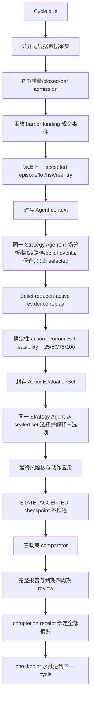

# 当前市场研究与连续仓位决策理论 v3（审查稿）

> 状态：`DRAFT_FOR_USER_REVIEW`
>
> 证据权限：`RESEARCH_DESIGN_AND_LOCAL_NON_EXECUTABLE_VERIFICATION_ONLY`
>
> 实验权限：`NONE_UNTIL_EXPLICIT_USER_REAUTHORIZATION`
>
> 日期：2026-08-05

本文件不是对 `CORE_TRADING_THEORY_v2_1.md` 的静默改写，而是把当前权威理论、SNDK V1 事故、形式化审查和 v1.4 暴露的新问题整理成一份可逐条审查的完整运行理论。用户确认前，它不能作为新实验、paper/live、账户或资金操作的授权。

## 1. 一句话目标

系统要从每个决策时点当时可得的数据出发，持续维护多时间尺度的竞争路径；只用新增或明确失效的证据更新上一战略状态；在相同风险与成本条件下比较持有、建仓、加仓、减仓、退出、重入和等待，并由单个 Strategy Agent 在确定性可行域内选择最能捕获当前主路径的连续仓位。

目标不是让 Agent 每次猜中涨跌，也不是追求“永远持有”。目标是避免三种结构性失败：

1. 正确识别路径后，因为静态目标和无状态决策过早永久离场；
2. 用保守、空仓或格式合规掩盖机会成本和路径捕获失败；
3. 用事后价格、模板化解释或工程 PASS 冒充理论有效和盈利证明。

## 2. 当前理论的来源与权威

| 来源 | 当前采用内容 | 不允许误解为 |
|---|---|---|
| `CORE_TRADING_THEORY_v2_1.md` §2–8、§11–16 | 点时认识论、D/L/C/F/R/K、episode、多时间尺度、动作/风险分离、动态竞争路径、证据等级 | 已证明盈利的交易规则 |
| `PROJECT_CORE_GOAL_RELOAD_2026-08-02.md` §3–10 | 市场分析、连续状态、仓位/重入、Agent 自主权、最低研究路线 | 建设通用 Agent 平台 |
| `THEORY_AGENT_V2_THEORY_FORMALIZATION_AUDIT_v0_1.md` §3–5 | 趋势延续、target 事件、CORE/TACTICAL、双维状态、reentry、动态几何、ABSTAIN 义务 | 固定持仓比例或自动加仓规则 |
| `audits/2026-07-31-sndk-execution-incident/EVIDENCE_INDEX.md` §4–10 | V1 无状态循环、全平、重入断裂、执行时钟和机会差证据 | 可后见地把第 16 轮改成“必然持有” |
| v1.4 Cycle 1–4 忠实度审查 | PIT/状态/成交链可用；selected-first、模板化反事实、belief 任意覆写、报告未绑定和复盘过度结论 | v1.4 已验证市场有效性 |

发生冲突时，优先级是：点时事实与不可变证据 > Core v2.1 的理论边界 > 本审查稿的运行形式化 > 实验参数。任何实验结果只能支持、反驳或保持不确定，不能倒过来改写已经发生的决策。

## 3. 认识论：系统究竟知道什么

### 3.1 唯一合法推论链

每条结论必须沿以下链条前进，不得跳级：

```text
OBSERVATION
  原始可观测事实，带 source、available_at、质量和摘要
    ↓ 可复算公式
DERIVED MEASURE
  指标、聚合、相对变化、结构统计
    ↓ 明确假设与局限
INFERENCE
  对供需、拥挤、吸收、衰竭或事件影响的解释
    ↓ 与竞争路径比较
HYPOTHESIS / FORECAST
  有 horizon、支持证据、反证、失效条件和到期时间的路径
    ↓ 经动作可行性、风险和成本比较
POLICY / ACTION
  当前仓位选择、保护、复核与重入义务
```

新闻标题、OI 变化、funding、订单簿、K 线形态和技术指标都只是观测或派生量，不能直接等同于“市场一定上涨/下跌”。

### 3.2 点时信息集

任一决策只允许使用 `available_at <= decision_at` 的内容。必须记录：

- 数据来源、请求时间、响应摘要和原始内容摘要；
- provider 是否确认 bar 已闭合；
- 直接周期、官方 fallback、完整 UTC 聚合或 `UNKNOWN`；
- 缺失、陈旧、冲突和代理数据的状态；
- 公式、参数和版本，使派生量可复算。

缺失不补零，旧值不自动携带为当前事实，代理量不冒充不可观测对象。Cycle 5 以后数据不允许用于解释或修改已封存的 v1.4 Cycle 1–4。

### 3.3 证据等级

当前证据由强到弱分为：

1. 原始 point-in-time 观测；
2. 可复算派生量；
3. 有来源和局限的 Agent 推论；
4. 有 horizon 与 falsifier 的路径假说；
5. 在未见顺序窗口中的实际前缀结果；
6. 多窗口、同条件对照后的市场效果证据。

本轮代码测试只能证明 1–4 的形式化和过程完整性，不能替代 5–6。

## 4. 市场状态理论：D/L/C/F/R/K

Agent 不把指标当投票器，而是用它们解释六个状态维度及其相互作用。

| 维度 | 含义 | 可用观测举例 | 主要不可识别边界 |
|---|---|---|---|
| D：方向压力 | 买卖方向与价格结构是否持续一致 | 多周期结构、收益、VWAP、EMA/ADX、趋势效率、主动买卖 proxy、相对强弱 | 成交方向 proxy 不等同全市场真实订单流 |
| L：杠杆变化 | 风险敞口是否在扩张或收缩 | OI、funding、basis、保证金/衍生品公开数据 | OI 增减不能单独识别多空开平 |
| C：拥挤 | 同向仓位与叙事是否集中 | funding、账户/仓位比、basis、新闻叙事、跨市场一致性 | 公共比率不是全体投资者持仓真相 |
| F：强制去杠杆 | 是否已观测到被动平仓或瀑布流 | 公共 liquidation、OI 急降、成交/价差异常、快速冲击 | 缺失 liquidation 数据必须为 UNKNOWN |
| R：流动性韧性 | 冲击后深度、价差和吸收是否恢复 | spread、depth、impact proxy、回撤修复、成交量分布 | REST 快照不能证明连续可执行深度 |
| K：上下文 | 事件、宏观、跨市场与数据质量 | 合规新闻、公告、BTC/美元/利率等公开上下文、source health | 标题情绪不等于因果事件影响 |

核心关系不是固定公式，而是可证伪机制：同样的价格上涨，在 `L↑ + C↑ + R↓` 时可能是脆弱拥挤，在 `D↑ + R↑ + 温和 L` 时更可能是可持续延续。Agent 必须说明是哪种机制使某条路径领先，以及什么观测会使该解释失效。

## 5. 多时间尺度与指标自由

### 5.1 时间尺度职责

| 层级 | 默认周期 | 决策职责 |
|---|---|---|
| 战略层 | 1W/1D/4H | episode 方向、市场阶段、核心假说、硬失效、CORE 风险上限 |
| 战术层 | 1H | 回撤/突破/吸收/衰竭的路径更新，TACTICAL 与 CORE 局部调整 |
| 执行层 | 15M | 入场、成交、保护、成本和短时异常，不得仅凭噪音改写战略假说 |

周期不是多数表决。短周期可以促使减小风险、延后加仓或触发保护；只有达到事前声明的跨周期晋级条件，才能挑战战略层。长期周期也不能以“仍然向上”为由忽略已经发生的硬失效或账户风险。

### 5.2 指标不是白名单

Agent 可以按路径区分价值请求并组合 Bollinger Bands、bandwidth、`%B`、rolling/session/anchored/event VWAP、ATR、实现波动、EMA、ADX、趋势效率、成交量分布、相对成交量、CVD/订单流 proxy、spread、depth、impact、OI、funding、basis、跨市场相对强弱、公开事件等。

每项新增观测只回答五件事：

1. 区分哪两条或多条竞争路径；
2. 适用于哪个时间尺度；
3. 改变哪个前提或 falsifier；
4. 数据质量、时效和成本是什么；
5. 如果缺失，是否真的改变当前动作。

不为每个指标创建模块、Agent、schema 或机械阈值。一个通用 observation request 足够；没有增量区分力的指标应删除。

## 6. 市场情绪的定义与分析

“情绪”不是一个神秘总分，也不是正负新闻计数。每个标的至少从四个维度解释：

1. **价格与流情绪**：追价、承接、抛压、波动扩张、冲击后的修复；
2. **杠杆与拥挤情绪**：OI/funding/basis 的组合是否显示追涨、挤压或去杠杆；
3. **公开事件叙事**：事件是否新鲜、是否已被价格吸收、是否存在来源冲突；
4. **跨市场风险偏好**：标的相对 BTC/行业/宏观风险资产是强化还是背离。

Agent 的情绪结论必须是机制推论，例如“价格创新高但 OI 收缩、主动卖压上升，更符合空头回补后的衰竭风险”，而不是“情绪=70”。若数据只支持多种解释，应保留多条标记推论，不得把它们合成伪精确概率。

## 7. 连续竞争路径

### 7.1 最小稳定路径族

每个 episode 保留稳定 `path_id`，至少包含：

- `TREND_CONTINUATION`：结构、需求和风险承受继续强化；
- `NORMAL_PULLBACK`：战略路径未失效，短期供给/过热通过回撤消化；
- `EXHAUSTION_OR_FAILURE`：动量、吸收或突破失败，核心前提受到挑战；
- `RANGE_REFORMATION`：趋势让位于双向均衡或新的交易区间；
- `OTHER_OR_UNKNOWN`：未覆盖机制、数据缺口和模型误差的剩余空间。

只有数据确有区分价值时才增加 `LIQUIDITY_STRESS`、`EVENT_REPRICING` 或 `DATA_ARTIFACT`。`OTHER` 不能被静默分配给已知路径，也不能被视为中性。

### 7.2 路径卡

每条路径必须包含：

- 稳定身份、机制和理论来源；
- horizon 与适用周期；
- 当前已观测前缀；
- 活跃支持、软反证和硬 falsifier；
- favorable / normal / adverse 演化；
- 下一项最有区分力的观测；
- expiry、switch 条件和数据局限。

Agent 选择 operational lead 和 runner-up，用于当前动作排序；它们不是统计概率。当前没有经过互斥完备 partition 和样本外校准，因此禁止把序数支持包装成合计 100% 的概率、EV 或置信边际。未来若要输出概率，必须先独立建立路径分区、标签、calibration 和 proper scoring 证据。

## 8. 连续 belief 更新：不再每轮重写观点

### 8.1 状态所有权

Agent 只能提出“证据生命周期事件”，不能直接写 `support_level`。确定性 reducer 持有上一 accepted 的活跃证据集合，并应用：

- `ADD`：新增独立支持；
- `SUPERSEDE`：同一来源/依赖 lineage 的新观测明确替代旧观测；
- `EXPIRE`：证据按时间或适用条件到期；
- `SOFT_CONTRADICTION`：削弱但不自动否定路径；
- `HARD_FALSIFIER`：命中已登记的硬失效。

缺失、请求失败和 Agent 沉默都不会自动降低支持。相同 dependency lineage 同时只能有一项活跃贡献，避免同一价格/OI 信息换名字重复计数。已使用的 evidence ID 不得复用。

### 8.2 序数支持编码

每项活跃证据的 strength 只允许 `1/2/3` 的弱/中/强序数贡献；软反证取负，硬 falsifier 独立优先。当前审查稿的透明映射为：

| 活跃证据状态 | 支持标签 |
|---|---|
| 无活跃证据 | UNKNOWN |
| 净序数余额 < 1 | WEAK |
| 1–2 | PLAUSIBLE |
| 3–4 | SUPPORTED |
| ≥5 | DOMINANT |
| 任一活跃 hard falsifier | INVALIDATED |

这只是持久状态编码，不是买卖阈值、概率或收益评分。最终 lead 和动作仍由 Agent 比较机制、horizon、仓位、风险、成本和 OTHER 后选择；若 lead 与支持标签排序不同，必须解释时间尺度或机制原因。该映射是本次需要用户重点审查的可冻结参数之一，未经确认不进入新实验。

### 8.3 可重放收据

每个 event receipt 同时记录目标路径的 before/after 活跃证据、序数余额、支持标签和 event digest。给定上一 belief digest、同一事件序列和 decision_at，必须得到同一新 state digest。

## 9. episode、状态和仓位不是同一个对象

每个标的同一时刻只有一个当前 accepted `StrategicEpisodeState`，并分开记录：

- 战略状态：`ACTIVE / CHALLENGED / INVALIDATED / CLOSED`；
- 暴露状态：`FLAT / EXPOSED / RISK_REDUCED / EXIT_PENDING / RECONCILE_PENDING`；
- 工作流投影：包括 `REENTRY_PENDING`；
- 路径 belief、动态几何、风险预算、lot、订单、保护和 review clock。

空仓不等于 episode 结束。只有战略失效或明确 terminal close，才能关闭 episode。若仓位因战术、执行或账户风险降为零，而战略假说仍有效，必须保留 reentry contract。

## 10. CORE、TACTICAL 与动态几何

每个 lot 必须具有 `role`、episode、来源路径、成本、数量、stop、风险预算、最大 horizon 和退出意图。

- **CORE**：捕获战略路径；target 是管理事件，不是默认全平指令；
- **TACTICAL**：捕获回撤、突破、短期扩张等局部机会，可以使用更明确的 target 和期限；
- **HEDGE**：若未来启用，只降低组合风险，不能伪装为反向战略观点。

CORE 全退需要以下至少一种可追溯原因：硬失效、账户/组合硬风险、episode terminal、或 Agent 明确选择的战略退出且其风险收益优于保留核心。系统不强迫“始终保留 CORE”，也不允许仅因短期过热、达到旧 target 或格式谨慎而静默全平。

旧支撑、target 和 entry zone 在市场结构改变时必须显式失效或重建，不能永久成为重入门槛。`TargetReachedEvent` 触发 continuation / pullback / failure 再比较；保护止损和真实挂单模拟则按冻结执行语义成交，不能在“固定止盈”和“事后动态市价”之间取有利结果。

## 11. 动作与仓位尺度：先比较，后选择

### 11.1 八类动作

每轮对每个标的至少评估：

`HOLD / OPEN / ADD / REDUCE / PARTIAL_TAKE_PROFIT / EXIT / REENTER / WAIT`

不可行的动作仍保留并显示具体 veto；风险内核不能因为谨慎而删除持有、加仓或重入。`WAIT` 必须说明数据缺口、风险 veto 或相对效用原因，同时记录机会成本、下一复核时间和触发后的义务。

### 11.2 两阶段单 Agent 决策

同一个 Strategy Agent 完成分析，不引入集群或 Critic，但输出分成两个不可倒置的阶段：

1. **Proposal 阶段**：读取上一 accepted state 和当前 PIT context，提出 belief events、竞争路径、每个动作/尺度在 lead、runner-up、OTHER 下的市场过程；此阶段没有 selected 字段；
2. **Selection 阶段**：确定性代码先计算并封存完整 evaluation set，Agent 才能从其中的可行候选选择，并逐项说明为何不选其余可行尺度。

这从数据依赖上消除了“先在 CONFIG 写 selected，再把它标为最高效用”的路径。自然语言是否相似不再决定 PASS；关键证据是选择发生前的 evaluation digest、真实数量/成本/风险计算和路径特异的 evidence/process refs。

### 11.3 确定性候选计算

每个候选由代码复算：

- action 后数量、估计成交价、turnover；
- fee、slippage 和总动作成本；
- action 后 symbol/portfolio open risk；
- symbol/portfolio 剩余风险预算；
- gross 和单标的 notional；
- stop 后最坏损失；
- action 语义是否与当前暴露/reentry 状态一致；
- 所有 hard veto。

对局部减仓至少比较 25%、50%、75% 和 100%（或事前冻结的同等级尺度）；比例不是由 SNDK 结果事后确定。Agent 可以选择其他连续数量，但必须同时看到相邻尺度的风险、成本、路径捕获和机会差。

## 12. 风险、成本和执行边界

风险核只拥有否决权，不拥有市场观点。它强制：

- 账户、组合和单标的最大风险；
- gross、杠杆、保证金和极端情景；
- 所有新增风险必须有保护和最大损失；
- 数据陈旧、状态冲突、保护失败和账本不平时停机；
- paper/live、账户、凭据、订单和资金的独立授权。

风险不能把“不行动”当成零成本。评价同时记录：

- realized / unrealized PnL；
- fees、slippage、funding（未知保持 UNKNOWN）；
- benchmark hold 和三政策机会差；
- drawdown、tail/stress loss；
- 空仓持续、reentry 延迟、add 利用和 path capture。

模拟成交必须提前冻结 barrier、bar close、gap、限价/市价、fee/slippage 和 funding 语义。固定 target 若模拟为挂单，应在首次可成交位置成交；若只作为管理事件，就不能事后按更优市价冒充固定止盈成交。

## 13. 102% 初始成本、24 小时窗口和 4 小时复盘

这些是压力实验参数，不是通用市场理论：

- 初始 exogenous position 的成本设为 genesis 当前价格的 102%，用来测试亏损起点下的修复、持有、减仓、重入和机会成本；
- 连续窗口 24 小时，每小时一个决策周期；
- 每 4 个周期形成一次结构化复盘；
- 静态 V1、确定性 continuous 和单 Agent 动态政策使用相同 PIT 输入、初始状态、风险、成本和执行语义。

不能因为四小时或二十四小时结果不佳就即时修改理论。先封存 raw，再评价；修改只进入新版本和新窗口。

## 14. 每轮完整运行流程



如果在 `STATE_ACCEPTED` 后报告生成失败，事件链显示下一阶段为 comparator/report/review，恢复时只重做确定性尾部，不重新采集、不重跑 Agent、不改 accepted state。无法修复的硬输入缺失则暂停当前周期并如实报告；不会自动复制出 successor。

## 15. 事件、Agent 归属和完成事务

每轮只有一条 append-only process chain，按顺序记录：

`CYCLE_DUE → COLLECTION_STARTED → COLLECTION_ATTEMPTS_SEALED → COLLECTION_SEALED → PIT_ADMITTED → REPLAY_SEALED → AGENT_CONTEXT_SEALED → AGENT_PROPOSAL_ATTEMPT_SEALED → AGENT_PROPOSAL_SEALED → BELIEF_UPDATE_SEALED → ACTION_EVALUATION_SEALED → DELIBERATION_SEALED → ACTION_SELECTION_SEALED → RISK_DECISION_SEALED → STATE_ACCEPTED → COMPARATOR_SEALED → REPORT_SEALED → [REVIEW_SEALED] → CYCLE_COMPLETED`

每个事件具有 sequence、previous digest、payload ref/digest、actor、recorded_at 和 evidence boundary。Agent invocation receipt 记录 input/proposal digest、attempt、开始/结束时间、automation/thread 和 authoring mode。没有平台级 model receipt 时只标记 `PRACTICAL_CODEX_PROVENANCE_NOT_MODEL_ATTESTED`，不能用自述证明精确模型身份。

checkpoint 只有在 completion receipt 同时绑定 market/pre-state/context/invocation/proposal/belief/evaluation/deliberation/selection/risk/decision/accepted state/action receipt/comparator/report，以及到期 review 后才推进。完成收据与 completion event 均可幂等恢复，但 accepted Agent 判断不能重做。

## 16. 四周期复盘与终局评价

四周期 review 是结构化工件，不是报告中的概括表。每个周期计算：

- 当时 lead path 与后来已发生前缀：`SUPPORTED / FAILED / UNRESOLVED`；
- selected 与 applied 是否一致；
- path capture；
- 相对静态/确定性基线的 opportunity difference；
- add risk utilization；
- exit 后 reentry eligibility、pending 和 delay；
- fees、funding status/value；
- drawdown。

24 个周期和 terminal observation 完成后，先封存 raw，再评价多 horizon 方向/路径、最大回撤、尾部、成本后结果、持仓/空仓持续、reentry、add、path capture 和机会成本。四周期复盘只发现过程问题，不能声明稳定盈利。

## 17. 三个同条件政策

1. **STATIC_V1**：冻结区间/target 逻辑的历史基线；
2. **DETERMINISTIC_CONTINUOUS**：无主观 Agent 的连续持仓与保护基线；
3. **SINGLE_AGENT_DYNAMIC**：本审查稿定义的单 Agent 动态政策。

比较目的是回答 Agent 的多尺度解释和路径选择是否产生增量市场价值，不是比较谁的报告更长。若动态策略长期只复制确定性政策、只增加费用或频繁给出模板化解释，则 Agent 增量失败，应裁剪其权限或特征，而不是增加角色数量。

## 18. 失败归因

每次失败必须归入可区分层级：

| 层级 | 例子 | 允许结论 |
|---|---|---|
| 数据失败 | 缺硬输入、PIT 违规、source 冲突 | 本轮不可判定，不把 UNKNOWN 当零 |
| 理论失败 | 冻结机制在足量新窗口中反复被 falsify | 对对应 claim 降级或删除 |
| 形式化失败 | 理论有但状态/动作/重入没有机器表达 | 修复编译，不宣称市场理论失败 |
| Agent 决策失败 | 看到了可区分证据却选择劣势动作，或无法解释相邻尺度 | 改善指导、上下文或选择合同 |
| 执行/账本失败 | barrier、成本、成交或状态提交错误 | 修复确定性代码，不用有利成交掩盖 |
| 市场效果失败 | 同条件多窗口成本后持续落后 | 裁剪理论/Agent 增量，不靠工程 PASS 辩护 |

v1.4 Cycle 1–4 当前只支持“过程结构部分可用、决策形成和复盘有 P0 缺口、市场前缀暂时不占优且样本不足”，不支持完整理论成功或失败。

## 19. Agent 与确定性代码的职责边界

| 单个 Strategy Agent | 确定性代码 |
|---|---|
| 多时间尺度解释与机制联系 | point-in-time cutoff 和数据 admission |
| 情绪四维分析 | 指标计算、聚合、公式和 source lineage |
| 提出 belief lifecycle events | reducer 决定 active evidence 与 support |
| 构造竞争路径和 OTHER | path_id/state continuity 与 digest |
| 描述各动作在路径下的市场过程 | 数量、成交成本、风险、最坏损失、可行性 |
| 在 sealed 可行集合中选择 | hard risk veto、账本、保护和成交 |
| 解释未选动作/尺度与机会成本 | event chain、completion、checkpoint |
| 请求有区分力的新观测 | 数据请求成本、质量、缓存与 UNKNOWN |

没有 Agent 集群、Critic、transport、插件系统、指标平台或第二决策中心。数据层只保留固定公开适配器和一个通用 observation request 接口。

## 20. 最小四层实现

| 层 | 当前模块 | 输入 | 输出/副作用 |
|---|---|---|---|
| Presentation | `presentation/continuous_cycle_report.py` | 完成后的结构化 cycle summary | 强制包含采集、理论、推论、路径、动作、仓位、成本、对照、问题和证据链接的中文摘要 |
| Application | `application/continuous_cycle.py` | 单 cycle 的 sealed artifacts | 编排 stage、post-accept deterministic finalization、completion 后推进 checkpoint |
| Domain | `domain/research_integrity.py` | 上一 belief、证据 events、候选、position/risk truth、四周期 rows | belief state、action evaluation、selection、Agent receipt、structured review；无 I/O |
| Infrastructure | `infrastructure/research_cycle_store.py` | payload digest 与 checkpoint | 专用 write-once event files、completion receipt、原子 checkpoint；无通用 event platform |

现有市场采集、portfolio、risk、barrier/funding replay 和 comparator 组件继续复用。旧 v1.4 ad-hoc decision builder 只作为封存诊断证据，不是未来兼容入口。

## 21. 已知问题到解决方案的逐项映射

| 已知问题 | 根因 | 当前解决 |
|---|---|---|
| V1 静态 target 全平 | target 与战略退出混为一体 | target 变管理事件；CORE/TACTICAL 与战略退出分离 |
| 每轮从零生成 PHI | 上一 episode/belief 不参与决策 | persistent episode + active evidence reducer |
| 空仓成为吸收态 | 退出容易、重入无义务 | exposure/strategic 双维状态 + reentry contract |
| selected-first、后补比较 | 决策与解释同一可变文档 | proposal 无 selected；sealed evaluation 后独立 selection |
| 模板文本绕过查重 | 把语言差异当因果证据 | 取消文本查重中心，绑定 path-specific process/evidence 与真实 economics |
| support 任意覆写 | Agent 同时拥有证据解释和状态提交 | Agent 发 event；reducer 计算 support 和 receipt |
| 25% 缺少尺度依据 | 没有相邻仓位反事实 | 25/50/75/100 与连续数量的成本风险并列 |
| receipt 不绑定报告/对照 | accept 后 checkpoint 已推进 | post-accept finalization + completion receipt |
| 四周期复盘过度声称 | 报告文字代替计算工件 | structured review 先计算，报告只投影 |
| heartbeat 信息太少 | 摘要无最低内容合同 | 完整用户摘要字段，不允许一句式“已完成” |
| 网络/报告错误后只播状态或复制 successor | 没有 stage-level durable continuation | event chain 定位下一阶段；accepted 后只恢复确定性尾部；successor 需新授权 |

## 22. 当前已实现、尚未验证与明确非主张

### 已实现并通过本地聚焦验证

- v1.4 automation 已暂停，Cycle 1–4 原样封存，Cycle 5 无产物；
- 用户暂停收据禁止 resume 和自动 successor；
- active evidence belief reducer、显式 lifecycle events、可重放 transition receipts；
- selection-free action evaluation、真实数量/成本/风险/尺度计算、selection digest 回绑；
- Agent practical invocation receipt；
- append-only cycle event chain、post-accept finalization、completion 才推进 checkpoint；
- 结构化四周期 review 和完整用户摘要合同。

### 尚未形成市场证据

- 新主链尚未在 fresh unseen window 运行；
- support strength 和序数映射尚未由用户审查冻结；
- Strategy Agent 是否能持续产出真正有区分力的多标的路径分析仍待实测；
- 动态政策是否优于静态 V1 或确定性 continuous 未知；
- 预测有效性、风险调整盈利和跨市场稳健性未知。

### 明确非主张

- 不宣称 v1.4 的工程通过证明理论有效；
- 不宣称四轮落后证明理论失败；
- 不宣称 Codex 自述等于平台级模型身份 attestation；
- 不宣称当前具有 paper/live、账户、订单、凭据或资金权限；
- 不宣称 numeric probability 或 EV 已获授权。

## 23. 用户审查清单

请重点判断以下设计是否符合您的真实理论：

1. 战略/战术/执行三个时间尺度的权限是否合理；
2. D/L/C/F/R/K 与四维情绪是否覆盖您希望 Agent 主动解释的市场状态；
3. 五条最小竞争路径与 optional path 是否足够开放；
4. belief event 和序数支持映射是否应调整，尤其是 `1–2 / 3–4 / ≥5`；
5. operational lead 使用序数而非合计 100% 概率是否接受；
6. CORE 全退、target event、动态几何和 reentry 义务是否符合设计；
7. 25/50/75/100 的尺度比较是否应作为默认实验要求；
8. 同一 Agent 的 proposal→evaluation→selection 两阶段是否保留了足够主动性；
9. 风险核只有硬 veto、不能静默删除动作的边界是否正确；
10. 24h/1h cycle/4h review 与 102% 初始成本是否继续作为下一实验参数。

用户逐项确认或提出修改后，才允许冻结新版本并准备 fresh genesis。当前唯一正确动作是继续暂停实验。
