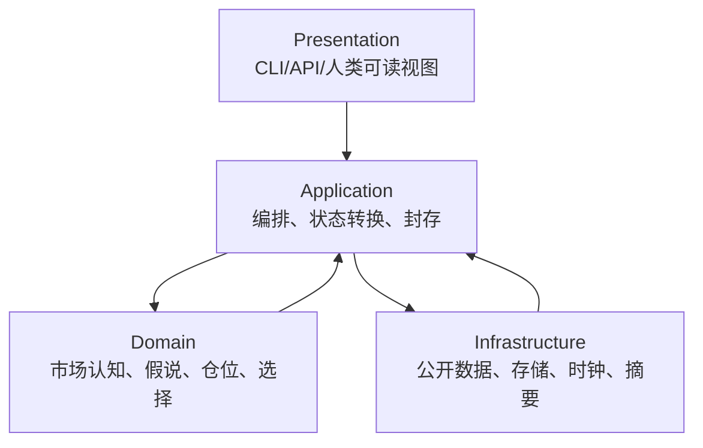

# 完整执行链路与 Agent 设置

版本：`3.3.0-modular-cognition-position-candidate.1`

状态：`FROZEN_CURRENT_CANDIDATE / PUBLIC_RESEARCH_ONLY / NOT_RUNTIME_IMPLEMENTED`

Owner：从请求到五工件、Outcome 和 Review 的最短链路，以及 Agent 与确定性组件的职责。

本文定义落地合同，不宣称现有 runtime 已完成 V3.3.0 多文件加载，也不授予 paper/live、账户、凭据或订单权限。

## 1. 交付目标

完整链路只需要完成一个核心闭环：

```text
真实点时数据
→ 可反驳市场判断
→ 竞争假说
→ 可比较的行为与仓位计划
→ 决策封存
→ 到期 outcome
→ review
```

一个 cycle 的完成定义不是生成更多 registry、receipt 或资格报告，而是五类业务工件拥有一致版本、时间和标的引用，并存在唯一下一合法动作。

## 2. 四层架构



| 层 | 唯一职责 | 禁止承担 |
|---|---|---|
| Domain | 纯对象、方法卡、假说更新、仓位几何、动作比较 | 网络、文件路径、账户 IO |
| Application | cycle 编排、状态机、调用顺序、单写者、恢复 | 重复一套市场理论 |
| Infrastructure | 数据 adapter、raw 保存、PIT 校验、存储、时钟 | 决定方向、修改假说 |
| Presentation | 输入请求、展示 lead/runner-up/OTHER、错误和下一步 | 成为第二套状态 owner |

模块只通过公开合同交互。V3.3.0 不新建事件总线、插件 SDK、第二个 orchestrator 或通用权限平台。

## 3. 五工件

| 工件 | 产生阶段 | 必需内容 | 完成条件 |
|---|---|---|---|
| `InputSnapshot` | 数据准入 | scope、raw refs、时间、coverage、UNKNOWN、profile | 决策前封存、无未来数据 |
| `HypothesisRecord` | 市场认知/假说 | state、zones、竞争机制、paths、falsifiers、expiry | lead/runner-up/OTHER 与下一观察齐全 |
| `BehaviorPlan` | 仓位/选择 | 合法动作比较、PositionPlan、WAIT 成本、选择理由 | 风险与权限上限明确 |
| `Outcome` | 到期评价 | 预注册 horizon 的 endpoint、可选路径、typed missing | 成功或失败都有终态 |
| `Review` | 复盘 | 决策对比、机会成本、错误类型、变更建议 | 不回写旧工件 |

`RunState` 仅引用五工件并表示下一合法转换，不是第六种业务工件。缓存、图和展示均应从这些 owner 派生。

## 4. 状态机

```text
REQUESTED
→ INPUT_SEALED
→ ANALYZED
→ PLAN_SEALED
→ OUTCOME_DUE
→ OUTCOME_SEALED
→ REVIEWED
→ COMPLETE
```

失败必须进入有原因的终态：

```text
REJECTED_SCOPE
INPUT_UNAVAILABLE
INPUT_INVALID
ANALYSIS_FAILED
PLAN_INVALID
OUTCOME_MISSING_TYPED
REVIEW_FAILED
```

同一状态只有 Application owner 可写。读取者不能通过创建旁路文件推进状态；恢复从已封存工件继续，不重做已完成阶段。

## 5. 完整冷启动链路

### 5.1 Freeze Request

冻结：

```text
instrument_id
venue and contract semantics
decision_at
decision_horizon and outcome_horizons
analysis_profile
lawful_actions
theory_revision and manifest digest
public-data permission boundary
```

标的、时间或 horizon 不清楚时只修正 request，不读取全市场。

### 5.2 Acquire and Admit

按 profile 获取核心数据和可选增强：

1. 读取仍新鲜的 slow/warm cache；
2. 只获取缺失或过期字段；
3. 保存 raw response；
4. 校验时间、instrument、unit、closed bar、revision、coverage；
5. 将失败增强记为 UNKNOWN，不把它写成零；
6. 形成不可变 `InputSnapshot`。

核心价格、时间、标的身份不可得时 `INPUT_INVALID/UNAVAILABLE`；可选 OI、flow、news、on-chain 缺失时继续降级。

### 5.3 Deterministic Preparation

确定性计算：returns、range/ATR、可重放 zones、已注册 method features、freshness、dependency clusters、event dedup 和 prior delta。不得在此处偷偷生成方向结论。

### 5.4 Market Cognition Agent

Agent 读取 bounded packet，输出：

```text
market state by frame
dominant changes
mechanism candidates
alternative explanations
path candidates
critical unknowns
next discriminating observations
```

### 5.5 Hypothesis Normalization

确定性 normalizer 校验 schema、source refs、falsifier、expiry、依赖簇和动作全集。缺字段返回一次局部修正，不把整个 cycle 送入无限 Agent 循环。

### 5.6 Position Planning

根据假说和公开合约规格生成 `REFERENCE` PositionPlan；如无独立账户授权，`executable_quantity=null`。至少比较 lead、runner-up、OTHER 与 WAIT/信息动作的机会成本。

### 5.7 Deterministic Selection

按假说篇词典序、风险上限和权限上限选择 operating lead；相同则保留 `UNRESOLVED`。不要求 sum-to-100 概率，也不以 Agent 语言强度打破平局。

### 5.8 Seal

一次写入 `HypothesisRecord` 和 `BehaviorPlan`，绑定：

```text
theory_version
theory_revision
theory_manifest_digest
input_snapshot_digest
decision_at
selected_action
next_review
outcome_schedule
```

封存后不可修改；新事实产生 delta/new cycle。

### 5.9 Outcome and Review

到预注册 horizon 后只取该时点可用、同一口径数据。路径观测缺失使用 typed missing，endpoint 可得则仍完成最小 Outcome。Review 比较当时所有合法动作，不用事后最佳路径重写决策。

## 6. Analysis Profile

| Profile | 必需输入 | 可选增强 | 合法输出上限 |
|---|---|---|---|
| `BASELINE_PRICE` | identity、time、closed price series、outcome route | 无 | price-only state/path、reference plan |
| `TACTICAL_FLOW` | baseline + trades 或连续 L2 + venue health | OI/funding | 短时流、liquidity 和 tactical path |
| `STRATEGIC_CONTEXT` | baseline + daily/4H + macro/event/cross-asset | on-chain | strategic regime 与传导假说 |
| `FULL_RESEARCH` | baseline + 已准入的多层数据 | 所有合法来源 | 多模型竞争，但仍受实际 coverage 限制 |

Profile 是数据和方法路由，不是质量勋章。`BASELINE_PRICE` 能完成 cycle；它必须标记 `SINGLE_FAMILY`，不能宣称 flow、crowding 或因果归因。

## 7. Agent 设置

### 7.1 默认形态

默认只有一个 `MarketReasoningAgent`，配一个确定性 Application orchestrator。只有当前 profile 需要可独立并行的宏观、microstructure 或 event 专项，且可显著缩短时间时，才临时使用 specialist；specialist 只返回结构化候选，不拥有最终选择或文件写入。

这避免多 Agent 相互复述、投票制造伪证据和上下文膨胀。

### 7.2 Agent 输入包

```text
AgentPacket
  request_scope
  theory_revision
  market_state_schema
  admitted_fact_cards[]
  deterministic_measures[]
  prior_active_hypotheses[]
  lawful_actions[]
  position_policy_schema
  critical_unknowns[]
  token/time budget
```

输入只包含当前决策需要的事实摘要与 raw refs，不默认塞入全理论、全部事故、测试闭包、旧 handoff 和完整历史。Agent 可按 ref 请求一项必要详情。

### 7.3 System Instruction 的稳定核心

```text
Use only admitted point-in-time facts.
Keep UNKNOWN unknown.
Separate fact, measure, inference, hypothesis and action.
Generate lead, strongest competitor and OTHER/no-effect.
Provide observable paths, falsifiers, expiry and next discriminating observation.
Compare all lawful actions; WAIT needs opportunity cost and review condition.
Do not emit probability, EV, account facts, orders or permissions.
Return the required schema; do not create files.
```

### 7.4 工具权限

当前公开研究 Agent 可：

- 读取已准入 `InputSnapshot` 与公开 raw refs；
- 调用注册的无副作用计算；
- 访问用户允许的公开官方来源补一个必要事实；
- 提出 acquisition plan；
- 返回结构化候选。

当前不可：

- 读取私有账户或凭据；
- 访问付费/许可数据而无授权；
- 绕过 403、地区或访问限制；
- 发送 paper/testnet/live 订单；
- 修改 raw、accepted、outcome 或已封存工件；
- 自行提升 risk budget、action set 或权限。

### 7.5 温度与重复性

理论不绑定特定模型供应商参数。实现时：

- 候选生成可保留有限多样性；
- schema normalization、选择、预算和封存必须确定性；
- 相同 packet 的非确定性差异作为 review 指标；
- 不靠多次采样投票提高表面确信；
- 只在 schema 缺失时允许一次局部修正。

## 8. 快慢路径与速度预算

以下是设计目标，不是已验证性能声明：

| 阶段 | Cold target | Delta target | 说明 |
|---|---:|---:|---|
| 核心源与准入 | 20s | 10s | 缓存慢层，只取变化字段 |
| 确定性准备 | 60s | 20s | 只重算受影响图 |
| Agent 市场/假说 | 6m | 50s | bounded packet；delta 不重述背景 |
| 仓位与选择 | 60s | 15s | 纯合同与公式 |
| 封存与展示 | 30s | 5s | 单写者；不跑业务 suite |
| 保留预算 | 5–7m | 20s | 网络抖动或一次局部修正 |
| **总体目标** | **≤15m** | **≤2m** | 未经实际测量前状态为 UNKNOWN |

### 8.1 Delta 路径

```text
load sealed prior state
→ admit changed/expired inputs only
→ traverse direct dependency consumers
→ update affected hypotheses
→ recompute affected PositionTransitions
→ compare prior vs current lawful actions
→ seal delta
```

未变化的 slow context、历史故事、method outputs 和旧资格不重算。

### 8.2 Event Fast Path

```text
official event card
+ latest price/liquidity/venue health
+ affected hypotheses
+ current position plan
→ REDUCE/CLOSE/PROTECT/REANALYZE proposal
```

减少风险可以走 fast path；新增方向风险仍需要当前 `InputSnapshot`、新假说与新 `BehaviorPlan`。

### 8.3 速度失效条件

若 cold/delta 超预算，按顺序处理：

1. 检查是否重复读取旧理论或历史；
2. 检查 source 是否应缓存/并行；
3. 检查同一依赖簇是否重复计算；
4. 缩小 packet 到会改变决策的内容；
5. 对可选增强降级，而非扩大 timeout；
6. 不通过跳过 PIT、falsifier、risk geometry 或封存来提速。

## 9. 恢复与幂等

恢复只读取 `RunState` 和已封存五工件：

| 最后完成状态 | 恢复动作 |
|---|---|
| `REQUESTED` | 继续获取/准入 |
| `INPUT_SEALED` | 从同一 snapshot 分析，不重新取未来数据 |
| `ANALYZED` | 校验并生成计划 |
| `PLAN_SEALED` | 等待预注册 outcome，不改决策 |
| `OUTCOME_DUE` | 获取同口径 outcome |
| `OUTCOME_SEALED` | 生成 review |
| `REVIEWED/COMPLETE` | 不重复推进 |

同一 `cycle_id + stage + input_digest` 重试只能返回同一结果或明确冲突。single writer 用现有文件原子写和状态所有权实现，不新建分布式事务系统。

## 10. 错误与降级

| 错误 | 最小处理 | 能否继续 |
|---|---|---|
| 可选 source 超时 | UNKNOWN + source error | 是 |
| 核心 price/time/identity 无效 | `INPUT_INVALID` | 否 |
| L2 断序 | 关闭 microstructure 方法；重建前 UNKNOWN | baseline 可继续 |
| Agent schema 缺字段 | 一次局部修正；仍失败则 `ANALYSIS_FAILED` | 不伪造字段 |
| 假说并列 | `UNRESOLVED` + 下一观察 | 是 |
| 执行真值缺失 | `execution_mapping=NOT_READY` | research 可继续 |
| Outcome 路径字段缺失 | typed missing；endpoint 可得则完成最小 outcome | 是 |
| 文件 owner 冲突 | 停止写入并报告冲突 | 否 |

错误处理只记录必要原因和下一步，不创建资格闭包、事故叙事或重复审计文件。

## 11. 与旧 V3.2 runtime 的兼容边界

现有 V3.2 loader 把 `theory/current/V3_2_DYNAMIC_AGGRESSIVE.md` 作为单一完整 Markdown 输入，并拒绝 symlink。V3.3.0 是多文件合同，不能用目录或软链接无缝冒充旧 runtime。

迁移顺序：

1. 当前把 V3.3.0 作为文档权威候选；
2. 保留旧 V3.2 单文件作为 runtime compatibility snapshot；
3. 后续实现 manifest loader，按固定顺序读取七个 owner；
4. loader 必须校验每文件 digest 和 version manifest；
5. 新 runtime 完成最小合同检查后，显式切换入口；
6. 确认无消费者后才退出旧 snapshot。

本次文档修改不改变现有 runtime，也不声称兼容迁移已完成。

## 12. 最小实现路线

### Stage 1：文档与合同

- 七个 owner 文件、版本索引、manifest 语义；
- 五工件字段与 Analysis Profile；
- 保留旧 runtime snapshot；
- 仅做链接、引用和格式检查。

### Stage 2：多文件读取与现有核心复用

- 在现有 composition owner 内增加 manifest loader；
- 复用现有 PIT、cycle 和对象；
- 删除热路径中的重复资格/registry 读取；
- 支持 Baseline cold/delta 两条主路由。

### Stage 3：前瞻 baseline

- 冻结理论和 policy；
- 用户另行确认真实公开数据运行权限；
- 先完成最小前瞻 baseline，再评价市场、仓位与速度；
- 结果不足只进入 Review，不在运行中改规则。

## 13. 当前非声明

- 未运行实验、回测、paper 或 live；
- 未测量 cold `≤15m` 或 delta `≤2m`；
- 未证明市场预测有效、成本后盈利或跨 regime 稳定；
- 未实现 V3.3.0 manifest loader；
- 未授予账户、订单、资金或自动化权限；
- 未把旧 accepted/qualification 继承为新版本有效性。
