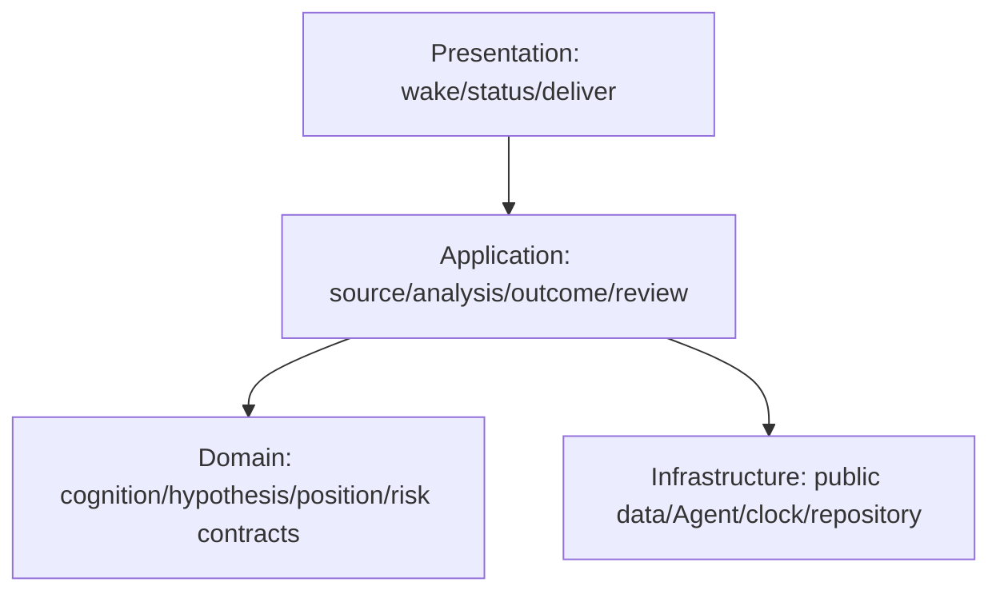
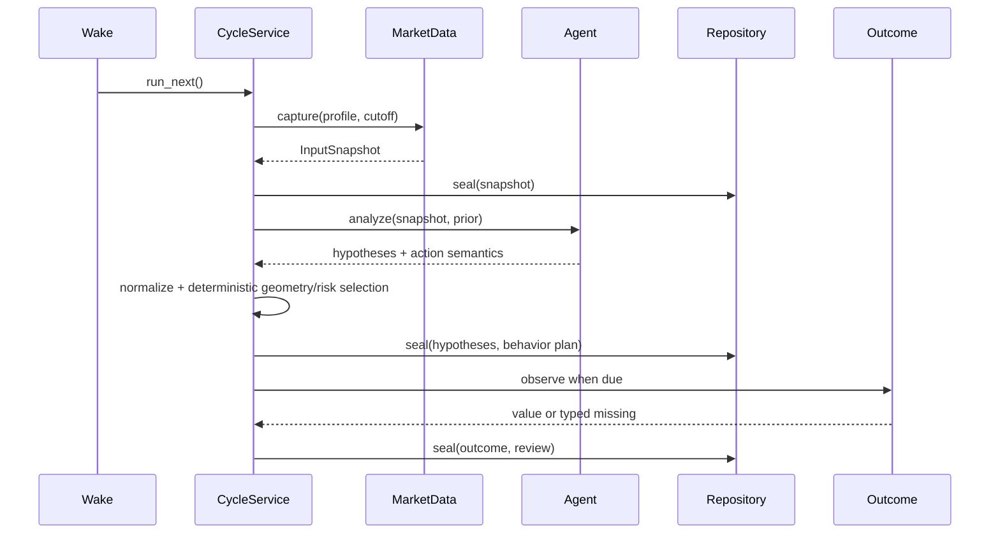

# 市场认知与动态仓位理论 V3.3.0

版本：`3.3.0-modular-cognition-position-candidate.1`

状态：`FROZEN_CURRENT_CANDIDATE / PUBLIC_NON_ACCOUNT_ONLY / NON_EXECUTABLE`

冻结日期：`2026-08-11`

冻结清单：[`MANIFEST.json`](./MANIFEST.json)

市场有效性：`UNKNOWN_NOT_EVALUATED`

前身：`V3.2.6-five-trap-hardening-candidate`

## 1. 结论

V3.3.0 不再把市场理论、运行时资格、文件系统故障和事故日志写进一个正文。理论主体固定为两件事：

1. 尽可能完整、快速且可反驳地认识市场；
2. 随市场路径变化动态规划仓位，使亏损受控、盈利不过早被截断，并保留部分兑现与 runner 捕获大行情的能力。

认识不完整不自动等于 WAIT。只要点时事实可信、研究损失参考可定义、动作仍可撤销，Agent 可以提出 probe、条件计划或信息价值更高的观察。只有数据真实性、未来泄漏、权限、不可定义的执行损失和状态写入冲突属于硬边界。

本文仍是公开数据、不可执行研究理论。仓位、止损、止盈和订单语义是行为规划；没有独立 paper/live 授权、账户真值、成交状态机和成本资格前，不得表述为真实订单或收益。

## 2. 文档所有权

| 文档 | 唯一职责 | 主要读者 | 不承载 |
|---|---|---|---|
| [`01_MARKET_COGNITION.md`](./01_MARKET_COGNITION.md) | 数据、来源、分析方法、时间尺度、行为动机、流程与市场模型 | 研究 Agent、数据 owner | 仓位算法、运行事故 |
| [`02_DYNAMIC_POSITION_MANAGEMENT.md`](./02_DYNAMIC_POSITION_MANAGEMENT.md) | 初始仓位、加减仓、止盈止损、runner、reentry、组合风险 | 行为规划 Agent、金融内核 | 数据采集实现、权限授予 |
| [`03_HYPOTHESIS_SYSTEM.md`](./03_HYPOTHESIS_SYSTEM.md) | 假说生成、竞争、更新、失效、选择和分析到行动映射 | 研究 Agent、Domain | mailbox、文件写入 |
| [`04_EXECUTION_AND_AGENT.md`](./04_EXECUTION_AND_AGENT.md) | 五工件、完整链路、Agent/确定性系统边界、快慢路径 | Application/Infrastructure | 市场理论扩写、事故叙事 |
| [`05_RISK_AND_BOUNDARIES.md`](./05_RISK_AND_BOUNDARIES.md) | 少量硬边界、软降级、权限和未来执行风险 | 风险 owner | 默认否决市场观点 |
| [`06_HISTORY_FAILURES_AND_CHANGES.md`](./06_HISTORY_FAILURES_AND_CHANGES.md) | 版本演进、失败、复盘和变更摘要 | 维护者 | 当前规则定义 |
| [`07_NEW_MECHANISMS_AND_RESOLVED_ISSUES.md`](./07_NEW_MECHANISMS_AND_RESOLVED_ISSUES.md) | V3.3.0 新机制、问题映射、剩余 UNKNOWN | 用户、维护者 | 重复完整理论 |

篇幅目标不是装饰指标，而是注意力约束：市场认知必须是最大单篇；市场认知与动态仓位合计应构成理论正文绝大多数。资格、测试、Git、receipt 和事故细节不得重新进入前五篇理论主体。

## 3. 理论信息流


任何信息不得从新闻标题直接跳到仓位。合法链条是：

```text
FACT → MEASURE → MARKET STATE → HYPOTHESIS → PATH
→ ACTION COMPARISON → POSITION PLAN → SEALED DECISION → OUTCOME → REVIEW
```

## 4. 五工件合同

理论内部可以有状态、区域、指标、假说和 tranche，但对一个 cycle 只形成五类业务工件：

| 工件 | 包含的理论对象 | owner | 不变量 |
|---|---|---|---|
| `InputSnapshot` | raw refs、时间、标的、分析 profile、可用数据、UNKNOWN、派生指标 | Source | 决策前封存；无未来数据 |
| `HypothesisRecord` | regime、zone、候选假说、反证、路径、expiry、证据依赖 | Analysis | Agent 可新增/削弱/替换；事实不可改写 |
| `BehaviorPlan` | lead/runner-up/OTHER、完整动作比较、tranche、stop/target/reentry | Position | 选择后不可事后改写 |
| `Outcome` | 预注册 horizon 的终点和可选路径观测、typed missing | Outcome | 同口径；失败也有终态 |
| `Review` | 决策对比、机会成本、错误类型、保留/修改建议 | Review | 只建议，不自动修改理论 |

`RunState` 只是 repository 对五工件引用和下一合法动作的投影，不是第六类业务工件。图、registry、审计展示和缓存若存在，只能是工件内部字段或可重建派生物。

每个新工件必须同时绑定：

```text
theory_version = 3.3.0
theory_revision = 3.3.0-modular-cognition-position-candidate.1
theory_manifest_digest = exact version-directory manifest digest at freeze
```

不能再只写旧兼容字段 `theory_version=3.2.1` 来代表不同修订。
README 与七个 owner 的顺序、大小和 SHA-256 已由 `MANIFEST.json` 固定；manifest 自身不嵌入自身摘要，其精确文件摘要由 `theory/CURRENT.md` 绑定。后续 loader 只能验证并读取该清单，不能在运行时重排、补写或改写冻结理论。

## 5. 四层与模块边界



| 模块 | 类型 | 输入 | 输出 | 数据 owner |
|---|---|---|---|---|
| Market Cognition | Domain strategy | `InputSnapshot` | market-state proposal | `HypothesisRecord.market_state` |
| Hypothesis System | Domain core | market state、prior hypotheses | candidates、paths | `HypothesisRecord` |
| Position Management | Domain strategy | hypotheses、objective geometry | action comparison | `BehaviorPlan` |
| Risk Boundary | Domain core | candidate plans、permission | hard veto/soft cap | decision annotations |
| Cycle Service | Application | `RunState` | one next transition | `RunState` |
| Public Data Adapter | Infrastructure adapter | source request | raw-first snapshot | raw capture |
| Agent Adapter | Infrastructure adapter | bounded packet | hypothesis/action proposal | transport receipt |
| Repository | Infrastructure service | five artifacts | immutable refs | physical files |

模块只通过上述合同交互；任何模块不得修改另一模块拥有的事实。V3.3.0 不建设通用事件总线、动态 plugin SDK 或第二套权限系统。新增数据和分析方法以静态 `DataSourceProfile`、`AnalysisMethodCard` 和 adapter 实现，不拥有核心状态。

## 6. 单 cycle 事件流



一次 wake 只推进一个高层边界；运行中不得启动第二个 advance。长 Agent 调用由同一个 composition owner 等待或终止，不以第二进程“解卡”。

## 7. 分析 profiles 与扩展路线

| Profile | 必需输入 | 允许结论 | 缺失处理 |
|---|---|---|---|
| `BASELINE_PRICE` | 时间、标的、mark、closed 15m bars | 价格结构、波动、基础 regime、条件路径 | 其他维度 UNKNOWN，不阻塞 cycle |
| `TACTICAL_FLOW` | Baseline + trades 或连续 L2 + venue health | 主动流、短时流动性候选 | OI/funding 缺失只关闭杠杆结论 |
| `STRATEGIC_CONTEXT` | Baseline + 4H/1D + 至少一种宏观/事件/跨资产背景 | 战略 regime 与传导假说 | 慢频数据按 release/vintage 使用 |
| `FULL_RESEARCH` | Baseline + 当前实际准入的多层增强 | 多机制比较与区分性请求 | 不要求全轴齐全；proxy 不升级为 direct fact |

Profile 是能力声明，不是通过缺失数据伪造完整十二轴。Baseline 可以产生 price-only 假说、条件计划或 reference probe，但不能声称已经观察到订单流、拥挤、机构身份或宏观传导。

## 8. 三阶段路线

1. **文档与合同**：完成本版本七文档、五工件映射、旧版本压缩和当前入口。
2. **最小实现**：在现有四层目录内实现 `BASELINE_PRICE` 垂直切片、单 repository、单 writer 和有界 Agent packet；旧 Q0–Q8/全仓闭包退出热路径。
3. **结果驱动扩展**：先得到真实前瞻 decision→outcome→review，再按错误类型增加 Tactical/Strategic 数据或调整理论；paper/live 另行授权。

## 9. 验证门与停止条件

| 门 | 只证明什么 | 失败动作 |
|---|---|---|
| V0 文档 | 路由、链接、版本和 owner 一致 | 修正文档，不扩理论 |
| V1 合同 | 五工件、单 writer、四层依赖可实现 | 停止实现，收缩对象 |
| V2 Baseline | 核心四项可形成完整研究 cycle | optional UNKNOWN 继续；核心失败停止 |
| V3 时延 | 冷启动与 delta 达到冻结预算 | 先减材料和重复重放，不抬预算 |
| V4 市场 | 前瞻样本能比较主策略与基线 | 不以工程 PASS 宣称有效 |
| V5 执行 | 未来独立 paper/live 合同与真实状态机 | 未授权前保持不可执行 |

立即停止新增复杂性，如果它需要：第二套平台、通用事件总线、大量新顶层工件、每轮全仓资格、双写、回填旧结果、读取 future outcome，或把可选数据缺失变成全系统停机。

## 10. 兼容与回滚

- V2.1 保留为旧工程/认识论 authority；V3.1.1 保留为 raw-first 与可靠性前身；V3.2.6 保留为先进待评价前身。三者都不代表市场成熟。
- V3.3.0 不改写任何旧 authority、accepted decision、outcome、receipt 或 raw data。
- 严格历史重放仍使用其原路径、摘要或清理前 Git 提交；当前入口变化不赋予旧 run 新语义。
- 回滚只需把 `theory/CURRENT.md` 指回一个保留版本；不得把 V3.3.0 新语义写进旧工件。

## 11. 当前非主张

- 本理论尚未证明预测增量、成本后收益、概率校准或跨 regime 泛化。
- 引用论文只说明方法值得成为候选，不证明它在 BTC 15m 上有效。
- 社区高赞经验只用于发现操作问题和候选 policy arm，不作为参数、胜率或盈利证据。
- 当前没有 paper/live、账户、订单、凭据、资金或真实组合写回权限。
