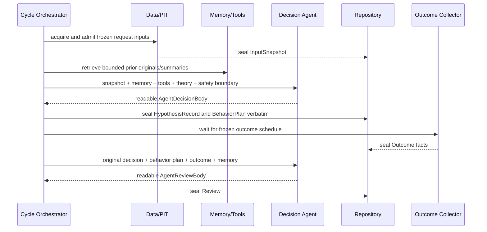

# Agent-first 完整执行链路与 Agent 设置

版本：`3.3.1-agent-first-trader-candidate.1`

状态：`FROZEN_VERSION_CANDIDATE / PUBLIC_RESEARCH_ONLY / RUNTIME_NOT_MIGRATED`

Owner：五工件主链、Agent/系统权责、`SystemEnvelope`、原文封存、Outcome/Review、长期记忆与恢复。

本文定义目标合同，不声称当前 runtime 已实现 V3.3.1，也不授予 paper/testnet/live、账户、凭据、订单或资金权限。

## 1. 完成定义

一个公开、不可执行研究 cycle 的最短完整链路是：

```text
legal point-in-time InputSnapshot
→ Agent market cognition + hypotheses + final action + position
→ exact AgentDecisionBody sealed in HypothesisRecord
→ BehaviorPlan with only verbatim Agent-selected action/position
→ Outcome facts at frozen horizon
→ exact AgentReviewBody sealed in Review
```

完成不要求 proposal schema、必填标题、固定词表、假说数量、lifecycle enum、字段顺序或系统选中的 action。可读非空的 Agent 原文一旦通过五条硬边界，就必须封存并继续 Outcome→Review。

## 2. 唯一权责表

| 事项 | Agent | 确定性系统 |
|---|---|---|
| 市场认知/状态 | 唯一决策 owner | 提供准入事实与计算，不选状态 |
| 假说生成/更新/反证 | 唯一决策 owner | 展示 raw/outcome/工具结果，不改状态 |
| lead/并列/OTHER | 唯一决策 owner | 不 tie-break、不排序 |
| 最终不可执行参考动作 | 唯一决策 owner | 只记录原文，不从候选中选择 |
| entry/stop/targets/仓位 | 唯一决策 owner | 按 Agent 要求计算，不 allocator |
| WAIT/机会成本 | 唯一决策 owner | 不在 UNKNOWN 时默认 WAIT |
| 复盘判断/学习 | 唯一决策 owner | 提供 Outcome/指标，封存原文 |
| raw/身份/PIT/时间 | 只读已准入事实 | 唯一事实 owner |
| 计算工具 | 选择问题、输入与解释 | 返回结果和 provenance |
| 长期记忆 | 判断什么值得使用 | 存储、检索、链接原文 |
| 封存/单写者 | 不直接写仓库 | 唯一物理 writer |
| 外部权限/副作用 | 可在原文中提议 | 未授权时必须阻断执行 |
| Outcome | 不改写事后事实 | 采集同口径事实与 typed missing |

一个系统模块不能同时以“安全”或“可重放”为理由拥有市场决策语义。可重放的是输入、计算、原文字节和调度，不是系统重新生成一个“等价决策”。

## 3. 五工件合同

### 3.1 `InputSnapshot`

系统事实 owner：

```text
request/run/cycle identity
instrument/venue/contract semantics
decision cutoff and frozen outcome schedule
raw refs and raw digests
admitted public facts and their availability times
transparent calculation results and provenance
actual coverage and UNKNOWN
theory identity and permission boundary
```

核心价格、标的、时间或 raw 覆盖损坏时，在 Agent 调用前 fail-close。可选非价格数据缺失时写 UNKNOWN 并继续。

### 3.2 `HypothesisRecord`

```text
SystemEnvelope
AgentDecisionBody exact bytes
optional DecisionIndex ref
```

`AgentDecisionBody` 是整个当时决策的唯一语义原文，不只是假说子集。它可包含市场认知、假说、最终动作、entry/stop/targets/仓位、UNKNOWN、机会成本与下一 review。

系统不能在写入前做语义 normalization、删除“额外”内容、补必填字段、转换词汇或改变顺序。

### 3.3 `BehaviorPlan`

`BehaviorPlan` 仍是五工件中的正式业务工件，不是可丢弃索引。它必须保留：

```text
hypothesis_record_ref
agent_decision_body_digest
agent_selected_action_verbatim_or_null
agent_position_plan_verbatim_or_null
verbatim source spans or full-body reference
extraction note: exact / not-found / ambiguous
non_executable = true
```

`agent_selected_action_verbatim_or_null` 和 `agent_position_plan_verbatim_or_null` 不是 proposal schema 要求。它们只能是 Agent 原文的精确引用/复制；如果没有可唯一定位内容，保留 null/ambiguous 和全文 ref，不拒绝、不推断、不用系统 planner 填充。

### 3.4 `Outcome`

系统在 `InputSnapshot` 中已冻结的 horizon 采集同标的/同口径事实：

```text
endpoint price/time
available path observations
MAE/MFE and transparent price calculations
missing fields with typed reasons
raw refs and digests
```

`Outcome` 不写“Agent 正确/错误”、不判断假说状态、不事后挑选最好 action。只有输入已预注册且当时可合法观测的事实才记录；其余保持 typed missing。

### 3.5 `Review`

```text
SystemEnvelope
references to InputSnapshot/HypothesisRecord/BehaviorPlan/Outcome
AgentReviewBody exact bytes
optional non-authoritative ReviewIndex
```

`AgentReviewBody` 是复盘判断的唯一语义原文。系统可给 Agent 提供原决策、Outcome、计算指标和有界记忆，但不能生成 Review 结论、给决策打分或把量化指标自动解释为学习。

`RunState`、`SystemEnvelope`、transport receipt、`DecisionIndex`、`ReviewIndex`、缓存和展示不是新的业务工件。

## 4. `SystemEnvelope`：只有安全身份，没有市场结论

每个工件外层可以使用严格机器合同，因为这些字段属于系统身份/安全真值，不是 Agent proposal：

```text
envelope_schema_id, envelope_schema_version
record_kind
run_id, cycle_id, request_id
instrument_id, venue, contract_semantics
decision_cutoff, decision_deadline
outcome_schedule
input_snapshot_ref, input_snapshot_digest
theory_version, theory_revision, theory_manifest_digest
agent_request_ref, agent_transport_result_ref
received_at, sealed_at
body_encoding, body_size_bytes, body_sha256
public_non_account_permission_scope
writer_id, idempotency_key, prior_record_ref_or_null
```

这些字段可以 fail-close 的原因只是：无法建立身份、PIT/未来/迟到边界、原文摘要或单写者安全。外层不得包含系统生成的：

```text
market regime
lead/runner/other
hypothesis lifecycle truth
selected_action
entry/stop/targets
position size or risk class
review verdict or learning
```

如果实现为了展示把这些语义放在外层，它们必须是原文 span 的非权威引用，不是系统真值。

## 5. Agent 输入：数据、工具、记忆和边界

Agent 需要的是会改变决策的上下文，而不是 proposal schema 和全仓治理材料：

```text
current request and frozen horizon
admitted InputSnapshot facts + raw refs
transparent calculations + provenance
actual data coverage and UNKNOWN
original prior AgentDecisionBody / AgentReviewBody refs
bounded memory summaries with source refs
available side-effect-free calculation tools
current public non-account, non-executable permission boundary
theory fragments needed for market/hypothesis/position/risk
```

Agent 可按 ref 请求一项会改变决策的详情。系统不默认注入全部 raw、全部旧决策、历史事故、tests、qualification 或维护篇 06/07。

工具必须无外部副作用并返回透明输入/版本/输出。Agent 可以选择是否使用这个输出；系统不因为某个指标被计算就自动将它加入决策。

## 6. 可读 `AgentDecisionBody` 的语义责任

理论期望一份有实战研究价值的原文尽可能解决：

1. 当前任务、cutoff、horizon 和数据覆盖；
2. 事实、测量、推断与 UNKNOWN；
3. 多时间尺度市场认知与最近变化；
4. 竞争假说、未来路径、反证、expiry 和下一区分观察；
5. 最终不可执行参考动作及其备选/机会成本；
6. entry、失效、stop、targets、初始仓位和动态仓位计划；
7. 高收益、亏损、路径变化、runner 和 reentry 情景；
8. 下一 review 与什么会改变决策；
9. 当前不可声称的事实和不可执行边界。

这九项是 Agent 质量与完整性的判断参考，不是输出模板、必填字段或顺序约束。Agent 可以用自然语言、Markdown、表格、公式或混合形式表达。

缺失、歧义或矛盾不得由系统补齐；原文封存，非权威索引可以标记 `not-found/ambiguous`，Outcome 按冻结时钟继续，之后由 Agent Review 判断缺口是否损害了决策。

## 7. `DecisionIndex`：只能指路，不能决策

非权威索引可包含：

```text
source_body_ref and source_body_digest
market-cognition source spans
hypothesis/path source spans
final-action source span or not-found/ambiguous
entry/stop/target/position source spans or not-found/ambiguous
review-time/outcome-question source spans
indexer version and created_at
```

索引器不得：

- 从多个候选中选一个最终动作；
- 把一个区间改成精确 entry/stop；
- 把自然语言风险转换成默认数值；
- 修正 Agent 的逻辑、单位、符号或相互矛盾；
- 因索引失败阻止五工件主链。

索引可以完全删除后从原文重建。原文和五工件不能从索引反向重建。

## 8. 唯一运行流



每个 cycle 只有一个 Application owner 和一个 Repository writer。一次 wake 只推进一个高层边界；不通过第二进程、双写或旁路工件“解卡”。

## 9. 唯一 fail-close 集合

### 9.1 整 cycle/当前阶段可关闭

| 硬边界 | 精确含义 | 最小处理 |
|---|---|---|
| 身份/raw/核心覆盖 | run/cycle/instrument/venue 不一致，raw 摘要损坏，核心价格时间序列不足以形成冻结输入 | Agent 前关闭，不伪造 InputSnapshot |
| PIT/未来泄漏 | `available_at > cutoff`、outcome/事后标签进入决策 | 关闭且保留证据，不重试同 identity |
| 迟到 | Agent 原文在冻结 deadline 后才返回，无法作为当时决策 | 原 transport 可存事故证据，不写入当时 HypothesisRecord/BehaviorPlan |
| 写冲突 | 单写者/幂等键/旧摘要冲突 | 停止写入，不选一个副本继续 |
| 不可读/空白 | 约定编码无法读取，或解码后只有空白 | 不伪造决策正文，当前分析阶段关闭 |

### 9.2 只关闭外部副作用通道

如果可读 Agent 原文提议访问账户、使用凭据、发送 paper/testnet/live 订单、移动资金或其他未授权副作用：

- 安全系统 fail-close 副作用通道；
- 原文仍按不可执行研究决策封存；
- `BehaviorPlan.non_executable=true`，不伪造 ACK/fill；
- Outcome/Review 仍可基于公开参考价格继续。

只有用户明确给予相应外部权限且实时安全真值完整时，外部通道才可以另行建立。本理论包不提供该授权。

## 10. 不是终态门的问题

以下问题不得转成 `ANALYSIS_FAILED`、`PLAN_INVALID` 或等价终态：

- JSON/Markdown/自然语言格式不同；
- 字段、标题、列名或顺序不同；
- triggers 是字符串、对象、列表或文本条件；
- 使用了新的市场状态、lifecycle 或 action 词汇；
- 没有明确 lead/runner/OTHER，或假说数量不合预期；
- 最终动作、entry、stop、targets 或仓位缺失/有歧义；
- 参考仓位超出系统旧 policy；
- WAIT 没写机会成本；
- 决策不符合理论质量期望，但没有破坏 raw/PIT/未来边界；
- `DecisionIndex` 抽取失败或得到歧义。

处理方式统一为：

```text
seal exact body
→ preserve missing/ambiguous as evidence
→ collect frozen Outcome
→ let AgentReviewBody judge consequence and learning
```

## 11. Outcome 与 Agent Review 设置

### 11.1 Outcome 不依赖完美索引

基本 Outcome 时钟已在 request/InputSnapshot 冻结，因此即使 Agent 没有写标准 horizon、target 不能解析或 DecisionIndex 失败，系统仍采集预注册 endpoint 与可得价格路径。

Agent 原文中的额外路径/目标如果可从原文稳定定位，可作为附加 Outcome question；无法定位时记 typed missing/not-indexed，不反向填充。

### 11.2 Review 是 Agent 的第二次完整判断

Agent 读取：

```text
original InputSnapshot
original AgentDecisionBody
BehaviorPlan verbatim references
Outcome facts and transparent metrics
bounded prior reviews/memory
```

然后交付可读 `AgentReviewBody`，尽可能判断市场认知、假说、动作、仓位、时间、机会成本、缺失/歧义、应保留/改动的内容和下一次学习假说。

复盘原文也不使用严格语义 schema 作封存门。可读非空就封存；缺漏作为复盘能力证据进入长期记忆。

## 12. 长期记忆不是第二个决策 Agent

系统记忆可以保留：

- 不可变的旧 `AgentDecisionBody/AgentReviewBody` refs 与 digests；
- 已准入 Outcome 事实；
- Agent 在 Review 中提出的学习候选；
- 链接原文的压缩摘要；
- 已知缺陷、适用条件和未解问题。

摘要必须有 source refs 并标记为派生记忆，不能取代原文。系统可以按时间、标的、horizon 和相关问题检索，但什么记忆影响当前决策由 Agent 决定。

记忆检索缺失、摘要不完整或旧决策与当前冲突不是终态门。系统不能以“历史 policy”覆盖 Agent 当前判断。

## 13. 学习与冻结验证分离

```text
Outcome facts
→ AgentReviewBody judgement
→ learning candidates
→ separate human/integrator theory-change decision
→ new version documents
→ byte/digest manifest validation
→ new run identity
```

- `AgentReviewBody` 可提出保留、弱化、删除、新增或重新定义理论的候选；
- 学习候选不自动修改当前冻结理论；
- 是否创建新 revision 由用户/integrator 单独决定；
- manifest/digest/link 验证只证明新版字节和路由，不判断学习是否正确；
- 任何改变 Agent 决策语义、prompt context、Outcome 口径或理论的新 revision 必须使用全新 run identity。

这避免了“因为冻结检查 PASS，所以学习有效”和“因为一次 outcome 不理想，运行中直接改规则”。

## 14. Cold、Delta 与 Event 路径

下列是调度/上下文建议，不改变 Agent 决策权：

| 路径 | 系统准备 | Agent 职责 | 当前状态 |
|---|---|---|---|
| `COLD` | 完整 price-only snapshot、多时间尺度计算、有界记忆 | 完整市场—假说—动作—仓位决策 | 新 V3.3.1 runtime 待实现 |
| `DELTA` | 新 closed facts、prior exact body、transparent diff | 判断什么变化并重做最终决策 | 待实现/未验证 |
| `EVENT` | 已准入事件原文 + 当前快照 | 重评市场、动作和仓位 | 非价格数据当前 UNKNOWN，不启用 |

设计目标可以保留 cold/delta 时间预算，但未实际测量前为 UNKNOWN。提速不得通过让系统代替 Agent 市场认知、删除假说、选择动作或仓位。

## 15. 恢复、幂等与终态

| 已封存边界 | 唯一恢复动作 |
|---|---|
| 无 InputSnapshot | 从冻结 request 获取/准入，不改 cutoff |
| 有 InputSnapshot、无 HypothesisRecord | 使用同一 snapshot 调用 Agent，不取未来数据 |
| 有 HypothesisRecord、无 BehaviorPlan | 只从同一 `AgentDecisionBody` 原样引用/复制，不重做决策 |
| 有 BehaviorPlan、Outcome 未到期 | 等待冻结时钟，不改决策 |
| Outcome 到期但未封存 | 只取同口径 outcome 事实 |
| 有 Outcome、无 Review | 调用 Agent 产生 `AgentReviewBody` |
| 有 Review | 完成，不重复推进 |

同一 `cycle_id + stage + input/body digest` 只能返回已有引用或明确写冲突。不得因为语义缺漏而重试 Agent 直到输出满足 schema；这会改写当时决策并制造幸存者偏差。

## 16. 与 V3.3.0 的兼容和退出

V3.3.1 保留 `InputSnapshot/HypothesisRecord/BehaviorPlan/Outcome/Review` 五工件名称，但改变了决策语义：

- V3.3.0 的 structured proposal 不再是 Agent 决策权威；
- V3.3.0 normalizer、deterministic selection 和 allocator 不能进入 V3.3.1 决策链；
- V3.3.1 `HypothesisRecord` 必须封存完整 `AgentDecisionBody`；
- V3.3.1 `BehaviorPlan` 必须保留 Agent 原样动作/仓位，不由 planner 选择；
- V3.3.1 `Review` 必须封存 `AgentReviewBody`；
- 旧 V3.3.0 run 不能续跑、回填或重新解释成 V3.3.1 证据。

新 runtime 必须通过本目录 manifest 唯一加载，用新 theory/implementation/run 身份启动。旧 route 保持只读直到显式退出；不允许双写或同一 cycle 同时使用两套决策语义。

## 17. 当前非声明

- 本文档候选未成为 `theory/CURRENT.md` 当前路由。
- V3.3.1 runtime、原文工件映射和新 run 尚未实现/启动。
- 非价格数据继续 UNKNOWN，本版不扩源。
- 尚未验证 cold/delta 时间、Agent 完整性、预测增量、仓位 policy 效果或成本后收益。
- 文档/manifest/test PASS 不能代替新身份的真实前瞻 Outcome/Review。
