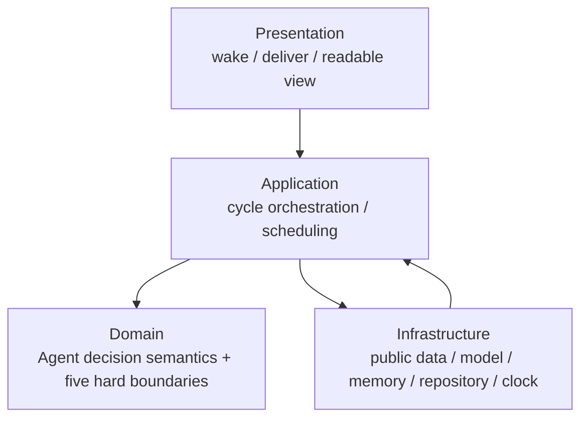

# Agent-first 市场认知与动态仓位理论 V3.3.1

版本：`3.3.1-agent-first-trader-candidate.1`

状态：`FROZEN_VERSION_CANDIDATE / NOT_CURRENT_ROUTED / PUBLIC_NON_ACCOUNT_ONLY / NON_EXECUTABLE`

候选冻结日期：`2026-08-12`

冻结清单：[`MANIFEST.json`](./MANIFEST.json)

前身：`3.3.0-modular-cognition-position-candidate.1`

前身 manifest SHA-256：`472c20300090e5b015290ce470312437a972fa2081d9f441e3c93b942b426013`

市场有效性：`UNKNOWN_NOT_EVALUATED`

## 1. 结论

V3.3.1 将一个公开、不可执行的市场决策的语义所有权收敛到单一 Agent：

- Agent 独立完成市场认知、竞争假说、路径更新与反证；
- Agent 独立作出最终不可执行参考动作；
- Agent 独立决定 entry、stop、targets、tranche、runner、reentry 与参考仓位；
- Agent 独立完成 Outcome 之后的 Review 判断与学习建议。

确定性系统不再拥有市场方向、lead、最终动作、风险档位或仓位计划的选择权。它只负责合法数据、PIT（点时隔离）、无副作用计算工具、长期记忆、Agent 原文记录、封存、权限安全、Outcome 事实采集与 Agent Review 的调度/封存。

本版不要求 Agent 填写一个严格 proposal schema。Agent 只需交付可读、可记录、能表达完整决策的正文。缺漏、歧义、未使用预设词汇、标题不同、字段顺序不同或 lifecycle 用语不同，都是 Agent 能力与决策质量证据：原样封存，继续 Outcome/Review，不作终态拒绝。

## 2. 不可委派的权责原则

```text
ADMITTED FACTS + CALCULATION TOOLS + MEMORY
                         ↓
                  AGENT REASONING
                         ↓
        EXACT READABLE AGENT DECISION BODY
                         ↓
             SEAL → OUTCOME → AGENT REVIEW
```

下列语义只能来自 Agent 原文：

```text
market interpretation
hypotheses and their updates
lead/runner/OTHER or another chosen comparison
final non-executable reference action
entry, invalidation, stop and targets
position size, tranches, harvest, runner and reentry
next review and decision-change conditions
post-outcome judgement and learning proposal
```

系统可以展示原始数据、计算收益/波动/距离/压力损失、检索记忆并记录原文，但不能：

- 为 Agent 选择假说、动作或仓位；
- 用词典序、分数、allocator、normalizer 或默认 policy 改写 Agent 结论；
- 将缺失字段、枚举外文本、对象/字符串差异或标题顺序差异升级为决策失败；
- 从 Agent 的多个候选中自行推断“真正最终动作”；
- 在封存后修补、清洗或重写决策原文。

## 3. 文档所有权

| 文档 | 唯一职责 | 不承载 |
|---|---|---|
| [`01_MARKET_COGNITION.md`](./01_MARKET_COGNITION.md) | Agent 的数据认知、分析对象、方法、时间尺度、行为动机与市场模型 | 系统选择市场观点 |
| [`02_DYNAMIC_POSITION_MANAGEMENT.md`](./02_DYNAMIC_POSITION_MANAGEMENT.md) | Agent 的初始/动态仓位、止损止盈、runner、reentry 与组合决策 | allocator 或真实订单 |
| [`03_HYPOTHESIS_SYSTEM.md`](./03_HYPOTHESIS_SYSTEM.md) | Agent 的假说生成、竞争、更新、反证与动作 thesis | 系统 tie-break |
| [`04_EXECUTION_AND_AGENT.md`](./04_EXECUTION_AND_AGENT.md) | 可读决策、System Envelope、原文封存、Outcome/Review 与记忆链路 | 市场策略改写 |
| [`05_RISK_AND_BOUNDARIES.md`](./05_RISK_AND_BOUNDARIES.md) | 五条硬边界、软降级与外部副作用隔离 | 决策质量资格门 |
| [`06_HISTORY_FAILURES_AND_CHANGES.md`](./06_HISTORY_FAILURES_AND_CHANGES.md) | V3.3.0→V3.3.1 的失败、修正与历史边界 | 当前运行规则 |
| [`07_NEW_MECHANISMS_AND_RESOLVED_ISSUES.md`](./07_NEW_MECHANISMS_AND_RESOLVED_ISSUES.md) | 新机制、问题解决状态与实现/证据边界 | 重复理论正文 |

市场认知和动态仓位仍是正文主体。执行篇只定义边界，历史与问题索引不进入 Agent 日常决策热路径。

## 4. 唯一加载合同

本目录是完整自包含包，不是 V3.3.0 overlay：

```text
composition_mode = SELF_CONTAINED_NO_BASE_OVERLAY
entrypoint = README.md
identity_order = README, 01, 02, 03, 04, 05, 06, 07
identity = theory_version + theory_revision + raw MANIFEST SHA-256
```

运行时只能先读取本目录 `MANIFEST.json`，逐项验证文件顺序、路径、普通文件类型、字节大小与 SHA-256，然后按 named fragment 读取。不得：

- 从 V3.3.0 或其他版本补齐冲突规则；
- 将 README/01–07 重排、拼接后产生新的未绑定身份；
- 跳过某个身份文件却仍宣称已加载 V3.3.1；
- 把 `06/07` 维护文档默认注入决策 prompt。

manifest 验证只证明字节身份，不证明理论质量、Agent 能力、预测有效或市场收益。

## 5. 五工件主链与原文权威

V3.3.1 保留唯一五工件主链，不新增第六/第七个业务工件：

| 工件 | 语义 owner | 权威内容 | 不可替代的原文规则 |
|---|---|---|---|
| `InputSnapshot` | 系统 | 合法 raw refs、PIT、计算工具输出、当前 UNKNOWN | 决策前封存，不得回填 |
| `HypothesisRecord` | Agent 拥有决策语义；系统只封存 | `AgentDecisionBody` 完整原文，同时承载市场、假说、最终动作和仓位语义 | body 按收到字节封存，不清洗/改写 |
| `BehaviorPlan` | Agent 拥有动作/仓位语义；系统只封存 | 稳定引用 `AgentDecisionBody`，并只能原样引用/复制 Agent 自选动作与仓位文本 | 未找到/有歧义时保留 null/ambiguous，不用默认 policy 填充 |
| `Outcome` | 系统事实 owner | 预注册 horizon 的同口径事实与 typed missing | 只记事实，不判断决策成败 |
| `Review` | Agent 拥有复盘语义；系统只封存 | `AgentReviewBody` 完整原文 | body 按收到字节封存，不自动写回理论 |

`SystemEnvelope`、transport receipt、`RunState` 和 `DecisionIndex` 都不是业务工件。`SystemEnvelope` 只是工件外层的身份、时间、摘要、权限和写入 owner 元数据；它不得包含系统选出的 `selected_action`、`lead_id`、仓位档位或市场分类真值。

`DecisionIndex` 只指向 `AgentDecisionBody` 的原文 span，用于检索、展示和 outcome 调度帮助。它可丢弃、可重建、可为 `UNAVAILABLE`；不能成为 `HypothesisRecord/BehaviorPlan` 的反向权威。

## 6. 四层与模块边界



| 模块 | 类型 | 输入 | 输出 | 数据 owner | 可替换面 |
|---|---|---|---|---|---|
| Market Cognition Agent | Core strategy | `InputSnapshot + memory` | readable `AgentDecisionBody` | `HypothesisRecord/BehaviorPlan` 决策语义 | model adapter/mock body |
| Cycle Orchestrator | Application service | run state | 下一调度动作 | schedule only | fake clock/repository |
| Public Data Admission | Infrastructure adapter | source request/raw | `InputSnapshot` | raw/PIT facts | fixture adapter |
| Calculation Tools | Infrastructure service | explicit inputs/formula | result + provenance | calculation result | pure implementation/mock |
| Memory Provider | Infrastructure adapter | time-bounded query | raw refs/summaries | stored memory | in-memory adapter |
| Agent Model Adapter | Infrastructure adapter | bounded context | exact response bytes | transport raw | deterministic stub |
| Outcome Collector | Infrastructure service | frozen schedule | `Outcome` facts | outcome facts | fixture adapter |
| Repository | Infrastructure service | envelope + exact bytes | immutable refs | physical bytes | in-memory repository |
| Safety Gate | Domain/Application boundary | proposed external side effect | allow/deny side effect | permission state | deny-all default |

所有交互只通过公开 IO 合同。不建新的通用事件总线、plugin SDK、第二个 orchestrator 或第二套权限平台。数据源、计算工具、记忆、模型与存储是静态 adapter 扩展点；它们不能拥有市场决策。

## 7. 单 cycle 事件流

```mermaid
sequenceDiagram
    participant O as Orchestrator
    participant D as Data/PIT
    participant M as Memory/Tools
    participant A as Agent
    participant R as Repository
    participant U as Outcome
    O->>D: capture and admit public facts
    D-->>O: sealed InputSnapshot
    O->>M: retrieve bounded prior memory
    O->>A: snapshot + tools + memory + safety boundary
    A-->>O: exact readable AgentDecisionBody
    O->>R: seal HypothesisRecord + BehaviorPlan
    O->>U: collect at frozen horizon
    U-->>R: sealed Outcome
    O->>A: original decision + outcome + bounded memory
    A-->>O: exact readable AgentReviewBody
    O->>R: seal Review; learning remains proposal
```

如果 `AgentDecisionBody` 可读且非空，系统必须将它封存进 `HypothesisRecord`，建立只原样引用/复制 Agent 语义的 `BehaviorPlan`，并继续 outcome 调度。一个非安全格式问题不能把流程转入 `ANALYSIS_FAILED` 或等价终态。

## 8. 五条硬边界和软证据

只有以下五类边界可以 fail-close 对应阶段：

1. 标的/任务/核心 raw 身份或完整性无法成立；
2. PIT、未来隔离、cutoff 或决策迟到边界被破坏；
3. 单一 owner、单写者、幂等或冻结原文出现写冲突；
4. Agent 输出无法按约定编码读取或只有空白；
5. 请求执行未授权外部副作用，或已授权副作用的安全真值不足。

其余情况全是软证据：格式不同、语义缺漏、新动作词汇、假说数量不同、并列结论、参考仓位激进、未写 stop/target、可选数据 UNKNOWN 都必须封存并由 Agent Review 判断其影响。

## 9. 扩展路线与验证门

### Phase A：候选冻结

- README 与七个 owner 完整；
- manifest 绑定原始字节；
- Agent/系统权责无冲突；
- 不修改 V3.3.0 和旧运行工件。

### Phase B：单一新路由

- 新 runtime 只按本 manifest 加载 V3.3.1；
- `HypothesisRecord.AgentDecisionBody` 成为唯一决策语义原文；
- `BehaviorPlan` 保留为五工件主链的正式工件，只原样引用/复制 Agent 自选动作和仓位；
- 严格 proposal schema/normalizer/allocator/tie-break 退出终态决策链；
- 旧 route 保持只读，不双写。

### Phase C：新身份前瞻证据

- 理论、实现、Agent context、Outcome 口径和 run 身份重新冻结；
- 旧 V3.3.0 run 不继续、不回填、不混入新证据；
- 市场动态性、自主性、全面性、效率与仓位效果只由新前瞻工件评价。

候选文档的无网络验证只包括：文件集、相对链接、无 BOM/LF、字节大小、SHA-256、manifest JSON 可解析、无未列 Markdown 和 `git diff --check`。这些都不是市场实验。

## 10. 兼容、回滚与当前非主张

- V3.3.0 继续作为冻结前身，其字节和旧 run 不改写。
- V3.3.1 改变决策语义和工件身份，不能在原 V3.3.0 run 上续跑。
- 回滚只是共享入口重新指向已保留版本；不得用 V3.3.1 解释旧决策。
- 本候选尚未被 `theory/CURRENT.md` 路由，runtime 也尚未按本合同实现。
- 非价格数据继续为 UNKNOWN；本版不接入、不扩展数据源。
- 本理论不可执行；没有 paper/testnet/live、账户、凭据、订单或资金权限。
- 未证明预测增量、概率校准、成本后收益、跨 regime 稳定或市场可用性。
