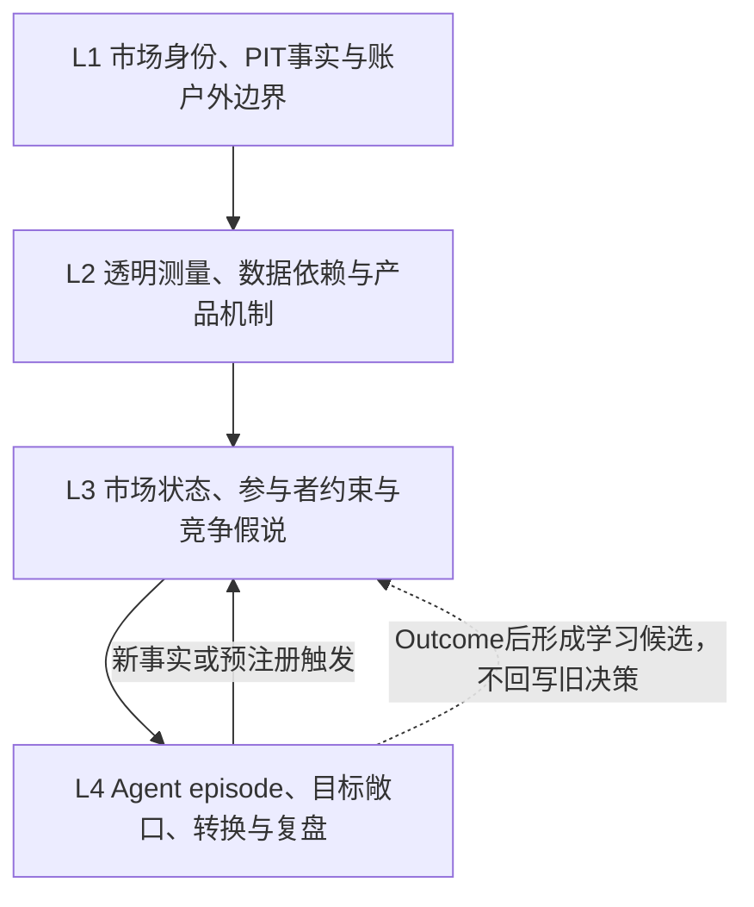
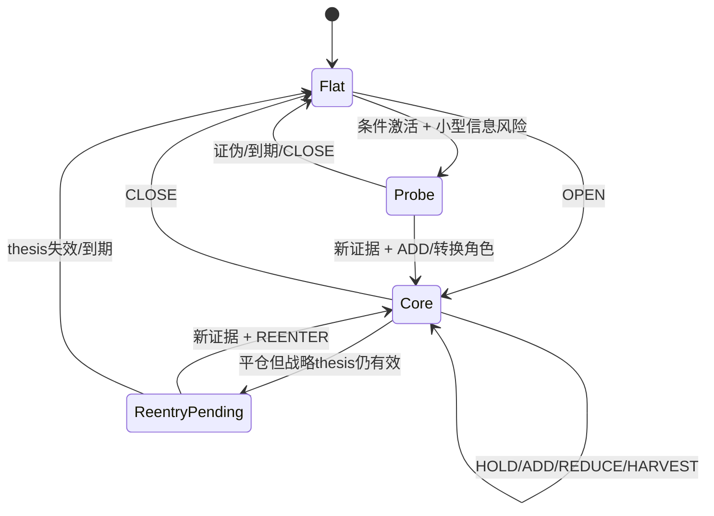

# V3.3.2 Agent-first 完整市场分析、动态交易与仓位管理理论

版本：`3.3.2-complete-market-analysis-candidate.3`

状态：`FROZEN_THEORY_REVIEW_CANDIDATE / USER_REVIEW_REQUIRED / CURRENT_REVIEW_ROUTE / NON_EXECUTABLE`

用户选择：V3.3.1 保持冻结；V3.3.2 作为可突破旧理论范围的实验版本，保留未验证但有规划价值的主体/意图假说，并补全市场认知、动态交易、动态仓位、注意力管理、参考执行和分层复盘。candidate.3 进一步把交易 Agent 的自主观察节奏纳入理论，并把 Goal、唤醒、多资产、纸面账户/订单、日志和 UI 全部移交系统类 owner。完成后先由用户审查，不启动市场实验或纸面交易。精确声明见 [`00_USER_DIRECTED_EXPERIMENTAL_SCOPE.md`](./00_USER_DIRECTED_EXPERIMENTAL_SCOPE.md)。

## 1. 结论

V3.3.2 candidate.3 已把理论链从“分析市场后给出一次动作”补成“持续管理市场 episode、参考敞口和注意力”的状态系统：

```text
市场身份与点时事实
→ 多尺度市场状态与竞争假说
→ 条件路径、激活/失效和下一观察
→ 战略 episode + 当前参考敞口
→ 目标参考敞口 + 仓位变化
→ 参考执行意图 + 动态管理义务
→ CONTINUE_NOW / WAKE_AFTER / RELEASE 注意力决定
→ Outcome事实
→ 市场/动作/仓位/转换/执行/风险/注意力分层复盘
```

它不是指标评分器、价格报点器或自动交易器。数据不足不代表机制不存在；`PLAUSIBLE_UNVERIFIED` 和 `ACTOR_HYPOTHESIS_UNOBSERVABLE` 可以进入条件规划，但不能冒充事实。路径命中可支持状态规划有用，不能单独证明某个机构身份或意图。

### 1.1 文档分类边界

`theory/versions/v3.3.2/` 只保存市场知识、假说、交易/仓位/注意力决策语义、风险知识、教学案例和评价体系。系统拓扑、监控 Goal、唤醒请求、Agent 生命周期、数据采集与切片、纸面账户、订单/成交、日志、UI、恢复和幂等只写入系统类 owner [`design/CURRENT_BLUEPRINT.md`](../../../design/CURRENT_BLUEPRINT.md)。系统蓝图不进入本理论 manifest；两类文档通过公开语义合同连接，不复制正文。

## 2. 当前理论可以做什么、不能做什么

| 当前可定义的理论能力 | 当前不能声称或执行的能力 |
|---|---|
| 识别市场状态、时间尺度、关键区域、参与者约束和竞争路径 | 已证明预测准确、跨市场稳定或成本后盈利 |
| 从分析生成 `WATCH/WAIT/PROBE/OPEN/HOLD/ADD/REDUCE/HARVEST/CLOSE/REENTER/HEDGE/OTHER` 参考动作 | 连接账户、读取私有持仓、发送或修改订单 |
| 区分战略观点、当前敞口、目标敞口和本次 `PositionDelta` | 用系统规则替 Agent 选择方向、仓位或默认止损 |
| 管理 CORE/TACTICAL/HEDGE/PROBE/RUNNER 角色、tranche 和再入场义务 | 把“触价”当成交，把回测价格当真实 fill |
| 管理 episode/工具/相关簇/组合/待激活/回撤风险预算 | 在没有校准和真实成本数据时给伪精确概率或最优仓位 |
| 在数据变旧、信号冲突、状态改变时触发复核、减险或保持观望 | 在无单独授权下启用 paper/testnet/live 或紧急平仓 |
| 自主选择近端连续观察、稍后复核或释放注意力 | 保证不会错过突发消息，或把一次秒级恢复探针当成长期调度能力 |
| 分开评价市场判断、动作、仓位、转换、参考执行和注意力安排 | 由文档完整性直接推导真实动态交易能力 |

## 3. 四层理论架构与动态闭环



动态仓位不是市场认知的附属数字，而是独立状态转换：



这些是认知与 owner 合同，不新建事件总线、插件 SDK、第二套 runtime 或第六类业务工件。

## 4. 模块路由

| 问题 | 唯一正文 | 责任/IO |
|---|---|---|
| 用户修订选择、候选恢复与不可豁免边界 | [`00_USER_DIRECTED_EXPERIMENTAL_SCOPE.md`](./00_USER_DIRECTED_EXPERIMENTAL_SCOPE.md) | 输入用户选择；输出候选身份与冻结政策 |
| 完整数据字典、K线、微观、杠杆、人群、事件、RSI和标准流程 | [`01_MARKET_COGNITION.md`](./01_MARKET_COGNITION.md) | 输入 `InputSnapshot`；输出市场认知和交易交接合同 |
| episode、当前/目标敞口、动作转换、角色、风险预算、参考执行与注意力决定 | [`02_DYNAMIC_POSITION_MANAGEMENT.md`](./02_DYNAMIC_POSITION_MANAGEMENT.md) | 输入市场/假说/既有状态；输出不可执行动态交易与观察计划 |
| 未验证假说、四级归因、竞争更新和 action thesis | [`03_HYPOTHESIS_SYSTEM.md`](./03_HYPOTHESIS_SYSTEM.md) | 输入事实/状态；输出竞争机制、路径、反证和动作依据 |
| 五工件、跨 cycle 连续性、Agent/系统权责、注意力语义、封存、Outcome与Review | [`04_EXECUTION_AND_AGENT.md`](./04_EXECUTION_AND_AGENT.md) | 输入完整决策；输出不可变决策/结果/复盘链；不定义系统架构 |
| PIT、raw、权限、参考/账户风险门和数据降级 | [`05_RISK_AND_BOUNDARIES.md`](./05_RISK_AND_BOUNDARIES.md) | 输入外部请求；输出允许/阻断边界，不选市场观点 |
| 闪迪 USDT/SNDKx 用户验证教学案例 | [`08_SANDISK_USDT_TEACHING_CASE.md`](./08_SANDISK_USDT_TEACHING_CASE.md) | 输入原始记录与公开历史；输出分析和动态管理教学重构 |
| 双时钟、市场与仓位状态、注意力时机、分层归因评价 | [`09_STATE_TRANSITION_AND_EVALUATION.md`](./09_STATE_TRANSITION_AND_EVALUATION.md) | 输入预注册路径/动作/注意力/Outcome；输出独立评价维度 |

公共合同是 `InputSnapshot` 事实引用、完整 `AgentDecisionBody`、五工件身份和 manifest。每个语义对象只有一个 owner，模块不得改写其他 owner 的事实或决定。

## 5. 完整 IO 合同

### 5.1 输入

```text
instrument/underlying/venue/contract semantics
decision cutoff, event clock and calendar horizons
admitted raw refs + coverage + UNKNOWN
transparent tool outputs with provenance
prior exact AgentDecisionBody/Review refs
prior StrategicEpisodeState and ReferenceExposureState projection
public non-executable permission boundary
```

### 5.2 Agent 权威输出

```text
facts vs measurements vs latent states vs actor/intent hypotheses
multi-timeframe state, key zones and horizon hierarchy
operational lead / runner-up / OTHER
event path, calendar thesis, activation, falsifiers and expiry
StrategicEpisodeState
ReferenceExposureState → TargetExposureState → PositionDelta
role/tranche risk budgets and protection obligations
PositionTransitionPlan and reference-only ExecutionIntent
actionability tier, opportunity cost and AttentionDecision
```

这些对象是 Agent 原文中的可读语义，不是系统可自行补齐的必填 schema。

### 5.3 系统输出

仍只有五类耐久业务工件：

1. `InputSnapshot`；
2. `HypothesisRecord`（内含完整 `AgentDecisionBody`）；
3. `BehaviorPlan`（只原样引用 Agent 选择的动作、仓位和执行意图）；
4. `Outcome`（点时事实、参考执行假设和透明测量）；
5. `Review`（内含完整 `AgentReviewBody`）。

`RunState`、索引、账户快照、订单状态和成交回报是投影或未来基础设施事实，不是新的市场决策工件。

## 6. 跨 cycle 动态流

```text
capture legal PIT raw + prior episode/exposure refs
→ seal InputSnapshot and coverage
→ Agent compares prior state with decision-relevant delta
→ Agent keeps/revises market thesis and episode state
→ Agent chooses target exposure, delta, transition and reference execution intent
→ seal HypothesisRecord + verbatim BehaviorPlan
→ observe only; no account side effect
→ capture frozen Outcome/path/transition/reference-price facts
→ Agent separately reviews market, action, sizing, transition, execution and risk
→ seal Review
→ carry exact prior refs into a new cycle; never rewrite the old cycle
```

新数据只有在改变状态、路径、几何、成本、风险预算、到期或关键 UNKNOWN 时，才构成仓位转换理由。否则处于 Agent 预声明的无交易区，避免把噪声变成频繁交易。

## 7. 理论与系统的唯一交接

理论只向系统交付：合法输入引用、完整 Agent 原文、episode/exposure/transition/attention 语义、五工件身份和安全边界。系统向理论返回：带时点的数据事实、纸面或真实账户事实、Outcome 与运行故障事实。adapter、工具、监控 Goal、时间等待、Agent registry、paper ledger、订单接口和展示层的具体设计均见 [`design/CURRENT_BLUEPRINT.md`](../../../design/CURRENT_BLUEPRINT.md)。

## 8. 不建立隐藏的第二决策中心

任何数据 adapter、指标模型、风险检查器、监控 Agent、唤醒算法、账户账本或 UI 都不能选择最终市场方向、仓位或观察时机。系统可以因身份、权限、资源、过期、重复和账户硬风险而 permit/block；不能因不同意交易 Agent 的市场判断而重写 `CONTINUE_NOW/WAKE_AFTER/RELEASE`、入场、止损或目标仓位。

## 9. Actionability 分层

| 等级 | 含义 |
|---|---|
| `RESEARCH_ACCEPTED` | 原文可读、非空、身份/PIT合法并已封存；不代表可行动 |
| `OBSERVATIONAL_ONLY` | 有市场认知，但没有足够明确的动作/几何 |
| `REFERENCE_CONDITIONAL` | 有条件路径，尚未激活 |
| `REFERENCE_ACTIONABLE` | 参考动作、目标敞口、失效、风险和参考执行语义足够明确 |
| `ACCOUNT_BLOCKED` | 即使参考计划明确，账户权限/事实/风险门不满足 |
| `ACCOUNT_ACTIONABLE` | 未来状态；必须同时有单独授权、账户真值、硬风险门和执行设施 |

自然语言含糊仍可 `RESEARCH_ACCEPTED` 并进入 Outcome/Review，但绝不能因此外部执行。

## 10. 三阶段路线

### Phase A：理论与系统设计审查候选（本次已完成）

- 完整市场认知、动态交易、动态仓位、注意力管理、参考执行、风险与评价合同；
- 案例、链接、manifest、candidate.1/candidate.2 备份和 V3.3.1 不变校验；
- 系统架构单独归入 `design/CURRENT_BLUEPRINT.md`；
- 先交用户审查，市场能力保持 `NOT_EVALUATED`。

### Phase B：用户批准后的简化纸面交易工作台实现

- 新 implementation/run identity；
- 复用五工件、公共数据与单一账本边界；
- 先实现 HYPEUSDT/SNDKUSDT 独立交易 Agent、虚拟子账户和只读组合视图；
- 实现 Agent 自主注意力请求、监控 Goal 登记和恢复，不实现市场信号 selector；
- 只接入会改变假说、动作或风险的数据；
- V3.3.1 run 不续跑、不双写。

### Phase C：用户另行授权后的前瞻纸面评价

- 同 cutoff/horizon 比较 price-only 与增强数据；
- 独立评价市场、动作、仓位、转换、参考执行、注意力和机会成本；
- paper 授权只覆盖本地纸面账本；testnet/live、私有账户和资金仍需各自单独授权。

## 11. 验证门

| 门 | 证明什么 | 不证明什么 |
|---|---|---|
| V3.3.1 manifest 摘要不变 | 旧冻结正文未被改写 | V3.3.2 正确 |
| candidate.1 归档摘要一致 | 本次修订可恢复 | candidate.1 市场有效 |
| candidate.2 归档摘要一致 | 本次修订可恢复 | candidate.2 市场有效 |
| candidate.3 manifest 摘要一致 | 当前候选字节身份固定 | 动态仓位或注意力有效 |
| 文档链接/结构/对象 owner 一致 | 包自包含、理论无已知结构断口 | 数据已取得或 runtime 已实现 |
| 案例事实与原记录分层 | 教学路径有依据 | 主体机制已证实 |
| 新身份前瞻 Outcome | 对应市场/动作/仓位证据 | 跨 regime 盈利，除非另行验证 |
| 未来真实订单/成交对账 | 实际执行事实 | 策略本身正确或获利 |

## 12. Legacy、冻结与回滚

- V3.3.1 保持冻结前身，旧 run 不受 V3.3.2 影响且不得续跑解释；
- V3.3.2 candidate.3 是当前审查路线，不是 runtime 或实验激活；
- candidate.1/candidate.2 精确归档及摘要见范围声明；
- 若 candidate.3 不被采纳，回滚是不实现/不启动，并可恢复 candidate.2；
- candidate.3 冻结后，语义修改使用新 revision/version 和 manifest；
- 不建立 V3.3.1/V3.3.2 同 cycle 双写或兼容解释层。

## 13. 当前非声明

- V3.3.2 runtime、数据集成和实验均未开始；
- 闪迪案例有用户验证和公开路径核查，但不是冻结前瞻盲试；
- 动态交易与仓位管理现在是完整理论合同，不是已验证实盘能力；
- 同一 Goal 任务树的秒级恢复探针通过，只证明局部运行闭环，不证明长期计时、跨重启或市场时机判断；
- 主体与意图假说可有规划价值，但大多未被身份数据验证；
- 未确认概率校准、真实滑点、成本后收益、跨市场稳定、paper/live 或生产能力；
- 未获得账户、订单、凭据、资金或任何紧急平仓权限。

## 14. Candidate.1–2 已知理论缺口的闭合位置

| 已知缺口 | candidate.3 处理 | Owner正文 |
|---|---|---|
| 战略观点、当前仓位、目标仓位和本次动作混在一起 | 拆为 episode/current/target/delta/transition/intent | `02` §19 |
| 动作没有明确前态/后态 | 定义全动作集合、角色影响和反转双 episode | `02` §20 |
| CORE/TACTICAL/HEDGE/PROBE/RUNNER 语义不完整 | 每个角色有独立用途、失效、预算与退出义务 | `02` §21 |
| 单笔风险存在但组合/待激活/回撤预算不足 | 建立 tranche→episode→instrument→cluster→portfolio 层级 | `02` §22 |
| 动态可能退化为每个数据点频繁交易 | 加入决策相关 delta、无交易区、迟滞和 re-arm | `02` §23 |
| 多触发器同时发生会互相覆盖 | 固定安全/失效/风险/激活/优化语义优先级 | `02` §24 |
| 数据变旧时持仓如何处理不明 | 区分假说保留、参考风险 fallback 和未来账户安全 | `02` §25、`05` §14 |
| 触价、订单和成交混淆 | 建立 target→delta→intent→order→fill→actual 链及参考口径 | `02` §26 |
| 不同产品沿用线性现货逻辑 | 加入现货、融券、永续、反向、期货、期权、代币化股票差异 | `02` §27 |
| Agent 决策权与未来硬风险门冲突 | 风险门只 permit/block，不静默改仓；紧急动作独立授权 | `02` §28、`05` §§12–16 |
| 可读原文接受后是否能交易不清 | 建立 research/reference/account actionability 分层 | `02` §29、`04` §20 |
| episode 无法跨 cycle 延续 | 用五工件精确引用和非权威投影延续，不新增第六工件 | `04` §19 |
| 多周期分析不能稳定交给仓位模块 | 建立战略/决策/触发/执行周期交接合同 | `01` §26 |
| 假说更新被误当自动调仓 | 分开 hypothesis、episode、exposure 生命周期 | `03` §16 |
| 盈亏会覆盖分析、动作、仓位和执行归因 | 扩为14个评价维度、逐决策点与失败矩阵 | `09` §§6、11–14 |
| 闪迪案例只证明方向、未展示动态管理 | 增加明确标注为事后教学的动态 policy 重构 | `08` §§11–14 |
| 谁决定何时持续观察或再次进入不清 | 交易 Agent 自选 `CONTINUE_NOW/WAKE_AFTER/RELEASE`，并独立评价注意力时机 | `02` §32、`04` §24、`09` §6.14 |
| 系统架构与市场知识混写 | 理论只保留语义和边界；Goal、唤醒、多资产、纸面账户/订单/UI 全部移交系统蓝图 | `README` §§1.1、7–8；`04` §22 |

这里“闭合”只表示理论定义、owner、状态和评价接口已补齐。runtime、数据可得性、参数校准、真实执行和市场效果问题没有被文档解决，继续保持 `NOT_IMPLEMENTED/NOT_EVALUATED/UNKNOWN`。
