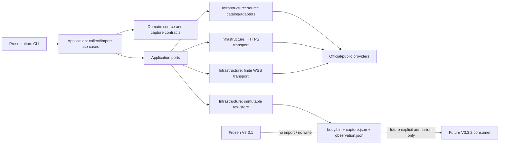

# V3.3.2 外置数据接口

## 当前系统开发入口

- [`DEVELOPMENT_PLAN.md`](./DEVELOPMENT_PLAN.md)：V3.3.2 最小系统开发计划，覆盖目标架构、HYPE/SNDK 数据准入、双资产 Agent、attention、纸面账户/订单/成交、工作台、验证、迁移与回滚。
- [`runtime/feasibility/manifest.json`](./runtime/feasibility/manifest.json)：本机隔离可行性工件索引；目录被 Git 忽略，不是 V3.3.1/R4 或正式实验结果。
- 本文件继续说明现有外置数据原型的实际能力与使用方式。该原型是后续来源合同的迁移源和诊断入口，不是第二套 V3.3.2 核心 runtime。
- 当前状态为数据/原型可行性 `PARTIAL_PASS`、主系统实现未开始；没有 paper/testnet/live 或账户权限。

## 结论与当前状态

这是面向未来 V3.3.2 的独立、只读、原始数据优先接口。它没有导入、修改或推进冻结中的 V3.3.1，也不会自动把数据送入当前实验。

当前目录登记 70 个来源合同：53 个无需账号即可执行，6 个等待用户提供联系信息或免费密钥，2 个需要人工公开导出，6 个需要另行申请或独立授权，3 个属于公开来源无法观测的事实。2026-08-12 的本机验证中，50 个无账号 HTTP 来源被逐一执行，40 个取得真实原始数据，10 个因当前网络、上游限流或页面策略失败；3 个实时 WebSocket 来源也已执行有限窗口，但当前主机未建立连接。失败仍按原始请求、时间和错误状态封存，绝不改写为零或成功。

“已登记全部”在这里指：当前项目范围内已识别、合法、低门槛且有清楚声明上限的来源。它不等于整个互联网，也不等于完整市场真相。新来源继续以一个独立 adapter 加入，不修改四层边界。

### 目标资产隔离预检（2026-08-12 UTC）

| 对象 | 当前实际证据 | 不能据此声称 |
|---|---|---|
| HYPE/OKX SWAP | 9 类 HTTP raw 全部 `OBSERVED_RAW` 且哈希审计通过；9 份 raw 重复解析一致 | profile 已准入、历史完整、连续可用或交易有效 |
| HYPE/OKX WSS | 一次有限连接失败，失败工件已封存 | 流式 L2 可用或序列连续 |
| OKX SNDK SWAP | 9 类 HTTP raw 可取，instrument 为 live linear USDT-settled swap | 已证明等同 Backed SNDKx 或 SNDK 正股 |
| Backed SNDKx | raw 确认 `SNDKx / CH1500008748 → SNDK / US80004C2008` | 已取得正股实时行情或 basis |
| Bybit / Kraken | Bybit SNDKUSDT Spot 当前 instrument 为空；Kraken 发现 online `SNDKx/USD` | 存在 SNDKx/USDT Spot，或 USD/USDT 可无损替代 |
| 系统 | 20/20 owning tests PASS；raw-first、observation 绑定和篡改检测可运行 | 已接 `MarketDataPort/InputSnapshot`、paper runtime 或交易 Agent |

预检同时确认四个实施前缺口：闭合 K 线没有过滤 `confirm=0`；成功 OKX WSS 会被 `provider_code=None` 误判；当前 WSS 没有 sequence/gap state machine；`verify-store` 没有把缺 observation 的 raw-only capture 标为 incomplete。修复应发生在唯一主路迁移中，不继续扩建此外置原型。

## 版本和权限边界

- 当前外置原型的代码、合同和测试只位于本目录；未来 V3.3.2 主 runtime 按开发计划接入现有四层 `market_cycle`，不会在这里复制第二套核心。
- 默认数据根目录是 `~/.local/state/agent-trade-emotion/v3.3.2/external-data`，不使用 V3.3.1 的 run store。
- 当前权限仅为公开、不可执行研究；没有账户读取、paper、testnet、订单、资金或 live 权限。
- 无账号 HTTP 请求只执行一次；没有自动重试、换域名、代理绕过或 403 绕过。
- 带密钥请求在密钥为空时关闭；密钥不写入封存 URL、日志或仓库。
- 每个 capture 先保存原始字节，再生成非权威摘要；摘要永远不能替代原始数据。

## 快速开始

```bash
V332_DIR=/Users/wt/Documents/agent-trade-emotion/trade_system/theory_paper_v2/v3.3.2
export PYTHONPATH="$V332_DIR"

python3.12 -m external_data_interface status
python3.12 -m external_data_interface catalog
python3.12 -m external_data_interface collect okx.mark_price
python3.12 -m external_data_interface collect-all
python3.12 -m external_data_interface verify-store
```

默认输出结构：

```text
external-data/
└── captures/
    └── <source-id>-<UTC-time>-<nonce>/
        ├── body.bin          # 原始响应，先封存
        ├── capture.json      # 来源合同、请求、响应、时间、SHA-256
        └── observation.json  # 状态、available_at、有限摘要、raw_sha256 绑定
```

状态含义：

| 状态 | 含义 |
|---|---|
| `OBSERVED_RAW` | 真实响应已封存并通过解析边界 |
| `OBSERVED_EMPTY` | 请求成功但官方窗口没有记录 |
| `CAPTURE_FAILED` | 已尝试并封存失败；不得视为零 |
| `WAITING_USER_CONFIG` | 等待联系信息、免费 key 或必要参数 |
| `MANUAL_INPUT_REQUIRED` | 需要用户从官方页面导出文件 |
| `PROHIBITED_CURRENT_SCOPE` | 需要申请、付费、插件 token 或独立权限，当前不执行 |
| `UNOBSERVABLE` | 公开数据无法观察该事实，必须保持 `UNKNOWN` |

## 已接入数据范围

### 无账号且已在本机取得真实数据：40 项

| 范围 | 来源和数据 |
|---|---|
| 价格、订单流、杠杆、市场微观结构 | OKX 15 项：服务器时间、合约身份、标记价格、15m/1h/4h/UTC 日线、400 档订单簿、近期成交、未平仓量、资金费率、主动买卖量、合约/币种多空比、延迟公开大宗交易 |
| 宏观与跨资产 | FRED graph CSV 13 项：CPI、核心 CPI、非农就业、失业率、实际 GDP、有效联邦基金利率、2Y/10Y 美债、10Y-2Y 利差、广义美元指数、WTI、Fed 总资产、NFCI 杠杆分项 |
| 跨资产与机构代理 | Cboe VIX 日线、ECB USD/EUR 参考汇率、纽约联储一级交易商汇总 |
| 链上 | Coin Metrics BTC 社区指标；Blockstream 链尖、mempool、费率估计；DefiLlama chain TVL、稳定币、DEX 量、DeFi OI |
| 搜索舆情代理 | Google Trending Now RSS；它只表示当前热门查询，不是任意关键词历史或绝对搜索量 |

FRED graph CSV 是当前修订版的公开下载入口，不是历史时点版本。需要 point-in-time（当时可见版本）时，必须使用下面带 key 的 `fred.series` 并显式指定 `realtime_start` / `realtime_end`。

### 已实现、但当前主机尚未取得：13 项

| 来源 | 当前实测 | 保留原因和下一合法路径 |
|---|---|---|
| BLS API、BLS RSS | TLS 失败 | 官方接口合同已完成；FRED 公开 CSV 已覆盖核心 CPI/就业当前修订版 |
| Treasury yield XML | TLS 失败 | 官方接口保留；FRED DGS2/DGS10/利差已提供当前修订版代理 |
| Fed H.15、H.10、新闻 RSS | TLS 失败 | 官方页面保留；FRED 当前序列提供部分替代，不宣称等价 |
| CFTC TFF COT | TLS 失败 | 仍是周频机构分类代理；不是当前机构意图 |
| EIA bulk manifest | TLS 失败 | 官方公开批量清单已接入；定向 EIA API 等待免费 key，但 key 不保证消除本机 TLS 问题 |
| GDELT 新闻发现 | 当前批次超时；较早批次出现 429 | 不自动重试；下一个合法周期再采集 |
| Bluesky post search | HTTP 非成功 | 公共 AppView 样本入口保留，不绕过页面策略 |
| OKX order-book WSS | 主路由连接重置；官方 AWS 备选 DNS 失败 | 两条有限合法路线均已尝试，停止继续换域名 |
| OKX liquidation WSS | 同上 | 官方说明该流本来也不是完整爆仓账本 |
| Bluesky firehose | 有限窗口超时 | 原始 CBOR/CAR 解码未被单独验证前只允许封存原始帧 |

### 等待用户设置：6 项

| `source_id` | 需要 | 得到什么 | 声明上限 |
|---|---|---|---|
| `sec.submissions` | `SEC_USER_AGENT` + `cik` 参数 | 某申报主体的 EDGAR submissions | 滞后披露，不是当前机构意图 |
| `fred.series` | `FRED_API_KEY` | 任意合法 FRED 序列及可选 realtime 窗口 | 默认当前修订；PIT 必须显式指定 realtime 日期 |
| `eia.crude_stocks` | `EIA_API_KEY` | 周度美国原油库存 | 官方周频汇总，不是实时油价 |
| `bea.gdp` | `BEA_USER_ID` | NIPA GDP 表 | 已发布/修订宏观统计 |
| `youtube.search` | `YOUTUBE_API_KEY` | 最近 25 条公开视频搜索结果 | 配额内抽样，不是总体情绪 |
| `alphavantage.daily` | `ALPHAVANTAGE_API_KEY` | SPY 或指定符号的免费日线 | 免费日线代理，不含免费实时交易所数据 |

### 人工公开导出：2 项

| `source_id` | 页面 | 文件 |
|---|---|---|
| `google_trends.manual_csv` | [Google Trends Explore](https://trends.google.com/trends/explore) | 用户选定词、地区、类别和时间范围后的 CSV |
| `btc_etf.issuer_holdings_manual` | ETF 发行人官方持仓页或 [SEC EDGAR](https://www.sec.gov/edgar/search/) | 官方 CSV/XLSX/JSON/XML；不要用无法追溯的聚合截图 |

### 需要另行申请或独立授权：6 项

- Google Trends API alpha：官方仍是有限 alpha 申请，不是稳定公开 API。
- OpenNews / OpenTwitter 6551：需要 token 和复用条款确认。
- Reddit research API：需要项目申请和资格审查。
- X official API：需要开发者账户及对应计划。
- execution account truth：成交、费用、滑点、延迟、仓位只存在于账户侧，必须另行授权；当前明确禁止。

### 公开数据无法取得：3 项

- 机构当前身份与真实意图；
- 全市场完整爆仓账本；
- 全体人群或市场的完整情绪。

这些字段必须保持 `UNKNOWN`，不能由大宗交易、申报、搜索趋势或社交样本推断成“已知”。

## 架构和模块合同



| 层 | owner | 输入 | 输出 | 禁止 |
|---|---|---|---|---|
| `presentation` | 参数解析和 JSON 输出 | CLI 参数 | 命令结果 | 市场判断、隐藏默认授权 |
| `application` | 一次有限采集或人工导入 | `source_id`、参数、时钟 | `CaptureResult` | 选择交易动作、自动重试 |
| `domain` | 稳定合同与状态语义 | 来源定义 | 可序列化合同 | 网络、文件系统、V3.3.1 依赖 |
| `infrastructure` | adapter、HTTPS/WSS、解析、封存 | ports 合同 | 原始 capture 和有限摘要 | 改写 provider 数据、伪造缺失值 |

每个数据插件是一个 `SourceAdapter`：

```text
SourceDefinition
├── source_id / family / provider / dataset
├── access_mode / transport
├── endpoint / terms_url
├── cadence / history / time_semantics
├── claim_ceiling
├── required_env / required_parameters
└── default_enabled / stream

SourceAdapter
├── build_request(parameters, environment, now) -> HttpRequest | WebSocketRequest
└── normalize(body, response) -> bounded non-authoritative summary
```

事件顺序固定为：检查 readiness → 构建白名单请求 → 单次有限传输 → 封存原始字节和 SHA-256 → 从已封存原始字节生成摘要 → 写 observation 绑定。任何 provider/TLS/HTTP/解析失败都在这条链上成为显式终态。

核心封存字段：

```json
{
  "capture_id": "source-time-nonce",
  "source": {"source_id": "...", "claim_ceiling": "..."},
  "request": {"url": "redacted-or-public", "retry_allowed": false},
  "response": {
    "request_started_at": "UTC",
    "response_received_at": "UTC",
    "capture_completed_at": "UTC",
    "body_sha256": "...",
    "body_size_bytes": 0,
    "transport_backend": "...",
    "error_code": null
  }
}
```

## 常用命令

采集单个公开来源：

```bash
python3.12 -m external_data_interface collect okx.order_book \
  --param instrument_id=BTC-USDT-SWAP

python3.12 -m external_data_interface collect fred_graph.nfci_leverage
```

采集有限实时窗口：

```bash
python3.12 -m external_data_interface stream okx.order_book_stream \
  --duration-seconds 12 --max-messages 12

# 只有主路由失败后才使用已白名单的官方 AWS 备选；其他 route 会被拒绝。
python3.12 -m external_data_interface stream okx.order_book_stream \
  --duration-seconds 12 --max-messages 12 --param route=aws
```

验证整个封存目录的 body 大小、SHA-256、capture ID 和 observation 绑定：

```bash
python3.12 -m external_data_interface verify-store
```

人工文件导入必须同时记录数据观察时间、当时可获得时间和精确官方来源页：

```bash
python3.12 -m external_data_interface import-file google_trends.manual_csv \
  --file /absolute/path/multiTimeline.csv \
  --observed-at 2026-08-09T00:00:00Z \
  --available-at 2026-08-12T12:00:00Z \
  --source-url 'https://trends.google.com/trends/explore?q=bitcoin'
```

## 用户需要完成的设置

先创建只在本机使用的配置文件：

```bash
cd /Users/wt/Documents/agent-trade-emotion/trade_system/theory_paper_v2/v3.3.2
cp credentials.env.example credentials.env.local
chmod 600 credentials.env.local
# 用本地编辑器填写；不要把真实值发到聊天、提交或截图中。
set -a
source credentials.env.local
set +a
```

`credentials.env.local` 已在本目录 `.gitignore` 中排除。

### 1. SEC：无需账号或 key

1. 阅读 [SEC Accessing EDGAR Data](https://www.sec.gov/search-filings/edgar-search-assistance/accessing-edgar-data)。
2. 在 `SEC_USER_AGENT` 填真实项目名和可联系邮箱，例如 `Agent Trade Emotion research your-email@example.com`。
3. 在 EDGAR 搜索目标主体，取得数字 CIK。
4. 运行：

```bash
python3.12 -m external_data_interface collect sec.submissions --param cik=1364742
```

SEC 当前公布的公平访问上限是 10 requests/second；本接口没有批量爬取或自动重试。

### 2. FRED：普通免费账号

1. 登录/注册 [FRED account](https://fredaccount.stlouisfed.org/)。
2. 在 [FRED API key 页面](https://fred.stlouisfed.org/docs/api/api_key.html) 为本项目创建独立 key。
3. 填入 `FRED_API_KEY`。
4. 当前修订版示例：

```bash
python3.12 -m external_data_interface collect fred.series --param series_id=DGS10
```

5. 历史时点版本示例：

```bash
python3.12 -m external_data_interface collect fred.series \
  --param series_id=DGS10 \
  --param observation_start=2025-01-01 \
  --param realtime_start=2025-06-30 \
  --param realtime_end=2025-06-30
```

### 3. EIA：姓名、邮箱和用途

1. 在 [EIA API key registration](https://www.eia.gov/opendata/register.php) 填姓名、邮箱、类别、用途并同意条款。
2. 邮件收到 key 后填入 `EIA_API_KEY`。
3. 运行：

```bash
python3.12 -m external_data_interface collect eia.crude_stocks
```

EIA 也提供 [免 key 的 bulk downloads](https://www.eia.gov/opendata/bulk-downloads.php)；接口已接入 manifest，但当前主机到 EIA 的 TLS 仍失败，因此 key 到手后也必须重新实测，不能预先宣称可用。

### 4. BEA：姓名或组织名、邮箱

1. 在 [BEA API signup](https://apps.bea.gov/API/signup/) 填姓名/组织名和有效邮箱并接受条款。
2. 填入 `BEA_USER_ID`。
3. 运行：

```bash
python3.12 -m external_data_interface collect bea.gdp
```

### 5. YouTube Data API：Google 账号和 Cloud 项目

1. 按 [YouTube Data API getting started](https://developers.google.com/youtube/v3/getting-started) 创建 Google Cloud project。
2. 启用 YouTube Data API v3，并创建 API key；本接口只搜索公开视频，不需要 OAuth 用户授权。
3. 建议在 Google Cloud 对 key 设置 API restriction 和适当的应用限制。
4. 填入 `YOUTUBE_API_KEY`，运行：

```bash
python3.12 -m external_data_interface collect youtube.search --param query=bitcoin
```

### 6. Alpha Vantage：有效邮箱

1. 在 [Alpha Vantage free key](https://www.alphavantage.co/support/#api-key) 填用途、组织和有效邮箱。
2. 阅读其条款及免费频率限制，填入 `ALPHAVANTAGE_API_KEY`。
3. 运行：

```bash
python3.12 -m external_data_interface collect alphavantage.daily --param symbol=SPY
```

### 可选但当前不建议阻塞主线的申请

- [Google Trends API alpha](https://developers.google.com/search/apis/trends)：只有收到批准和实际 API 合同后才实现 adapter；当前公开页面明确仍是有限 alpha。
- Reddit、X、OpenNews、OpenTwitter：只有用户确认用途、token、费用和数据复用条款后再开放；当前保持关闭。

## 验证依据

本机无账号 HTTP 复验目录：

```text
/Users/wt/.local/state/agent-trade-emotion/v3.3.2/external-data/verification-20260812T1215Z-curl
```

- `collect-all` 当前覆盖全部 50 个无账号 HTTP 来源；本次得到 40 `OBSERVED_RAW`、10 `CAPTURE_FAILED`。
- 50/50 capture 的原始字节大小、SHA-256、ID 和 observation 绑定有效；0 个损坏。
- 13 个 FRED 公开序列全部取得记录，单项记录数从 48 到 1097。
- 27 个非 FRED 公共来源和 13 个 FRED graph 序列取得原始数据；每个失败均保留明确错误码。
- 另一个验证目录保存 3 个 WSS 主路由和 2 个 OKX 官方备选路由的有限失败窗口；没有把连接失败写成空市场数据。

离线验证：

```bash
PYTHONPATH=/Users/wt/Documents/agent-trade-emotion/trade_system/theory_paper_v2/v3.3.2 \
python3.12 -m unittest discover \
  -s /Users/wt/Documents/agent-trade-emotion/trade_system/theory_paper_v2/v3.3.2/tests -v
```

## 接入未来 V3.3.2 前的三阶段路线

### 阶段 1：外置数据准备（当前）

- 完成来源合同、只读采集、原始封存、显式 UNKNOWN、凭据关闭态和本机可达性验证。
- 验收门：来源条款明确；响应真实；`available_at` 存在；原始 SHA-256 有效；密钥不落盘；失败不变零。

### 阶段 2：用户凭据和时间可用性验收

- 用户只在本机设置需要的免费 key/联系信息；AI 可继续逐项首次采集和验证。
- 每个来源单独通过：HTTP/provider 成功、非空或有官方空窗口、字段可读、PIT 语义明确、原始封存有效、声明上限不过界。
- 未通过的来源继续 `WAITING_USER_CONFIG` 或 `CAPTURE_FAILED`，不阻塞已有公开 baseline。

### 阶段 3：未来 V3.3.2 显式准入

- 只有 V3.3.1 冻结实验结束、用户明确授权且未来 consumer 合同冻结后，才添加一个从已封存 capture 读取的兼容 adapter。
- 首先只接入 identity、价格、时间和 outcome 所需核心数据；增强数据仍允许 `UNKNOWN`。
- 准入门必须检查未来隔离、时点可见性、schema 版本、claim ceiling 和回滚；绝不把当前目录自动挂入 V3.3.1。

## 已知限制

- 当前主机到部分美国政府域名和 WSS 端点存在 TLS、DNS 或连接重置；代码存在不等于本机已可用。
- RSS、搜索、新闻、社交和 Trends 只是样本或代理，不能证明总体舆情。
- COT、EDGAR、大宗交易、ETF 持仓和一级交易商数据都是滞后/汇总代理，不能证明机构当前身份和意图。
- 公共 liquidation stream、OI、多空比和 funding 不能组成完整杠杆真相。
- 当前没有调度器；每次采集都由明确命令触发，避免在冻结实验期间产生隐式数据流。
